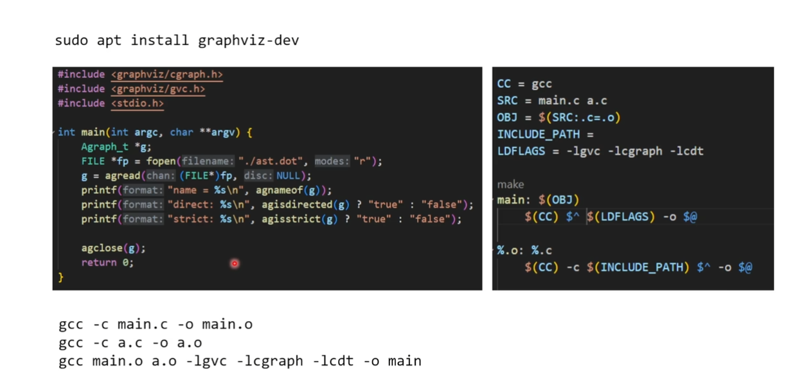
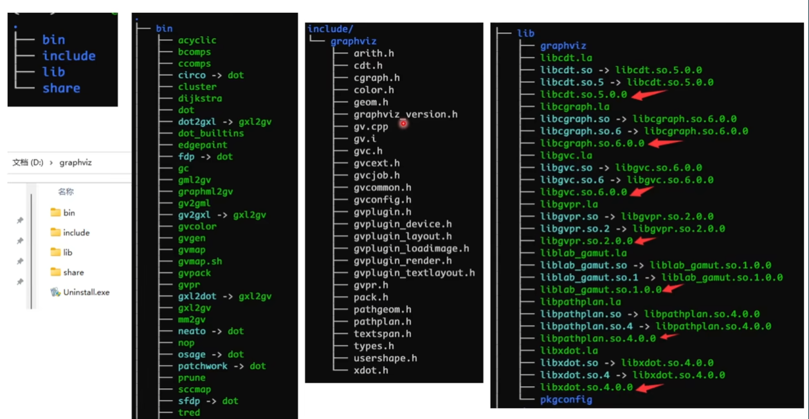
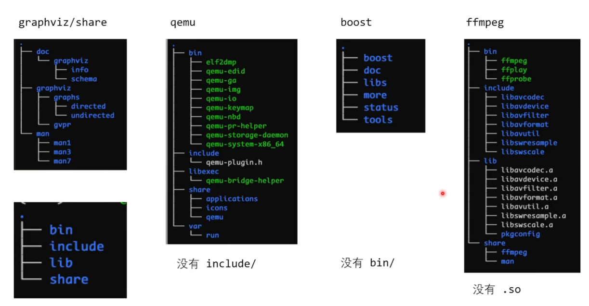
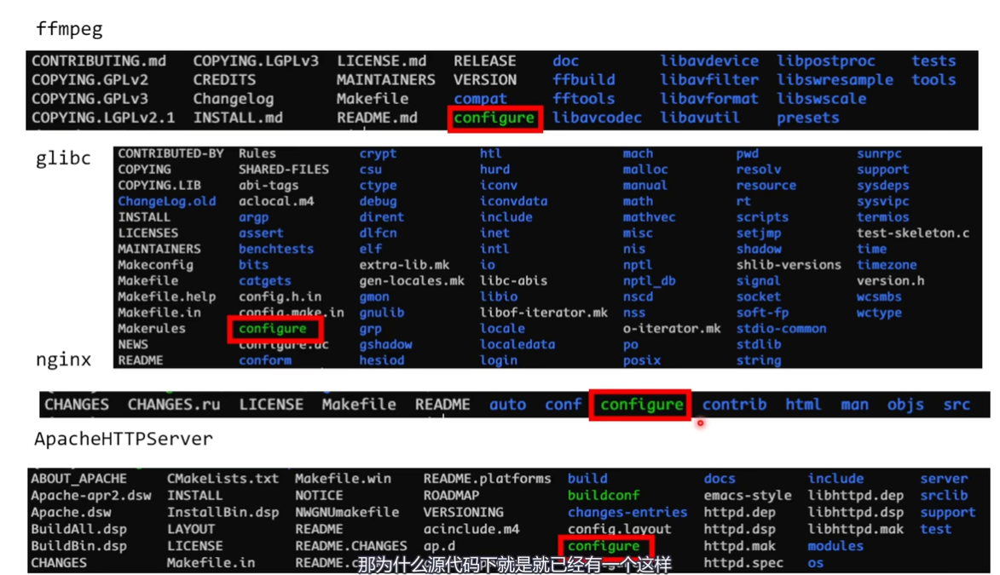
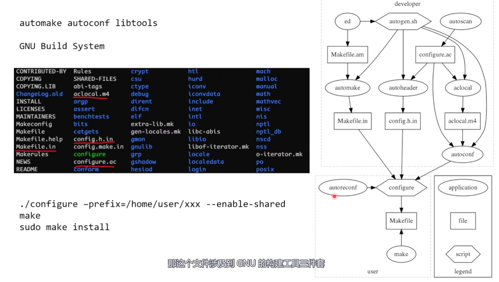
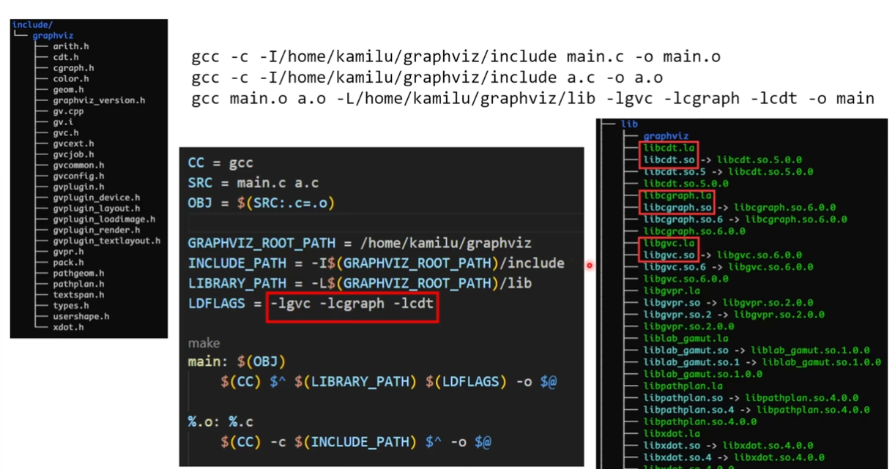
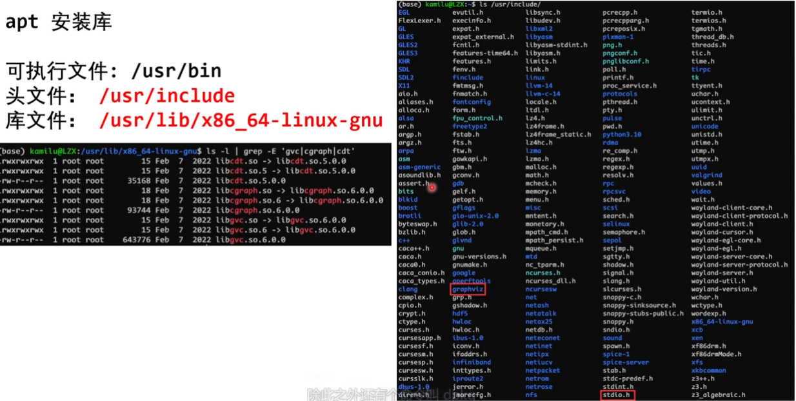
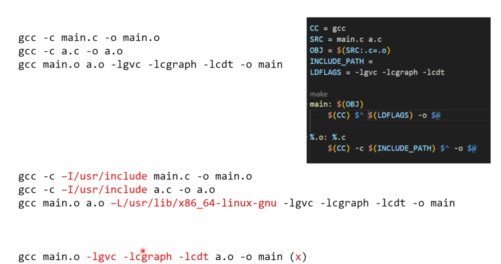
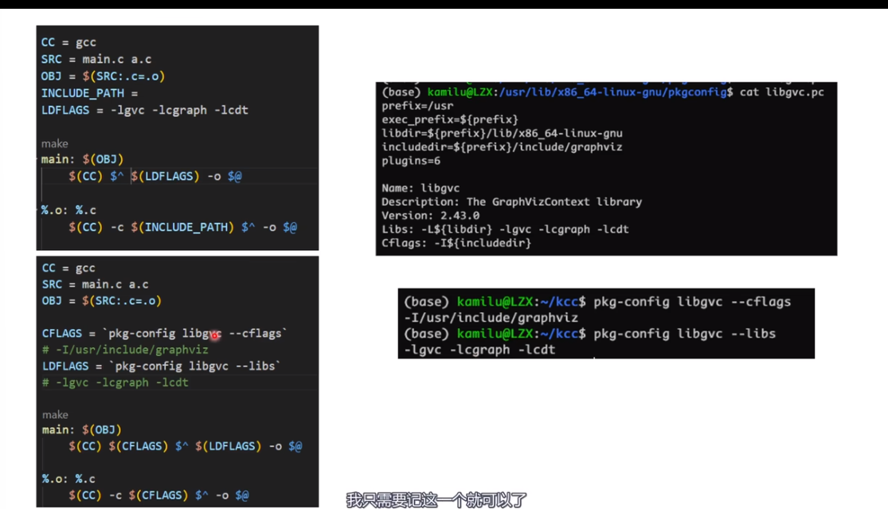

# 特殊的符号

```sh
main: main.o a.o
    gcc $^ -o $@ # 这里$^指的是上面一行所有的冒号后面的内容
                       $@指的时上面一行所有的冒号之前的内容

%.o: %.c   # 使用模式匹配
    gcc -c $^ -o $@
```


```sh
CC = gcc
SRC = main.c a.c
OBJ = $(SRC:.c=.o)
INCLUDE_PATH = -Ifolder/ -Iinclude1 -I include2

main: $(OBJ)
    $(CC) $^ -O $@

%.o: %.c
    $(CC) -c $^ -o $@
```

# 查看项目
在makefile声明了需要去哪里查找头文件、库，因此编译没有问题。
但是阅读代码时候，在IDE中，仍然存在可能无法解析符号。比如在VSCode中使用Clangd，你可以在clangd.fallbackFlags中添加这些目录

问：既然编译时候能够编译通过，那么编译时，能否生成一个文件，告诉IDE要include什么目录不就行吗？
答：可以的，这个文件叫做compile_commands.json

问：使用cmake，如何生成compile_commands.json?
答：使用编译选项. -DCMAKE_EXPORT_COMPILE_COMMANDS=1

问：使用makefile，如何生成compile_commands.json?
答：使用bear工具

问：在VSCode中，使用compile_commands.json
答: 修改clangd配置,  让clangd找到这个文件即可
```json
{
    "clangd.arguments":[
        "--query-driber=/usr/bin/gcc",
        "--compile-commands-dir=${workspaceFolder}"
    ]
}
```

# 使用第三方库


## 一个常规的C第三方库都应该有什么
预编译好的库、头文件和源码

### 一个第三方库编译之后得到什么
1


2 share目录下放man、doc文件之类的


#### 源代码中的configure

这个文件涉及到了GNU的三件套


GNU三件套GUN Build System：automake + autoconf + libtools， 目的是为了简化跨平台软件的构建过程
1. autoconf会自动检测系统特性，会根据操作系统和架构来做一个调整
2. automake是用来生成makefile
3. libtools是用来处理库的版本号

直接使用头文件和库文件

-l 库的名字
-L 搜索库的目录
如果目录中既有动态链接库又有静态链接库，优先选动态的

## 怎么使用
### apt把这个库安装到哪里了
gcc -print-search-dirs列出搜索路径

apt安装到哪里了


### gcc默认会到哪里搜索头文件和静态库

####
main.o只会从后面的动态库中找符号


## pkg-config

pkg-config可以根据库的名字返回路径，常用在makefile， 这样就不用记头文件（如下图中CFLAGS）和库文件（如下图LFLAGS）的目录




# C运行时库
- glibc
- MSVCRT
- BSD libc（MacOS）
- Bionic（Android）
- Musl/newlib/uClibc/

## triplet：描述一个平台
<arch>-<OS>-<libc>
X86_64_linux_gnu
X86_64_windows_gnu
X86_64_windows_msvc
arm_linux_gnu
