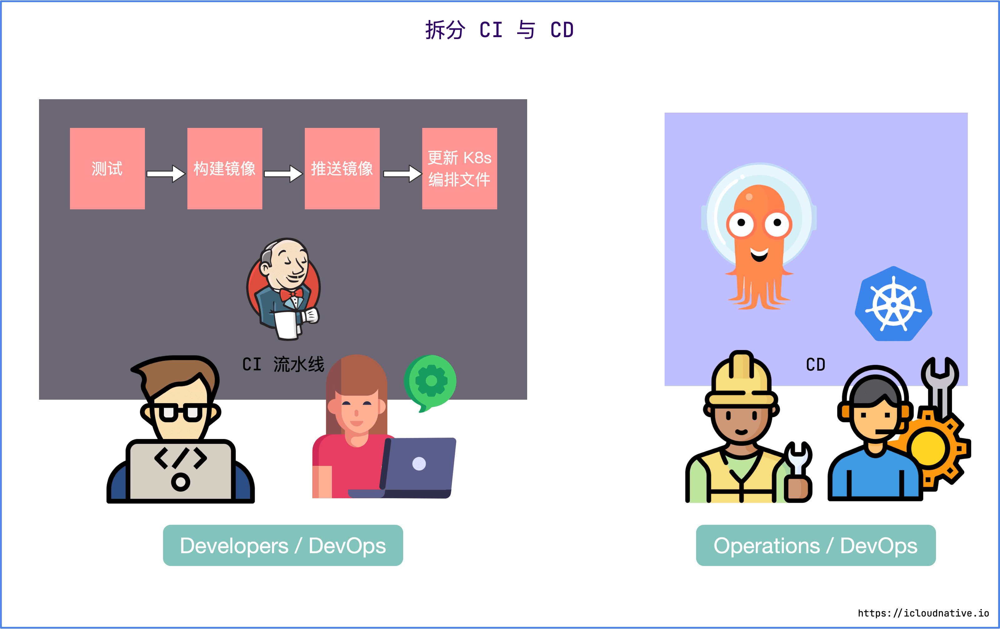
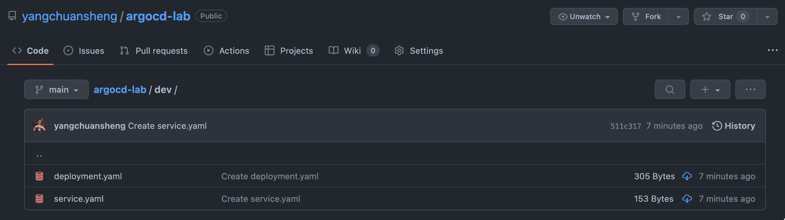

Argo CD 是以 Kubernetes 作为基础设施，遵循声明式 GitOps 理念的持续交付（continuous delivery, CD）工具，支持多种配置管理工具，包括 ksonnet/jsonnet、kustomize 和 Helm 等。它的配置和使用非常简单，并且自带一个简单易用的可视化界面。

按照官方定义，Argo CD 被实现为一个 Kubernetes 控制器，它会持续监控正在运行的应用，并将当前的实际状态与 Git 仓库中声明的期望状态进行比较，如果实际状态不符合期望状态，就会更新应用的实际状态以匹配期望状态

# 使用 Argo CD 的 CD 工作流

和传统 CI/CD 工具一样，CI 部分并没有什么区别，无非就是测试、构建镜像、推送镜像、修改部署清单等等。重点在于 CD 部分。

Argo CD 使用的是基于 Pull 的部署模式，它会周期性地监控应用的实际状态，也会周期性地拉取 Git 仓库中的配置清单，并将实际状态与期望状态进行比较，如果实际状态不符合期望状态，就会更新应用的实际状态以匹配期望状态。


无论是通过 CI 流水线触发更新 K8s 编排文件，还是 DevOps 工程师直接修改 K8s 编排文件，Argo CD 都会自动拉取最新的配置并应用到 K8s 集群中。

最终会得到一个相互隔离的 CI 与 CD 流水线，CI 流水线通常由研发人员（或者 DevOps 团队）控制，CD 流水线通常由集群管理员（或者 DevOps 团队）控制。



# Argo CD 架构


从功能架构来看，Argo CD 主要有三个组件：**API Server**、**Repository Server** 和 **Application Controller**。

从 GitOps 工作流的角度来看，总共分为 3 个阶段：**检索、调谐和呈现**。

1. 检索 – Repository Server

检索阶段会克隆应用声明式配置清单所在的 Git 仓库，并将其缓存到本地存储。包含 Kubernetes 原生的配置清单、Helm Chart 以及 Kustomize 配置清单。履行这些职责的组件就是 Repository Server。

2. 调谐 – Application Controller

调谐（Reconcile）阶段是最复杂的，这个阶段会将 Repository Server 获得的配置清单与反映集群当前状态的实时配置清单进行对比，一旦检测到应用处于 OutOfSync 状态，Application Controller 就会采取修正措施，使集群的实际状态与期望状态保持一致。

3. 呈现 – API Server

最后一个阶段是呈现阶段，由 Argo CD 的 API Server 负责，它本质上是一个 gRPC/REST Server，提供了一个无状态的可视化界面，用于展示调谐阶段的结果。同时还提供了以下这些功能：

- 应用管理和状态报告；
- 调用与应用相关的操作（例如同步、回滚、以及用户自定义的操作）；
- Git 仓库与集群凭证管理（以 Kubernetes Secret 的形式存储）；
- 为外部身份验证组件提供身份验证和授权委托；
- RBAC 增强；
- Git Webhook 事件的监听器/转发器。

# Argo CD 核心概念

## Argo CD Application


- Argo CD 中的 Application 定义了 Kubernetes 资源的来源（Source）和目标（Destination）。来源指的是 Git 仓库中 Kubernetes 资源配置清单所在的位置，而目标是指资源在 Kubernetes 集群中的部署位置。

- 来源可以是原生的 Kubernetes 配置清单，也可以是 Helm Chart 或者 Kustomize 部署清单。

- 目标指定了 Kubernetes 集群中 API Server 的 URL 和相关的 namespace，这样 Argo CD 就知道将应用部署到哪个集群的哪个 namespace 中。

- 简而言之，Application 的职责就是将目标 Kubernetes 集群中的 namespace 与 Git 仓库中声明的期望状态连接起来

Application 的配置清单示例:


## Argo CD Project

Argo CD 中的项目（Project）可以用来对 Application 进行分组，不同的团队使用不同的项目，这样就实现了多租户环境。项目还支持更细粒度的访问权限控制：

- 限制部署内容（受信任的 Git 仓库）；
- 限制目标部署环境（目标集群和 namespace）；
- 限制部署的资源类型（例如 RBAC、CRD、DaemonSets、NetworkPolicy 等）；
- 定义项目角色，为 Application 提供 RBAC（例如 OIDC group 或者 JWT 令牌绑定）。

# Demo 演示

## 准备 Git 仓库

在 GitHub 上创建一个项目，取名为 argocd-lab，为了方便实验将仓库设置为公共仓库。在仓库中新建 dev 目录，在目录中创建两个 YAML 配置清单，分别是 deployment.yaml 和 service.yaml



配置清单内容如下:

```yaml
# deployment.yaml
apiVersion: apps/v1
kind: Deployment
metadata:
  name: myapp
spec:
  selector:
    matchLabels:
      app: myapp
  replicas: 2
  template:
    metadata:
      labels:
        app: myapp
    spec:
      containers:
      - name: myapp
        image: nginx:latest
        ports:
        - containerPort: 80
        
# service.yaml
apiVersion: v1
kind: Service
metadata:
  name: myapp-service
spec:
  selector:
    app: myapp
  ports:
  - port: 80
    protocol: TCP
    targetPort: 80
```

接下来在仓库根目录中创建一个 Application 的配置清单:
```yaml
# application.yaml
apiVersion: argoproj.io/v1alpha1
kind: Application
metadata:
  name: myapp-argo-application
  namespace: argocd
spec:
  project: default
  source:
    repoURL: https://github.com/yangchuansheng/argocd-lab.git
    targetRevision: HEAD
    path: dev
  destination: 
    server: https://kubernetes.default.svc
    namespace: myapp
  syncPolicy: #  指定自动同步策略和频率，不配置时需要手动触发同步
    syncOptions: #  定义同步方式
    - CreateNamespace=true # 如果不存在这个 namespace，就会自动创建它
    automated: # : 检测到实际状态与期望状态不一致时，采取的同步措施
      selfHeal: true #  当集群世纪状态不符合期望状态时，自动同步
      prune: true  # 自动同步时，删除 Git 中不存在的资源
```

Argo CD 默认情况下每 3 分钟会检测 Git 仓库一次，用于判断应用实际状态是否和 Git 中声明的期望状态一致，如果不一致，状态就转换为 OutOfSync。默认情况下并不会触发更新，除非通过 syncPolicy 配置了自动同步。

如果嫌周期性同步太慢了，也可以通过设置 Webhook 来使 Git 仓库更新时立即触发同步

## 创建 Application

现在万事具备，只需要通过 application.yaml 创建 Application 即可

```sh
$ kubectl apply -f application.yaml
application.argoproj.io/myapp-argo-application created
```