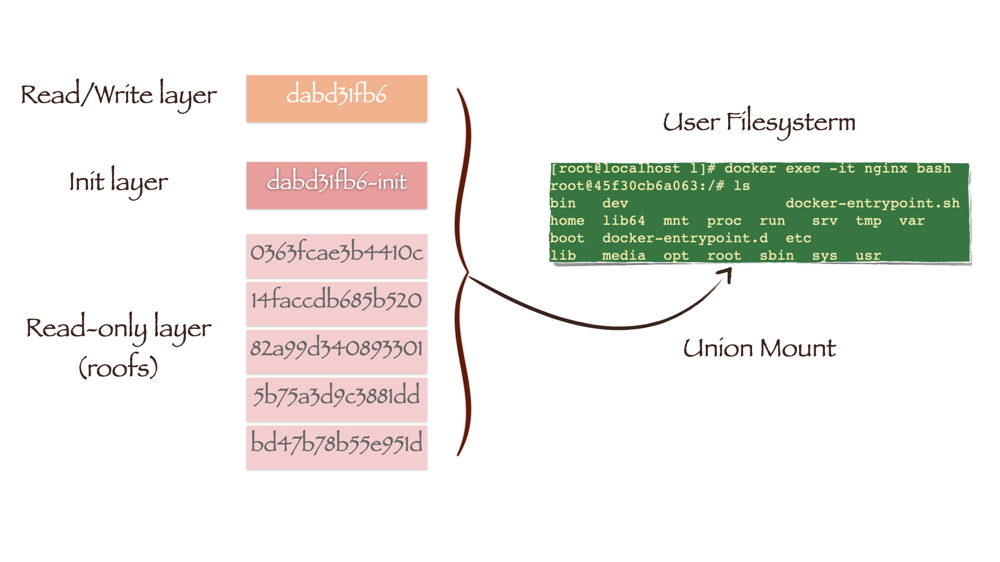

# 镜像基于内容寻址

docker1.10推翻了之前的镜像管理方式，重新开发了基于内容寻址的策略。该策略至少有3个好处：

- 提高了安全性
- 避免了ID冲突
- 确保数据完整性

基于内容寻址的实现，使用了两个目录:/var/lib/docker/image和/var/lib/docker/overlay， 后面的这个根据存储驱动的名称不同，而目录名不同。image目录保存了image的内容(sha256)数据。overlay目录保持了image的真实数据。

 Docker镜像的内容主要包含两个部分：第一，镜像层文件内容；第二，镜像json文件

静态的镜像不包含的

1./proc以及/sys等虚拟文件系统的内容
2.容器的hosts文件，hostname文件以及resolv.conf文件，这些事具体环境的信息，原则上的确不应该被打入镜像。
3.容器的Volume路径，这部分的视角来源于从宿主机上挂载到容器内部的路径
4.部分的设备文件


# /var/lib/docker/image/overlay2 目录
## distribution 目录
- diffid-by-digest 保存了digest->diffID的映射关系 （layer digest，可以认为是layerID，不过在客户端基本用不到。 这是registry上的概念，不同于ChainID）
- v2metadata-by-diffid 保存了diffid -> (layer digest,repository)的映射关系
> digest(layerID) 就是 pull 镜像时的 hash ID，拉取是 镜像层文件是压缩文件，压缩态 docker pull时可以看到，12位。  registry上的一个概念，下载时会用到
> diffid 是 docker inspect 查看到的 镜像层 hash ID，此时 镜像层文件是解压缩的，解压缩态
> 因此虽说这两种 ID 都表示 镜像层 hash ID，但一个是压缩的，一个是解压缩的，所以 hash 运算后不一致
> 镜像ID， 是本地生成的，下面有解释

## imagedb 目录
- 保存镜像的元数据信息
- 两个子文件夹 content/ 和 metadata/
1) tree /var/lib/docker/image/overlay2/imagedb 可以查看此目录的结构
- 打开content/sha256目录下以**镜像ID**命名的文件，我们可以看到镜像的元数据信息，包括了镜像架构、操作系统 、默认配置、创建时间、历史信息和rootfs等
- cat /var/lib/docker/image/overlay2/imagedb/content/sha256/<**镜像ID**> | python -mjson.tool （查看image config）
- image config 中layer的diffID是以低层到高层的顺序记录的。即底层的是一个基础镜像

## layerdb 目录
- 保存镜像层的关联关系
- layerdb/sha256下的目录名称是以layer的 **ChainID** 来命名的，它的计算方式为：
1) 如果layer是最底层，没有任何父layer，那么diffID = chainID;
2) 否则，chainID(n)=sha256sum(chainID(n-1) diffID(n))
- 查看： tree /var/lib/docker/image/overlay2/layerdb -L 2
- 举例，查看某一镜像层 chainID 目录下的内容： cat /var/lib/docker/image/overlay2/layerdb/sha256/（任一chainID）
1) parent：父layer的ChainID
2) size：layer文件的大小
3) cache-id：存储驱动通过cache-id索引到layer的实际文件内容； 宿主机随即生成的一个uuid，存放于 /var/lib/docker/image/overlay2/layerdb/sha256/{chainID}/cache-id 文件中（容器层不会有 cache-id），每一个 cache-id 都对应着一个镜像层，每一个 cache-id 对应着 /var/lib/docker/overlay2/${cache-id} 目录
4) diff ： 本层layer的diff_id (解压缩态的)

## repositories.json 文件
- 这个需要先搞清楚 registry 是镜像仓库，而 repository 代表镜像组（比如不同版本的 nginx 镜像）
- 该文件中描述了宿主机上所有镜像的repository元数据，主要包括镜像名、tag和镜像ID
1) 镜像ID是Docker采用SHA256算法, 镜像ID是本地计算生成的
- 查看：cat /var/lib/docker/image/overlay2/repositories.json | python -mjson.tool

# 镜像

Docker镜像是一个只读的容器模板，含有启动Docker容器所需的文件系统。Docker镜像的文件内容和一些运行容器的配置文件组成了Docker容器的文件系统运行环境——rootfs。

当我们使用docker pull下载一个nginx镜像后，可以在Docker的工作目录**/var/lib/docker/image/overlay2**下找到它的相关信息

> overlay2是一种常用的存储驱动

# Repository

在Docker的镜像管理系统中，registry代表镜像仓库，如官方的Docker Hub。而repository则代表镜像组，即包含了不同版本的镜像集合。repositories.json文件中描述了宿主机上所有镜像的repository元数据，主要包括镜像名、tag和镜像ID。而镜像ID是Docker采用SHA256算法，根据镜像元数据配置文件计算得出的。

repositories.json
其中 f6d0b4767a6c466c178bf718f99bea0d3742b26679081e52dbf8e0c7c4c42d74 指向了 /var/lib/docker/image/overlay2/imagedb/content/sha256/<**镜像ID**> 目录下的配置文件
```json
{
    "Repositories": {
        "nginx": {
            "nginx:latest": "sha256:f6d0b4767a6c466c178bf718f99bea0d3742b26679081e52dbf8e0c7c4c42d74",
            "nginx@sha256:10b8cc432d56da8b61b070f4c7d2543a9ed17c2b23010b43af434fd40e2ca4aa": "sha256:f6d0b4767a6c466c178bf718f99bea0d3742b26679081e52dbf8e0c7c4c42d74"
        }
    }
}


```

# Image

镜像的元数据信息保存在imagedb目录中，其文件结构如下(有裁剪)：

```sh
[root@localhost ~]# tree  /var/lib/docker/image/overlay2/imagedb
/var/lib/docker/image/overlay2/imagedb
├── content
│   └── sha256
│       └── f6d0b4767a6c466c178bf718f99bea0d3742b26679081e52dbf8e0c7c4c42d74
└── metadata
    └── sha256

4 directories, 1 file

```

打开content/sha256目录下以**镜像ID**命名的文件(image config, 并非image digest，后者存在于registry)，我们可以看到镜像的元数据信息，包括了镜像架构、操作系统 、默认配置、创建时间、历史信息和rootfs等：

```sh
cat /var/lib/docker/image/overlay2/imagedb/content/sha256/f6d0b4767a6c466c178bf718f99bea0d3742b26679081e52dbf8e0c7c4c42d74 | jq .
```

```json
{
    "architecture": "amd64",
    ...
    "created": "2021-01-12T10:17:41.649267496Z",
    "docker_version": "19.03.12",
    ...
    "os": "linux",
    "rootfs": {
        "diff_ids": [
            "sha256:cb42413394c4059335228c137fe884ff3ab8946a014014309676c25e3ac86864", 
            "sha256:1c91bf69a08b515a1f9c36893d01bd3123d896b38b082e7c21b4b7cc7023525a",
            "sha256:56bc37de0858bc2a5c94db9d69b85b4ded4e0d03684bb44da77e0fe93a829292",
            "sha256:3e5288f7a70f526d6bceb54b3568d13c72952936cebfe28ddcb3386fe3a236ba",
            "sha256:85fcec7ef3efbf3b4e76a0f5fb8ea14eca6a6c7cbc0c52a1d401ad5548a29ba5"
        ],
        "type": "layers"
    }
}
```
rootfs是容器运行的文件系统环境。而从上面的元数据信息中我们发现，rootfs是由多个layer文件组成的。元数据记录了这些layer的diffID，它们是Docker使用SHA256算法根据layer文件内容计算得到的。这样做的好处是可以根据diffID检查layer文件的完整性，并且可以让相同diffID的layer文件被不同镜像共享。

# image digest
镜像的内容变了，但镜像的名称和tag没有变，所以会造成前后两次通过同样的名称和tag从服务器得到不同的两个镜像的问题，于是docker引入了镜像的digest的概念。

**一个镜像的digest就是镜像的manifes文件的sha256码，当镜像的内容发生变化的时候，即镜像的layer发生变化，从而layer的sha256发生变化，而manifest里面包含了每一个layer的sha256，所以manifest的sha256也会发生变化，即镜像的digest发生变化，这样就保证了digest能唯一的对应一个镜像。**

注意镜像id和image digest不一样：

Image ID是在本地由Docker根据镜像的描述文件计算的，并用于imagedb的目录名称。image config 的 sha256 哈希值，在本地镜像存储中由它唯一标识一个镜像
```sh
root@VM-21-227-ubuntu:/var/lib/docker/image/overlay2/imagedb/content/sha256# sha256sum  022bb6b5da130c489ccb83e1af94fd69e0a87d1a17e30856b552491582bb65f8 
022bb6b5da130c489ccb83e1af94fd69e0a87d1a17e30856b552491582bb65f8  022bb6b5da130c489ccb83e1af94fd69e0a87d1a17e30856b552491582bb65f8
```

Image ID（镜像ID）是由Docker生成的一个唯一标识符，用于标识Docker镜像在本地宿主机上的唯一副本。每次构建或拉取一个新的镜像时，都会生成一个新的镜像ID。它通常由一串长的哈希值表示，例如sha256:abcdef123456...。镜像ID用于在本地宿主机上对镜像进行引用和操作，例如启动容器、导出镜像等。

Digest（摘要）是镜像内容的唯一标识符，用于确保镜像的完整性和不可更改性。摘要是通过对镜像内容进行哈希计算而生成的，使用的是SHA算法，通常是SHA256。它以sha256:作为前缀，后跟一串哈希值，例如sha256:123456abcdef...。摘要用于验证镜像是否被篡改或传输过程中是否有损坏，可以在拉取镜像时进行验证，以确保获取到的镜像与原始镜像完全一致。

区别：

Image ID是用于本地宿主机上镜像的唯一标识符，而digest是用于验证和标识镜像内容的唯一标识符。
Image ID是在每次构建或拉取镜像时生成的，而digest是对镜像内容进行哈希计算生成的。
Image ID用于在本地宿主机上引用镜像，而digest用于验证镜像的完整性和不可更改性。

在实际使用中，Image ID常用于本地操作和管理镜像，而digest通常在构建、分发和验证镜像的过程中使用，以确保镜像的安全性和一致性。


# Layer

diff_ids	    镜像每一层的 id ，是对 layer 的未压缩的 tar 包的 sha256 哈希值

layer digest	镜像在 registry 存储中的 id ，是对 layer 压缩后的 tar 包的 sha256 哈希值, 这个概念存在于registry

/var/lib/docker/image/overlay2/layerdb/sha256下的目录名称是以layer的 **ChainID** 来命名的，它的计算方式为：

如果layer是最底层，没有任何父layer，那么diffID = chainID;
否则，chainID(n)=sha256sum(chainID(n-1) diffID(n))

我们可以发现**只有layer cb42413394c *的diffID和chainID相等，因为它就是镜像的最底层**。实际上image元数据中layer的diffID是以低层到高层的顺序记录的，我们可以根据公式计算出倒数第二层的chainID：

```sh
[root@localhost ~]# echo -n "sha256:cb42413394c4059335228c137fe884ff3ab8946a014014309676c25e3ac86864 sha256:1c91bf69a08b515a1f9c36893d01bd3123d896b38b082e7c21b4b7cc7023525a" | sha256sum -
a3ee2510dcf02c980d7aff635909612006fd1662084d6225e52e769b984abeb5  -
[root@localhost ~]# ls /var/lib/docker/image/overlay2/layerdb/sha256 | grep a3ee2510dcf0*
a3ee2510dcf02c980d7aff635909612006fd1662084d6225e52e769b984abeb5

```

每一个以layer的chainID命名的目录下都保存了镜像层layer的元数据信息：

```sh
[root@localhost ~]# ls  /var/lib/docker/image/overlay2/layerdb/sha256/a3ee2510dcf02c980d7*
cache-id   # docker 下载镜像时随机生成的 id，  它指向了压缩后的目录
diff       # 存放 layer 的 diffid(解压缩态)   它标志了唯一性
parent     # 父layer的ChainID
size       # 该 layer 的大小
tar-split.json.gz # tar-split.json.gz 文件是 layer tar 包的 split 文件，记录了 layer 解压后的文件在 tar 包中的位置（偏移量），通过这个文件可以还原 layer 的 tar 包
```


```sh
[root@localhost ~]# cat /var/lib/docker/image/overlay2/layerdb/sha256/a3ee2510dcf02c980d7*/parent
sha256:cb42413394c4059335228c137fe884ff3ab8946a014014309676c25e3ac86864
[root@localhost ~]# cat /var/lib/docker/image/overlay2/layerdb/sha256/a3ee2510dcf02c980d7*/size
63704232
[root@localhost ~]# cat /var/lib/docker/image/overlay2/layerdb/sha256/a3ee2510dcf02c980d7*/cache-id
0363fcae3b4410c394b8a99e0a24d1ec01eb5198c82d3422f9c411ceaad98286
```

如果我们启动一个容器，便可以发现Docker会在layerdb目录下新生成一个mounts目录

```sh
[root@localhost ~]# docker run -d --name=nginx -v /home:/home nginx
45f30cb6a063a7251db4388f17f85c1226d96277cb74693c1f38bef1d17b6193
[root@localhost ~]#  tree  /var/lib/docker/image/overlay2/layerdb -L 2
/var/lib/docker/image/overlay2/layerdb
├── mounts
│   └── 45f30cb6a063a7251db4388f17f85c1226d96277cb74693c1f38bef1d17b6193
├── sha256
│   ├── 3c90a0917c79b758d74b7040f62d17a7680cd14077f734330b1994a2985283b8
│   ├── 4dfe71c4470c5920135f00af483556b09911b72547113512d36dc29bfc5f7445
│   ├── a1c538085c6f891424160d8db120ea093d4dda393e94cd4713e3fff3c82299b5
│   ├── a3ee2510dcf02c980d7aff635909612006fd1662084d6225e52e769b984abeb5
│   └── cb42413394c4059335228c137fe884ff3ab8946a014014309676c25e3ac86864
└── tmp

9 directories, 0 files
```

mounts目录下有着以***容器ID命名***的文件，其内部记录了**容器层layer**的元数据信息：

```sh
[root@localhost ~]# ls /var/lib/docker/image/overlay2/layerdb/mounts/45f30cb6a063*
init-id  mount-id  parent
```

## overlay2 目录
目录 /var/lib/docker/overlay2
存放的是镜像的每一层layer解压后的，以及基于每一个镜像生成容器后，对镜像合并挂载后的目录和对应的init目录

/var/lib/docker/overlay2/<id>/merged: 所有镜像层合并后的，就是容器中进程看到的
/var/lib/docker/overlay2/<id>/upper: 只读的上层
/var/lib/docker/overlay2/<id>/work：用来做cow相关操作的
/var/lib/docker/overlay2/<id>/diff: 容器层的读写层

/var/lib/docker/overlay2/l目录下保存的均是*软链接文件*，其文件名是避免使用mount命令时输出结果达到页面大小限制而生成的短名称；这些软连接一般都连接到上层目录的<id>文件夹

# 容器

镜像是由多个layer组成的文件，并在容器启动时成为容器文件系统的运行环境——只读的rootfs。而容器其实就是**Dokcer利用存储驱动在只读rootfs上挂载一个可读写层后的结果**。

## 联合挂载

联合挂载技术可以在一个挂载点同时挂载多个文件系统，将挂载点的原目录与被挂载内容进行整合，使得最终可见的文件系统将会包含整合之后的各层的文件和目录。

- lower：底层文件系统。对于Docker来说，就是只读的镜像层；
- upper：上层文件系统。对于Docker来说，就是可读写的容器层；
- merged：作为统一视图的联合挂载点。对于Docker来说，就是用户视角下的文件系统；
- work：提供辅助功能。

## 启动一个容器，观察系统中overlay2类型的挂载情况

```sh
[root@localhost ~]# docker run -d --name=nginx -v /home:/home nginx
45f30cb6a063a7251db4388f17f85c1226d96277cb74693c1f38bef1d17b6193
[root@localhost ~]# mount -t overlay
# dabd31fb6ad636b16b6f01f2332d068888de1e3e41a53751a35206e266b5dad4 是读写层ID
overlay on /var/lib/docker/overlay2/dabd31fb6ad636b16b6f01f2332d068888de1e3e41a53751a35206e266b5dad4/merged type overlay (rw,relatime,seclabel,lowerdir=/var/lib/docker/overlay2/l/U7ZXQ4ZL7TLD6XEBUVLR77LKS4:/var/lib/docker/overlay2/l/BXVB3Q7277EPHJEMMHKEOR6YS5:/var/lib/docker/overlay2/l/5K76AX5UNX35LFXZKLATNWHOIK:/var/lib/docker/overlay2/l/QTGJLTLBMEML5OGHHZUYM3GHTR:/var/lib/docker/overlay2/l/55T5LSGE3C2NFFQ54FHM7YDNKY:/var/lib/docker/overlay2/l/R2AW2LUWRDIV7DLJFYMS67LB3L,upperdir=/var/lib/docker/overlay2/dabd31fb6ad636b16b6f01f2332d068888de1e3e41a53751a35206e266b5dad4/diff,workdir=/var/lib/docker/overlay2/dabd31fb6ad636b16b6f01f2332d068888de1e3e41a53751a35206e266b5dad4/work)
```

根据输出结果我们可以找到overlay2的挂载点位置：
```sh
[root@localhost ~]# ll /var/lib/docker/overlay2/l
总用量 0
lrwxrwxrwx. 1 root root 72 2月   2 07:37 55T5LSGE3C2NFFQ54FHM7YDNKY -> ../0363fcae3b4410c394b8a99e0a24d1ec01eb5198c82d3422f9c411ceaad98286/diff
lrwxrwxrwx. 1 root root 72 2月   2 07:37 5K76AX5UNX35LFXZKLATNWHOIK -> ../14faccdb685b520f09148aaafec45dd31d2e6aa96516b60deaf59228ae9dbe66/diff
lrwxrwxrwx. 1 root root 72 2月   2 07:37 BXVB3Q7277EPHJEMMHKEOR6YS5 -> ../82a99d340893301cf33c79588042cd7d5db55cbcf34ca4b7a6ade609b6d28c96/diff
lrwxrwxrwx. 1 root root 72 2月   2 10:02 M5NBJHQ4ICWANIEYBYMJ5FLCZO -> ../dabd31fb6ad636b16b6f01f2332d068888de1e3e41a53751a35206e266b5dad4/diff # 读写层cache-id
lrwxrwxrwx. 1 root root 72 2月   2 07:37 QTGJLTLBMEML5OGHHZUYM3GHTR -> ../5b75a3d9c3881dd8041cdc3fa73679a9f1e4f1052d4548e22b5f4e4ccce7c2d0/diff
lrwxrwxrwx. 1 root root 72 2月   2 07:37 R2AW2LUWRDIV7DLJFYMS67LB3L -> ../bd47b78b55e951d504c6e70c0e7af451b020a5741f71ed0e91cb8f8dc77a8664/diff
lrwxrwxrwx. 1 root root 77 2月   2 10:02 U7ZXQ4ZL7TLD6XEBUVLR77LKS4 -> ../dabd31fb6ad636b16b6f01f2332d068888de1e3e41a53751a35206e266b5dad4-init/diff #读写层cache-id-init
```

/var/lib/docker/overlay2/l目录下保存的均是*软链接文件*，其文件名是避免使用mount命令时输出结果达到页面大小限制而生成的短名称；

在lowerdir中的软链接，除`U7ZXQ4ZL7TLD6XEBUVLR77LKS4`外，均指向了只读镜像层文件的挂载点，分别对应了我们下载的ngingx镜像的五层layer；

上文提到，layer元数据中的cache-id会索引到layer的实际文件，其路径为：/var/lib/docker/overlay2/bd47b78b55e951d504c6e70c0e7af451b020a5741f71ed0e91cb8f8dc77a8664/diff；

U7ZXQ4ZL7TLD6XEBUVLR77LKS4 指向的是容器启动时自动生成一层的以`读写层cache-id-init`命名的init-layer，其中的文件配置了容器的主机名，DNS服务等。

```sh
[root@localhost ~]# cd /var/lib/docker/overlay2/l
[root@localhost l]# ls ../bd47b78b55e951d504c6e70c0e7af451b020a5741f71ed0e91cb8f8dc77a8664/diff
bin  boot  dev  etc  home  lib  lib64  media  mnt  opt  proc  root  run  sbin  srv  sys  tmp  usr  var
[root@localhost l]# ls ../0363fcae3b4410c394b8a99e0a24d1ec01eb5198c82d3422f9c411ceaad98286/diff
docker-entrypoint.d  etc  lib  tmp  usr  var
[root@localhost l]# ls ../dabd31fb6ad636b16b6f01f2332d068888de1e3e41a53751a35206e266b5dad4-init/diff
dev  etc
[root@localhost l]# ls ../dabd31fb6ad636b16b6f01f2332d068888de1e3e41a53751a35206e266b5dad4-init/diff/etc
hostname  hosts  mtab  resolv.conf
...
```

我们更加深刻地意识到，镜像层就是多个layer文件经过联合挂载后得到的文件系统。而 M5NBJHQ4ICWANIEYBYMJ5FLCZO 指向的目录（mount -t overlay命令输出的upperdir）便是读写层，也就是容器层的文件系统：

```sh
[root@localhost l]# ls ../dabd31fb6ad636b16b6f01f2332d068888de1e3e41a53751a35206e266b5dad4/diff
etc  run  var
```

overlay2将upper和lower的文件系统联合挂载，就得到了用户视角下的文件系统：

```sh
[root@localhost l]# ls ../dabd31fb6ad636b16b6f01f2332d068888de1e3e41a53751a35206e266b5dad4/merged
bin   dev                  docker-entrypoint.sh  home  lib64  mnt  proc  run   srv  tmp  var
boot  docker-entrypoint.d  etc
```


用户在容器中修改文件，其实只对读写层进行了变动，不会覆盖下层只读层的文件系统。读写层会把只读层的原始版本文件隐藏，所以用户发现文件系统已改变。而如果我们使用docker commit 命令生成新镜像，保存内容仅为读写层更新的文件。

## 容器信息

可以在**/var/lib/docker/containers/容器ID**目录下看到容器的相关信息

```sh
[root@localhost ~]# tree /var/lib/docker/containers
/var/lib/docker/containers
└── 45f30cb6a063a7251db4388f17f85c1226d96277cb74693c1f38bef1d17b6193
    ├── 45f30cb6a063a7251db4388f17f85c1226d96277cb74693c1f38bef1d17b6193-json.log
    ├── checkpoints
    ├── config.v2.json
    ├── hostconfig.json
    ├── hostname
    ├── hosts
    ├── mounts
    ├── resolv.conf
    └── resolv.conf.hash

3 directories, 7 files
```

目录下的config.v2.json文件描述了容器的详细配置信息，和使用**docker inspect **命令对容器的查看结果是基本一致的

还可以在hostname、hosts和resolv.conf文件中看到容器的主机名，DNS配置等，它们和init-layer文件系统中的内容一致


```sh
[root@localhost ~]# cat /var/lib/docker/containers/45f30cb6a063a7*/hostname
45f30cb6a063
[root@localhost ~]# cat /var/lib/docker/containers/45f30cb6a063a7*/hosts
127.0.0.1	localhost
::1	localhost ip6-localhost ip6-loopback
fe00::0	ip6-localnet
ff00::0	ip6-mcastprefix
ff02::1	ip6-allnodes
ff02::2	ip6-allrouters
172.17.0.2	45f30cb6a063
[root@localhost ~]# cat /var/lib/docker/containers/45f30cb6a063a7*/resolv.conf
# Generated by NetworkManager
nameserver 192.168.1.1
nameserver 192.168.0.1
```

# Example

1. 下拉一个镜像

```sh
root@VM-21-227-ubuntu:/var/lib/docker/image/overlay2/imagedb/content/sha256# docker pull redis:latest
latest: Pulling from library/redis
b0a0cf830b12: Pull complete # diff-id: sha256:52ec5a4316fadc09a4a51f82b8d7b66ead0d71bea4f75e81e25b4094c4219061
214d0afb35ca: Pull complete # diff-id: sha256:c92e7d4d470709c28e500db21b377e957b8df548395b91e7125383a7aa2d45f8 计算ChainID echo -n "sha256:52ec5a4316fadc09a4a51f82b8d7b66ead0d71bea4f75e81e25b4094c4219061 sha256:c92e7d4d470709c28e500db21b377e957b8df548395b91e7125383a7aa2d45f8" | sha256sum - 得到 ChainID bd82f177af4db81e497fc51862c45cff1fd1c630fec7ca5edb10d0419d16c570
16a9d12e7a2c: Pull complete # diff-id: sha256:b4d6fc2df94af8aa941de0d3f06c066437032ab991117fbc86c8d5e769ad7721 计算ChainID 得到da5bc51517f018bb4d94e9fc178ab191fb65773844dd08ee027aebfcfa75f097
cb9709829e8b: Pull complete 
00e912971fa2: Pull complete 
f7ebca356832: Pull complete 
4f4fb700ef54: Pull complete 
c16c264be546: Pull complete 
Digest: sha256:f14f42fc7e824b93c0e2fe3cdf42f68197ee0311c3d2e0235be37480b2e208e6
Status: Downloaded newer image for redis:latest
docker.io/library/redis:latest

计算得到的ChainID都可以在 /var/lib/docker/image/overlay2/layerdb/sha256下找到相应的目录
```
2. 查看相关的layer-digest

diffid-by-digest目录下， 根据digest可以查询这一层的diffid

```sh
cat  b0a0cf830b12453b7e15359a804215a7bcccd3788e2bcecff2a03af64bbd4df7

sha256:52ec5a4316fadc09a4a51f82b8d7b66ead0d71bea4f75e81e25b4094c4219061

cat 214d0afb35cac94ec5547fa556dccc1a417b383b8e17fdd6ec002ce54e240f7e 

sha256:c92e7d4d470709c28e500db21b377e957b8df548395b91e7125383a7aa2d45f8
```

v2metadata-by-diffid

```sh
jq . 52ec5a4316fadc09a4a51f82b8d7b66ead0d71bea4f75e81e25b4094c4219061094c4219061
[
  {
    "Digest": "sha256:b0a0cf830b12453b7e15359a804215a7bcccd3788e2bcecff2a03af64bbd4df7",
    "SourceRepository": "docker.io/library/redis",
    "HMAC": ""
  }
]

jq . c92e7d4d470709c28e500db21b377e957b8df548395b91e7125383a7aa2d45f8
[
  {
    "Digest": "sha256:214d0afb35cac94ec5547fa556dccc1a417b383b8e17fdd6ec002ce54e240f7e",
    "SourceRepository": "docker.io/library/redis",
    "HMAC": ""
  }
]
```


3. 镜像ID

通过repositories.json查询到这个镜像的 **镜像ID** 是 9509c4dd19fbb2a8abe044ab2edba261139c141ef4ebba4dcb9e0d9295431288

4. 查看image config

/var/lib/docker/image/overlay2/imagedb/content/sha256# jq . 9509c4dd19fbb2a8abe044ab2edba261139c141ef4ebba4dcb9e0d9295431288 

```json
{
  "architecture": "amd64",
  "config": {
    "ExposedPorts": {
      "6379/tcp": {}
    },
    "Env": [
      "PATH=/usr/local/sbin:/usr/local/bin:/usr/sbin:/usr/bin:/sbin:/bin",
      "GOSU_VERSION=1.17",
      "REDIS_VERSION=7.2.4",
      "REDIS_DOWNLOAD_URL=http://download.redis.io/releases/redis-7.2.4.tar.gz",
      "REDIS_DOWNLOAD_SHA=8d104c26a154b29fd67d6568b4f375212212ad41e0c2caa3d66480e78dbd3b59"
    ],
    "Entrypoint": [
      "docker-entrypoint.sh"
    ],
    "Cmd": [
      "redis-server"
    ],
    "Volumes": {
      "/data": {}
    },
    "WorkingDir": "/data",
    "ArgsEscaped": true
  },
  "created": "2024-04-05T21:53:10Z",
  "history": [
    {
      "created": "2024-04-05T21:53:10Z",
      "created_by": "/bin/sh -c #(nop) ADD file:4b1be1de1a1e5aa608c688cad2824587262081866180d7368feb79d33ca05953 in / "
    },
    {
      "created": "2024-04-05T21:53:10Z",
      "created_by": "/bin/sh -c #(nop)  CMD [\"bash\"]",
      "empty_layer": true
    },
    {
      "created": "2024-04-05T21:53:10Z",
      "created_by": "RUN /bin/sh -c set -eux; \tgroupadd -r -g 999 redis; \tuseradd -r -g redis -u 999 redis # buildkit",
      "comment": "buildkit.dockerfile.v0"
    },
    {
      "created": "2024-04-05T21:53:10Z",
      "created_by": "RUN /bin/sh -c set -eux; \tapt-get update; \tapt-get install -y --no-install-recommends \t\ttzdata \t; \trm -rf /var/lib/apt/lists/* # buildkit",
      "comment": "buildkit.dockerfile.v0"
    },
    {
      "created": "2024-04-05T21:53:10Z",
      "created_by": "ENV GOSU_VERSION=1.17",
      "comment": "buildkit.dockerfile.v0",
      "empty_layer": true
    },
    {
      "created": "2024-04-05T21:53:10Z",
      "created_by": "RUN /bin/sh -c set -eux; \tsavedAptMark=\"$(apt-mark showmanual)\"; \tapt-get update; \tapt-get install -y --no-install-recommends ca-certificates gnupg wget; \trm -rf /var/lib/apt/lists/*; \tarch=\"$(dpkg --print-architecture | awk -F- '{ print $NF }')\"; \tcase \"$arch\" in \t\t'amd64') url='https://github.com/tianon/gosu/releases/download/1.17/gosu-amd64'; sha256='bbc4136d03ab138b1ad66fa4fc051bafc6cc7ffae632b069a53657279a450de3' ;; \t\t'arm64') url='https://github.com/tianon/gosu/releases/download/1.17/gosu-arm64'; sha256='c3805a85d17f4454c23d7059bcb97e1ec1af272b90126e79ed002342de08389b' ;; \t\t'armel') url='https://github.com/tianon/gosu/releases/download/1.17/gosu-armel'; sha256='f9969910fa141140438c998cfa02f603bf213b11afd466dcde8fa940e700945d' ;; \t\t'i386') url='https://github.com/tianon/gosu/releases/download/1.17/gosu-i386'; sha256='087dbb8fe479537e64f9c86fa49ff3b41dee1cbd28739a19aaef83dc8186b1ca' ;; \t\t'mips64el') url='https://github.com/tianon/gosu/releases/download/1.17/gosu-mips64el'; sha256='87140029d792595e660be0015341dfa1c02d1181459ae40df9f093e471d75b70' ;; \t\t'ppc64el') url='https://github.com/tianon/gosu/releases/download/1.17/gosu-ppc64el'; sha256='1891acdcfa70046818ab6ed3c52b9d42fa10fbb7b340eb429c8c7849691dbd76' ;; \t\t'riscv64') url='https://github.com/tianon/gosu/releases/download/1.17/gosu-riscv64'; sha256='38a6444b57adce135c42d5a3689f616fc7803ddc7a07ff6f946f2ebc67a26ba6' ;; \t\t's390x') url='https://github.com/tianon/gosu/releases/download/1.17/gosu-s390x'; sha256='69873bab588192f760547ca1f75b27cfcf106e9f7403fee6fd0600bc914979d0' ;; \t\t'armhf') url='https://github.com/tianon/gosu/releases/download/1.17/gosu-armhf'; sha256='e5866286277ff2a2159fb9196fea13e0a59d3f1091ea46ddb985160b94b6841b' ;; \t\t*) echo >&2 \"error: unsupported gosu architecture: '$arch'\"; exit 1 ;; \tesac; \twget -O /usr/local/bin/gosu.asc \"$url.asc\"; \twget -O /usr/local/bin/gosu \"$url\"; \techo \"$sha256 */usr/local/bin/gosu\" | sha256sum -c -; \texport GNUPGHOME=\"$(mktemp -d)\"; \tgpg --batch --keyserver hkps://keys.openpgp.org --recv-keys B42F6819007F00F88E364FD4036A9C25BF357DD4; \tgpg --batch --verify /usr/local/bin/gosu.asc /usr/local/bin/gosu; \tgpgconf --kill all; \trm -rf \"$GNUPGHOME\" /usr/local/bin/gosu.asc; \tapt-mark auto '.*' > /dev/null; \t[ -z \"$savedAptMark\" ] || apt-mark manual $savedAptMark > /dev/null; \tapt-get purge -y --auto-remove -o APT::AutoRemove::RecommendsImportant=false; \tchmod +x /usr/local/bin/gosu; \tgosu --version; \tgosu nobody true # buildkit",
      "comment": "buildkit.dockerfile.v0"
    },
    {
      "created": "2024-04-05T21:53:10Z",
      "created_by": "ENV REDIS_VERSION=7.2.4",
      "comment": "buildkit.dockerfile.v0",
      "empty_layer": true
    },
    {
      "created": "2024-04-05T21:53:10Z",
      "created_by": "ENV REDIS_DOWNLOAD_URL=http://download.redis.io/releases/redis-7.2.4.tar.gz",
      "comment": "buildkit.dockerfile.v0",
      "empty_layer": true
    },
    {
      "created": "2024-04-05T21:53:10Z",
      "created_by": "ENV REDIS_DOWNLOAD_SHA=8d104c26a154b29fd67d6568b4f375212212ad41e0c2caa3d66480e78dbd3b59",
      "comment": "buildkit.dockerfile.v0",
      "empty_layer": true
    },
    {
      "created": "2024-04-05T21:53:10Z",
      "created_by": "RUN /bin/sh -c set -eux; \t\tsavedAptMark=\"$(apt-mark showmanual)\"; \tapt-get update; \tapt-get install -y --no-install-recommends \t\tca-certificates \t\twget \t\t\t\tdpkg-dev \t\tgcc \t\tlibc6-dev \t\tlibssl-dev \t\tmake \t; \trm -rf /var/lib/apt/lists/*; \t\twget -O redis.tar.gz \"$REDIS_DOWNLOAD_URL\"; \techo \"$REDIS_DOWNLOAD_SHA *redis.tar.gz\" | sha256sum -c -; \tmkdir -p /usr/src/redis; \ttar -xzf redis.tar.gz -C /usr/src/redis --strip-components=1; \trm redis.tar.gz; \t\tgrep -E '^ *createBoolConfig[(]\"protected-mode\",.*, *1 *,.*[)],$' /usr/src/redis/src/config.c; \tsed -ri 's!^( *createBoolConfig[(]\"protected-mode\",.*, *)1( *,.*[)],)$!\\10\\2!' /usr/src/redis/src/config.c; \tgrep -E '^ *createBoolConfig[(]\"protected-mode\",.*, *0 *,.*[)],$' /usr/src/redis/src/config.c; \t\tgnuArch=\"$(dpkg-architecture --query DEB_BUILD_GNU_TYPE)\"; \textraJemallocConfigureFlags=\"--build=$gnuArch\"; \tdpkgArch=\"$(dpkg --print-architecture)\"; \tcase \"${dpkgArch##*-}\" in \t\tamd64 | i386 | x32) extraJemallocConfigureFlags=\"$extraJemallocConfigureFlags --with-lg-page=12\" ;; \t\t*) extraJemallocConfigureFlags=\"$extraJemallocConfigureFlags --with-lg-page=16\" ;; \tesac; \textraJemallocConfigureFlags=\"$extraJemallocConfigureFlags --with-lg-hugepage=21\"; \tgrep -F 'cd jemalloc && ./configure ' /usr/src/redis/deps/Makefile; \tsed -ri 's!cd jemalloc && ./configure !&'\"$extraJemallocConfigureFlags\"' !' /usr/src/redis/deps/Makefile; \tgrep -F \"cd jemalloc && ./configure $extraJemallocConfigureFlags \" /usr/src/redis/deps/Makefile; \t\texport BUILD_TLS=yes; \tmake -C /usr/src/redis -j \"$(nproc)\" all; \tmake -C /usr/src/redis install; \t\tserverMd5=\"$(md5sum /usr/local/bin/redis-server | cut -d' ' -f1)\"; export serverMd5; \tfind /usr/local/bin/redis* -maxdepth 0 \t\t-type f -not -name redis-server \t\t-exec sh -eux -c ' \t\t\tmd5=\"$(md5sum \"$1\" | cut -d\" \" -f1)\"; \t\t\ttest \"$md5\" = \"$serverMd5\"; \t\t' -- '{}' ';' \t\t-exec ln -svfT 'redis-server' '{}' ';' \t; \t\trm -r /usr/src/redis; \t\tapt-mark auto '.*' > /dev/null; \t[ -z \"$savedAptMark\" ] || apt-mark manual $savedAptMark > /dev/null; \tfind /usr/local -type f -executable -exec ldd '{}' ';' \t\t| awk '/=>/ { so = $(NF-1); if (index(so, \"/usr/local/\") == 1) { next }; gsub(\"^/(usr/)?\", \"\", so); printf \"*%s\\n\", so }' \t\t| sort -u \t\t| xargs -r dpkg-query --search \t\t| cut -d: -f1 \t\t| sort -u \t\t| xargs -r apt-mark manual \t; \tapt-get purge -y --auto-remove -o APT::AutoRemove::RecommendsImportant=false; \t\tredis-cli --version; \tredis-server --version; \t\techo '{\"spdxVersion\":\"SPDX-2.3\",\"SPDXID\":\"SPDXRef-DOCUMENT\",\"name\":\"redis-server-sbom\",\"packages\":[{\"name\":\"redis-server\",\"versionInfo\":\"7.2.4\",\"SPDXID\":\"SPDXRef-Package--redis-server\",\"externalRefs\":[{\"referenceCategory\":\"PACKAGE-MANAGER\",\"referenceType\":\"purl\",\"referenceLocator\":\"pkg:generic/redis-server@7.2.4?os_name=debian&os_version=bookworm\"}],\"licenseDeclared\":\"BSD-3-Clause\"}]}' > /usr/local/redis.spdx.json # buildkit",
      "comment": "buildkit.dockerfile.v0"
    },
    {
      "created": "2024-04-05T21:53:10Z",
      "created_by": "RUN /bin/sh -c mkdir /data && chown redis:redis /data # buildkit",
      "comment": "buildkit.dockerfile.v0"
    },
    {
      "created": "2024-04-05T21:53:10Z",
      "created_by": "VOLUME [/data]",
      "comment": "buildkit.dockerfile.v0",
      "empty_layer": true
    },
    {
      "created": "2024-04-05T21:53:10Z",
      "created_by": "WORKDIR /data",
      "comment": "buildkit.dockerfile.v0"
    },
    {
      "created": "2024-04-05T21:53:10Z",
      "created_by": "COPY docker-entrypoint.sh /usr/local/bin/ # buildkit",
      "comment": "buildkit.dockerfile.v0"
    },
    {
      "created": "2024-04-05T21:53:10Z",
      "created_by": "ENTRYPOINT [\"docker-entrypoint.sh\"]",
      "comment": "buildkit.dockerfile.v0",
      "empty_layer": true
    },
    {
      "created": "2024-04-05T21:53:10Z",
      "created_by": "EXPOSE map[6379/tcp:{}]",
      "comment": "buildkit.dockerfile.v0",
      "empty_layer": true
    },
    {
      "created": "2024-04-05T21:53:10Z",
      "created_by": "CMD [\"redis-server\"]",
      "comment": "buildkit.dockerfile.v0",
      "empty_layer": true
    }
  ],
  "os": "linux",
  "rootfs": {
    "type": "layers",
    "diff_ids": [
      "sha256:52ec5a4316fadc09a4a51f82b8d7b66ead0d71bea4f75e81e25b4094c4219061",
      "sha256:c92e7d4d470709c28e500db21b377e957b8df548395b91e7125383a7aa2d45f8",
      "sha256:b4d6fc2df94af8aa941de0d3f06c066437032ab991117fbc86c8d5e769ad7721",
      "sha256:422df2762dcb3650fe9e768fe0a1d6df8fb4e289703793d3fc7872c18bbc96af",
      "sha256:4102eab4cfabcf9667f4f38910f8f583fae2807575c4e78e184877cfa5dccf8e",
      "sha256:738e88fe8c69efb12a74dea83a53cff095c46449346161428e4fe072971a45e5",
      "sha256:5f70bf18a086007016e948b04aed3b82103a36bea41755b6cddfaf10ace3c6ef",
      "sha256:32f9033ea7ae061bbeb9323def643b607786372643dcb0a25e4c9fabdd4be5cd"
    ]
  }
}
```


