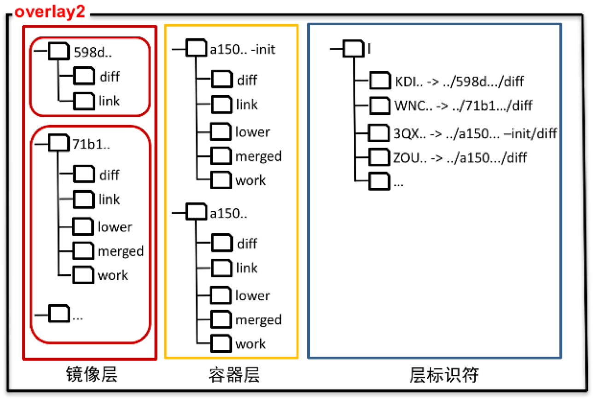

# 层的文件结构

overlay2的存储驱动目录结构



存储驱动目录下存有镜像层和容器层的层目录，层目录中是一些层的描述文件。其中：

最底层：最底层只有包含该层文件的diff目录和记录该层层标识符的link文件
其它层：由于不是最底层，所以除了diff目录和link文件外，还有描述下层信息的lower文件，联合挂载目录merged，以及copy-up等操作会用到的work目录

# 创建层

一般在下列情况情况下会创建层：

1. 拉取一个镜像时需要为镜像创建镜像层
2. 根据镜像创建一个容器时，需要创建一层初始化层和容器层
3. docker commit根据容器生成镜像时，会创建一层镜像层

创建层时，会调用overlay2实现的Create()函数，参数id是将要创建层的ID，parent是这一层的父层ID。opts是创建层时需要用到的一些参数：

```go
func (d *Driver) Create(id, parent string, opts *graphdriver.CreateOpts) (retErr error) {
	/*
		如果存储参数不为0，但是底层文件系统又不是xfs，则输出错误信息
			projectQuotaSupported是全局变量，初始化为false。
			在调用Init()函数创建存储驱动时，如果底层文件系统是xfs，
			则支持磁盘配额，会将这个变量赋值为true。
	*/
	if opts != nil && len(opts.StorageOpt) != 0 && !projectQuotaSupported {
		return fmt.Errorf("--storage-opt is supported only for overlay over xfs with 'pquota' mount option")
	}

	//得到即将创建层的层目录路径/var/lib/docker/overlay2/id
	dir := d.dir(id)

	//获取rootUID和rootGID
	rootUID, rootGID, err := idtools.GetRootUIDGID(d.uidMaps, d.gidMaps)
	if err != nil {
		return err
	}
	//创建层overlay2目录，如果存在则设置目录的权限
	if err := idtools.MkdirAllAs(path.Dir(dir), 0700, rootUID, rootGID); err != nil {
		return err
	}
	//创建层目录
	if err := idtools.MkdirAs(dir, 0700, rootUID, rootGID); err != nil {
		return err
	}

	//如果层创建失败，则最后会删除层目录
	defer func() {
		// Clean up on failure
		if retErr != nil {
			os.RemoveAll(dir)
		}
	}()

	//处理存储参数
	if opts != nil && len(opts.StorageOpt) > 0 {
		driver := &Driver{}
		//解析存储参数，docker 17.05.0只支持size
		if err := d.parseStorageOpt(opts.StorageOpt, driver); err != nil {
			return err
		}

		//如果设置了磁盘空间(size)配额，则将相应信息存到存储驱动的结构对象中
		//对该层能使用的磁盘空间进行限制
		if driver.options.quota.Size > 0 {
			// Set container disk quota limit
			if err := d.quotaCtl.SetQuota(dir, driver.options.quota); err != nil {
				return err
			}
		}
	}

	//在层目录下创建diff目录
	if err := idtools.MkdirAs(path.Join(dir, "diff"), 0755, rootUID, rootGID); err != nil {
		return err
	}

	//生成层标识符字符串lid。
	//创建层标识符的软链接，链接文件位于存储驱动目录下的l目录下，链接到层目录下的diff目录
	lid := generateID(idLength)
	if err := os.Symlink(path.Join("..", id, "diff"), path.Join(d.home, linkDir, lid)); err != nil {
		return err
	}

	//创建link文件，将层标识符信息(层标识符字符串)写入link文件中
	if err := ioutil.WriteFile(path.Join(dir, "link"), []byte(lid), 0644); err != nil {
		return err
	}

	//如果没有父层，则返回。因此，对于最底层来说，在这就返回了。
	if parent == "" {
		return nil
	}

	/*如果不是最底层，则创建work目录和merged目录*/
	if err := idtools.MkdirAs(path.Join(dir, "work"), 0700, rootUID, rootGID); err != nil {
		return err
	}
	if err := idtools.MkdirAs(path.Join(dir, "merged"), 0700, rootUID, rootGID); err != nil {
		return err
	}

	/*
		不是最底层，除了work和merged外，还要创建lower文件，记录lower层信息
		所以根据父层ID(parent)读取父层目录下的lower文件，然后在结果中添加父层信息
		上述结果就是lower文件中的内容，将其写入lower文件
	*/
	lower, err := d.getLower(parent)
	if err != nil {
		return err
	}
	if lower != "" {
		if err := ioutil.WriteFile(path.Join(dir, lowerFile), []byte(lower), 0666); err != nil {
			return err
		}
	}

	return nil
```

## 获取lower层信息

```go
func (d *Driver) getLower(parent string) (string, error) {
	//获取父层的层目录路径
	parentDir := d.dir(parent)

	// Ensure parent exists
	if _, err := os.Lstat(parentDir); err != nil {
		return "", err
	}

	//读取父层的层目录下的link文件
	parentLink, err := ioutil.ReadFile(path.Join(parentDir, "link"))
	if err != nil {
		return "", err
	}
	//将父层的层标识符路径信息 “l/层标识符” 添加到记录lower层信息的数组lowers中
	lowers := []string{path.Join(linkDir, string(parentLink))}

	//读取父层下的lower文件
	parentLower, err := ioutil.ReadFile(path.Join(parentDir, lowerFile))
	if err == nil {
		//将父层的lower层信息添加到lowers数组
		parentLowers := strings.Split(string(parentLower), ":")
		lowers = append(lowers, parentLowers...)
	}
	//如果lower层太多，最大限制是128，则返回错误
	if len(lowers) > maxDepth {
		return "", errors.New("max depth exceeded")
	}
	//将lower层字符串通过':'连接成一个字符串返回
	return strings.Join(lowers, ":"), nil
```

# 删除层

般在下列情况下会删除层：

1. 删除一个镜像，会删除镜像的所有层
2. 删除一个容器，会删除为容器创建的初始化层和容器层

删除一个层时，会调用存储驱动的Remove函数：

```go
func (d *Driver) Remove(id string) error {
	//删除前先获得锁
	d.locker.Lock(id)
	//函数返回时释放锁
	defer d.locker.Unlock(id)
	//获得该层的层目录路径
	dir := d.dir(id)
	//获取层标识符链接文件的路径
	lid, err := ioutil.ReadFile(path.Join(dir, "link"))
	if err == nil {
		//删除层标识符目录l下该层的层标识符链接文件
		if err := os.RemoveAll(path.Join(d.home, linkDir, string(lid))); err != nil {
			logrus.Debugf("Failed to remove link: %v", err)
		}
	}

	//删除该层的层目录
	if err := os.RemoveAll(dir); err != nil && !os.IsNotExist(err) {
		return err
	}
	return nil
}
```

# 容器启动与停止

我们在容器内看到的文件存在哪？

我们已经知道层目录下有diff，merged和work 3个目录。diff存储的是该层的文件，work是执行一些特定操作时所要用到的目录，所以实际上，在容器内看到的文件，就存在于merged目录下.

merged目录在容器未运行时，是一个空目录，当容器启动时会将该容器所有层的diff目录进行联合挂载，挂载到merged目录下，挂载时使用的文件系统就是内核OverlayFS文件系统

## 挂载文件系统

容器启动时，文件系统的挂载逻辑上面已经介绍过了，就是将一系列diff目录联合挂载到容器层的merged目录下。这个操作通过overlay2存储驱动实现的Get函数来完成：

```go
func (d *Driver) Get(id string, mountLabel string) (s string, err error) {
	d.locker.Lock(id)
	defer d.locker.Unlock(id)
	//获取该层的层目录路径
	dir := d.dir(id)
	if _, err := os.Stat(dir); err != nil {
		return "", err
	}

	//获取该层的diff目录路径
	diffDir := path.Join(dir, "diff")
	//读取lower文件，获取lower层的层标识符信息
	lowers, err := ioutil.ReadFile(path.Join(dir, lowerFile))
	if err != nil {
		// If no lower, just return diff directory
		if os.IsNotExist(err) {
			return diffDir, nil
		}
		return "", err
	}

	//获取该层merged目录的路径
	mergedDir := path.Join(dir, "merged")
	//曾加引用计数，如果大于1说明已经挂载了则直接返回
	if count := d.ctr.Increment(mergedDir); count > 1 {
		return mergedDir, nil
	}
	defer func() {
		if err != nil {
			if c := d.ctr.Decrement(mergedDir); c <= 0 {
				syscall.Unmount(mergedDir, 0)
			}
		}
	}()

	//获取该层work目录的路径
	workDir := path.Join(dir, "work")
	//通过:分割lower层的层标识符信息
	splitLowers := strings.Split(string(lowers), ":")
	//得到lower层层标识符路径数组
	absLowers := make([]string, len(splitLowers))
	for i, s := range splitLowers {
		absLowers[i] = path.Join(d.home, s)
	}
	//挂载命令的参数字符串
	opts := fmt.Sprintf("lowerdir=%s,upperdir=%s,workdir=%s", strings.Join(absLowers, ":"), path.Join(dir, "diff"), path.Join(dir, "work"))
	//挂载命令的数据
	mountData := label.FormatMountLabel(opts, mountLabel)
	//挂载函数
	mount := syscall.Mount
	//挂载目标目录
	mountTarget := mergedDir

	pageSize := syscall.Getpagesize()

	//go 1.7.中，可能会返回一个比系统支持更大的页大小。这个在go 1.8中解决了
	//所以如果是go 1.8，下面这3行代码可以删掉
	if pageSize > 4096 {
		pageSize = 4096
	}

	// 如果挂载命令太长，一个页中放不下，则使用相对路径作为参数来挂载
	if len(mountData) > pageSize {
		opts = fmt.Sprintf("lowerdir=%s,upperdir=%s,workdir=%s", string(lowers), path.Join(id, "diff"), path.Join(id, "work"))
		mountData = label.FormatMountLabel(opts, mountLabel)
		if len(mountData) > pageSize {
			return "", fmt.Errorf("cannot mount layer, mount label too large %d", len(mountData))
		}

		mount = func(source string, target string, mType string, flags uintptr, label string) error {
			return mountFrom(d.home, source, target, mType, flags, label)
		}
		mountTarget = path.Join(id, "merged")
	}

	if err := mount("overlay", mountTarget, "overlay", 0, mountData); err != nil {
		return "", fmt.Errorf("error creating overlay mount to %s: %v", mergedDir, err)
	}

	// chown "workdir/work" to the remapped root UID/GID. Overlay fs inside a
	// user namespace requires this to move a directory from lower to upper.
	rootUID, rootGID, err := idtools.GetRootUIDGID(d.uidMaps, d.gidMaps)
	if err != nil {
		return "", err
	}

	if err := os.Chown(path.Join(workDir, "work"), rootUID, rootGID); err != nil {
		return "", err
	}

	return mergedDir, nil
}
```

函数完成下列操作：

1. 为挂载命令准备参数，设置挂载函数。包括
- 获取该层diff目录路径
- 获取联合挂载的目标目录——merged目录的路径
- 获取该层work目录路径
- 获取链接到lower层diff目录的软连接的路径
2. 根据页大小判断是否要使用相对路径进行挂载
3. 调用挂载函数执行挂载
4. 修改work目录权限

> 第2步是因为”/var/lib/docker/overlay2/…“这样的字符串太长，由于overlay2最大支持128层，所以加起来字符串的长度可想而知。这有可能无法放入一个页中导致挂载失败。所以要进行一个这样的判断，这也是overlay2引入层标识符的原因

## 卸载文件系统

容器停止时，会卸载容器的文件系统。通过overlay2实现的函数Put来完成：

```go
func (d *Driver) Put(id string) error {
	d.locker.Lock(id)
	defer d.locker.Unlock(id)
	//获取该层路径
	dir := d.dir(id)
	//读取lower文件，获取lower层信息
	_, err := ioutil.ReadFile(path.Join(dir, lowerFile))
	if err != nil {
		// If no lower, no mount happened and just return directly
		if os.IsNotExist(err) {
			return nil
		}
		return err
	}

	//获取挂载点路径，即merged目录的路径
	mountpoint := path.Join(dir, "merged")
	//挂载时增加了引用计数，卸载时减少
	if count := d.ctr.Decrement(mountpoint); count > 0 {
		return nil
	}
	//卸载
	if err := syscall.Unmount(mountpoint, 0); err != nil {
		logrus.Debugf("Failed to unmount %s overlay: %s - %v", id, mountpoint, err)
	}
	return nil
}
```

如果不存在lower层，则该层不会发生挂载。所以如果读取lower文件，发现文件不存在，说明是一个最底层，直接返回。否则，获取该层的merged目录，也就是联合挂载目录，调用syscall.Unmount()卸载容器的文件系统。这个函数会产生一个卸载文件系统的系统调用，进一步进入内核，由内核OverlayFS完成文件系统的卸载工作

