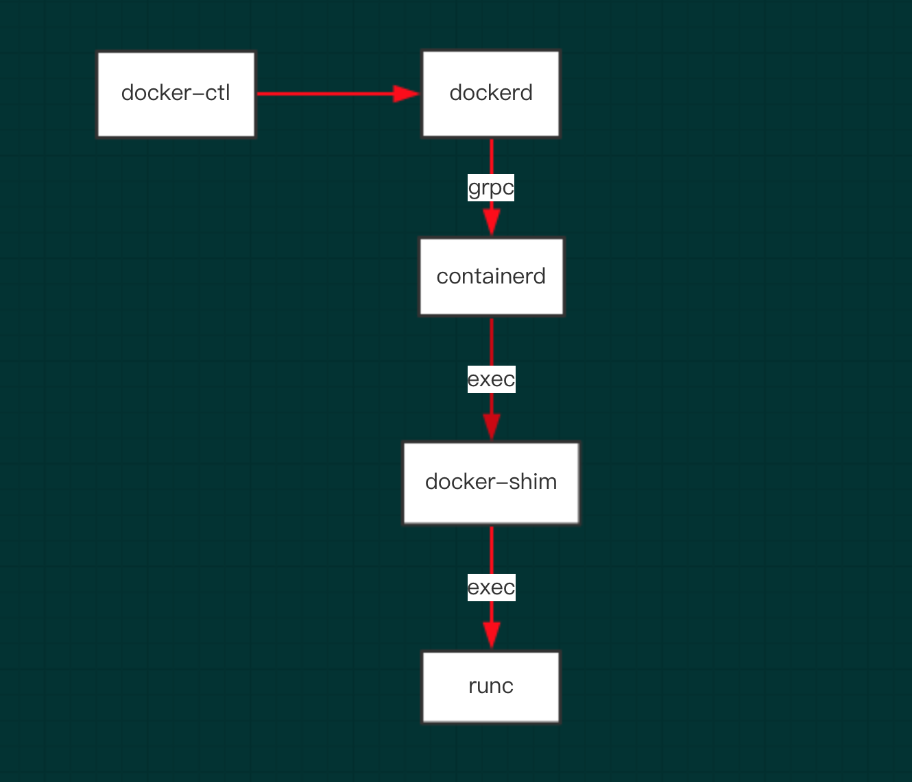

关于containerd
关于containerd的一些详解介绍，请参考containerd的官网：（https://containerd.io/）

关于docker
docker本身而言包括了，docker client和dockerd（docker daemon），dockerd本身实属是对容器相关操作的api的最上层封装，
直接面向操作用户。

# 关于docker1.12.x
该版本的docker由 docker-client ,dockerd,containerd,docker-shim,runc组成，现在来谈谈每个组件是用来干嘛的：

dockerd
dockerd本身实属是对容器相关操作的api的最上层封装，直接面向操作用户。

containerd
dockerd实际真实调用的还是containerd的api接口（rpc方式实现），containerd是dockerd和runc之间的一个中间交流组件。

docker-shim
docker-shim是一个真实运行的容器的真实垫片载体，每启动一个容器都会起一个新的docker-shim的一个进程，
他直接通过指定的三个参数：容器id，boundle目录（containerd的对应某个容器生成的目录，一般位于：/var/run/docker/libcontainerd/containerID），
运行是二进制（默认为runc）来调用runc的api创建一个容器（比如创建容器：最后拼装的命令如下：runc create 。。。。。）

runc
runc是一个命令行工具端，他根据oci（开放容器组织）的标准来创建和运行容器。

他们之间的关系如下图：

# containerd为什么要单独出来的？他和docker-shim什么关系？

**from chatgpt**

containerd是一个独立的容器守护进程，它是由Docker公司开发的，旨在为容器运行时（如Docker）提供一个标准化的接口，以便管理和操作容器。containerd的设计目标是提供一个简单、高效、可扩展的容器运行时，同时提供足够的灵活性和可定制性，以适应不同的使用场景和需求。

Docker-shim是一个用于启动Docker容器的简单代理程序，它与Docker Daemon一起运行，并负责管理Docker容器的生命周期。Docker-shim是Docker 1.11之前的版本中使用的默认容器运行时。

containerd和Docker-shim的关系是：在Docker 1.11之后，Docker引入了containerd来代替Docker-shim作为默认的容器运行时。这是因为，containerd相对于Docker-shim具有更好的可扩展性和灵活性，而且可以与其他容器运行时（如runc）进行集成。

因此，containerd和Docker-shim都是容器运行时的组件，但是它们的实现和设计方式有所不同。containerd是一个独立的容器守护进程，它可以被用作多个容器运行时的后端，而Docker-shim是Docker特有的容器运行时代理程序。

