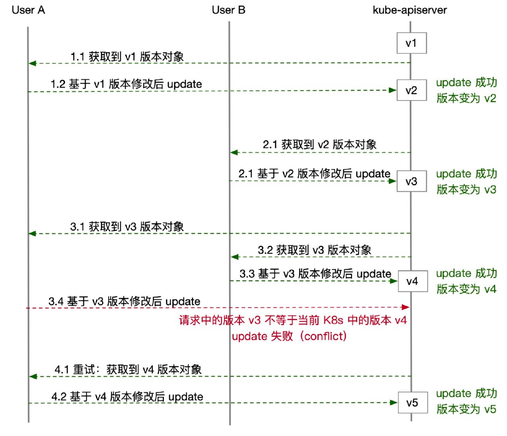

# 概述

在kubernetes中，对资源进行更新的方式有两种。一种是update操作，一种是patch操作。对于update请求,我们需要将整个修改后的对象提交给k8s, 而对于patch请求， 我们只需要将对象中某些字段的修改提交给k8s。

# kubernetes update 机制

在kubernetes的所有资源对象中，都有一个全局唯一的版本号(metadata.resourceVersion), 每个资源对象从创建开始就会有一个版本号，而后每次被修改（不管是 update 还是 patch 修改），版本号都会发生变化。

kubernetes官方文档 告诉我们，这个版本号是一个 K8s 的内部机制，用户不应该假设它是一个数字或者通过比较两个版本号大小来确定资源对象的新旧，唯一能做的就是通过比较版本号相等来确定对象是否是同一个版本（即是否发生了变化）。而 resourceVersion 一个重要的用处，就是来做 update 请求的版本控制。

kubernetes 要求用户 update 请求中提交的对象必须带有 resourceVersion，也就是说我们提交 update 的数据必须先来源于 K8s 中已经存在的对象。因此，一次完整的 update 操作流程是：

1. 首先，从 K8s 中拿到一个已经存在的对象（可以选择直接从 K8s 中查询；如果在客户端做了 list watch，推荐从本地 informer 中获取）；
2. 然后，基于这个取出来的对象做一些修改，比如将 Deployment 中的 replicas 做增减，或是将 image 字段修改为一个新版本的镜像；
3. 最后，将修改后的对象通过 update 请求提交给 K8s；
4. 此时，kube-apiserver 会校验用户 update 请求提交对象中的 resourceVersion 一定要和当前 K8s 中这个对象最新的 resourceVersion 一致，才能接受本次 update。否则，K8s 会拒绝请求，并告诉用户发生了版本冲突（Conflict）。



上图展示了多个用户同时 update 某一个资源对象时会发生的事情。而如果如果发生了 Conflict 冲突，对于 User A 而言应该做的就是做一次重试，再次获取到最新版本的对象，修改后重新提交 update, 因此

1. 用户修改 YAML 后提交 update 失败，是因为 YAML 文件中没有包含 resourceVersion 字段。对于 update 请求而言，应该取出当前 K8s 中的对象做修改后提交；
2. 如果两个用户同时对一个资源对象做 update，不管操作的是对象中同一个字段还是不同字段，都存在版本控制的机制确保两个用户的 update 请求不会发生覆盖。

# kubernetes patch 机制

相比于 update 的版本控制，K8s 的 patch 机制则显得更加简单。当用户对某个资源对象提交一个 patch 请求时，kube-apiserver 不会考虑版本问题，而是“无脑”地接受用户的请求（只要请求发送的 patch 内容合法），也就是将 patch 打到对象上、同时更新版本号。

不过，patch 的复杂点在于，目前 K8s 提供了 4 种 patch 策略：json patch、merge patch、strategic merge patch、apply patch(server-side apply)。通过 kubectl patch -h 命令我们也可以看到这个策略选项（默认采用 strategic

## json patch

```json
{
    "op": "add",
    "path": "/spec/containers/0/image",
    "value": "busybox:latest"
}
```
1. op: 表示对资源对象的操作，主要有以下六种操作。
add
replace
remove
move
copy
test
2. path: 表示被作资源对象的路径. 例如/spec/containers/0/image表示要操作的对象是“spec.containers[0].image”
3. value 表示预修改的值

新增容器：

```sh
kubectl patch deployment/foo --type='json' -p \
  '[{"op":"add","path":"/spec/template/spec/containers/1","value":{"name":"nginx","image":"nginx:alpine"}}]'
```

修改已有的容器镜像:

```sh
kubectl patch deployment/foo --type='json' -p \
  '[{"op":"replace","path":"/spec/template/spec/containers/0/image","value":"app-image:v2"}]'
```

根据http patch原子性的定义，当某个op(操作)不成功,则整个patch都不成功

## merge patch

merge patch 必须包含一个对资源对象的部分描述，json对象。该json对象被提交到服务端，并和服务端的当前对象进行合并，从而创建新的对象。完整的替换列表，也就是说，新的列表定义会替换原有的定义

例如(设置label)：

```sh
kubectl patch deployment/foo --type='merge' -p '{"metadata":{"labels":{"test-key":"foo"}}}'
```

使用merge patch也有如下限制

1. 如果value的值为null,表示要删除对应的键，因此我们无法将value的值设置为null, 如下，表示删除键f

```json
{
	"a":"z",
	"c": {
		"f": null
	}
}
```

2. merge patch 无法单独更新一个列表(数组)中的某个元素，因此不管我们是要在 containers 里新增容器、还是修改已有容器的 image、env 等字段，都要用整个 containers 列表(数组)来提交 patch：

```json
kubectl patch deployment/foo --type='merge' -p \
  '{"spec":{"template":{"spec":{"containers":[{"name":"app","image":"app-image:v2"},{"name":"nginx","image":"nginx:alpline"}]}}}}'
```

## strategic merge patch

这种 patch 策略并没有一个通用的 RFC 标准，而是 K8s 独有的，不过相比前两种而言却更为强大的。

我们先从 K8s 源码看起，在 K8s 原生资源的数据结构定义中额外定义了一些的策略注解。比如以下这个截取了 podSpec 中针对 containers 列表的定义，参考 [Github](https://github.com/kubernetes/api/blob/release-1.18/core/v1/types.go#L2864)：

```go
// ...
// +patchMergeKey=name
// +patchStrategy=merge
Containers []Container `json:"containers" patchStrategy:"merge" patchMergeKey:"name" protobuf:"bytes,2,rep,name=containers"`
```

可以看到其中有两个关键信息：patchStrategy:”merge” patchMergeKey:”name” 。这就代表了，containers 列表使用 strategic merge patch 策略更新时，会把下面每个元素中的 name 字段看作 key

简单来说，在我们 patch 更新 containers 不再需要指定下标序号了，而是指定 name 来修改，K8s 会把 name 作为 key 来计算 merge。比如针对以下的 patch 操作：

```sh
kubectl patch deployment/foo -p \
  '{"spec":{"template":{"spec":{"containers":[{"name":"nginx","image":"nginx:mainline"}]}}}}'
```

> 如果 K8s 发现当前 containers 中已经有名字为 nginx 的容器，则只会把 image 更新上去；而如果当前 containers 中没有 nginx 容器，K8s 会把这个容器插入 containers 列表。

> 此外还要说明的是，目前 strategic 策略只能用于原生 K8s 资源以及 Aggregated API 方式的自定义资源，对于 CRD 定义的资源对象，是无法使用的。这很好理解，因为 kube-apiserver 无法得知 CRD 资源的结构和 merge 策略。如果用 kubectl patch 命令更新一个 CR，则默认会采用 merge patch 的策略来操作。

## apply patch

apply patch 分为client-side apply和服务器端的server-side apply。

### client-side apply

在使用默认参数执行 apply 时，触发的是 client-side apply。kubectl 逻辑如下：

首先解析用户提交的数据（YAML/JSON）为一个对象 A；然后调用 Get 接口从 K8s 中查询这个资源对象：

- 如果查询结果不存在，kubectl 将本次用户提交的数据记录到对象 A 的 annotation 中（key 为 kubectl.kubernetes.io/last-applied-configuration），最后将对象 A提交给 K8s 创建；
- 如果查询到 K8s 中已有这个资源，假设为对象 B

1. kubectl 尝试从对象 B 的 annotation 中取出 kubectl.kubernetes.io/last-applied-configuration 的值（对应了上一次 apply 提交的内容）
2. kubectl 根据前一次 apply 的内容和本次 apply 的内容计算出 diff（默认为 strategic merge patch 格式，如果非原生资源则采用 merge patch）
3. 将 diff 中添加本次的 kubectl.kubernetes.io/last-applied-configuration annotation，最后用 patch 请求提交给 K8s 做更新

与kubectl apply 相比，kubectl edit 逻辑上更简单一些。在用户执行kubectl edit 命令之后，kubectl 从 K8s 中查到当前的资源对象，并打开一个命令行编辑器（默认用 vi）为用户提供编辑界面。当用户修改完成、保存退出时，**kubectl 并非直接把修改后的对象提交 update（避免 Conflict，如果用户修改的过程中资源对象又被更新），而是会把修改后的对象和初始拿到的对象计算 diff，最后将 diff 内容用 patch 请求提交给 K8s**。

### server-side apply [k8s v1.18新特性]

server-side apply是k8s v1.18的新特性，在Kubernetes 1.18中，所有新对象都将附加managedFields，并提供关于冲突的准确信息。

那什么是Server-side Apply呢？简单的说就是多个Controller控制一个资源, 通过managedFields来记录哪个Field被哪个资源控制，例如 WorkloadController只能修改image相关的操作，而ScaleController 只能修改副本数。

相比于client-side apply 用 last-applied annotations的方式，服务器端(server-side) apply 新提供了一种声明式 API (叫 ManagedFields) 来明确指定谁管理哪些资源字段。当使用server-side apply时，尝试着去改变一个被其他人管理的字段， 会导致请求被拒绝（在没有设置强制执行时，参见冲突）

冲突是一种特定的错误状态， 发生在执行 Apply 改变一个字段，而恰巧该字段被其他用户声明过主权时。 这可以防止一个应用者不小心覆盖掉其他用户设置的值。 冲突发生时，应用者有三种办法来解决它：

- **覆盖前值，成为唯一的管理器**：如果打算覆盖该值（或应用者是一个自动化部件，比如控制器）， 应用者应该设置查询参数 force 为 true，然后再发送一次请求。 这将强制操作成功，改变字段的值，从所有其他管理器的 managedFields 条目中删除指定字段。
不覆盖前值，放弃管理权： 如果应用者不再关注该字段的值， 可以从配置文件中删掉它，再重新发送请求。 这就保持了原值不变，并从 managedFields 的应用者条目中删除该字段。
不覆盖前值，成为共享的管理器： 如果应用者仍然关注字段值，并不想覆盖它， 他们可以在配置文件中把字段的值改为和服务器对象一样，再重新发送请求。 这样在不改变字段值的前提下， 就实现了字段管理被应用者和所有声明了管理权的其他的字段管理器共享


