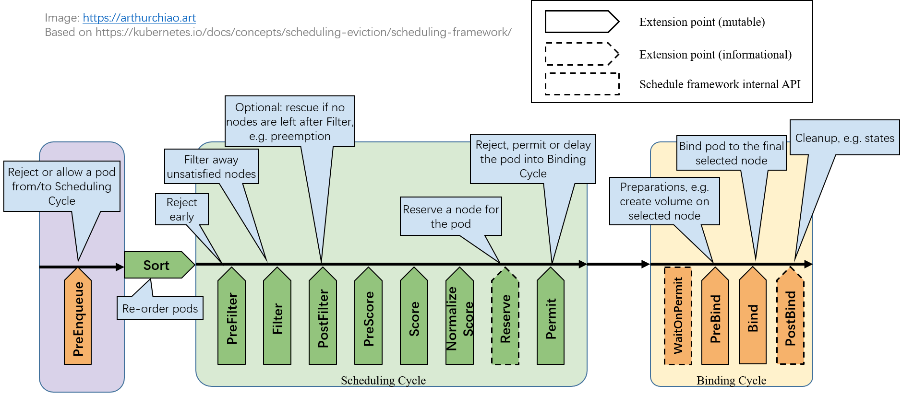

# 引言
K8s 调度框架提供了一种扩展调度功能的插件机制， 对于想实现自定义调度逻辑的场景非常有用。

如果 pod spec 里没指定 schedulerName 字段，则使用默认调度器；
如果指定了，就会走到相应的调度器/调度插件。

本文整理一些相关内容，并展示如何用 300 来行代码实现**一个简单的固定宿主机调度插件**。 代码基于 k8s v1.28。

## 调度框架（sceduling framework）扩展点

K8s 调度框架定义了一些扩展点（extension points）



**用户可以编写自己的调度插件（scheduler plugins）注册到这些扩展点来实现想要的调度逻辑。 每个扩展点上一般会有多个 plugins，按注册顺序依次执行。**

扩展点根据是否影响调度决策，可以分为两类

1. 影响调度决策的扩展点

大部分扩展点是影响调度决策的，

- 后面会看到，这些函数的返回值中包括一个成功/失败字段，决定了是允许还是拒绝这个 pod 进入下一处理阶段；
- 任何一个扩展点失败了，这个 pod 的调度就失败了；

2. 不影响调度决策的扩展点（informational）

少数几个扩展点是 informational 的，

- 这些函数没有返回值，因此不能影响调度决策；
- 但是，在这里面可以修改 pod/node 等信息，或者执行清理操作。

## 调度插件分类

根据是否维护在 k8s 代码仓库本身，分为两类。

1. in-tree plugins
维护在 k8s 代码目录 pkg/scheduler/framework/plugins 中， 跟内置调度器一起编译。里面有十几个调度插件，大部分都是常用和在用的，

```sh
ll pkg/scheduler/framework/plugins
defaultbinder/
defaultpreemption/
dynamicresources/
feature/
imagelocality/
interpodaffinity/
names/
nodeaffinity/
nodename/
nodeports/
noderesources/
nodeunschedulable/
nodevolumelimits/
podtopologyspread/
queuesort/
schedulinggates/
selectorspread/
tainttoleration/
volumebinding/
volumerestrictions/
volumezone/
```

in-tree 方式每次要添加新插件，或者修改原有插件，都需要修改 kube-scheduler 代码然后编译和 重新部署 kube-scheduler，比较重量级。

2. out-of-tree plugins
out-of-tree plugins 由用户自己编写和维护，独立部署， 不需要对 k8s 做任何代码或配置改动。

本质上 out-of-tree plugins 也是跟 kube-scheduler 代码一起编译的，不过 kube-scheduler 相关代码已经抽出来作为一个独立项目 github.com/kubernetes-sigs/scheduler-plugins。 **用户只需要引用这个包，编写自己的调度器插件，然后以普通 pod 方式部署就行（其他部署方式也行，比如 binary 方式部署）。 编译之后是个包含默认调度器和所有 out-of-tree 插件的总调度器程序**:

- 它有内置调度器的功能
- 也包括了 out-of-tree 调度器的功能

## 每个扩展点上分别有哪些内置插件

内置的调度插件，以及分别工作在哪些 extention points： [官方文档](https://kubernetes.io/docs/reference/scheduling/config/#scheduling-plugins)。 比如

- node selectors 和 node affinity 用到了 NodeAffinity plugin；
- taint/toleration 用到了 TaintToleration plugin。

# Pod 调度过程

一个 pod 的完整调度过程可以分为两个阶段：

1. scheduling cycle：为 pod 选择一个 node，类似于数据库查询和筛选；
2. binding cycle：落实以上选择，类似于处理各种关联的东西并将结果写到数据库。

例如，虽然 scheduling cycle 为 pod 选择了一个 node，但是在接下来的 binding cycle 中， 在这个 node 上给这个 pod 创建 persistent volume 失败了， 那整个调度过程也是算失败的，需要回到最开始的步骤重新调度。 以上两个过程加起来称为一个 scheduling context。

另外，在**进入一个 scheduling context 之前，还有一个调度队列**， 用户可以编写自己的算法对队列内的 pods 进行排序，决定哪些 pods 先进入调度流程。 总流程如下图所示：


## 等待调度阶段

1. PreEnqueue

Pod 处于 ready for scheduling 的阶段。 内部工作原理：[sig-scheduling/scheduler_queues.md](https://github.com/kubernetes/community/blob/f03b6d5692bd979f07dd472e7b6836b2dad0fd9b/contributors/devel/sig-scheduling/scheduler_queues.md)。

这一步没过就不会进入调度队列，更不会进入调度流程。

2. QueueSort

对调度队列（scheduling queue）内的 pod 进行排序，决定先调度哪些 pods。

## 调度阶段（scheduling cycle）

### PreFilter：pod 预处理和检查，不符合预期就提前结束调度

这里的插件可以对 Pod 进行预处理，或者条件检查，函数签名如下：

```go
// https://github.com/kubernetes/kubernetes/blob/v1.28.4/pkg/scheduler/framework/interface.go#L349-L367

// PreFilterPlugin is an interface that must be implemented by "PreFilter" plugins.
// These plugins are called at the beginning of the scheduling cycle.
type PreFilterPlugin interface {
    // PreFilter is called at the beginning of the scheduling cycle. All PreFilter
    // plugins must return success or the pod will be rejected. PreFilter could optionally
    // return a PreFilterResult to influence which nodes to evaluate downstream. This is useful
    // for cases where it is possible to determine the subset of nodes to process in O(1) time.
    // When it returns Skip status, returned PreFilterResult and other fields in status are just ignored,
    // and coupled Filter plugin/PreFilterExtensions() will be skipped in this scheduling cycle.
    PreFilter(ctx , state *CycleState, p *v1.Pod) (*PreFilterResult, *Status)

    // PreFilterExtensions returns a PreFilterExtensions interface if the plugin implements one,
    // or nil if it does not. A Pre-filter plugin can provide extensions to incrementally
    // modify its pre-processed info. The framework guarantees that the extensions
    // AddPod/RemovePod will only be called after PreFilter, possibly on a cloned
    // CycleState, and may call those functions more than once before calling
    // Filter again on a specific node.
    PreFilterExtensions() PreFilterExtensions
}
```

输入：

- p *v1.Pod 是待调度的 pod；
- 第二个参数 state 可用于保存一些状态信息，然后在后面的扩展点（例如 Filter() 阶段）拿出来用；

输出：

- 只要有任何一个 plugin 返回失败，这个 pod 的调度就失败了；
- 换句话说，所有已经注册的 PreFilter plugins 都成功之后，pod 才会进入到下一个环节；

### Filter：排除所有不符合要求的 node

- 这里的插件可以过滤掉那些不满足要求的 node（equivalent of Predicates in a scheduling Policy），

- 针对每个 node，调度器会按配置顺序依次执行 filter plugins；
任何一个插件 返回失败，这个 node 就被排除了；

```go
// https://github.com/kubernetes/kubernetes/blob/v1.28.4/pkg/scheduler/framework/interface.go#L349C1-L367C2

// FilterPlugin is an interface for Filter plugins. These plugins are called at the
// filter extension point for filtering out hosts that cannot run a pod.
// This concept used to be called 'predicate' in the original scheduler.
// These plugins should return "Success", "Unschedulable" or "Error" in Status.code.
// However, the scheduler accepts other valid codes as well.
// Anything other than "Success" will lead to exclusion of the given host from running the pod.
type FilterPlugin interface {
    Plugin
    // Filter is called by the scheduling framework.
    // All FilterPlugins should return "Success" to declare that
    // the given node fits the pod. If Filter doesn't return "Success",
    // it will return "Unschedulable", "UnschedulableAndUnresolvable" or "Error".
    // For the node being evaluated, Filter plugins should look at the passed
    // nodeInfo reference for this particular node's information (e.g., pods
    // considered to be running on the node) instead of looking it up in the
    // NodeInfoSnapshot because we don't guarantee that they will be the same.
    // For example, during preemption, we may pass a copy of the original
    // nodeInfo object that has some pods removed from it to evaluate the
    // possibility of preempting them to schedule the target pod.
    Filter(ctx , state *CycleState, pod *v1.Pod, nodeInfo *NodeInfo) *Status
}
```

输入：

- nodeInfo 是当前给定的 node 的信息，Filter() 程序判断这个 node 是否符合要求；

输出：

- 放行或拒绝

### PostFilter：Filter 之后没有 node 剩下，补救阶段

如果 Filter 阶段之后，所有 nodes 都被筛掉了，一个都没剩，才会执行这个阶段；否则不会执行这个阶段的 plugins。

```go
/ https://github.com/kubernetes/kubernetes/blob/v1.28.4/pkg/scheduler/framework/interface.go#L392C1-L407C2

// PostFilterPlugin is an interface for "PostFilter" plugins. These plugins are called after a pod cannot be scheduled.
type PostFilterPlugin interface {
    // A PostFilter plugin should return one of the following statuses:
    // - Unschedulable: the plugin gets executed successfully but the pod cannot be made schedulable.
    // - Success: the plugin gets executed successfully and the pod can be made schedulable.
    // - Error: the plugin aborts due to some internal error.
    //
    // Informational plugins should be configured ahead of other ones, and always return Unschedulable status.
    // Optionally, a non-nil PostFilterResult may be returned along with a Success status. For example,
    // a preemption plugin may choose to return nominatedNodeName, so that framework can reuse that to update the
    // preemptor pod's .spec.status.nominatedNodeName field.
    PostFilter(ctx , state *CycleState, pod *v1.Pod, filteredNodeStatusMap NodeToStatusMap) (*PostFilterResult, *Status)
}
```

按 plugin 顺序依次执行，任何一个插件将 node 标记为 Schedulable 就算成功，不再执行剩下的 PostFilter plugins。

典型例子：preemptiontoleration， Filter() 之后已经没有可用 node 了，在这个阶段就挑一个 pod/node，抢占它的资源

### PreScore
PreScore/Score/NormalizeScore 都是给 node 打分的，以最终选出一个最合适的 node。这里就不展开了， 函数签名也在上面给到的源文件路径中，这里就不贴了。

### Score
针对每个 node 依次调用 scoring plugin，得到一个分数。

### NormalizeScore

### Reserve：Informational，维护 plugin 状态信息

```go
// https://github.com/kubernetes/kubernetes/blob/v1.28.4/pkg/scheduler/framework/interface.go#L444C1-L462C2

// ReservePlugin is an interface for plugins with Reserve and Unreserve
// methods. These are meant to update the state of the plugin. This concept
// used to be called 'assume' in the original scheduler. These plugins should
// return only Success or Error in Status.code. However, the scheduler accepts
// other valid codes as well. Anything other than Success will lead to
// rejection of the pod.
type ReservePlugin interface {
    // Reserve is called by the scheduling framework when the scheduler cache is
    // updated. If this method returns a failed Status, the scheduler will call
    // the Unreserve method for all enabled ReservePlugins.
    Reserve(ctx , state *CycleState, p *v1.Pod, nodeName string) *Status
    // Unreserve is called by the scheduling framework when a reserved pod was
    // rejected, an error occurred during reservation of subsequent plugins, or
    // in a later phase. The Unreserve method implementation must be idempotent
    // and may be called by the scheduler even if the corresponding Reserve
    // method for the same plugin was not called.
    Unreserve(ctx , state *CycleState, p *v1.Pod, nodeName string)
}
```

这里有两个方法，都是 informational，也就是不影响调度决策； 维护了 runtime state (aka “stateful plugins”) 的插件，可以通过这两个方法 接收 scheduler 传来的信息：


1. Reserve

用来避免 scheduler 等待 bind 操作结束期间，因 race condition 导致的错误。 只有当所有 Reserve plugins 都成功后，才会进入下一阶段，否则 scheduling cycle 就中止了。

2. Unreserve

调度失败，这个阶段回滚时执行。Unreserve() 必须幂等，且不能 fail。

### Permit：允许/拒绝/等待进入 binding cycle

这是 scheduling cycle 的最后一个扩展点了，可以阻止或延迟将一个 pod binding 到 candidate node。

```go
// PermitPlugin is an interface that must be implemented by "Permit" plugins.
// These plugins are called before a pod is bound to a node.
type PermitPlugin interface {
    // Permit is called before binding a pod (and before prebind plugins). Permit
    // plugins are used to prevent or delay the binding of a Pod. A permit plugin
    // must return success or wait with timeout duration, or the pod will be rejected.
    // The pod will also be rejected if the wait timeout or the pod is rejected while
    // waiting. Note that if the plugin returns "wait", the framework will wait only
    // after running the remaining plugins given that no other plugin rejects the pod.
    Permit(ctx , state *CycleState, p *v1.Pod, nodeName string) (*Status, time.Duration)
}
```

三种结果：

- approve：所有 Permit plugins 都 appove 之后，这个 pod 就进入下面的 binding 阶段；
- deny：任何一个 Permit plugin deny 之后，就无法进入 binding 阶段。这会触发 Reserve plugins 的 Unreserve() 方法；
- wait (with a timeout)：如果有 Permit plugin 返回 “wait”，这个 pod 就会进入一个 internal “waiting” Pods list；

## 绑定阶段（binding cycle）

### PreBind：Bind 之前的预处理，例如到 node 上去挂载 volume

```go
// PreBindPlugin is an interface that must be implemented by "PreBind" plugins.
// These plugins are called before a pod being scheduled.
type PreBindPlugin interface {
    // PreBind is called before binding a pod. All prebind plugins must return
    // success or the pod will be rejected and won't be sent for binding.
    PreBind(ctx , state *CycleState, p *v1.Pod, nodeName string) *Status
}
```

任何一个 PreBind plugin 失败，都会导致 pod 被 reject，进入到 reserve plugins 的 Unreserve() 方法；

### Bind：将 pod 关联到 node

所有 PreBind 完成之后才会进入 Bind。

```go
// https://github.com/kubernetes/kubernetes/blob/v1.28.4/pkg/scheduler/framework/interface.go#L497

// Bind plugins are used to bind a pod to a Node.
type BindPlugin interface {
    // Bind plugins will not be called until all pre-bind plugins have completed. Each
    // bind plugin is called in the configured order. A bind plugin may choose whether
    // or not to handle the given Pod. If a bind plugin chooses to handle a Pod, the
    // remaining bind plugins are skipped. When a bind plugin does not handle a pod,
    // it must return Skip in its Status code. If a bind plugin returns an Error, the
    // pod is rejected and will not be bound.
    Bind(ctx , state *CycleState, p *v1.Pod, nodeName string) *Status
}
```

- 所有 plugin 按配置顺序依次执行；
- 每个 plugin 可以选择是否要处理一个给定的 pod；
- 如果选择处理，后面剩下的 plugins 会跳过。也就是最多只有一个 bind plugin 会执行。

### PostBind：informational，可选，执行清理操作

这是一个 informational extension point，也就是无法影响调度决策（没有返回值）。

```go
// https://github.com/kubernetes/kubernetes/blob/v1.28.4/pkg/scheduler/framework/interface.go#L473

// PostBindPlugin is an interface that must be implemented by "PostBind" plugins.
// These plugins are called after a pod is successfully bound to a node.
type PostBindPlugin interface {
    // PostBind is called after a pod is successfully bound. These plugins are informational.
    // A common application of this extension point is for cleaning
    // up. If a plugin needs to clean-up its state after a pod is scheduled and
    // bound, PostBind is the extension point that it should register.
    PostBind(ctx , state *CycleState, p *v1.Pod, nodeName string)
}
```

# 3 开发一个极简 sticky node 调度器插件（out-of-tree）

这里以 kubevirt 固定宿主机调度 VM 为例，展示如何用几百行代码实现一个 out-of-tree 调度器插件。

## 设计

### 背景知识

一点背景知识 [2,3]：

- VirtualMachine 是一个虚拟机 CRD；
- 一个 VirtualMachine 会对应一个 VirtualMachineInstance，这是一个运行中的 VirtualMachine；
- 一个 VirtualMachineInstance 对应一个 Pod；

如果发生故障，VirtualMachineInstance 和 Pod 可能会重建和重新调度，但 VirtualMachine 是不变的； VirtualMachine <--> VirtualMachineInstance/Pod 的关系， 类似于 StatefulSet <--> Pod 的关系。

## 业务需求

VM 创建之后只要被调度到某台 node，以后不管发生什么故障，它永远都被调度到这个 node 上（除非人工干预）。

> 需求来源：可能场景：VM 挂载了宿主机本地磁盘，因此换了宿主机之后数据就没了。 故障场景下，机器或容器不可用没关系，微服务系统自己会处理实例的健康检测和流量拉出， 底层基础设施保证不换宿主机就行了，这样故障恢复之后数据还在。

技术描述：

- 用户创建一个 VirtualMachine 后，能正常调度到一台 node 创建出来；
- 后续不管发生什么问题（pod crash/eviction/recreate、node restart …），这个 VirtualMachine 都要被调度到这台机器。

### 技术方案

- 用户创建一个 VirtualMachine 后，由默认调度器给它分配一个 node，然后将 node 信息保存到 VirtualMachine CR 上；

- 如果 VirtualMachineInstance 或 Pod 被删除或发生重建，调度器先找到对应的 VirtualMachine CR， 如果 CR 中有保存的 node 信息，就用这个 node；否则（必定是第一次调度），转 1。

## 实现
实现以上功能需要在三个位置注册调度扩展函数：

- PreFilter
- Filter
- PostBind

代码基于 k8s v1.28

### Prefilter()

主要做一些检查和准备工作，

1. 如果不是我们的 Pod：直接返回成功，留给其他 plugin 去处理；

2. 如果是我们的 Pod，查询关联的 VMI/VM CR，这里分两种情况：
2.1 找到了：说明之前已经调度过（可能是 pod 被删除了导致重新调度），我们应该解析出原来的 node，供后面 Filter() 阶段使用；
2.2 没找到：说明是第一次调度，什么都不做，让默认调度器为我们选择初始 node。
3. 将 pod 及为它选择的 node（没有就是空）保存到一个**state 上下文**中，这个 state 会传给后面的 Filter() 阶段使用。

```go
// PreFilter invoked at the preFilter extension point.
func (pl *StickyVM) PreFilter(ctx , state *framework.CycleState, pod *v1.Pod) (*framework.PreFilterResult, *framework.Status) {
    s := stickyState{false, ""}

    // Get pod owner reference
    podOwnerRef := getPodOwnerRef(pod)
    if podOwnerRef == nil {
        return nil, framework.NewStatus(framework.Success, "Pod owner ref not found, return")
    }

    // Get VMI
    vmiName := podOwnerRef.Name
    ns := pod.Namespace

    vmi := pl.kubevirtClient.VirtualMachineInstances(ns).Get(context.TODO(), vmiName, metav1.GetOptions{ResourceVersion: "0"})
    if err != nil {
        return nil, framework.NewStatus(framework.Error, "get vmi failed")
    }

    vmiOwnerRef := getVMIOwnerRef(vmi)
    if vmiOwnerRef == nil {
        return nil, framework.NewStatus(framework.Success, "VMI owner ref not found, return")
    }

    // Get VM
    vmName := vmiOwnerRef.Name
    vm := pl.kubevirtClient.VirtualMachines(ns).Get(context.TODO(), vmName, metav1.GetOptions{ResourceVersion: "0"})
    if err != nil {
        return nil, framework.NewStatus(framework.Error, "get vmi failed")
    }

    // Annotate sticky node to VM
    s.node, s.nodeExists = vm.Annotations[stickyAnnotationKey]
    return nil, framework.NewStatus(framework.Success, "Check pod/vmi/vm finish, return")
}
```

### Filter()

调度器会根据 pod 的 nodeSelector 等，为我们初步选择出一些备选 nodes。 然后会遍历这些 node，依次调用各 plugin 的 Filter() 方法，看这个 node 是否合适。 伪代码：

```go
// For a given pod
for node in selectedNodes:
    for pl in plugins:
        pl.Filter(ctx, customState, pod, node)
```

我们的 plugin 逻辑，首先解析传过来的 state/pod/node 信息，

1. 如果 state 中保存了一个 node，

- 如果保存的这个 node 就是当前 Filter() 传给我们的 node，返回成功；
- 对于其他所有 node，都返回失败。

2. 如果 state 中没有保存的 node，说明是第一次调度，也返回成功，默认调度器会给我们分一个 node。 我们在后面的 PostBind 阶段把这个 node 保存到 state 中。

```go
func (pl *StickyVM) Filter(ctx , state *framework.CycleState, pod *v1.Pod, nodeInfo *framework.NodeInfo) *framework.Status {
    s := state.Read(stateKey)
    if err != nil {
        return framework.NewStatus(framework.Error, fmt.Sprintf("read preFilter state fail: %v", err))
    }

    r, ok := s.(*stickyState)
    if !ok {
        return framework.NewStatus(framework.Error, fmt.Sprintf("convert %+v to stickyState fail", s))
    }
    if !r.nodeExists {
        return nil
    }

    if r.node != nodeInfo.Node().Name {
        // returning "framework.Error" will prevent process on other nodes
        return framework.NewStatus(framework.Unschedulable, "already stick to another node")
    }

    return nil
}
```

### PostBind()

能到这个阶段，说明已经为 pod 选择好了一个 node。我们只需要检查下这个 node 是否已经保存到 VM CR 中， 如果没有就保存之。

```go
func (pl *StickyVM) PostBind(ctx , state *framework.CycleState, pod *v1.Pod, nodeName string) {
    s := state.Read(stateKey)
    if err != nil {
        return
    }

    r, ok := s.(*stickyState)
    if !ok {
        klog.Errorf("PostBind: pod %s/%s: convert failed", pod.Namespace, pod.Name)
        return
    }

    if r.nodeExists {
        klog.Errorf("PostBind: VM already has sticky annotation, return")
        return
    }

    // Get pod owner reference
    podOwnerRef := getPodOwnerRef(pod)
    if podOwnerRef == nil {
        return
    }

    // Get VMI owner reference
    vmiName := podOwnerRef.Name
    ns := pod.Namespace

    vmi := pl.kubevirtClient.VirtualMachineInstances(ns).Get(context.TODO(), vmiName, metav1.GetOptions{ResourceVersion: "0"})
    if err != nil {
        return
    }

    vmiOwnerRef := getVMIOwnerRef(vmi)
    if vmiOwnerRef == nil {
        return
    }

    // Add sticky node to VM annotations
    retry.RetryOnConflict(retry.DefaultRetry, func() error {
        vmName := vmiOwnerRef.Name
        vm := pl.kubevirtClient.VirtualMachines(ns).Get(context.TODO(), vmName, metav1.GetOptions{ResourceVersion: "0"})
        if err != nil {
            return err
        }

        if vm.Annotations == nil {
            vm.Annotations = make(map[string]string)
        }

        vm.Annotations[stickyAnnotationKey] = nodeName
        if _ = pl.kubevirtClient.VirtualMachines(pod.Namespace).Update(ctx, vm, metav1.UpdateOptions{}); err != nil {
            return err
        }
        return nil
    })
}
```

3.2.4 其他说明
以上就是核心代码，再加点初始化代码和脚手架必需的东西就能编译运行了。 完整代码见 [这里](https://github.com/ArthurChiao/arthurchiao.github.io/blob/master/assets/code/k8s-scheduling-plugins/stickyvm.go) （不包括依赖包）。

实际开发中，golang 依赖问题可能比较麻烦，需要根据 k8s 版本、scheduler-plugins 版本、golang 版本、kubevirt 版本等等自己解决。

## 部署

Scheduling plugins 跟网络 CNI plugins 不同，后者是可执行文件（binary），放到一个指定目录就行了。 Scheduling plugins 是 long running 服务。

### 配置

为我们的 StickyVM scheduler 创建一个配置：

```sh
cat ksc.yaml
```

```yaml
apiVersion: kubescheduler.config.k8s.io/v1
kind: KubeSchedulerConfiguration
clientConnection:
  kubeconfig: "/etc/kubernetes/scheduler.kubeconfig"
profiles:
- schedulerName: stickyvm
  plugins:
    preFilter:
      enabled:
      - name: StickyVM
      disabled:
      - name: NodeResourceFit
    filter:
      enabled:
      - name: StickyVM
      disabled:
      - name: NodePorts
      # - name: "*"
    reserve:
      disabled:
      - name: "*"
    preBind:
      disabled:
      - name: "*"
    postBind:
      enabled:
      - name: StickyVM
      disabled:
      - name: "*"
```

一个 ksc 里面可以描述多个 profile， 会启动多个独立 scheduler。 由于这个配置是给 kube-scheduler 的，而不是 kube-apiserver，

# content of the file passed to "--config"
apiVersion: kubescheduler.config.k8s.io/v1alpha1
kind: KubeSchedulerConfiguration

所以 k api-resources 或 k get KubeSchedulerConfiguration 都是找不到这个资源的。

### 运行

不需要对 k8s 做任何配置改动，作为普通 pod 部署运行就行（需要创建合适的 CluterRole 等等）。

这里为了方面，用 k8s cluster admin 证书直接从开发机启动，适合开发阶段快速迭代：


