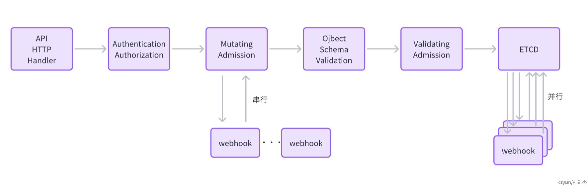

# K8s的 Admission Webhook

Kubernetes 中的 Admission Webhook 是一种机制，**可用于对 Kubernetes API 对象进行验证、修改或拒绝请求，以确保这些对象符合其应用程序的需求和策略。Admission Webhook 通常用于实现安全、合规性和自动化等功能**。



接收HTTP请求 --> 认证 --> 授权 --> 准入

# 为什么需要准入控制器 Admission Controller

从两个角度来理解为什么我们需要准入控制器：

1. 从安全的角度
- 我们需要明确在 Kubernetes 集群中部署的镜像来源是否可信，以免遭受攻击；
- 一般情况下，在 Pod 内尽量不使用 root 用户，或者尽量不开启特权容器等；
2. 从治理的角度
比如通过 label 对业务/服务进行区分，那么可以通过 admission controller 校验服务是否已经有对应的 label 存在之类的；
比如添加资源配额限制 ，以免出现资源超卖之类的情况；使用 Mutating 修改这个资源对象内容（如增加验证的信息），增加sidecar，initContainer

# 准入控制器 Admission Controller 分类

## 内置
其实有很多种准入控制器 Admission Controller ，以下是几种常见的几种：
1. Namespace Lifecycle：该 Admission Controller 可以确保命名空间的生命周期符合规范。例如，它可以防止用户创建不符合命名空间命名约定的命名空间或删除正在使用的命名空间。
2. Resource Quota：该 Admission Controller 可以确保 Kubernetes 集群中的资源使用量不会超过预定义的限制。例如，它可以防止用户创建过多的 Pod、Deployment 或 Service 对象，从而导致资源耗尽。
3. Limit Range：该 Admission Controller 可以确保 Kubernetes 集群中的容器资源使用量在预定义的限制范围内。例如，它可以限制容器的 CPU 使用量和内存使用量，从而防止容器使用过多的资源。
4. PodSecurityPolicy：该 Admission Controller 可以确保 Pod 对象符合安全策略。例如，它可以防止用户创建特权容器或使用不安全的容器镜像，从而提高集群的安全性。
5. MutatingWebhook：该 Admission Controller 可以在创建或更新对象之前修改对象规范。例如，它可以自动为 Pod 添加 sidecar 容器、自动为 Deployment 添加标签，从而简化应用程序部署和管理。

## 特殊的

由于准入控制器是内置在 kube-apiserver 中的，这种情况下就限制了admission controller的可扩展性。在这种背景下，kubernetes提供了一种可扩展的准入控制器 extensible admission controllers，这种行为叫做动态准入控制 Dynamic Admission Control，而提供这个功能的就是 admission webhook 。

## 使用条件
1. 确保 Kubernetes 集群版本至少为 v1.16（以便使用 admissionregistration.k8s.io/v1 API） 或者 v1.9 （以便使用 admissionregistration.k8s.io/v1beta1 API）；
2. 确保已经启用 MutatingAdmissionWebhook 和 ValidatingAdmissionWebhook 准入控制器；
3. 确保启用了 admissionregistration.k8s.io/v1beta1 或者 admissionregistration.k8s.io/v1 API;

## 实现方式

两种动态准入介绍

Validating Admission Webhook：在创建、更新或删除 Kubernetes API 对象之前验证其规范性。在这种方式下，当 Kubernetes API Server 接收到一个请求时，它将发送一个验证请求到 Admission Webhook，Admission Webhook 将通过校验逻辑验证该请求是否符合规范，如果请求不符合规范，Admission Webhook 将返回一个错误响应并拒绝该请求。

Mutating Admission Webhook：可以在创建、更新或删除 Kubernetes API 对象之前对其进行修改。在这种方式下，当 Kubernetes API Server 接收到一个请求时，它将发送一个修改请求到 Admission Webhook，Admission Webhook 将通过修改逻辑对该请求进行修改，并返回一个修改后的请求，Kubernetes API Server 将使用修改后的请求来创建、更新或删除 Kubernetes API 对象。

# 实现步骤 example

https://dev.to/cylon/shen-ru-jie-xi-kubernetes-admission-webhooks-25gh

那么完成一个自定义admission webhook需要两个步骤：

1. 将相关的webhook config注册给kubernetes，也就是让kubernetes知道你的webhook
2. 准备一个http server来处理 apiserver发过来验证的信息

## 向kubernetes注册webhook对象

kubernetes提供的两种类型可自定义的准入控制器，和其他资源一样，可以利用资源清单，动态配置那些资源要被adminssion webhook处理。 kubernetes将这种形式抽象为两种资源：

```
ValidatingWebhookConfiguration

MutatingWebhookConfiguration
```

ValidatingAdmission

```yaml
apiVersion: admissionregistration.k8s.io/v1
kind: ValidatingWebhookConfiguration
metadata:
  name: "pod-policy.example.com"
webhooks:
- name: "pod-policy.example.com"
  rules:
  - apiGroups:   [""] # 拦截资源的Group "" 表示 core。"*" 表示所有。
    apiVersions: ["v1"] # 拦截资源的版本
    operations:  ["CREATE"] # 什么请求下拦截
    resources:   ["pods"]  # 拦截什么资源
    scope:       "Namespaced" # 生效的范围，cluster还是namespace "*"表示没有范围限制。
  clientConfig: # 我们部署的webhook服务，
    service: # service是在cluster-in模式下
      namespace: "example-namespace"
      name: "example-service"
      port: 443 # 服务的端口
      path: "/validate" # path是对应用于验证的接口
    # caBundle是提供给 admission webhook CA证书  
    caBundle: "Ci0tLS0tQk...<base64-encoded PEM bundle containing the CA that signed the webhook's serving certificate>...tLS0K"
  admissionReviewVersions: ["v1", "v1beta1"]
  sideEffects: None
  timeoutSeconds: 5 # 1-30s直接，表示请求api的超时时间
```

MutatingAdmission

```yaml
apiVersion: admissionregistration.k8s.io/v1
kind: ValidatingWebhookConfiguration
metadata:
  name: "valipod-policy.example.com"
webhooks:
- name: "valipod-policy.example.com"
  rules:
    - apiGroups:   ["apps"] # 拦截资源的Group "" 表示 core。"*" 表示所有。
      apiVersions: ["v1"] # 拦截资源的版本
      operations:  ["CREATE"] # 什么请求下拦截
      resources:   ["deployments"]  # 拦截什么资源
      scope:       "Namespaced" # 生效的范围，cluster还是namespace "*"表示没有范围限制。
  clientConfig: # 我们部署的webhook服务，
    url: "https://10.0.0.1:81/validate" # 这里是外部模式
    #      service: # service是在cluster-in模式下
    #        namespace: "default"
    #        name: "admission-webhook"
    #        port: 81 # 服务的端口
    #        path: "/mutate" # path是对应用于验证的接口
    # caBundle是提供给 admission webhook CA证书
    caBundle: "Ci0tLS0tQk...<base64-encoded PEM bundle containing the CA that signed the webhook's serving certificate>...tLS0K"
  admissionReviewVersions: ["v1"]
  sideEffects: None
  timeoutSeconds: 5 # 1-30s直接，表示请求api的超时时间
```

对于webhook，也可以引入外部的服务，并非必须部署到集群内部

对于外部服务来讲，需要 clientConfig 中的 service , 更换为 url ; 通过 url 参数可以将一个外部的服务引入

```yaml
apiVersion: admissionregistration.k8s.io/v1
kind: MutatingWebhookConfiguration
...
webhooks:
- name: my-webhook.example.com
  clientConfig:
    url: "https://my-webhook.example.com:9443/my-webhook-path"
  ...
```

注意url规则

- scheme://host:port/path
- 使用了url 时，这里不应填写集群内的服务
- scheme 必须是 https，不能为http，这就意味着，引入外部时也需要
- 配置时使用了，?xx=xx 的参数也是不被允许的（官方说法是这样的，通过源码学习了解到因为会发送特定的请求体，所以无需管参数）

## 准备一个webhook

让我们编写我们的 webhook server。将创建两个钩子，/mutate 与 /validate；

1. /mutate 将在创建deployment资源时，基于版本，给资源加上注释 webhook.example.com/allow: true

2. /validate 将对 /mutate 增加的 allow:true 那么则继续，否则拒绝。

服务器文件

```go
package main

import (
    "context"
    "crypto/tls"
    "encoding/json"
    "fmt"
    "io/ioutil"
    "net/http"
    "os"
    "os/signal"
    "strings"
    "syscall"

    v1admission "k8s.io/api/admission/v1"
    "k8s.io/apimachinery/pkg/runtime"
    "k8s.io/apimachinery/pkg/runtime/serializer"

    appv1 "k8s.io/api/apps/v1"
    metav1 "k8s.io/apimachinery/pkg/apis/meta/v1"
    "k8s.io/klog"
)

type patch struct {
    Op    string            `json:"op"`
    Path  string            `json:"path"`
    Value map[string]string `json:"value"`
}

func serve(w http.ResponseWriter, r *http.Request) {

    var body []byte
    if data, err := ioutil.ReadAll(r.Body); err == nil {
        body = data
    }
    klog.Infof(fmt.Sprintf("receive request: %v....", string(body)[:130]))
    if len(body) == 0 {
        klog.Error(fmt.Sprintf("admission request body is empty"))
        http.Error(w, fmt.Errorf("admission request body is empty").Error(), http.StatusBadRequest)
        return
    }
    var admission v1admission.AdmissionReview
    codefc := serializer.NewCodecFactory(runtime.NewScheme())
    decoder := codefc.UniversalDeserializer()
    _, _, err := decoder.Decode(body, nil, &admission)

    if err != nil {
        msg := fmt.Sprintf("Request could not be decoded: %v", err)
        klog.Error(msg)
        http.Error(w, msg, http.StatusBadRequest)
        return
    }

    if admission.Request == nil {
        klog.Error(fmt.Sprintf("admission review can't be used: Request field is nil"))
        http.Error(w, fmt.Errorf("admission review can't be used: Request field is nil").Error(), http.StatusBadRequest)
        return
    }

    switch strings.Split(r.RequestURI, "?")[0] {
    case "/mutate":
        req := admission.Request
        var admissionResp v1admission.AdmissionReview
        admissionResp.APIVersion = admission.APIVersion
        admissionResp.Kind = admission.Kind
        klog.Infof("AdmissionReview for Kind=%v, Namespace=%v Name=%v UID=%v Operation=%v",
            req.Kind.Kind, req.Namespace, req.Name, req.UID, req.Operation)
        switch req.Kind.Kind {
        case "Deployment":
            var (
                respstr []byte
                err     error
                deploy  appv1.Deployment
            )
            if err = json.Unmarshal(req.Object.Raw, &deploy); err != nil {
                respStructure := v1admission.AdmissionResponse{Result: &metav1.Status{
                    Message: fmt.Sprintf("could not unmarshal resouces review request: %v", err),
                    Code:    http.StatusInternalServerError,
                }}
                klog.Error(fmt.Sprintf("could not unmarshal resouces review request: %v", err))
                if respstr, err = json.Marshal(respStructure); err != nil {
                    klog.Error(fmt.Errorf("could not unmarshal resouces review response: %v", err))
                    http.Error(w, fmt.Errorf("could not unmarshal resouces review response: %v", err).Error(), http.StatusInternalServerError)
                    return
                }
                http.Error(w, string(respstr), http.StatusBadRequest)
                return
            }

            current_annotations := deploy.GetAnnotations()
            pl := []patch{}
            for k, v := range current_annotations {
                pl = append(pl, patch{
                    Op:   "add",
                    Path: "/metadata/annotations",
                    Value: map[string]string{
                        k: v,
                    },
                })
            }
            pl = append(pl, patch{
                Op:   "add",
                Path: "/metadata/annotations",
                Value: map[string]string{
                    deploy.Name + "/Allow": "true",
                },
            })

            annotationbyte, err := json.Marshal(pl)

            if err != nil {
                http.Error(w, err.Error(), http.StatusInternalServerError)
                return
            }
            respStructure := &v1admission.AdmissionResponse{
                UID:     req.UID,
                Allowed: true,
                Patch:   annotationbyte,
                PatchType: func() *v1admission.PatchType {
                    t := v1admission.PatchTypeJSONPatch
                    return &t
                }(),
                Result: &metav1.Status{
                    Message: fmt.Sprintf("could not unmarshal resouces review request: %v", err),
                    Code:    http.StatusOK,
                },
            }
            admissionResp.Response = respStructure

            klog.Infof("sending response: %s....", admissionResp.Response.String()[:130])
            respByte, err := json.Marshal(admissionResp)
            if err != nil {
                klog.Errorf("Can't encode response messages: %v", err)
                http.Error(w, err.Error(), http.StatusInternalServerError)
            }
            klog.Infof("prepare to write response...")
            w.Header().Set("Content-Type", "application/json")
            if _, err := w.Write(respByte); err != nil {
                klog.Errorf("Can't write response: %v", err)
                http.Error(w, fmt.Sprintf("could not write response: %v", err), http.StatusInternalServerError)
            }

        default:
            klog.Error(fmt.Sprintf("unsupport resouces review request type"))
            http.Error(w, "unsupport resouces review request type", http.StatusBadRequest)
        }

    case "/validate":
        req := admission.Request
        var admissionResp v1admission.AdmissionReview
        admissionResp.APIVersion = admission.APIVersion
        admissionResp.Kind = admission.Kind
        klog.Infof("AdmissionReview for Kind=%v, Namespace=%v Name=%v UID=%v Operation=%v",
            req.Kind.Kind, req.Namespace, req.Name, req.UID, req.Operation)
        var (
            deploy  appv1.Deployment
            respstr []byte
        )
        switch req.Kind.Kind {
        case "Deployment":
            if err = json.Unmarshal(req.Object.Raw, &deploy); err != nil {
                respStructure := v1admission.AdmissionResponse{Result: &metav1.Status{
                    Message: fmt.Sprintf("could not unmarshal resouces review request: %v", err),
                    Code:    http.StatusInternalServerError,
                }}
                klog.Error(fmt.Sprintf("could not unmarshal resouces review request: %v", err))
                if respstr, err = json.Marshal(respStructure); err != nil {
                    klog.Error(fmt.Errorf("could not unmarshal resouces review response: %v", err))
                    http.Error(w, fmt.Errorf("could not unmarshal resouces review response: %v", err).Error(), http.StatusInternalServerError)
                    return
                }
                http.Error(w, string(respstr), http.StatusBadRequest)
                return
            }
        }
        al := deploy.GetAnnotations()
        respStructure := v1admission.AdmissionResponse{
            UID: req.UID,
        }
        if al[fmt.Sprintf("%s/Allow", deploy.Name)] == "true" {
            respStructure.Allowed = true
            respStructure.Result = &metav1.Status{
                Code: http.StatusOK,
            }
        } else {
            respStructure.Allowed = false
            respStructure.Result = &metav1.Status{
                Code: http.StatusForbidden,
                Reason: func() metav1.StatusReason {
                    return metav1.StatusReasonForbidden
                }(),
                Message: fmt.Sprintf("the resource %s couldn't to allow entry.", deploy.Kind),
            }
        }

        admissionResp.Response = &respStructure

        klog.Infof("sending response: %s....", admissionResp.Response.String()[:130])
        respByte, err := json.Marshal(admissionResp)
        if err != nil {
            klog.Errorf("Can't encode response messages: %v", err)
            http.Error(w, err.Error(), http.StatusInternalServerError)
        }
        klog.Infof("prepare to write response...")
        w.Header().Set("Content-Type", "application/json")
        if _, err := w.Write(respByte); err != nil {
            klog.Errorf("Can't write response: %v", err)
            http.Error(w, fmt.Sprintf("could not write response: %v", err), http.StatusInternalServerError)
        }
    }
}

func main() {
    var (
        cert, key string
    )

    if cert = os.Getenv("TLS_CERT"); len(cert) == 0 {
        cert = "./tls/tls.crt"
    }

    if key = os.Getenv("TLS_KEY"); len(key) == 0 {
        key = "./tls/tls.key"
    }

    ca, err := tls.LoadX509KeyPair(cert, key)
    if err != nil {
        klog.Error(err.Error())
        return
    }

    server := &http.Server{
        Addr: ":81",
        TLSConfig: &tls.Config{
            Certificates: []tls.Certificate{
                ca,
            },
        },
    }

    httpserver := http.NewServeMux()

    httpserver.HandleFunc("/validate", serve)
    httpserver.HandleFunc("/mutate", serve)
    httpserver.HandleFunc("/ping", func(w http.ResponseWriter, r *http.Request) {
        klog.Info(fmt.Sprintf("%s %s", r.RequestURI, "pong"))
        fmt.Fprint(w, "pong")
    })
    server.Handler = httpserver

    go func() {
        if err := server.ListenAndServeTLS("", ""); err != nil {
            klog.Errorf("Failed to listen and serve webhook server: %v", err)
        }
    }()

    klog.Info("starting serve.")
    signalChan := make(chan os.Signal, 1)
    signal.Notify(signalChan, syscall.SIGINT, syscall.SIGTERM)
    <-signalChan

    klog.Infof("Got shut signal, shutting...")
    if err := server.Shutdown(context.Background()); err != nil {
        klog.Errorf("HTTP server Shutdown: %v", err)
    }
}
```

Dockerfile, 打成镜像

```dockerfile
FROM golang:alpine AS builder
MAINTAINER cylon
WORKDIR /admission
COPY ./ /admission
ENV GOPROXY https://goproxy.cn,direct
RUN \
    sed -i 's/dl-cdn.alpinelinux.org/mirrors.ustc.edu.cn/g' /etc/apk/repositories && \
    apk add upx  && \
    GOOS=linux GOARCH=amd64 CGO_ENABLED=0 go build -ldflags "-s -w" -o webhook main.go && \
    upx -1 webhook && \
    chmod +x webhook

FROM alpine AS runner
WORKDIR /go/admission
COPY --from=builder /admission/webhook .
VOLUME ["/admission"]
```

集群内部部署所需的资源清单

```yaml
apiVersion: v1
kind: Service
metadata:
  name: admission-webhook
  labels:
    app: admission-webhook
spec:
  ports:
    - port: 81
      targetPort: 81
  selector:
    app: simple-webhook
---
apiVersion: apps/v1
kind: Deployment
metadata:
  labels:
    app: simple-webhook
  name: simple-webhook
spec:
  replicas: 1
  selector:
    matchLabels:
      app: simple-webhook
  template:
    metadata:
      labels:
        app: simple-webhook
    spec:
      containers:
        - image: cylonchau/simple-webhook:v0.0.2
          imagePullPolicy: IfNotPresent
          name: webhook
          command: ["./webhook"]
          env:
            - name: "TLS_CERT"
              value: "./tls/tls.crt"
            - name: "TLS_KEY"
              value: "./tls/tls.key"
            - name: NS_NAME
              valueFrom:
                fieldRef:
                  apiVersion: v1
                  fieldPath: metadata.namespace
          ports:
            - containerPort: 81
          volumeMounts:
            - name: tlsdir
              mountPath: /go/admission/tls
              readOnly: true
      volumes:
        - name: tlsdir
          secret:
            secretName: webhook
---
apiVersion: admissionregistration.k8s.io/v1
kind: MutatingWebhookConfiguration
metadata:
  name: "pod-policy.example.com"
webhooks:
  - name: "pod-policy.example.com"
    rules:
      - apiGroups:   ["apps"] # 拦截资源的Group "" 表示 core。"*" 表示所有。
        apiVersions: ["v1"] # 拦截资源的版本
        operations:  ["CREATE"] # 什么请求下拦截
        resources:   ["deployments"]  # 拦截什么资源
        scope:       "Namespaced" # 生效的范围，cluster还是namespace "*"表示没有范围限制。
    clientConfig: # 我们部署的webhook服务，
      url: "https://10.0.0.1:81/mutate"
#      service: # service是在cluster-in模式下
#        namespace: "default"
#        name: "admission-webhook"
#        port: 81 # 服务的端口
#        path: "/mutate" # path是对应用于验证的接口
      # caBundle是提供给 admission webhook CA证书
      caBundle: Put you CA (base64 encode) in here
    admissionReviewVersions: ["v1"]
    sideEffects: None
    timeoutSeconds: 5 # 1-30s直接，表示请求api的超时时间
---
apiVersion: admissionregistration.k8s.io/v1
kind: ValidatingWebhookConfiguration
metadata:
  name: "valipod-policy.example.com"
webhooks:
- name: "valipod-policy.example.com"
  rules:
    - apiGroups:   ["apps"] # 拦截资源的Group "" 表示 core。"*" 表示所有。
      apiVersions: ["v1"] # 拦截资源的版本
      operations:  ["CREATE"] # 什么请求下拦截
      resources:   ["deployments"]  # 拦截什么资源
      scope:       "Namespaced" # 生效的范围，cluster还是namespace "*"表示没有范围限制。
  clientConfig: # 我们部署的webhook服务，
    #      service: # service是在cluster-in模式下
    #        namespace: "default"
    #        name: "admission-webhook"
    #        port: 81 # 服务的端口
    #        path: "/mutate" # path是对应用于验证的接口
    # caBundle是提供给 admission webhook CA证书
    caBundle: Put you CA (base64 encode) in here
  admissionReviewVersions: ["v1"]
  sideEffects: None
  timeoutSeconds: 5 # 1-30s直接，表示请求api的超时时间
  ```


