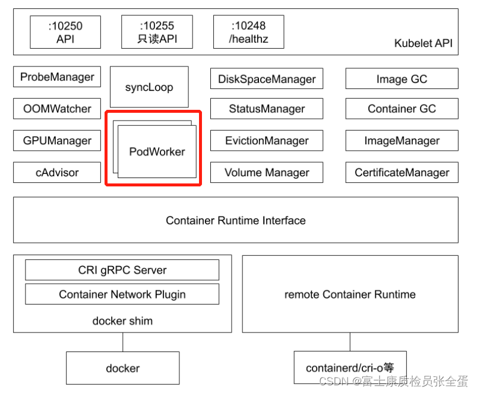
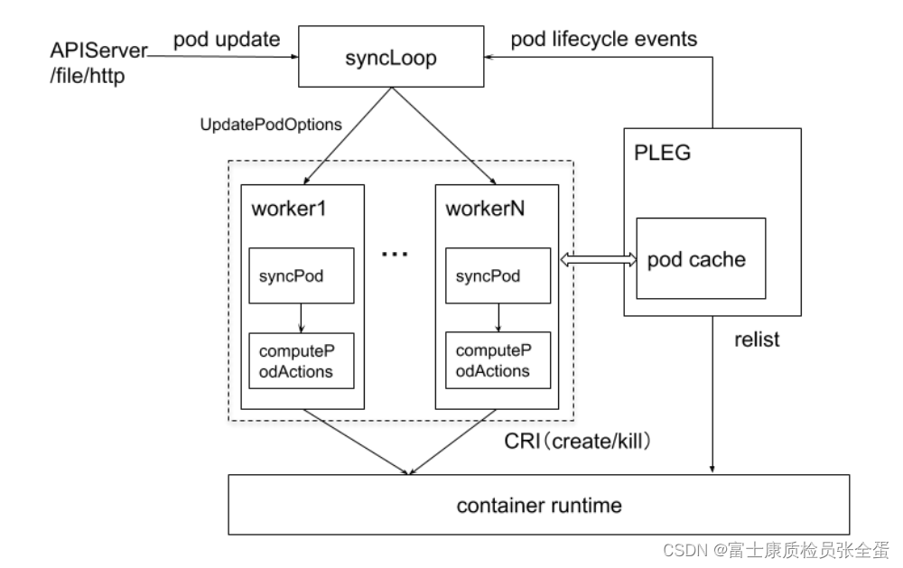

syncLoop watch当前节点的pod对象，syncLoop接收到pod的变更通知时交给pod worker就会去干活。

# Pod Worker的工作细节

synLoop监听pod的状态变化，update或add事件。syncLoop接收到这些事件之后，将事件存在updateoption里面，那么不同的worker（在kubelet里面有多个worker）每个worker都会从队列里面获取这些pod变更事件的清单。

然后针对每一个pod，它就会去执行syncPod的操作，syncPod里面最重要的行为就是computePodActions, 也就是计算针对这个pod应该采取什么样的行为。

# pleg

PLEG 是 kubelet 用来检查容器 runtime 的健康检查机制。这件事情本来可以由 kubelet 使用 polling 的方式来做。但是 polling 有其成本上的缺陷，所以PLEG 应用而生。它是pod lifecycle event的一个汇聚器，worker管理pod的生命周期，管理完之后通过pleg上报POD状态。

pleg维护了一个pod cache，它是本地的一个缓存。pleg会去定期的往container runtime里面去发一个list的操作，去获取当前节点上pod的清单，pleg 通过pod lifecycle event发回上报给apiserver，apiserver那端就知道这个node节点上面所有pod的状态了。

1. 如果contained runtime不响应了，那么relist就会失败，relist失败，那么这些状态就上报不了，那么最终这个状态无法上报，那么kubernets就会认为你整个节点有问题。所以runtime本身不响应，那么这个节点会变的不正常。

2. 还有就是bug，退出容器的gc没有做好，导致节点上出现了几千上万的exit container在那里，pleg再去跟runtime relist 这些container的时候，他就会去遍历所有的已经退出的容器，就会导致时间非常的长，它没有办法及时返回所有容器的清单，没有在它规定的时间内返回，那么整个pleg的操作就超时了，那么就会导致整个节点的状态发生变化。
