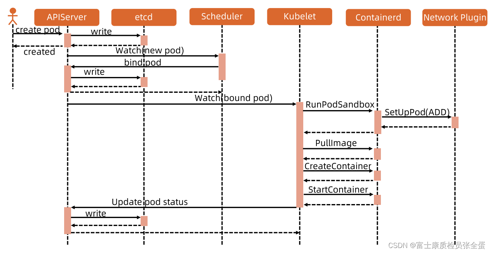
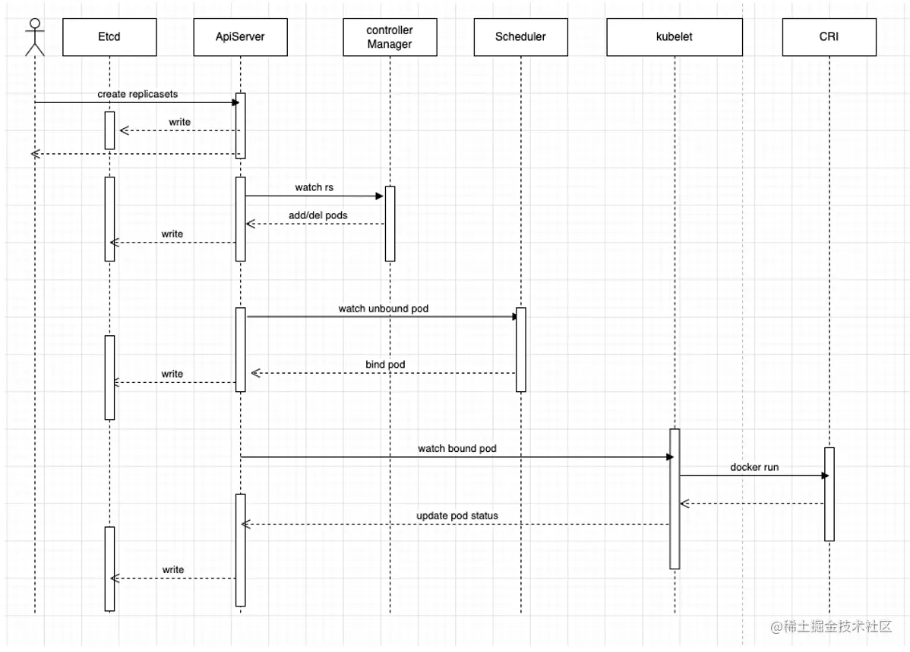
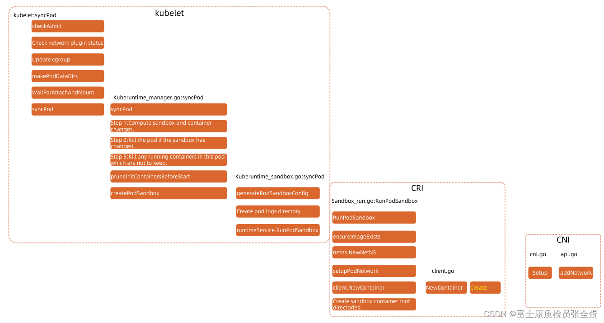

# 从提交到启动一个POD

用户通过ReplicaSet创建POD的宏观流程

# 节点上启动一个POD的流程（从kubelet接受任务开始）

- CheckAdmit：kubelet在sync pod也就是做pod同步的时候，首先也会去做准入，比如它要去启动pod，如果节点资源不够，你非要将nodename设置为该节点，因为和节点产生绑定关系，那么就需要启动这个容器了，启动的时候我要去check一下，也需要去做准入的，要去看你的cpu的需求满足不满足，如果不满足就直接报错了，out of cpu的error，写回到这个pod状态里面。

- Check network plugin：然后会去监听当前节点上网络插件的情况，如果网络插件不就绪，那么pod是启动不起来的，所以这里也会直接报错。

- Update cgroup：namspace cgroup这些技术要去启动容器进程的时候，要将容器对应的cgroup文件配置好。

- Makepoddir：pod需要存储日志，容器的日志需要在主机上有个目录，它会去将数据目录创建起来。

- WaitForattachandmount：你的pod是需要一些存储，比如configmap轻量级存储只需要将文件下载下来，然后mount到容器当中就行了，如果是更高要求的存储，比如网络存储，那么需要去创建volume，然后和这个节点产生attach关系，然后再mount到容器里面。如果这一步不过的话，它会一直卡在这里，接下来才会去做syncpod。

> CRI CNI CSI，它们之间关系是怎么样的呢？在启动pod的时候谁先启动，谁后启动，上面可以很清晰看到CSI就在kubelet这部分运行，就是在pod后续加载还没有启动的时候，我就得先去将存储挂载好，并且mount进来。

syncPod里面就是来计算sandbox和容器变化，如果sandox发生变化了，就是已经在运行的容器和我pod本身不匹配了，那就是重建了，这里面其实就是computePodAction的动作，如果这个pod已经不存在了，你的容器还在，那么就需要将容器kill掉。

然后你要启动一个新的容器，那么会去经历启动的动作。之前讲了第一步就是createPodSandbox，它会去生成这些sandbox的config，它有一些mainfest，要将这些配置文件生成出来。然后pod的日志目录要创建好，然后要去调用runtime的sandbox。

以containerd为例，它的cri本身又是一个grpc的服务，kubelet会去调用grpc服务，这个时候整个请求就转到containerd进程里面，kubelet就要暂时等待它的返回结果了。

然后就是createsandboxcontainer，然后一步一步的往下走，最后由cri去调用cni的接口。
