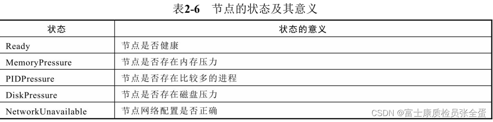

Kubelet

每个Node节点上都运行一个 Kubelet 服务进程，默认监听 10250 端口，管理 Pod 及 Pod 中的容器。每个 Kubelet 进程会在 API Server 上注册所在Node节点的信息，定期向 Master 节点汇报该节点的资源使用情况，并通过 cAdvisor 监控节点和容器的资源。

> pod健康状态通过pleg去做上报，节点的资源使用情况通过cadvisor上报

# 整体架构

- Kubelet API，包括 10250 端口的认证 API（也是metrics 接口）、4194 端口的 cAdvisor API、以及 10248 端口的健康检查 API
- syncLoop：从 API 或者 manifest 目录接收 Pod 更新，发送到 podWorkers 处理
- 辅助的 manager，如 cAdvisor、PLEG、Volume Manager 等，
- CRI：容器执行引擎接口
- 容器执行引擎
- 网络插件，目前支持 CNI 和 kubenet

## probemanager

就是为这个节点上面的pod做探活的这样一个管理器，liveless readyless probe，这些探活由kubelet发起

## oomwatcher

kubelet是整个节点的守护神，它是一个代理，它负责所有应用的生命周期，同时它有包含节点当前继续正常工作的职责，所以它由oomwatcher来监听，比如节点出现oom问题，比如某些进程出现了oom的错误，oomwathcer就会通过oom这个事件来获取这些异常，并且上报给kubelet。

## GPU manager

就是用来管理GPU等等这些扩展的device，当节点上有GPU卡的时候，GPUmanager就是用来管理这张GPU卡的。

## cadvisor

是独立开源的软件，kubelet里面会内嵌cadvisor，它其实基于cgroup技术去获取节点上运行应用的资源状态，整个集群的监控都是由cadvisor收集上来的，并且通过kubelet上报的

## diskspacemanager

## statusmanager

用来管理节点的状态的

## evictionmanager

- 驱逐策略是基于磁盘和内存用量的，两者是不可压缩资源
- Kubelet发起的驱逐，它需要留下一些痕迹， 不能只将pod删除掉，从用户的角度都看不到发生了什么事件，发生驱逐的时候是通过evict命令将pod驱逐掉，它并不会删除pod，这个pod的实体还在，但是会将其状态置为evicted。这个目的是为了你做审计的时候，无论作为管理员还是用户，只要查看evict的message就可以知道它之前发生了什么事情。

## volumemanager

pod启动要挂载磁盘，要挂载存储卷的，这个是由volumemanager去做的

## imagegc

所谓的imagegc就会去扫描一些不怎么活跃的镜像，把这些镜像清除掉

## containegc

进程可能会退出，它会有一个exit的container，这个container其实它的文件层是没有清理掉的，所谓的container gc就是会清除这些退出的容器

## syncloop

watch当前节点的pod对象，syncloop做完之后，下面内嵌了一堆的worker，pod worker就是当我的syncgroup接收到pod的变更通知的时候，那么这个podworker就会去干活，也就是去维护pod的生命周期。

## OOM Killer

# 节点管理

## 注册

Kubelet 可以通过设置启动参数 --register-node 来确定是否向 API Server 注册自己

## 状态上报

- 节点基础信息，包括IP 地址、操作系统、内核、运行时、kubelet、kube-proxy 版本信息等

- 节点资源信息包括CPU、内存、Hugepage、临时存储、GPU 等注册设备，以及这些资源中可以分配给容器使用的部分。

- 调度器在为Pod 选择节点时会将机器的状态信息作为依据。表2-6 展示了节点状态 及其代表的意义。比如Ready 状态反映了节点是否就绪，True 表示节点健康；False 表示节点不健康；Unknown 表示节点控制器在最近40s 内没有收到节点的消息。调度器在调度Pod 时会过滤掉所有Ready 状态为非True 的节点。

- 控制kubelet更新节点状态频率的参数：NodeStatusUpdateFrequency、NodeStatusReportFrequency和NodeLeaseDurationSeconds

- 健康状态的上报就是通过lease对象去上报的，默认上报会以40s为周期不断的向上汇报（没有被更新说明不正常），资源使用情况是使用更加慢的频率去上报的

- 通过 Kubelet 的 10255 端口可以查询 Node 的汇总指标。比如 http://<node-name>:10255/stats/summary

# Pod 管理

## 获取 Pod 清单

Kubelet如何知道当前节点应该运行哪些POD（如何获取PodSpec）？

### Watch/List API Server

如果是创建和修改 Pod 任务，则执行如下处理：

1. 为该 Pod 创建一个数据目录；
2. 从 API Server 读取该 Pod 清单；
3. 为该 Pod 挂载外部卷；
4. 下载 Pod 用到的 Secret；
5. 检查已经在节点上运行的 Pod，如果该 Pod 没有容器或 Pause 容器没有启动，则先停止 Pod 里所有容器的进程。如果在 Pod 中有需要删除的容器，则删除这些容器；
6. 用 “kubernetes/pause” 镜像为每个 Pod 创建一个容器。Pause 容器用于接管 Pod 中所有其他容器的网络。每创建一个新的 Pod，Kubelet 都会先创建一个 Pause 容器，然后创建其他容器。
7. 为 Pod 中的每个容器做如下处理：
7.1 为容器计算一个 hash 值，然后用容器的名字去 Docker 查询对应容器的 hash 值。若查找到容器，且两者 hash 值不同，则停止Docker 中容器的进程，并停止与之关联的 Pause 容器的进程；若两者相同，则不做任何处理；
7.2 如果容器被终止了，且容器没有指定的 restartPolicy，则不做任何处理；
7.3 调用 Docker Client 下载容器镜像，调用 Docker Client 运行容器。

### Static Pod

所有以非 API Server 方式创建的 Pod 都叫 Static Pod。Kubelet 将 Static Pod 的状态汇报给 API Server，API Server 为该 Static Pod 创建一个 Mirror Pod 和其相匹配。Mirror Pod 的状态将真实反映 Static Pod 的状态。当 Static Pod 被删除时，与之相对应的 Mirror Pod 也会被删除。

创建方式：

- 文件：启动参数 --config 指定的配置目录下的文件 (默认/etc/kubernetes/manifests/)。该文件每 20 秒重新检查一次（可配置）。
- HTTP endpoint (URL)：启动参数 --manifest-url 设置。每 20 秒检查一次这个端点（可配置）。
- HTTP server：kubelet 侦听 HTTP 请求，并响应简单的 API 以提交新的 Pod 清单。

## POD 启动流程

# 容器健康检查

1. LivenessProbe 探针：用于判断容器是否健康，告诉 Kubelet 一个容器什么时候处于不健康的状态。如果 LivenessProbe 探针探测到容器不健康，则 Kubelet 将删除该容器，并根据容器的重启策略做相应的处理。

2. ReadinessProbe：用于判断容器是否启动完成且准备接收请求。如果 ReadinessProbe 探针探测到失败，则 Pod 的状态将被修改。Endpoint Controller 将从 Service 的 Endpoint 中删除包含该容器所在 Pod 的 IP 地址的 Endpoint 条目。

# cAdvisor 资源监控
Kubernetes 集群中，应用程序的执行情况可以在不同的级别上监测到，这些级别包括：容器、Pod、Service 和整个集群。

Heapster 项目为 Kubernetes 提供了一个基本的监控平台，它是集群级别的监控和事件数据集成器 (Aggregator)。Heapster 以 Pod 的方式运行在集群中，Heapster 通过 Kubelet 发现所有运行在集群中的节点，并查看来自这些节点的资源使用情况。

Kubelet 通过 cAdvisor 获取其所在节点及容器的数据。Heapster 通过带着关联标签的 Pod 分组这些信息，这些数据将被推到一个可配置的后端，用于存储和可视化展示。支持的后端包括 InfluxDB(使用 Grafana 实现可视化) 和 Google Cloud Monitoring。

cAdvisor 是一个开源的分析容器资源使用率和性能特性的代理工具，集成到 Kubelet中，当Kubelet启动时会同时启动cAdvisor，且一个cAdvisor只监控一个Node节点的信息。cAdvisor 自动查找所有在其所在节点上的容器，自动采集 CPU、内存、文件系统和网络使用的统计信息。

cAdvisor 通过其所在节点机的 4194 端口暴露一个简单的 UI。

# Kubelet Eviction（驱逐）

Kubelet 会监控资源的使用情况，并使用驱逐机制防止计算和存储资源耗尽。在驱逐时，Kubelet 将 Pod 的所有容器停止，并将 PodPhase 设置为 Failed。驱逐信号可以分为软驱逐和硬驱逐：

- 软驱逐（Soft Eviction）：配合驱逐宽限期（eviction-soft-grace-period和eviction-max-pod-grace-period）一起使用。系统资源达到软驱逐阈值并在超过宽限期之后才会执行驱逐动作。
- 硬驱逐（Hard Eviction ）：系统资源达到硬驱逐阈值时立即执行驱逐动作。

驱逐POD顺序：BestEffort、Burstable、Guaranteed