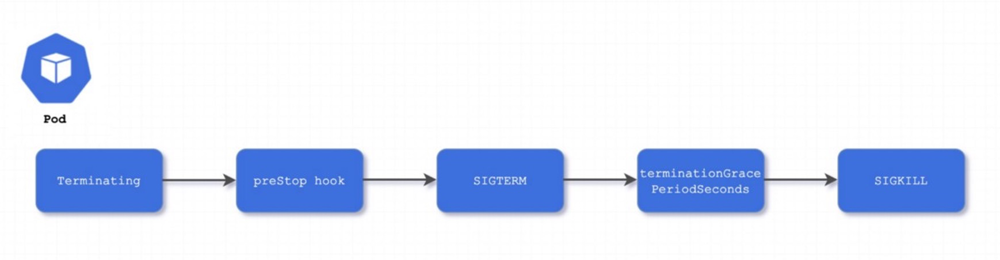

# 1. 理想情况下的pod删除

在通常语境下，删除一个pod，对应着kubectl delete pod 。

在k8s中删除一个资源对象的本质是在etcd中删除一条数据。

我们来简单回顾下pod的删除流程：

1. 当用户执行kubectl delete pod命令时（实际上是带grace-period=30s），实际上是访问kube-apiserver的DELETE接口（此时业务逻辑做的只是更新Pod对象的元信息（DeletionTimestamp字段和DeletionGracePeriodSeconds字段），并没有在etcd中删除记录）

2. 有DeletionTimestamp字段后，将Pod标记为Terminating状态。

3. kubelet在监控到Pod对象转为Terminating状态，启动Pod关闭过程。

4. 在Pod关闭过程中，如果当前Pod对象定义了preStop钩子句柄，先执行preStop，

6. 如果宽限期内(默认30s)preStop执行完，向Pod 对象中的容器进程发送TERM信号。

7. 如果宽限期内(默认30s)preStop未执行完，则重新修改DeletionTimestamp并额外获取一个时长为2秒的小宽限期，并向pod对象中的容器发送SIGKILL信号

8. pod删除完毕，Kubelet请求API Server的Delete接口 （并且带grace-period=0），将此Pod资源的宽限期设置为0从而完成删除操作。

9. 此时kube-apiserver的DELETE接口会去etcd中删除pod对象，此时用户kubectl get pod则才真正看不见pod对象，因为记录真的是被删除了。

10. 当停止某个节点上的kubelet进程，在执行kubelet delete pod 删除这个节点上的pod，这时删除操作会卡住。这证明了最终删除etcd中pod数据的请求是kubelet发出的。

上述过程没有pod gc controller组件的参与。那么pog gc controller是做什么的呢？

# 2. 非理想情况下的pod删除

真实生产场景是非理想化的，存在一些极端情况，比如：

节点宕机，这时Kubelet已经不能工作了，但所在节点的pod应该被删除。

Pod未被调度时执行kubectl delete pod pod1，应该由哪个kubelet去发出请求删除etcd中的数据？

…

k8s作为一个成熟稳定的项目，有着清理极端场景下无用Pod的组件，即pod gc controller

# 3. pod gc controller源码分析 - 插件注册和启动

源码路径 cmd/kube-controller-manager/controllermanager.go

我们可以看到pod gc controller注册到了controller manager中。

后续在controller-manager启动时会遍历启动这里注册的控制器。

注意：并不是所有的controller都在这里注册，比如service Controller，node Controller等。

# 4. pod gc controller源码分析 - 处理逻辑

pod gc controller会watch pod 和 node的变化。

startPodGCController中会watch pod和node的变化

它会每20s【gcc.gcCheckPeriod默认为20】运行一次，直到ctx状态变为done。

Run->go wait.UntilWithContext(ctx, gcc.gc, gcc.gcCheckPeriod)

下图gcc.gc是最核心的函数，最终的pod删除（回收）逻辑就是这个函数。

串行执行图中圈红的4个函数有着不同的判断标准，来衡量pod是否应该被删除（回收）。

```go
func (gcc *PodGCController)gc(ctx context.Context) {
  // Pod.Status.Phase不是Pending、Running、Unknown
  gcc.gcTerminated   # 找出已经Terminated的pod，判断其数量是否超过gcc.terminatedPodThreshold限制。则删除一些pod，让Terminated pod总数小于gcc.terminatedPodThreshold限制。
  gcc.gcTerminating  // 如果pod所在节点是Not Ready 并且节点加了NodeOutOfService污点，就把pod加到terminatingPods队列，之后遍历队列删除pod。
  gcc.gcOrphaned   // 如果pod所在节点不存在（这属于异常情况），就把pod删除
  gcc.gcUnschedTerminating // 删除标记了删除时间戳并且还没被调度的pod。
}
```

# 5. node not ready的场景会出现的问题

在通常的默认情况下，当节点宕机，这个节点上的Pod会在等待300s后变成Terminating状态，并且一直处于Terminating状态。这时可以手动强制删除，或等节点正常后会自动删除。

对于deployment类型的工作负载：这是可以能接受的。因为故障节点的Pod变成Terminating后，会在正常节点上拉起新的pod。

对于statefulset类型的工作负载：这是不能接受的，因为statefulset是有状态有序号的，原pod处于Terminating未被删除，StatefulSet 无法创建同名的新 Pod。 而且statefulset Pod 通常使用了存储卷， VolumeAttachments 不会从原来的已关闭节点上删除， 因此这些 Pod 所使用的卷也无法挂接到新的运行节点上。


* NodeOutOfServiceVolumeDetach功能 *


为了解决上述场景，k8s在1.24版本发布了NodeOutOfServiceVolumeDetach功能，在1.28版本成为GA功能。（1.24-1.27版本默认关闭此功能，需手动修改controller-manager的启动参数）

NodeOutOfServiceVolumeDetach 能力有多重要呢?  在1.28 1.29 版本均被锁定为 true，并且无法禁用

NodeOutOfServiceVolumeDetach功能：在node故障时，可以通过在 Node 上手动添加 out-of-service 污点，这时挂接到not ready节点的持久卷将被解除挂接，然后pod gc controller会自动删除异常节点上的 Terminating pod。在原pod删除后，statefulset控制器就会在正常节点自动拉起pod了。

kubectl taint nodes <nodename> node.kubernetes.io/out-of-service=nodeshutdown:NoExecute

3.2.3 第二个判断函数的源码分析

走到这个函数需要开启NodeOutOfServiceVolumeDetach功能。

如果pod所在节点是Not Ready 并且节点加了NodeOutOfService污点，就把pod加到terminatingPods队列，之后遍历队列删除pod。

# 6. pod gc controller 总结

pod gc 和其他的常见控制器区别：它不是以informer watch 到的事件来触发处理逻辑。它的informer只用来获取集群信息，它的触发方式是以定时任务每20s运行一次。

pod gc controller 是 kubernetes 自动删除Pod的逻辑，区别于kubectl delete pod这种手动删除，

pod gc controller 的删除对于集群管理员（运维）是透明的。

# 7. 节点异常处理逻辑

节点如何被标记为not ready的

Kubelet 会主动向apiserver汇报节点状态，kubelet的nodeStatusUpdateFrequency 参数为上报的时间间隔。

ControllerManager 会控制节点状态，如果超过--node-monitor-grace-period 参数（该参数默认值为 40s，且必须是kubelet的nodeStatusUpdateFrequency 参数的整数倍）的时间都没有上报节点状态，就将节点标记为不健康。

5.2 节点not ready，Pod 如何变为Terminating的

5.2.1 准入控制器注入污点容忍

k8s中有个准入控制器：DefaultTolerationSeconds。

此准入控制器基于 k8s-apiserver 的输入参数 default-not-ready-toleration-seconds 和
default-unreachable-toleration-seconds 为 Pod 设置默认的容忍度，
以容忍 notready:NoExecute 和 unreachable:NoExecute 污点（如果 Pod 尚未容忍 node.kubernetes.io/not-ready：NoExecute 和 node.kubernetes.io/unreachable：NoExecute 污点的话）。（两个参数默认都是300秒）

```yaml
在创建 Pod 时，如⽆特别指定，节点控制器会为 Pod 添加如下污点：
tolerations:
- key: "node.kubernetes.io/unreachable"
operator: "Exists"
effect: "NoExecute"
tolerationSeconds: 300
- key: "node.kubernetes.io/not-ready"
operator: "Exists"
effect: "NoExecute"
tolerationSeconds: 300
```


