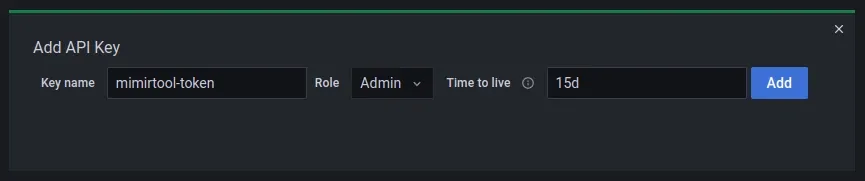

目的： 跟踪、搞定 series 基数问题，并显著减少 Prometheus 的资源使用

方式： 使用 mimirtool 来识别平台上使用哪些指标以及哪些没有被使用。Mimirtool 是一个 CLI 工具，可用于涉及 Grafana Mimir 或 Grafana Cloud Metrics 的 Prometheus 兼容任务的各种操作。

安装：

```sh
# MacOS
brew install kubectl mimirtool jq
```

#

# 1. 分析你的 Prometheus 的 metrics 使用情况

## 1.1 Grafana 仪表板中的指标

在我们提取 Grafana 实例中使用的指标列表之前，我们首先需要创建一个具有管理员角色的 Grafana API 密钥。如果你有一个暴露的 Grafana 实例，只需打开它并转到 [https://grafana.your.domain/org/apikeys](https://grafana.your.domain/org/apikeys) 。如果没有，您可能需要先公开它：

```bash

kubectl port-forward ${my_grafana_pod} -n monitoring 3000:3000
```

从那里，单击 New API key 按钮，为密钥命名、管理员角色和可选的 TTL，如下所示：



单击添加并将 Token 保存到终端中的变量：

```bash
GRAFANA_API_TOKEN="copy your token here"
```

我们现在可以使用 mimirtool 来提取我们的 Grafana 实例中使用的指标列表：

```bash
mimirtool analyze grafana --address=http://localhost:3000 --key="${GRAFANA_API_TOKEN}"
```

`

完成后，您应该在当前目录中有一个 metrics-in-grafana.json 文件，其中包含 Grafana 中使用的 JSON 格式的指标列表。

## 1.2 Prometheus 规则中的指标

我们将对 Prometheus 规则中使用的指标做同样的事情。 因为我使用 Prometheus Operator，所以我的规则来自不同的地方和格式，主要是 ServiceMonitors 但不仅如此。最后，它们都加载到 Prometheus 实例本身，这就是为什么我们需要直接在 Prometheus pod 上提取指标列表。

所有规则都位于我的 Prometheus pod 中的 /etc/prometheus/rules/ 中，检查你的规则并在需要时进行调整：

```bash
# Export your Prometheus rules files to a local file
kubectl exec -it ${my_prometheus_pod} -n monitoring \
  -- sh -c 'for i in `find /etc/prometheus/rules/ -type f` ; do cat $i ; done' > my-prom-rules.yaml
 ```

如果您有多个规则文件，您可能需要在继续之前修复 YAML 结构：

```bash
# Fix the combined rules YAML schema for mimirtool
sed -i -e 's/groups://g' -e '1s/^/groups:/' my-prom-rules.yaml
```

现在我们在 my-prom-rules.yaml 中有了导出的规则，我们现在可以使用 mimirtool 来提取指标列表：

```bash
mimirtool analyze rule-file my-prom-rules.yaml
```

与我们为 Grafana 所做的类似，您现在应该在当前目录中有一个 metrics-in-ruler.json 文件，其中包含 Prometheus 规则中使用的指标列表。

## 1.3 其他地方的指标

根据您的环境，您可能会在其他地方使用 Prometheus 指标，例如，如果您有任何基于自定义指标的 Horizo​​ntalPodAutoscaler。如果是这种情况，您将需要找到一种方法在进一步操作之前将指标列表导入其中一个文件中。

# 2. 与 Prometheus 对比

一旦我们同时拥有 metrics-in-grafana.json 和 metrics-in-ruler.json，其中包含我们当前使用的指标列表，我们就可以将它们与我们在 Prometheus 中拥有的所有指标进行比较。这使我们能够获得 Prometheus 中已使用和未使用的指标列表。

为此，我们需要公开我们的 Prometheus 实例：

```bash
# run this is a separate terminal
kubectl port-forward ${my_prometheus_pod} -n monitoring 9090:9090
```

再一次，我们将使用 mimirtool 自动加载我们之前创建的文件并将它们与存储在我们的 Prometheus 实例中的指标进行比较：

```bash
mimirtool analyze prometheus --address=http://localhost:9090
```

样例输出：

```bash
$ mimirtool analyze prometheus --address=http://localhost:9090
INFO[0000] Found 1377 metric names
INFO[0000] 22451 active series are being used in dashboards
INFO[0000] 28440 active series are NOT being used in dashboards
INFO[0000] 270 in use active series metric count
INFO[0000] 1105 not in use active series metric count
```

最终会得到 prometheus-metrics.json 文件，其中包括了已使用和未使用的 metrics 列表。

要以原始文本格式保存已用指标列表：

```bash
jq -r ".in_use_metric_counts[].metric" prometheus-metrics.json | sort > used_metrics.txt
```

要以原始文本格式保存未使用的指标列表：

```bash
jq -r ".additional_metric_counts[].metric" prometheus-metrics.json | sort > unused_metrics.txt
```

在此示例中，这是一个默认的 Kubernetes 部署，只有几个正在运行的应用程序，我们看到只使用了 270/1377 个指标，这意味着 80% 的抓取指标从未使用过！您拥有的应用程序和指标越多，这个数字就越大。

未使用的列表可能是最有趣的一个。有了它，我们可以甄别那些或许可以在我们的仪表板和警报中利用的指标，但也可以甄别出或许需要在 Exporter 侧禁用的无用指标，或者使用 relabeling 规则 删除它们。


# 尾部占位
