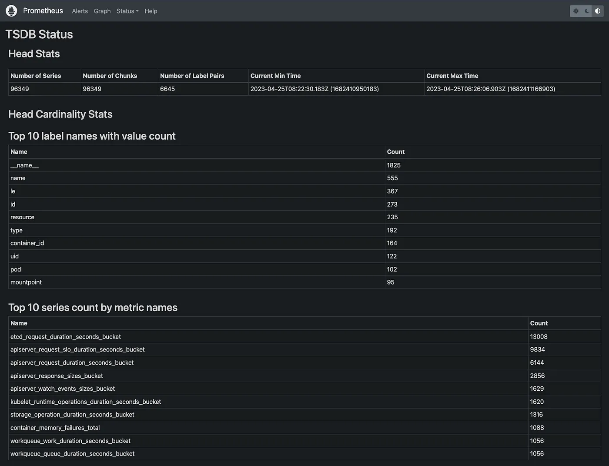
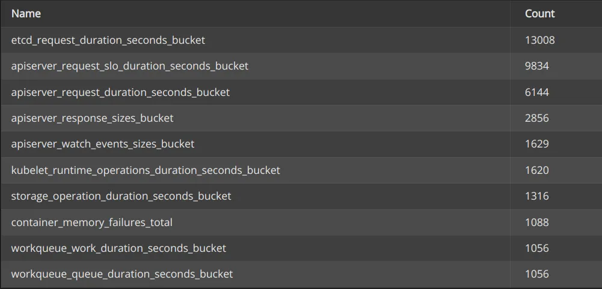

# 0. 先决条件

本文中描述的所有内容都是在 Kubernetes 环境中使用 kube-prometheus-stack(https://github.com/prometheus-community/helm-charts/tree/main/charts/kube-prometheus-stack) 完成的。如果您的设置不同，您可能需要进行调整。

# 简介

Prometheus 项目试图让事情尽可能简单。它也非常开放，一些特定场景的功能通常被转嫁到其他项目，如 Thanos、Mimir 或 VictoriaMetrics。出于这个原因，没有魔法标志可以显着改变 Prometheus 的行为。为了提高 Prometheus 的性能，您需要了解您的使用情况，并根据您的用例和规模做出正确的设计选择。现在我们知道我们使用哪些指标，哪些不使用，让我们看看如何配置我们的 Prometheus。


# 1. 丢弃不用的指标


最容易想到的显然是丢弃未使用的指标。以下是我们可以丢弃的未使用列表中的一些指标：

```
node_arp_entries
node_netstat_Udp6_OutDatagrams
node_netstat_Udp6_RcvbufErrors
node_sockstat_FRAG6_inuse
node_sockstat_RAW6_inuse
node_softnet_dropped_total
node_softnet_processed_total
[...]
```

有几种方法可以丢弃指标，让我们梳理一下最常见的方法


## 1.1 配置 Exporter

配置数据源，比如机器监控，大多数情况下我们会使用 node-exporter，合理地配置 exporter 可以节省大量的时间和资源，因为控制住了源头，指标都不会有更远的传输了。

我们可以做的第一件事是检查采集器有哪些参数可供选择，node\_exporter 具有打开和关闭的 collector 的功能。

```yaml
prometheus-node-exporter:
  # Doc: https://github.com/prometheus/node_exporter#collectors
  extraArgs:
    # Disable unused collectors
    - --no-collector.arp
    - --no-collector.ipvs
    - --no-collector.sockstat
    - --no-collector.softnet
    # Excludes from kube-prometheus-stack
    - --collector.filesystem.mount-points-exclude=^/(dev|proc|sys|var/lib/docker/.+|var/lib/kubelet/.+)($|/)
    - --collector.filesystem.fs-types-exclude=^(autofs|binfmt_misc|bpf|cgroup2?|configfs|debugfs|devpts|devtmpfs|fusectl|hugetlbfs|iso9660|mqueue|nsfs|overlay|proc|procfs|pstore|rpc_pipefs|securityfs|selinuxfs|squashfs|sysfs|tracefs)$
```

如上，我们禁用了 `arp`, `ipvs`, `sockstat` 和 `softnet` 等采集器。如果不想禁用整个 collector，有些 collector 支持配置一些额外的包含、排除规则。

以下是撰写本文时的清单：

```yaml
# Exclude flags
--collector.arp.device-exclude
--collector.diskstats.device-exclude
--collector.ethtool.device-exclude
--collector.filesystem.fs-types-exclude
--collector.filesystem.mount-points-exclude
--collector.netdev.device-exclude
--collector.qdisk.device-exclude
--collector.systemd.unit-exclude

# Include flags
--collector.arp.device-include
--collector.cpu.info.bugs-include
--collector.cpu.info.flags-include
--collector.diskstats.device-include
--collector.ethtool.metrics-include
--collector.netdev.device-include
--collector.qdisk.device-include
--collector.sysctl.include
--collector.systemd.unit-include
```


## 1.2 使用 relabel 规则

现在，假设我们想 Drop 少量指标，而这些指标对应的 collector 又不支持配置排除规则。既然不能通过 Exporter 来做到，那就只能通过 relabel 规则来 Drop 了。这些规则发生在 scrape 之后，但是在 ingest 之前（译者注：抓取到了，但是还没有往后端写）。

解释 relabel 的工作原理不在本文的范围内，但如果您想了解更多信息，Grafana 有一篇关于此的优秀文章：

[Prometheus 中的 relabel 如何工作](https://grafana.com/blog/2022/03/21/how-relabeling-in-prometheus-works/)。


下面是一个 drop 规则：

```yaml
- sourceLabels: [__name__]
  action: drop
  regex: 'node_(nf_conntrack_stat|netstat_.*6|timex_pps|network_carrie|network_iface|scrape).*'
```

此规则需要添加到您的 Prometheus 设置中，在我的例子中，我将它添加到我的 kube-prometheus-stack values 中的 node\_exporter ServiceMonitor。

下面是针对 node-exporter 相关的 kube-prometheus-stack values：


```yaml
# kube-prometheus-stack values for node-exporter metrics

prometheus-node-exporter:
  # Doc: https://github.com/prometheus/node_exporter#collectors
  extraArgs:
    # Disable unused collectors
    - --no-collector.arp
    - --no-collector.ipvs
    - --no-collector.sockstat
    - --no-collector.softnet
    # Excludes from kube-prometheus-stack
    - --collector.filesystem.mount-points-exclude=^/(dev|proc|sys|var/lib/docker/.+|var/lib/kubelet/.+)($|/)
    - --collector.filesystem.fs-types-exclude=^(autofs|binfmt_misc|bpf|cgroup2?|configfs|debugfs|devpts|devtmpfs|fusectl|hugetlbfs|iso9660|mqueue|nsfs|overlay|proc|procfs|pstore|rpc_pipefs|securityfs|selinuxfs|squashfs|sysfs|tracefs)$

  prometheus:
    monitor:
      enabled: true

      # MetricRelabelConfigs to apply to samples after scraping, but before ingestion.
      # Doc: https://github.com/prometheus-operator/prometheus-operator/blob/main/Documentation/api.md#relabelconfig
      metricRelabelings:
        # Unused node-exporter metrics
        - sourceLabels: [__name__]
          action: drop
          regex: 'node_(nf_conntrack_stat|netstat_.*6|timex_pps|network_carrie|network_iface|scrape).*'
```

# 2. 跟踪指标基数问题

## 2.1 使用 Prometheus UI

Prometheus UI 已经具有开箱即用的基数信息。

让我们做一个端口转发来自本地公开我们的 Prometheus 实例：

```bash
# kubectl get po -n monitoring | grep prometheus
my_prometheus_pod="prometheus-kube-prometheus-stack-prometheus-0"

# port-forward
kubectl port-forward ${my_prometheus_pod} -n monitoring 9090:9090
```

完成后，您应该能够在浏览器中打开 [http://localhost:9090/tsdb-status](http://localhost:9090/tsdb-status)。



从这里，您将获得一堆有用的统计数据来开始您的高基数调查研究：

* value最多的前10个标签名称
* 指标最多的前10个指标名称
* 占用内存最多的前10大标签名称
* 指标最多的前10个标签对

首先，你应该关注“指标最多的前10个指标名称”。你也可以使用下面的 PromQL 获取此信息。你可以随意调整 PromQL 来查看更多指标，下面这个 PromQL 是查看了前 20 个：

```promql
topk(20, count by (__name__)({__name__=~".+"}))
```

我们的前 10 名看起来像这样：




# 2.2 使用基数浏览器

有时，您会有一些需要保留的高基数指标，但您仍然需要为基数问题找到解决方案。有一个出色的仪表板可以查找和了解 Prometheus 指标的基数，即 [Cardinality Explorer dashboard](https://grafana.com/grafana/dashboards/11304-cardinality-explorer/)。您可以在 Grafana 上使用 ID 11304 导入它。

仪表板包含操作方法和常见问题解答部分，可帮助您理解和使用此仪表板。让我们使用仪表板分析 `etcd_request_duration_seconds_bucket` 指标：


# 3. 使用 pprof 分析资源占用


安装 [pprof](https://github.com/google/pprof) 和 [graphviz](https://www.graphviz.org/download/) 后，您将能够以 svg 格式导出此数据：


```bash
# Export the cpu data
pprof -svg http://localhost:9090/debug/pprof/profile > pprof-prom-profile.svg
# Export the mem data
pprof -svg http://localhost:9090/debug/pprof/allocs > pprof-prom-allocs.svg
# Export the heap data
pprof -svg http://localhost:9090/debug/pprof/heap > pprof-prom-heap.svg
```


## 3.1 配置 scrapeInterval

根据您的用例为每个 target 或 ServiceMonitor 配置 scrape\_interval 始终是一个好习惯。当您监控基础架构或应用程序性能时，您通常需要一个好的解决方案，但某些用例没有此要求，因此应相应地进行配置。


# 5. 考虑替代方案

根据您的用例和规模，如果还没有，您可能需要考虑使用其他 Prometheus 兼容解决方案，如 [Thanos](https://github.com/thanos-io/thanos)、[Mimir](https://github.com/grafana/mimir) 或 [VictoriaMetrics](https://github.com/VictoriaMetrics/VictoriaMetrics)。
