# prometheus本地存储

prometheus有着非常高效的时间序列数据存储方法，每个采样数据仅仅占用3.5byte的空间

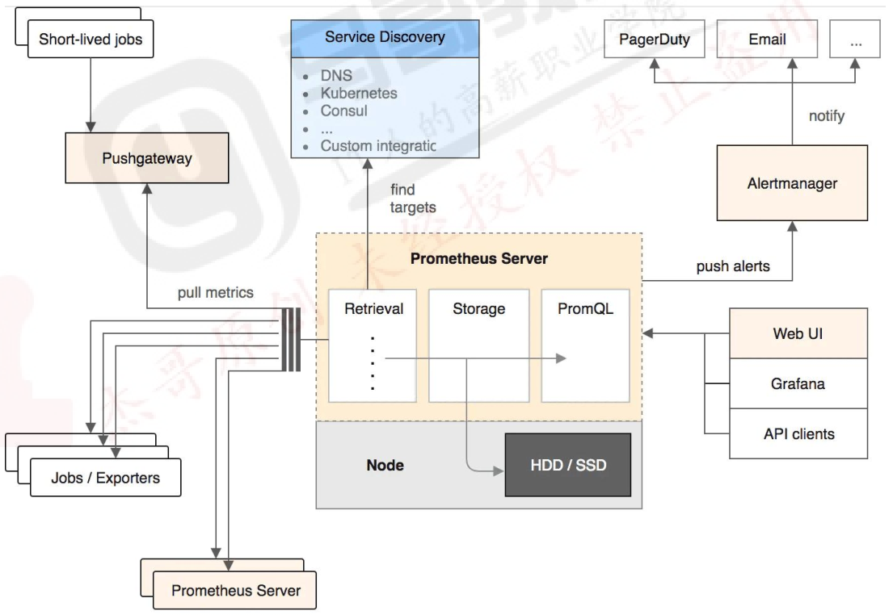

默认情况下，prometheus将采集到的数据存储在本地的TSDB数据库中，路径默认为prometheus安装目录的data目录下，数据写入过程先把数据写入wal日志并存放在内存，然后2小时后将内存的数据保存至一个新的block块，同时再把新采集的数据写入内存并在2小时后保存至一个新的block块，以此类推

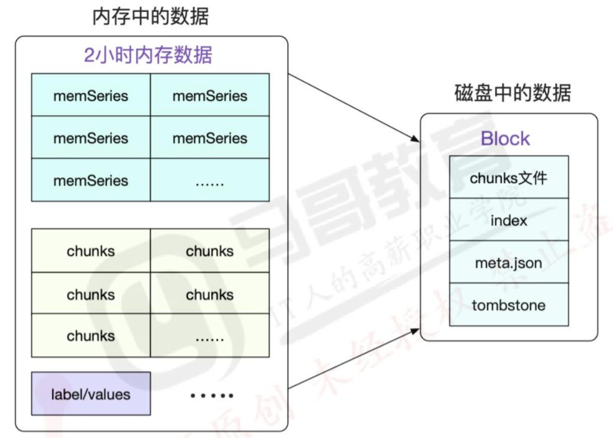

## block简介

每个block为一个data目录中以01开头的存储目录，如下

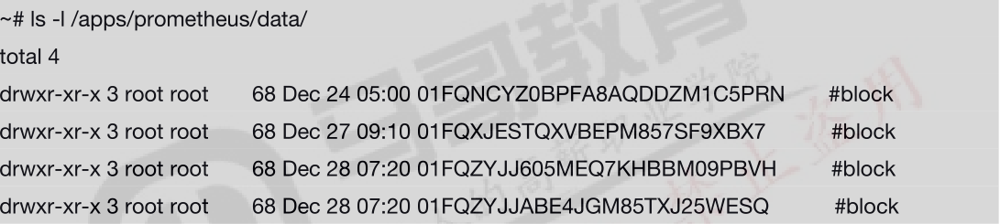

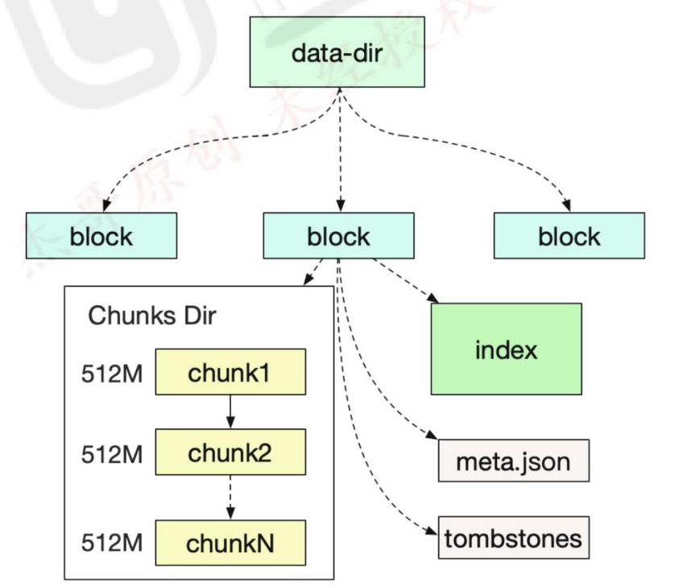

block块会压缩、合并历史数据块，以及删除过期的数据块，随着压缩、合并，block块数量会减少，在压缩过程中会发生三件事：定时执行压缩、合并小的block到大的block、清理过期的块.

每个block有4部分组成：

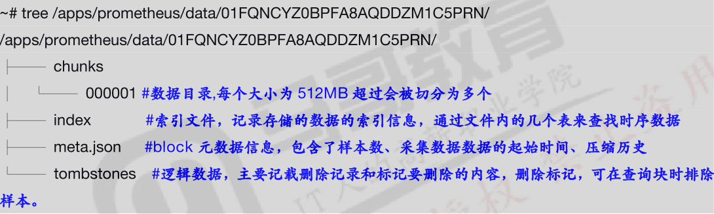

## 本地存储配置参数
```sh
--config.file="prometheus.yml"                         # 指定配置文件
--web.listen-address="0.0.0.0:9090"                    # 指定监听地址
--storage.tsdb.path="data/"                            # 指定数据存储目录
--storage.tsdb.retention.size=B,KB,MB,GB,TB,PB,EB      # 指定chunk大小，默认512M
--storage.tsdb.retention.time=                         # 数据保存时长，默认15天
--query.timeout=2m                                     # 最大查询超时时间
--query.max-connections=512                            # 最大查询并发数
--web.read-timeout=5m                                  # 最大空闲超时时间
--web.max-connections=512                              # 最大并发连接数
--web.enable-lifecycle                                 # 启用api动态加载功能
```

# prometheus远端存储VictoriaMetrics

GITHUB地址：https://github.com/VictoriaMetrics/VictoriaMetrics
官网地址：https://docs.victoriametrics.com/Single-server-VictoriaMetrics.html

VictoriaMetrics 可以认为是 Prometheus 的增强版。它不仅能作为时序数据库结合 Prometheus 使用进行指标的长期远程存储，也能单独作为一个监控解决方案对 Prometheus 进行平替。

对比其他一些主流的监控方案、时序数据库，VictoriaMetrics 具有如下优势：

1. 指标数据的收集和查询具有极高的性能和良好的垂直和水平伸缩性，比 InfluxDB 和 TimesscaleDB 的性能高出 20 倍
2. 在处理时间序列时，内存方面做出了优化，比 InfluxDB 少 10x 倍，比 Prometheus、Thanos 或 Cortex 少 7 倍
3. 数据存储的压缩方式更加高效。比 TimescaleDB 少 70 倍，与 Prometheus、Thanos、Cortex 相比，所需存储空间也少 7 倍。
4. 针对高延迟 IO 和低 IOPS 存储进行了优化
5. 单节点的 VictoriaMetrics 即可替代 Thanos、M3DB、Cortex、InfluxDB 或 TimescaleDB 等竞品中等规模的集群
6. 对于 Prometheus 具有良好的兼容性，能够支持 Prometheus 的配置文件、PromQL、各类 API、数据格式，并有一些自己的增强 API

## VictoriaMetrics 的架构

VictoriaMetrics 分为单节点和集群两个方案。两种方案都提供了二进制文件、docker、helm 以及 operator 等部署方式。对于数据采集点低于 100w/s 的场景，官方推荐使用单节点版，单节点版相当于一个 all-in-one 的包，包含了大部分的功能，但不支持告警，简单好维护。多集群的架构图如图 1 所示：

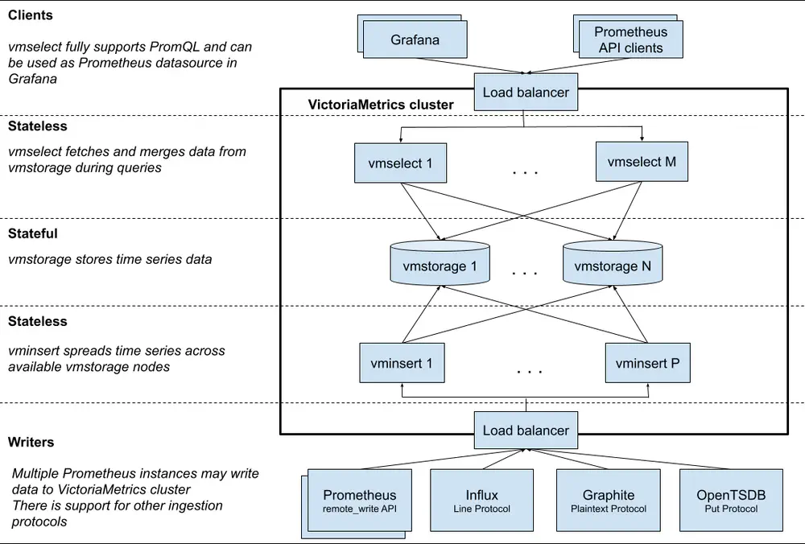

VictorMetrics 集群部分主要包含了以下几个组件：

- vmstorage：它是一个有状态的组件，主要负责存储原始数据并返回指定标签过滤器在给定时间范围内的查询数据，集群部署的必选组件，默认端口为 8482。
- vminsert：无状态的服务组件，主要负责接收摄取的数据并**根据指标名称和标签的哈希值分散存储**到部署了 vmstorage 的节点中去，集群部署的必选组件，默认端口为 8480。
- vmselect：无状态的额服务组件，面向外部终端的查询组件，根据收到的请求去各个 vmstorage 节点中获取数据，集群部署的必选组件，默认端口为 8481。
- vmagent：主要负责数据指标的抓取，并将它们存储在 VictoriaMetrics 或其他支持 remote write 协议的 Prometheus 兼容的存储系统中，会占用本地磁盘缓存。它是一个可选组件，位于上图 的 Writers 那层 Load balancer 与各个采集源之间，类似于 Prometheus 中 pushgateway 的地位。是一个可选组件，默认占用端口 8429。其组件作用如图 2 所示：

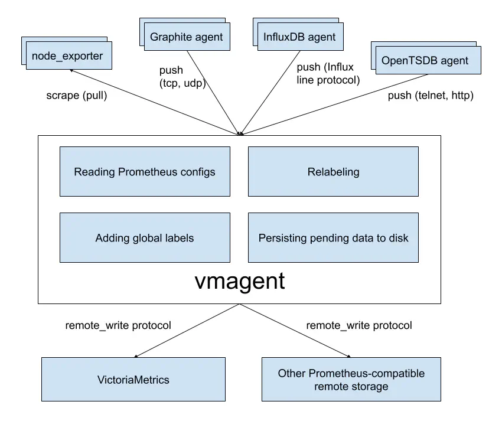

vmalert：类似于 Prometheus 中的 alertmanager，是一个告警的相关组件，如果不需要告警功能可以不使用该组件，是一个可选组件，默认占用端口为 8880。

集群部署模式下，各个服务可以进行独立的扩展，但部署 vmstorage 节点之间建议互不通信和进行数据共享，单节点模式的二进制文件或镜像已经集成了三个必选组件的功能。

下面我们将使用单集群的方式在 K8S 中对 VictoriaMetrics 进行部署，并验证其对于 Prometheus 的兼容性。

## VictoriaMetrics 单节点的安装和兼容性验证

首先，我们使用 Prometheus-Operator 进行 Prometheus 以及相关诸如 node-exporter、grafana 的快速安装。接着，在 K8S 内部署单节点的 VictoriaMetrics。最后，开启远程写入将 Prometheus 的数据写入 VictoriaMetrics 中，并在 grafana 中浏览 Prometheus 和 VictoriaMetrics 的指标，若结果相同，说明在不使用告警功能的情况下，VictoriaMetrics 可兼容替换 Prometheus 进行使用（单节点版不包含告警功能）。
整体的组件图如下：

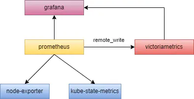

### 使用 kube-prometheus 安装 prometheus 相关组件

首先，我们克隆和使用 kube-prometheus (https://github.com/prometheus-operator/kube-prometheus) 这个项目来进行上图中蓝色、黄色以及粉色部分组件的快速安装，该项目和 prometheus-operator 的区别就类似于 Linux 内核和 CentOS/Ubuntu

这些发行版的关系，真正起作用的是 Operator 去实现的，kube-prometheus 项目编写了一系列常用的监控资源清单，更加容易上手安装。不过需要注意 Kubernetes 版本和 kube-prometheus 的兼容，各个版本的兼容关系如图 4 所示：

由于作者本地的 K8s 环境为 1.21 版本，所以我们这里下载使用 release-0.9 的版本到本地，接着进行进行解压并重命名（起始目录为压缩包所在目录），并进入工作目录，命令如下：

```sh
tar -xvf kube-prometheus-0.9.0.tar.gz
mv kube-prometheus-0.9.0 kube-prometheus
cd kube-prometheus
kubectl create -f manifests/setup # 这会帮我们安装创建 prometheus-operator 的命名空间（默认是 monitoring）和所需的 CRD 资源。
kubectl wait –for condition=Established –all CustomResourceDefinition –namespace=monitoring # 校验和等待我们所需 CRD 和命名空间的完成
ubectl create -f manifests/ # 安装项目已经定义好的 Prometheus、node-exporter、kube-state-metrics、alertmanager 组件
```

为了后续方便使用 Prometheus 和 grafana，我们将两个服务对应的 service 设置成 NodePort（默认为 ClusterIP）。命令为：

```sh
kubectl edit svc prometheus-k8s -n monitoring
kubectl edit svc grafana -n monitoring
```

完成之后，总体的服务清单如图所示：

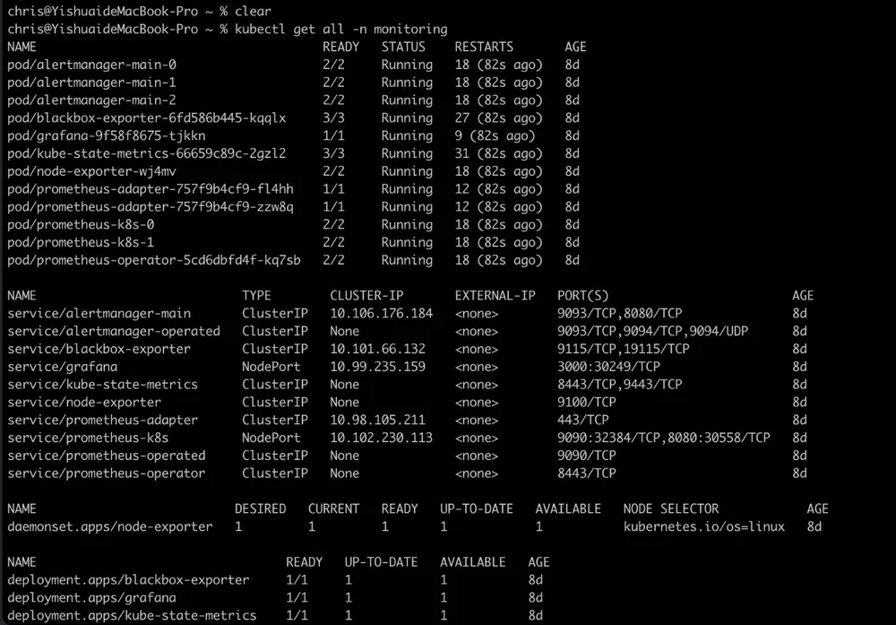

通过 http://:30246 就可以访问 grafana 了，我们可以看到 kube-prometheus 这个项目的 grafana 已经为我们关联了图 5 中的 prometheus，具体见图:

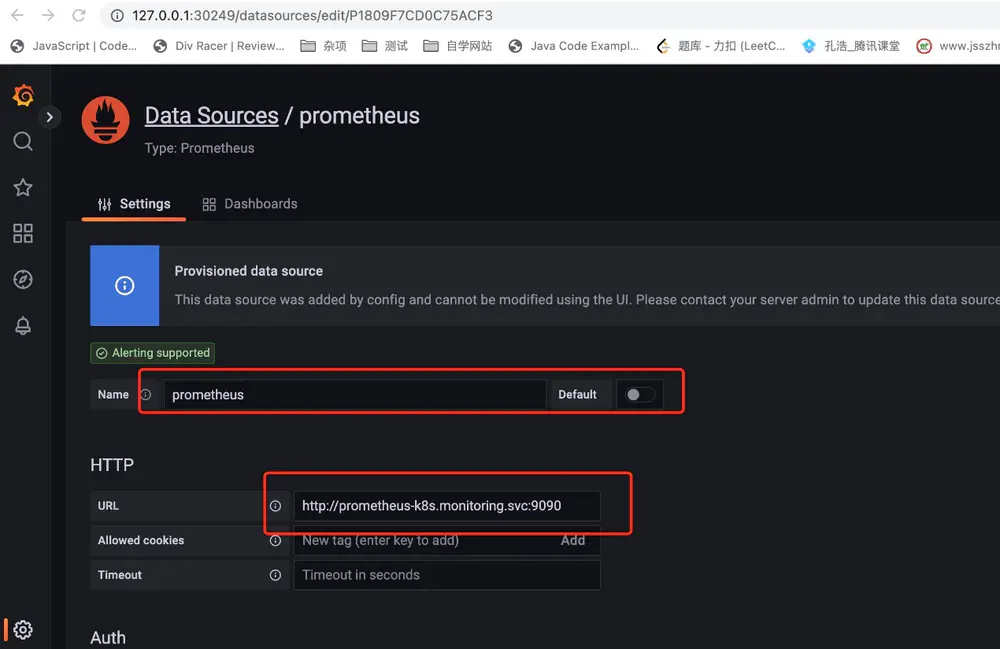

### 在 K8S 中部署 VictoriaMetrics

使用 Local PV 作为VictoriaMetrics的存储（生产环境一般使用 NFS 或者 ceph）。一般来说，Local PV 对应的存储介质应该是一块外挂在宿主机的磁盘或者块设备，我们这里暂时将本机节点的/Users/chris/data/k8s/vm 这个目录看成是一个挂载的独立磁盘，然后我们依次准备 StorageClass、PV 和 PVC 的资源清单，其内容如下代码块所示：

#### StorageClass 定义

```yaml
apiVersion: storage.k8s.io/v1
kind: StorageClass
metadata:
  name: local-storage  # 匹配的关键
provisioner: kubernetes.io/no-provisioner # 关键
volumeBindingMode: WaitForFirstConsumer # 延迟绑定
```

> ReadWriteOnce——该卷可以被单个节点以读/写模式挂载
> ReadOnlyMany——该卷可以被多个节点以只读模式挂载
> ReadWriteMany——该卷可以被多个节点以读/写模式挂载

#### PV 定义
```yaml
apiVersion: v1
kind: PersistentVolume
metadata:
  name: victoria-metrics-data
spec:
  accessModes:
    - ReadWriteOnce # 该卷可以被多个节点以读/写模式挂载，这里似乎妥
  capacity:
    storage: 10Gi
  storageClassName: local-storage
  local:
    path: /Users/chris/data/k8s/vm-operator
  persistentVolumeReclaimPolicy: Retain
  nodeAffinity:
    required:
      nodeSelectorTerms:
        - matchExpressions:
            - key: project
              operator: In
              values:
                - local-cluster
```

#### PVC

```yaml
apiVersion: v1
kind: PersistentVolumeClaim
metadata:
  name: victoria-metrics-data
  namespace: kube-vm
spec:
  accessModes:
    - ReadWriteOnce
  resources:
    requests:
      storage: 10Gi
  storageClassName: local-storage # 一定要匹配
```

PV 定义中我们设置了一个亲和性的 nodeSelector 进行使用，是因为本地存储不能随着 Pod 进行漂移，所以要求 Pod 固定到一个节点上，一旦漂移到其他节点上，另外的节点是没有对应的数据的（project=local-cluster 是我们实现为 node 设置的一个标签对）。并且我们在 StorageClass 定义中创建 StorageClass 的时候设置了延迟绑定，当节点第一次调度的时候才进行 PV 与 PVC 的绑定过程。因为假如我们一开始就绑定了 PV 和 PVC 在 node1 节点，且 PV 的存储卷在 node1 节点，但 Pod 只能运行在 node2 节点，那么就会出现冲突，导致调度失败，延迟调度就是让 K8S 调度器的总和考虑调度规则，再 Pod 被调度时再考虑 PVC 到底应该和哪个 PV 进行绑定。

接着，我们定义 VictoriaMetrics 的 Deployment 和它的 Service，如下代码块所示：

```yaml
apiVersion: apps/v1
kind: Deployment
metadata:
  name: victoria-metrics
  namespace: kube-vm
spec:
  selector:
    matchLabels:
      app: victoria-metrics
  template:
    metadata:
      labels:
        app: victoria-metrics
    spec:
      volumes:
        - name: storage
          persistentVolumeClaim:
            claimName: victoria-metrics-data
      containers:
        - name: vm
          image: victoriametrics/victoria-metrics:v1.79.8
          imagePullPolicy: IfNotPresent
          args:
            - -storageDataPath=/var/lib/victoria-metrics-data # 指定了数据存储目录
            - -retentionPeriod=1w # 指定了数据的保留周期为 1 个星期
          ports:
            - containerPort: 8428
              name: http
          volumeMounts:
            - mountPath: /var/lib/victoria-metrics-data
              name: storage
---
apiVersion: v1
kind: Service
metadata:
  name: victoria-metrics
  namespace: kube-vm
spec:
  type: NodePort
  ports:
    - port: 8428
  selector:
    app: victoria-metrics
```

然后 创建命名空间->apply以上yaml文件即可

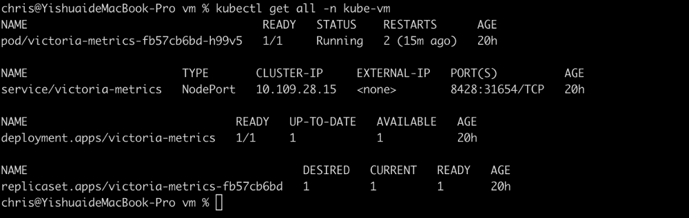

# 在 Prometheus 中开启远程写入

在 kube-promethus 项目下的 manifest 目录下找到 prometheus-prometheus.yaml 文件，在清单的最后添加 VictoriaMetrics 在 K8S 中的 DNS 路径，并重新 apply 即可，如图 10 所示：

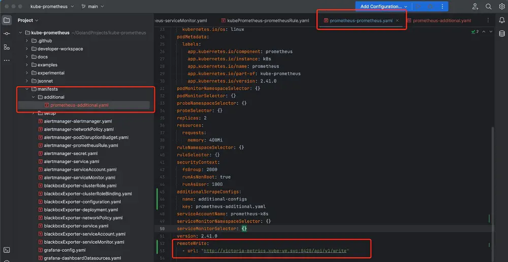

https://cloudnative.to/blog/victoriametrics/

## VictoriaMetrics 集群部署

环境简介

```sh
192.168.88.200 prometheus
192.168.88.201 victoriametrics-server1  # 启动vminsert、vmstorage、vmselect三个组件
192.168.88.202 victoriametrics-server2  # 启动vminsert、vmstorage、vmselect三个组件
192.168.88.203 victoriametrics-server3  # 启动vminsert、vmstorage、vmselect三个组件
192.168.88.204 node1
192.168.88.205 node2
```

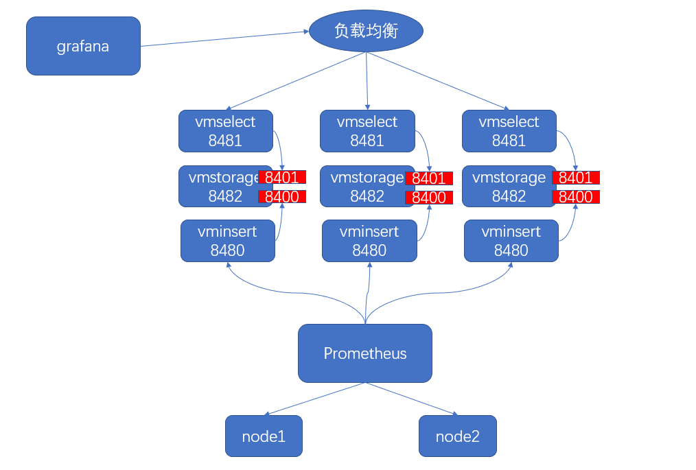

分别在各个victoriametrics服务器进行安装配置

```sh
tar xf victoria-metrics-amd64-v1.71.0-cluster.tar.gz
vminsert-prod
vmstorage-prod
vmselect-prod
mv vminsert-prod vmstorage-prod vmselect-prod /usr/local/bin
```