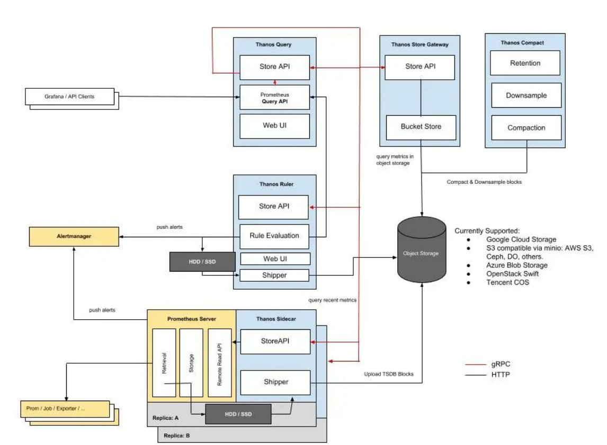
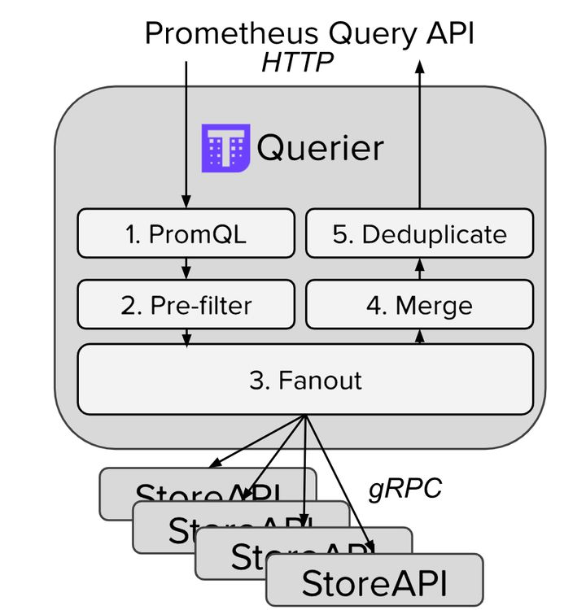
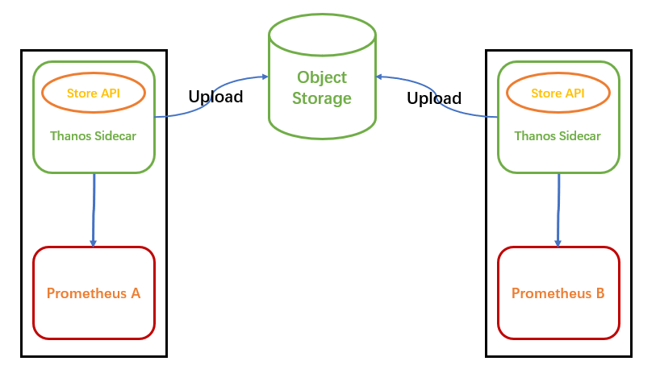
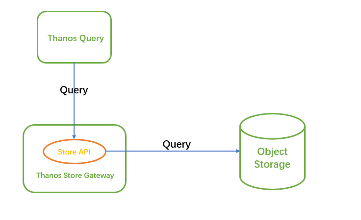
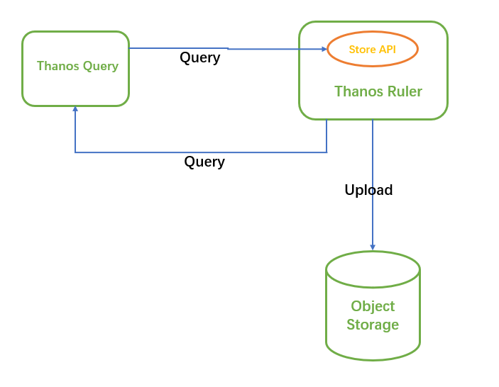
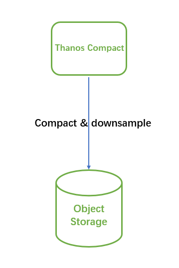
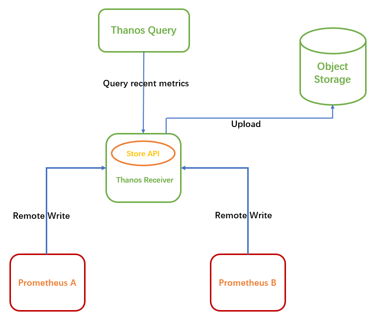

# thanos是什么

thanos是prometheus的高可用解决方案之一，thanos与prometheus无缝集成，并提高了一些高级特性，满足了长期存储 + 无限拓展 + 全局视图 + 无侵入性的需求

# thanos架构

这张图中包含了 Thanos 的几个核心组件，但并不包括所有组件，简单介绍下图中几个组件：

Thanos Query：实现了 Prometheus API，提供全局查询视图，将来StoreAPI提供的数据进行聚合最终返回给查询数据的client（如grafana）

Thanos Sidecar：连接 Prometheus，将其数据提供给 Thanos Query 查询，并且/或者将其上传到对象存储，以供长期存储

Thanos Store Gateway：将对象存储的数据暴露给 Thanos Query 去查询。

Thanos Ruler：对监控数据进行评估和告警，还可以计算出新的监控数据，将这些新数据提供给 Thanos Query 查询并且/或者上传到对象存储，以供长期存储。

Thanos Compact：将对象存储中的数据进行压缩和降低采样率，加速大时间区间监控数据查询的速度

Thanos Receiver：从 Prometheus 的远程写入 WAL 接收数据，将其公开和/或上传到云存储。

# 架构设计剖析

## Query 与 Sidecar

首先，监控数据的查询肯定不能直接查 Prometheus 了，因为会存在许多个 Prometheus 实例，每个 Prometheus 实例只能感知它自己所采集的数据

Thanos Query 实现了 Prometheus 的 HTTP API，能够 “看懂” PromQL。这样，查询 Prometheus 监控数据的 client 就不直接查询 Prometheus 本身了，而是去查询 Thanos Query，Thanos Query 再去下游多个存储了数据的地方查数据，最后将这些数据聚合去重后返回给 client，也就实现了分布式 Prometheus 的数据查询

那么 Thanos Query 又如何去查下游分散的数据呢？Thanos 为此抽象了一套叫 Store API 的内部 gRPC 接口，其它一些组件通过这个接口来暴露数据给 Thanos Query，它自身也就可以做到完全无状态部署，实现高可用与动态扩展。

这些分散的数据可能来自哪些地方呢？

首先，Prometheus 会将采集的数据存到本机磁盘上，如果我们直接用这些分散在各个磁盘上的数据，可以给每个 Prometheus 附带部署一个 Sidecar，这个 Sidecar 实现 Thanos Store API，当 Thanos Query 对其发起查询时，Sidecar 就读取跟它绑定部署的 Prometheus 实例上的监控数据返回给 Thanos Query

由于 Thanos Query 可以对数据进行聚合与去重，所以可以很轻松实现高可用：相同的 Prometheus 部署多个副本（都附带 Sidecar），然后 Thanos Query 去所有 Sidecar 查数据，即便有一个 Prometheus 实例挂掉过一段时间，数据聚合与去重后仍然能得到完整数据

不过因为磁盘空间有限，Prometheus 存储监控数据的能力也是有限的，通常会给 Prometheus 设置一个数据过期时间（默认 15 天）或者最大数据量大小，不断清理旧数据以保证磁盘不被撑爆。因此，我们无法看到时间比较久远的监控数据，有时候这也给我们的问题排查和数据统计造成一些困难

对于需要长期存储的数据，并且使用频率不那么高，最理想的方式是存进对象存储

## Store Gateway

那么这些被上传到了对象存储里的监控数据该如何查询呢？理论上 Thanos Query 也可以直接去对象存储查，但这会让 Thanos Query 的逻辑变的很重。我们刚才也看到了，Thanos 抽象出了 Store API，只要实现了该接口的组件都可以作为 Thanos Query 查询的数据源，Thanos Store Gateway 这个组件也实现了 Store API，向 Thanos Query 暴露对象存储的数据。Thanos Store Gateway 内部还做了一些加速数据获取的优化逻辑，一是缓存了 TSDB 索引，二是优化了对象存储的请求 (用尽可能少的请求量拿到所有需要的数据)

这样就实现了监控数据的长期储存，由于对象存储容量无限，所以理论上我们可以存任意时长的数据，监控历史数据也就变得可追溯查询，便于问题排查与统计分析

## Ruler

有一个问题，Prometheus 不仅仅只支持将采集的数据进行存储和查询的功能，还可以配置一些 rules:

1. 根据配置不断计算出新指标数据并存储，后续查询时直接使用计算好的新指标，这样可以减轻查询时的计算压力，加快查询速度。

2. 不断计算和评估是否达到告警阀值，当达到阀值时就通知 AlertManager 来触发告警。

由于我们将 Prometheus 进行分布式部署，每个 Prometheus 实例本地并没有完整数据，有些有关联的数据可能存在多个 Prometheus 实例中，单机 Prometheus 看不到数据的全局视图，这种情况我们就不能依赖 Prometheus 来做这些工作

这时，Thanos Ruler 就能大显身手了。它通过查询 Thanos Query 获取全局数据，然后根据 rules 配置计算新指标并存储，同时也通过 Store API 将数据暴露给 Thanos Query，同样还可以将数据上传到对象存储以供长期保存（这里上传到对象存储中的数据一样也是通过 Thanos Store Gateway 暴露给 Thanos Query）

看起来 Thanos Query 跟 Thanos Ruler 之间会相互查询，不过这个不冲突:

- Thanos Ruler 为 Thanos Query 提供计算出的新指标数据

- Thanos Query 为 Thanos Ruler 提供计算新指标所需要的全局原始指标数据

至此，Thanos 的核心能力基本实现了，完全兼容 Prometheus 情况下提供数据查询的全局视图、高可用以及数据的长期保存。

那我们还可以怎么进一步做优化呢？

## Compact

由于我们有数据长期存储的能力，也就可以实现查询较大时间范围的监控数据，当时间范围很大时，查询的数据量也会很大，这会导致查询速度非常慢

通常在查看较大时间范围的监控数据时，我们并不需要那么详细的数据，只需要看到大致就行。这时我们可以用到 Thanos Compact，它可以读取对象存储的数据，对其进行压缩以及降采样再上传到对象存储，这样在查询大时间范围数据时就可以只读取压缩和降采样后的数据，极大地减少了查询的数据量，从而加速查询

## Sidecar模式和Receiver模式

Receiver 是做什么的呢？为什么需要 Receiver？它跟 Sidecar 有什么区别？

它们都可以将数据上传到对象存储以供长期保存，区别在于最新数据的存储。

由于数据上传不可能实时，Sidecar 模式将最新的监控数据存到 Prometheus 本机，Query 通过调所有 Sidecar 的 Store API 来获取最新数据，这就成一个问题：如果 Sidecar 数量非常多或者 Sidecar 跟 Query 离的比较远，每次查询 Query 都调所有 Sidecar 会消耗很多资源，并且速度很慢，而我们查看监控大多数情况都是看的最新数据。

为了解决这个问题，Thanos Receiver 组件被提出，它适配了 Prometheus 的 remote write API，也就是所有 Prometheus 实例可以实时将数据 push 到 Thanos Receiver，最新数据也得以集中起来，然后 Thanos Query 也不用去所有 Sidecar 查最新数据了，直接查 Thanos Receiver 即可。

另外，Thanos Receiver 也将数据上传到对象存储以供长期保存，当然，对象存储中的数据同样由 Thanos Store Gateway 暴露给 Thanos Query。

有同学可能会问：如果规模很大，Receiver 压力会不会很大，成为性能瓶颈？当然，设计者在设计这个组件时肯定会考虑这个问题，Receiver 实现了一致性哈希，支持集群部署，所以即使规模很大也不会成为性能瓶颈

# Thanos部署

Thanos 支持云原生部署方式，充分利用 Kubernetes 的资源调度与动态扩容能力。从官方文档里可以看到，当前 Thanos 在 Kubernetes 上部署有以下三种：

1. prometheus-operator：集群中安装了 prometheus-operator 后，就可以通过创建 CRD 对象来部署 Thanos 了；
2. 社区贡献的一些 helm charts：很多个版本，目标都是能够使用 helm 来一键部署 thanos；
3. kube-thanos：Thanos 官方的开源项目，包含部署 thanos 到 kubernetes 的 jsonnet 模板与 yaml 示例

##

https://www.cnblogs.com/zhrx/p/16054135.html

