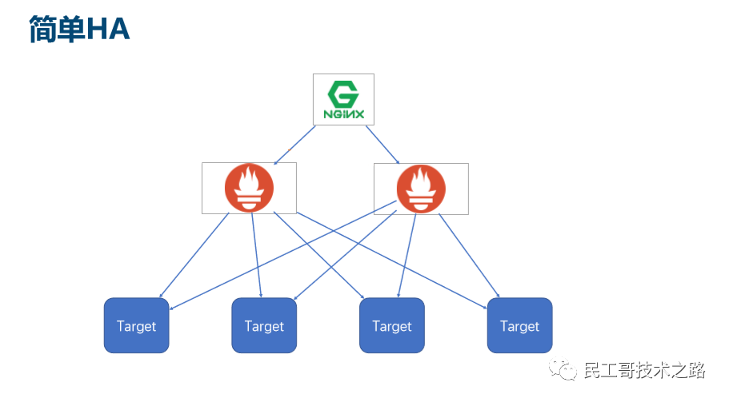
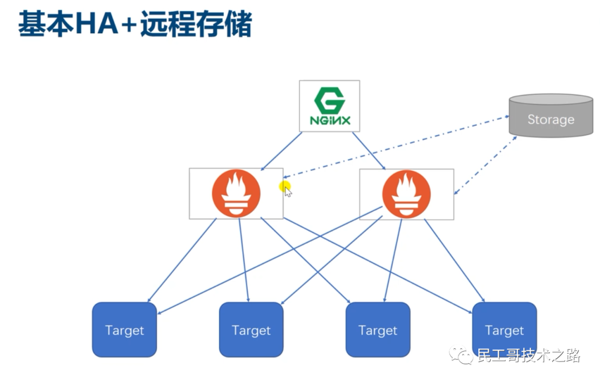
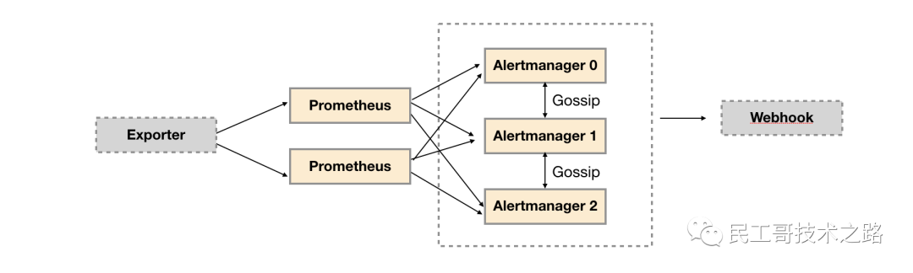
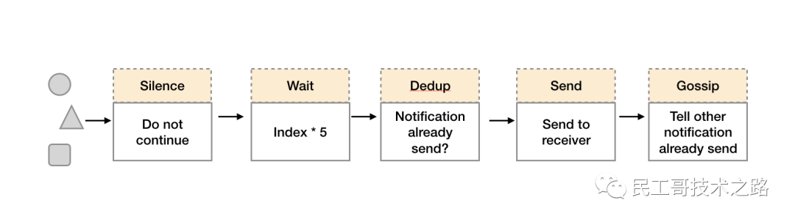

Prometheus 作为新生代的开源监控系统，慢慢成为了云原生体系的监控事实标准，也证明了其设计得到业界认可。

但在多集群，大集群等场景下，Prometheus **由于没有分片能力和多集群支持，还有 Prometheus 不支持长期存储、不能自动水平扩缩、大范围监控指标查询会导致 Prometheus 服务内存突增**等

单台的 Prometheus 存在单点故障的风险，随着监控规模的扩大，Prometheus 产生的数据量也会非常大，性能和存储都会面临问题。毋庸置疑，我们需要一套高可用的 Prometheus 集群。

# 方案一: 基本HA

Promethues通过Pull机制进行数据采集，要确保Promethues服务的可用性，只需要部署多套Prometheus Server实例，并且采集相同的Exporter目标, 通过负载均衡访问多个prometheus实例, 即可实现基本的高可用功能。

基本的HA模式只能确保Promethues服务的可用性问题，但是不解决Prometheus Server之间的数据一致性问题以及持久化问题，也无法进行动态的扩展。适合监控规模不大，Promethues Server也不会频繁发生迁移的情况，并且只需要保存短周期监控数据的场景。

# 方案二: 基本HA+远程存储

在基本HA模式的基础上通过添加Remote Storage存储支持，将监控数据保存在第三方存储服务上。

在解决了Promethues服务可用性的基础上，同时确保了数据的持久化，当Promethues Server发生宕机或者数据丢失的情况下，可以快速的恢复。同时Promethues Server能很好的进行迁移. 该方案适用于监控规模不大，希望能够将监控数据持久化，同时能够确保Promethues Server的可迁移性的场景。

## 远程存储解决方案

Prometheus的本地存储在可扩展性和耐用性方面受到单个节点的限制, 无法持久化数据，无法存储大量历史数据，同时也无法灵活扩展和迁移. Prometheus官方没有尝试解决Prometheus本身的集群存储问题，而是提供了一组允许与远程存储系统集成的接口, 将数据保存到任意第三方的存储服务中，实现远程存储。

Prometheus以两种方式与远程存储系统集成：

1. Prometheus可以以标准格式将其提取的样本写入远程URL。
2. Prometheus可以以标准格式从远程URL读取（返回）样本数据。

Prometheus的远端存储(remote storage)原理如下图所示：

Prometheus定义了同远端存储的读写接口，交互协议使用protocol buffer定义，传输基于HTTP；一个存储系统如果要支持Prometheus，仅需要实现一个adapter层，将Prometheus的的读写请求转换为其内部的格式来处理。

## InfluxDB

Influxdb是目前Prometheus支持的最好的时序型数据库,也是目前相对主流的时序数据库,选用Influxdb来作为Prometheus的远程存储是目前的最佳选择, 解锁本地存储的限制, 解决Prometheus server高可用的数据一致性和持久化问题。

不足之处是Influxdb的集群功能只有商业版本才支持, 开源版本只能部署单机版, 解决办法是使用公有云上的时序数据库产品。

## 推荐方案
推荐方案为基本ＨＡ架构，即创建两台Prometheus server实例, 进行相同的配置,在这两个Prometheus server前端添加一台云厂商的内网负载均衡进行请求接入.后期可以为现有的基本ＨＡ架构增加远程存储．解决两个Prometheus server数据同步和持久化的问题

## 方案存在的问题

### Prometheus单机性能
每秒消费百万级时间序列, 监控上千个目标,可以支持单机每秒1000w个指标项的收集,处理数百万的指标数据。

### Alertmanager高可用

为提升Promethues的服务可用性，通常会部署两个或者两个以上的Promthus Server，它们具有完全相同的配置包括Job配置，以及告警配置等, 这样就导致Alertmanager会收到多个相同的报警信息, 但是基于Alertmanager的告警分组机制, 即使不同的Prometheus Sever分别发送相同的告警给Alertmanager，Alertmanager也可以自动将这些告警合并为一个通知向receiver发送。

虽然Alertmanager能够同时处理多个相同的Prometheus Server所产生的告警。但是由于单个Alertmanager的存在，当前的部署结构存在明显的单点故障风险，当Alertmanager单点失效后，告警的后续所有业务全部失效。解决方案是部署多套Alertmanager。但是由于Alertmanager之间并不了解彼此的存在，因此则会出现告警通知被不同的Alertmanager重复发送多次的问题。

为解决Alertmanager集群带来的告警重复发送问题, Alertmanager引入了Gossip机制。**Gossip机制为多个Alertmanager之间提供了信息传递的机制**。确保即使在多个Alertmanager分别接收到相同告警信息的情况下，也只有一个告警通知被发送给Receiver。

当Alertmanager接收到来自多个Prometheus的告警消息后，会按照以下流程对告警进行处理：

1. 在第一个阶段Silence中，Alertmanager会判断当前通知是否匹配到任何的静默规则，如果没有则进入下一个阶段，否则则中断流水线不发送通知。
2. 在第二个阶段Wait中，Alertmanager会根据当前Alertmanager在集群中所在的顺序(index)等待index * 5s的时间。
3. 当前Alertmanager等待阶段结束后，Dedup阶段则会判断当前Alertmanager数据库中该通知是否已经发送，如果已经发送则中断流水线，不发送告警，否则则进入下一阶段Send对外发送告警通知。
4. 告警发送完成后该Alertmanager进入最后一个阶段Gossip，Gossip会通知其他Alertmanager实例当前告警已经发送。其他实例接收到Gossip消息后，则会在自己的数据库中保存该通知已发送的记录。

Alertmanager基于Gossip实现的集群机制虽然不能保证所有实例上的数据时刻保持一致，但是实现了CAP理论中的AP系统，即可用性和分区容错性。同时对于Prometheus Server而言保持了配置了简单性，Promethues Server之间不需要任何的状态同步。

# Promethues 邦联集群

当单台Promethues Server无法处理大量的采集任务时，可以考虑基于Prometheus联邦集群的方式将监控采集任务划分到不同的Promethues实例当中, 即在任务级别做功能分区。

