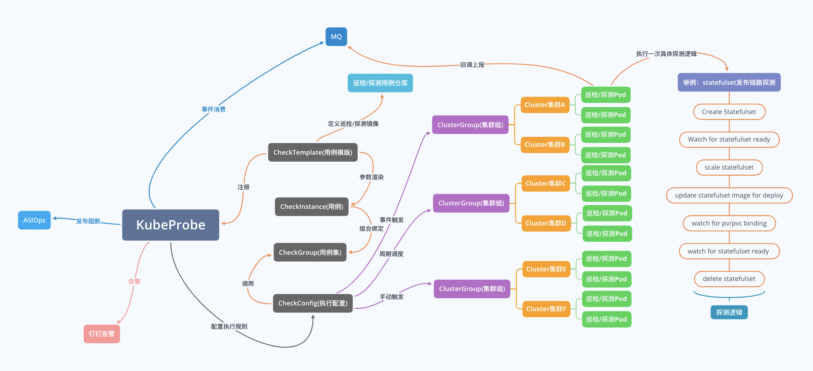
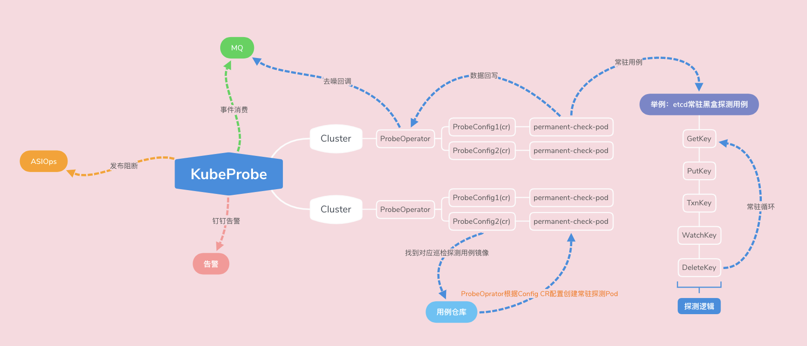
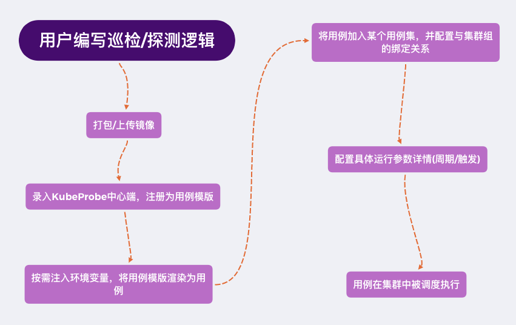
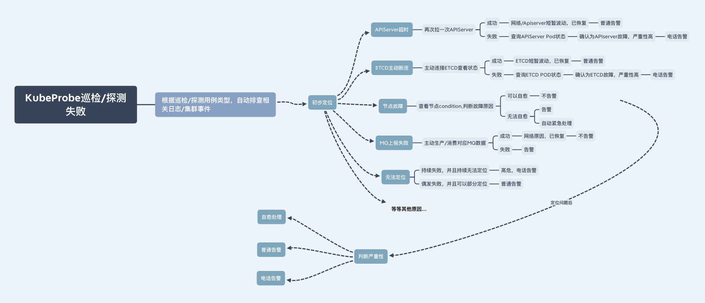

# KubeProbe

## 探测

### 黑盒探测

所谓黑盒探测，就是让自己成为自己的用户，模拟广义"用户"的行为去对集群/组件/链路等待待测对象做探测。注意，这里的"用户"并不仅仅是狭义上使用系统的同学，而是广义用户。

在 变更时（监听到集群状态发生变化/组件变更/组件发布/系统升级等等事件）/运行时（周期，高频）/故障恢复时（手动），通过周期/事件触发/手动触发，执行各种不同类型的黑盒探测，第一时间感知组件/集群/链路的可用性。

以 etcd 集群的可用性来举例，我们可以实现一个探测用例，逻辑是对 etcd 做 create/get/delete/txn 等等操作，并记录每个操作的成功率/消耗时间，当成功率低于 100% 或消耗时间超过容忍阈值后，触发报警。我们将周期高频运行这个 etcd 的探测用例，同时对于 etcd 集群的任何变更都会发出一个事件 event 触发这个 etcd 探测立即运行，这样就能尽量确保第一时间发现 etcd 可用性故障了。同时，当 etcd 集群因为某些原因不可用了，我们也可以通过手动触发等其他方式做探活，也能第一时间得到是否恢复的信息

### 定向巡检

相比于黑盒探测面对的未知故障场景，定向巡检的目标是对集群的已知风险点做扫描。

比如 etcd 冷热备多集群覆盖不全，可能导致集群遇到故障无法快速恢复。那么我们就定期对 etcd 的冷热备覆盖情况做定向巡检，找出没有覆盖推平的集群，并告警。比如 集群风控系统没有全集群链路覆盖，限流配置没有全集群链路推平，可能导致某些故障场景引发集群全面崩溃，我们定期对风控配置全网扫描，判断是否可能导致故障，找出这些隐藏的已知风险点并告警

## 架构

### 基本架构

KubeProbe 的基本实现架构大致如下图，KubeProbe 中心端配置**集群/集群组**与**巡检/探测用例/用例集**之间的关联关系，负责对集群做具体某次探测实例下发。某个具体的巡检/探测用例下发到具体某个集群将使用用例的镜像创建一个 pod，这个 pod 里会执行若干巡检/探测逻辑，当执行完成后会回调中心端回写本次巡检/探测结果。其具体结果在中心端统一展示/告警，并提供给其他消费者消费（如支持 ASIOps 平台的发布阻断）。



除了上述的基本架构之外，我们对于高频探测用例（既探测周期短，触发频率需要非常频繁，甚至保持无缝探测的场景）设计了一套集群内的分布式常驻探测架构，该架构通过集群内的 ProbeOperator 组件 watch 自定义对象 probeConfig 的变化，在集群内创建一个常驻的探测 pod，将持续无间断的运行探测逻辑，实现接近无缝的持续探测，并将结果通过去噪/令牌桶限流等处理后，上报中心端，共给其他消费者消费。



### 用例管理

```go
KPclient "gitlab.alibaba-inc.com/{sigma-inf}/{kubeProbe}/client"

// 报告成功
// 此方法会向KubeProbe报告本次巡检结果为成功
KPclient.ReportSuccess()
os.Exit(0)

// 报告失败
// 报告方法会向KubeProbe报告本次巡检结果为失败，并且失败信息为 `我失败啦`
KPclient.ReportFailure([]string{"我失败啦!"})
os.Exit(1)
```
通过提供好的 Makefile 将这个用例打包成镜像，录入 KubeProbe 中心端就可以对集群做配置和下发了。将具体巡检/探测逻辑和 KubeProbe 中心管控端解耦，可以灵活而又简便的让更多的二方用户接入自己的特殊巡检/探测逻辑。

目前已经使用的探测/巡检用例包括：

1. 通用探测：模拟 pod / deployment / statefulset 生命周期探测集群整条管控链路。
2. etcd 黑盒探测：模拟 etcd 的基本操作，探测元集群中各 etcd 状态。
3. 金丝雀探测（感谢质量技术同学的大力支持）：模拟用户使用 ASI 的部署场景，实现金丝雀应用的全链路模拟发布/扩容/缩容。
4. Virtual cluster 探测：探测 vc 虚拟集群的管控链路状态。
5. 联邦链路探测：探测联邦控制器相关链路的状态。
6. 节点通用探测：在集群每个节点上模拟调度一个探测 pod，探测节点侧链路状态。
7. ASI 客户端/服务端证书巡检：检查客户端/服务端证书有效性以及到期时间是否已超过告警阈值。
8. 全局风控限流巡检：检查各 ASI 集群是否已经推平并开启 KubeDefender 全局限流风控配置

### KubeProbe 中心端管控

编写完成探测/巡检用例，并打包上传好镜像后，就需要在 KubeProbe 中心端注册这个用例模版，即将镜像注册进 KubeProbe 中心端的数据库中。

我们可以通过"渲染配置"参数传入一些指定的 env 环境变量到巡检/探测 pod 中，用于执行不同的业务逻辑，实现同一个用例模版生成多个用例。

最后通过统一的配置管控将用例和集群做绑定，配置对应的参数，执行各种下发逻辑。




## KubeProbe 和数据监控的告警区别
KubeProbe 所面对的场景和数据监控不同，更多偏向于链路探测。

比如，监控告警一般的告警可能如下：

xx容器内存使用率 99%
webhook 双副本全部挂掉了
apiserver 三副本全部宕机了
这些告警，往往内容中就包含了具体的故障点，而 KubeProbe 的链路探测告警就有很多不一样，比如：

Statefulset 链路探测失败，Failed to create pod sandbox: rpc error: code = Unknown
etcd 全流程黑盒探测失败，context deadline exceeded
CloneSet 扩容失败，connect: connection refused

## KubeProbe 自闭环的根因定位系统




