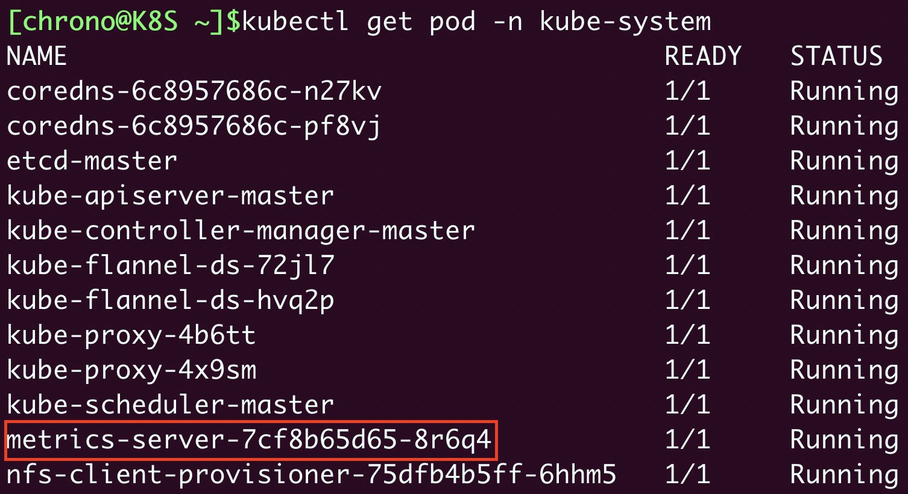
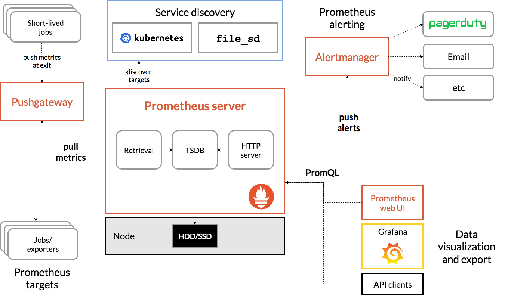

# Metrics Server
如果你对 Linux 系统有所了解的话，也许知道有一个命令 top 能够实时显示当前系统的 CPU 和内存利用率，它是性能分析和调优的基本工具，非常有用。Kubernetes 也提供了类似的命令，就是 kubectl top，不过默认情况下这个命令不会生效，必须要安装一个插件 Metrics Server 才可以。

Metrics Server 是一个专门用来收集 Kubernetes 核心资源指标（metrics）的工具，它**定时**从所有节点的 kubelet 里采集信息，但是对集群的整体性能影响极小，每个节点只大约会占用 1m 的 CPU 和 2MB 的内存，所以性价比非常高。

下面的这张图来自 Kubernetes 官网，你可以对 Metrics Server 的工作方式有个大概了解：它调用 kubelet 的 API 拿到节点和 Pod 的指标，再把这些信息交给 apiserver，这样 kubectl、HPA 就可以利用 apiserver 来读取指标了.

在 Metrics Server 的项目网址（https://github.com/kubernetes-sigs/metrics-server）可以看到它的说明文档和安装步骤.

Metrics Server 的所有依赖都放在了一个 YAML 描述文件里，你可以使用 wget 或者 curl 下载

```sh
wget https://github.com/kubernetes-sigs/metrics-server/releases/latest/download/components.yaml
```

但是在 kubectl apply 创建对象之前，我们还有两个准备工作要做。

1. 修改 YAML 文件。你需要在 Metrics Server 的 Deployment 对象里，加上一个额外的运行参数 --kubelet-insecure-tls，也就是这样：

```yaml
apiVersion: apps/v1
kind: Deployment
metadata:
  name: metrics-server
  namespace: kube-system
spec:
  ... ... 
  template:
    spec:
      containers:
      - args:
        - --kubelet-insecure-tls
        ... ... 
```

这是因为 Metrics Server 默认使用 TLS 协议，要验证证书才能与 kubelet 实现安全通信，而我们的实验环境里没有这个必要，加上这个参数可以让我们的部署工作简单很多（生产环境里就要慎用）。

2. 预先下载 Metrics Server 的镜像。看这个 YAML 文件，你会发现 Metrics Server 的镜像仓库用的是 gcr.io，下载很困难。好在它也有国内的镜像网站。

```sh
repo=registry.aliyuncs.com/google_containers

name=k8s.gcr.io/metrics-server/metrics-server:v0.6.1
src_name=metrics-server:v0.6.1

docker pull $repo/$src_name

docker tag $repo/$src_name $name
docker rmi $repo/$src_name
```

准备完成之后就可以部署了：

```sh
kubectl apply -f components.yaml
```

查看部署结果

```sh
kubectl get pod -n kube-system
```



Metrics Server使用方法

```sh
kubectl top node # 查看节点的资源使用率
kubectl top pod -n kube-system # 查看Pod的资源使用率
```
# HPA

一个Nginx应用如下：

```yaml
apiVersion: apps/v1
kind: Deployment
metadata:
  name: ngx-hpa-dep

spec:
  replicas: 1
  selector:
    matchLabels:
      app: ngx-hpa-dep

  template:
    metadata:
      labels:
        app: ngx-hpa-dep
    spec:
      containers:
      - image: nginx:alpine
        name: nginx
        ports:
        - containerPort: 80

        resources:
          requests:
            cpu: 50m
            memory: 10Mi
          limits:
            cpu: 100m
            memory: 20Mi
---

apiVersion: v1
kind: Service
metadata:
  name: ngx-hpa-svc
spec:
  ports:
  - port: 80
    protocol: TCP
    targetPort: 80
  selector:
    app: ngx-hpa-dep
```

为这个应用创建HPA

```yaml
apiVersion: autoscaling/v1
kind: HorizontalPodAutoscaler
metadata:
  name: ngx-hpa

spec:
  maxReplicas: 10
  minReplicas: 2
  scaleTargetRef:
    apiVersion: apps/v1
    kind: Deployment
    name: ngx-hpa-dep
  targetCPUUtilizationPercentage: 5
```

# Prometheus

架构图




