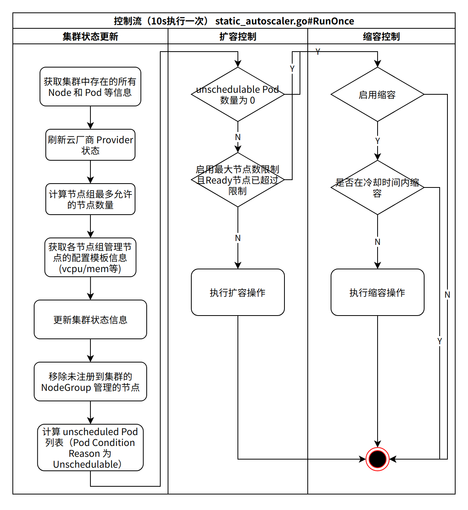
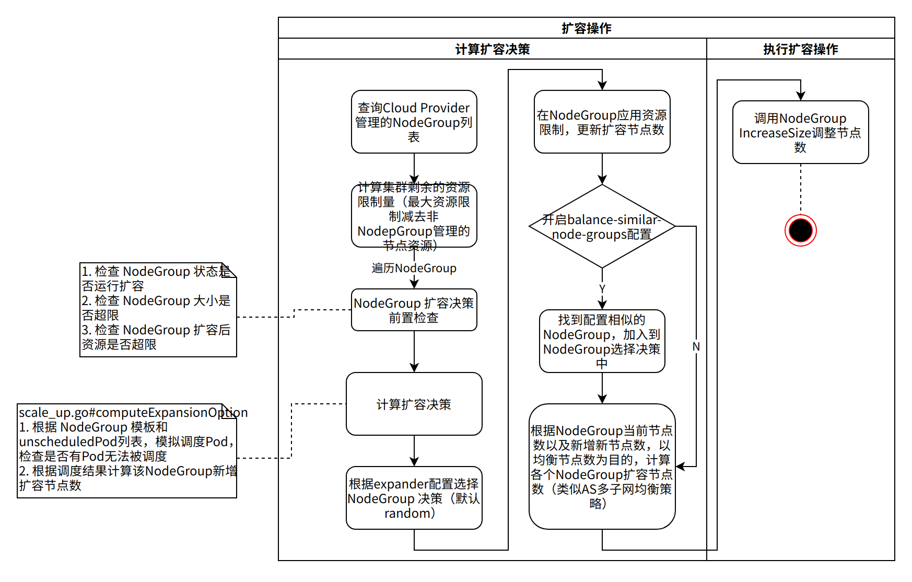
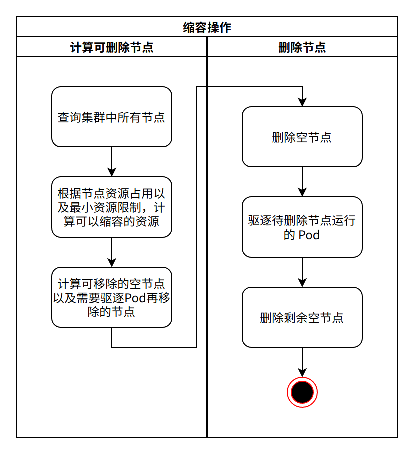
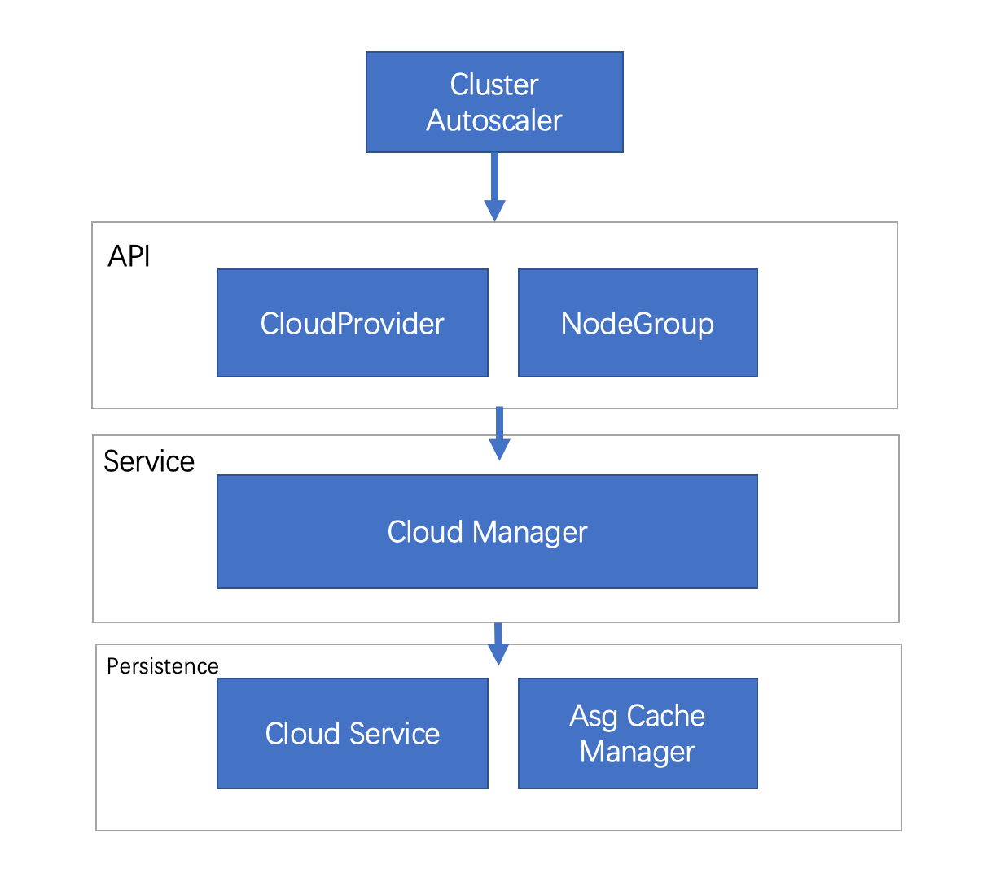
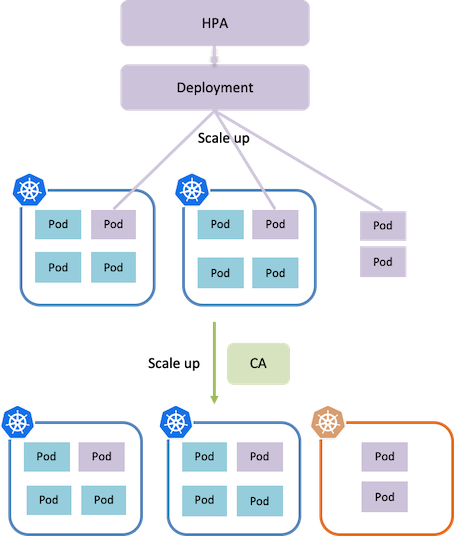

Autoscaler 是 Kubernetes 弹性伸缩的一个组件集合，主要包含三个组件

1. Cluster Autoscaler / CA：用于自动调整 Kubernetes 集群大小，以便所有 Pod 都能被调度到 Node 上运行，且没有多余的无负载 Node。GA 版本已随 Kubernetes 1.8 版本发布。
2. Vertical Pod Autoscaler / VPA：用于自动调整在 Kubernetes 中运行的 Pod 请求的 CPU 和内存量的一组组件。目前处于 beta 版本，主要由 3 个部分组成：
- Recommender：监控 Pod 的当前和过去的资源消耗，根据监控数据计算推荐的 CPU 和内存建议值。
- Updater：检查 Pod 是否使用 Recommender 推荐的资源建议值，如果 Pod 没有使用推荐值，Updater 会尝试驱逐该 Pod。
- Admission Plugin：在新的 Pod 上设置 Recommender 推荐的资源建议值。
3. Addon Resizer：VPA 的简化版，根据集群中 Node 数量修改资源请求。

# CA 工作原理

## 工作流程

CA 顶层工作流程:

1. 每 10s 检查集群是否存在无法被调度的 Pod
2. 集群中没有足够资源分配给这些 Pod，CA 会触发云厂商 Provider 执行扩容流程
3. 云厂商支持新节点加入集群
4. Pod 调度至新加入集群的 Node

## 核心控制循环

CA 是一个 CLI 应用程序。启动时，它会触发无限控制循环逻辑，每 10 秒执行一次。它会检查集群状态，以决定是否执行扩容或缩容操作。



## 节点扩容

## 节点缩容



## 节点缩容



# CA Provider

## 简介

CA Provider 是 autoscaler CA 组件云厂商适配提供的插件。通过实现 CA 暴露的指定接口，提供节点组管理相关的能力。目前各个云厂商主流实现都是通过对接 NodeGroup 到自家的弹性伸缩服务，利用弹性伸缩的丰富能力（例如支持在多个可用区按照优先级、均衡策略扩缩容、支持多实例规格、支持健康检查等能力），更加快速、稳定地支撑 Kubernetes 集群扩缩容需求。

弹性伸缩提供实例托管服务，集群需要扩容时 CA 通知 NodeGroup（一般等同弹性伸缩服务的伸缩组）扩大实例数，伸缩组收到请求后自动创建 ECS 实例，实例完成创建后自动加入到 Kubernetes 集群中（通常通过 cloud-init 实现），最终实现 Kubernetes 集群的扩缩容操作。

1. 为了自动创建和初始化 Node，Cluster Autoscaler 要求 Node 必须属于某个 Node Group，比如
- GCE/GKE 中的 Managed instance groups（MIG）
- AWS 中的 Autoscaling Groups
- Azure 中的 Scale Sets 和 Availability Sets

2. 当集群中有多个 Node Group 时，可以通过 --expander=<option> 选项配置选择 Node Group 的策咯，支持如下四种方式

- random：随机选择
- most-pods：选择容量最大（可以创建最多 Pod）的 Node Group
- least-waste：以最小浪费原则选择，即选择有最少可用资源的 Node Group
- price：选择最便宜的 Node Group（仅支持 GCE 和 GKE）

目前，Cluster Autoscaler 可以保证
- 小集群（小于 100 个 Node）可以在不超过 30 秒内完成扩展（平均 5 秒）
- 大集群（100-1000 个 Node）可以在不超过 60 秒内完成扩展（平均 15 秒）

用户在启动 Cluster AutoScaler 时可以配置 Node 数量的范围（包括最大 Node 数和最小 Node 数）。

### 注意1

1. 由于在删除 Node 时会发生 Pod 重新调度的情况，所以应用必须可以容忍重新调度和短时的中断（比如使用多副本的 Deployment）

2. 当 Node 上面的 Pods 满足下面的条件之一 时，Node 不会删除

- Pod 配置了 PodDisruptionBudget (PDB)

- kube-system Pod 默认不在 Node 上运行或者未配置 PDB

- Pod 不是通过 deployment, replica set, job, stateful set 等控制器创建的

- Pod 使用了本地存储

- 其他原因导致的 Pod 无法重新调度，如资源不足，其他 Node 无法满足 NodeSelector 或 Affinity 等

### 注意2

Cluster Autoscaler 仅根据 Pod 的调度情况和 Node 的整体资源使用情况（reqeust）来增删 Node，跟 Pod 或 Node 的资源度量（metrics）没有直接关系。

## 接口设计

对接 CA 需要实现两个接口：

- CloudProvider：CA 直接与云提供商交互的接口。主要通过该接口查询集群的 NodeGroup 列表、集群 Node 和 NodeGroup 归属关系等信息。
- NodeGroup：节点组，通过该接口控制节点扩缩容操作。一般一个 NodeGroup 对标弹性伸缩中的一个伸缩组（Auto Scaling Group）。

## Provider 设计



各个云厂商的 Provider 设计主要分 3 层：

- API 层：直接与 CA 对接，包括上述需要实现的 Cloud Provider 和 NodeGroup 接口。
- Service 层：实现 Cloud Provider 和 NodeGroup 相关的业务逻辑。
- Persistence 层：各个云提供商提供的服务，CA 里体现为 OpenAPI 调用。目前 Cloud Service 主要包括弹性伸缩、ECS 相关的 OpenAPI；NodeGroup Cache Manager 主要提供 NodeGroup 的缓存服务，同时实现 Service 层部分查询需求。

# 构建打包

1. 获取代码

Fork the repository in the cloud:

Visit https://github.com/kubernetes/autoscaler
Click Fork button (top right) to establish a cloud-based fork. The code must be checked out as a subdirectory of k8s.io, and not github.com.

```sh
mkdir -p $GOPATH/src/k8s.io
cd $GOPATH/src/k8s.io
git clone https://github.com/kubernetes/autoscaler.git
cd autoscaler
```

2. 构建

最新的 CA 使用 go1.19 版本，可以使用 gvm 切换不同的 Go 版本。

```sh
# 编译
cd cluster-autoscaler && make build
# 构建镜像
docker build -t xxx.com/xx/cluster-autoscaler:[tag] -f Dockerfile.amd64 .
# 上传镜像
docker push xxx.com/xxx/cluster-autoscaler:[tag]
```

# 最佳实践

1. Cluster AutoScaler 可以和 Horizontal Pod Autoscaler（HPA）配合使用



2. 运行 Pod 时指定资源请求

3. 必要时使用 PodDisruptionBudgets 阻止 Pod 被误删除

4. 确保云服务商的配额充足

5. Cluster AutoScaler 与云服务商提供的 Node 自动扩展功能以及基于 CPU 利用率的 Node 自动扩展机制冲突，不要同时启用


