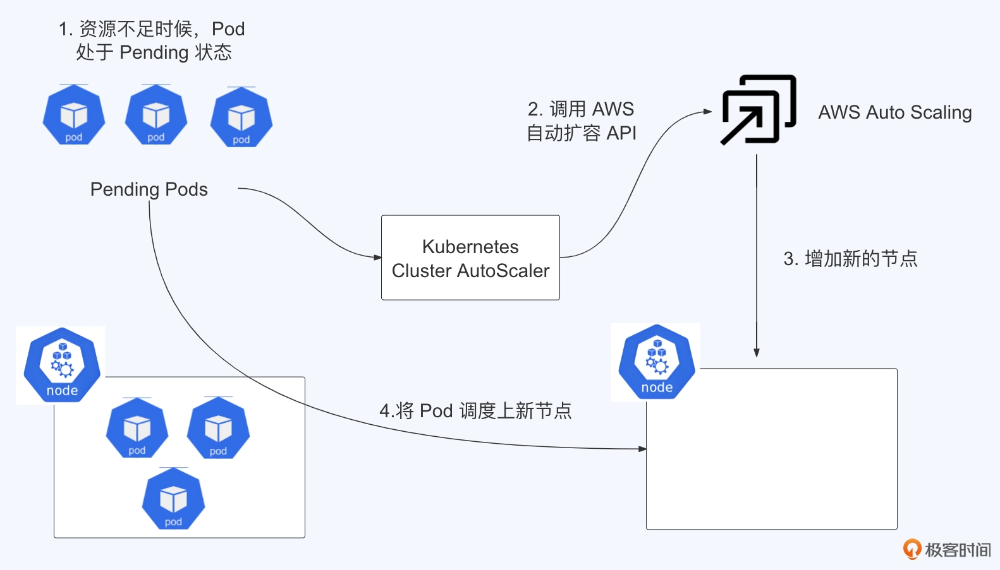
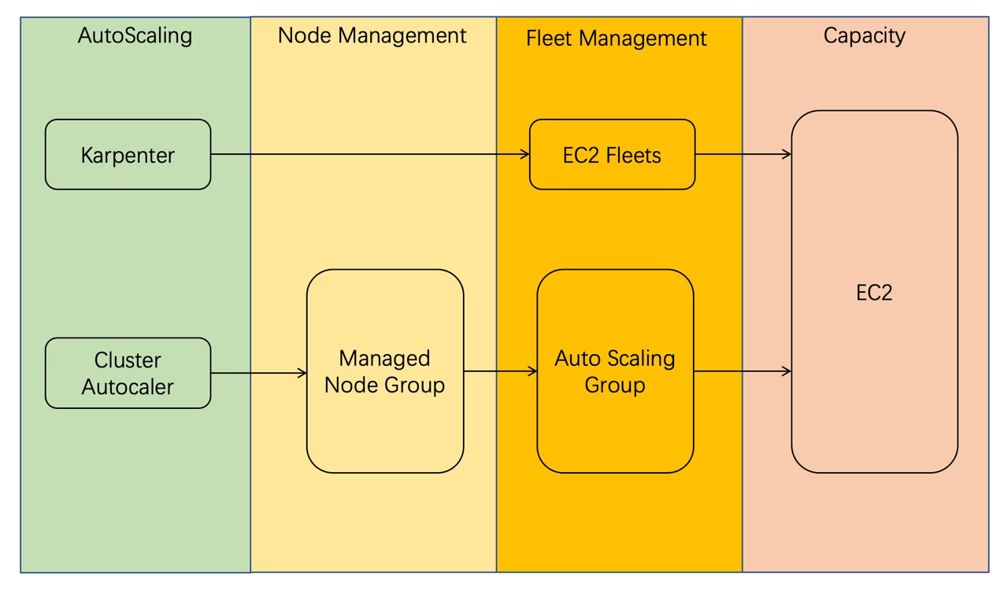
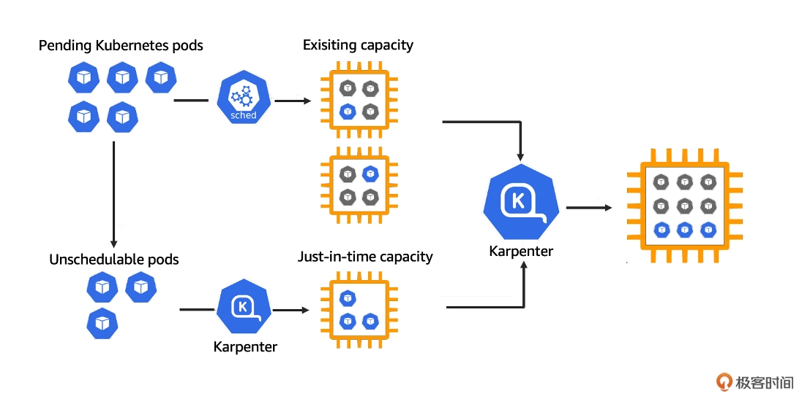

我们可以使用 Kubernetes 官方社区支持的集群自动扩缩容工具 Cluster Autoscaler，

它能根据 Pod 的资源需求和节点的资源可用情况自动扩缩容集群。除了 Kubernetes 社区主推的 Cluster Autoscaler 之外，云厂商也推出了自己的集群扩缩容工具来弥补 Cluster Autoscaler 中的一些不足，比如今天课程里将要重点学习的 AWS Karpenter

# Cluster Autoscaler

Kubernetes 集群伸缩一直是集群管理的重要课题之一，随着容器技术的普及和广泛应用，更需要我们找到高效伸缩集群的方式，来满足不断变化的负载需求。

Cluster Autoscaler 作为 Kubernetes 早期推出的集群伸缩工具，在简化集群管理方面发挥了重要作用。它通过监控集群资源利用率，自动增减节点以满足 Pod 需求，有效降低了运维成本并提高了资源利用率。

然而，随着 Kubernetes 生态系统的不断发展，垂直和水平两个维度的伸缩需求也日益凸显。为了简化运维操作并统一管理伸缩功能，Kubernetes 社区于 2021 年将 Cluster Autoscaler、VPA 和 Addon Resizer 整合为 Kubernetes Autoscaler。

虽然 Kubernetes Autoscaler 整合了三大自动扩缩容能力，但在实际使用场景中，Cluster Autoscaler 作为集群节点自动扩缩容的核心组件，重要性不言而喻。因此，接下来我们重点关注 Kubernetes Autoscaler 中的 Cluster Autoscaler。

# 原理

Cluster Autoscaler 能够定期监控集群中 Pod 的资源需求与节点的资源使用情况，主要应对以下两种情形。

1. 当集群中的 Pod 由于资源不足无法被调度时，Cluster Autoscaler 能够自动进行集群扩容。
2. 若集群中的节点长时间以低利用率运行，并且这些节点上的 Pod 可以迁移到其他现有节点，Cluster Autoscaler 就会通过 Kubernetes 接口把这些 Pod 驱逐其他机器上，并释放这些节点。

整个扩展过程分为四个步骤：

1. 因为资源不足，Pod 处于等待状态（Pending Pod）。在 Kubernetes 中，Pod 是最小的部署单元，这里显示的是因为节点（Node）上的资源不够，所以新的 Pod 无法启动，处于等待状态。
2. 增加 Auto Scaling Group 中的所需实例数量（Increase desired number of instances in one Auto Scaling Group）。这是在 AWS 的自动伸缩服务中进行的，用来响应资源不足的情况，提出要增加更多的实例。
3. 自动伸缩服务将创建新的节点（Provision new node）。在 AWS 中，根据预先设定的自动伸缩策略，会自动启动新的计算实例来扩展集群。
4. 调度 Pod 到新节点上（Schedule pod）。最后，Kubernetes 的调度器会将等待中的 Pod 调度到新加入的节点上，这样 Pod 就可以被成功部署并运行了。

整个流程是一个自动化的扩容机制，当 Kubernetes 集群中的资源不足时，可以自动利用云服务提供的自动伸缩功能来增加计算资源，这能保证集群的应用顺利运行。

那么在步骤 1 和步骤 2 之间，Cluster Autoscaler 会定期（默认间隔 10 秒）检测是否有足够的资源来调度新创建的 Pod。如果资源不足，Cluster Autoscaler 会调用云提供商 API 创建新的节点。现在 Cluster Autoscaler 支持非常多的公有云 API，具体支持情况你可以从[这里](https://github.com/kubernetes/autoscaler/tree/master/cluster-autoscaler)查找。

Cluster Autoscaler 不仅可以做扩容，也可以做缩容，Cluster Autoscaler 会定期（默认间隔 10 秒）自动监测节点的资源使用情况。如果一个节点长时间（超过 10 分钟，其期间没有执行任何的扩缩容操作）资源利用率都很低（低于 50%），Cluster Autoscaler 会自动将其所在虚拟机从云服务商中删除。(首先，确定需要缩容哪些节点，从历史的数据中找到资源利用率低于 50% 的机器。然后，准备将机器上的工作负载通过 kubectl drain 的方式来驱逐到其他的机器上。同时，Cluster Autoscaler 会查询当前节点上的 pod 是不是受到 Kubernetes PDB 控制，并计算出哪些节点可以被删除。最后，通过云服务商 API 删除这些节点)

当 Cluster Autoscaler 决定缩减节点数量时，运行在被缩减节点上的 Pod 会被驱逐。如果这些 Pod 没有适当地**终止宽限期**或 **PreStop**钩子，可能会导致应用程序的连接被突然中断，进而影响服务的稳定性。

不过，Kubernetes 为我们提供了一些机制来缓解这个问题，可以通过这么几种方式来保证应用的稳定性。

1. 通过设置 PodDisruptionBudget 来控制同一时间被驱逐的 Pod 数量上限。
2. 为 Pod 设置合理的终止宽限期，让应用有足够时间优雅退出。
3. 在 Pod 中配置 PreStop 钩子，让应用在被终止前，执行一些清理操作。
4. 为关键应用设置较高的 PriorityClass，降低它们被驱逐的优先级。

因此，虽然缩容可能会对应用造成一定影响，但只要我们合理配置 Kubernetes 的各项机制，就能最大程度降低这种影响，保证应用的平稳运行。为了实现这一目标，接下来我们将详细了解如何在 AWS 上配置 Cluster Autoscaler。通过这个配置帮我们优化资源管理，提高系统的整体效率

## 局限性
1. 它可能会有点慢。有时候 Cluster Autoscaler 需要一段时间才能察觉到 Pod 的资源需求有变化，然后才开始进行扩缩容操作。

2. 其次，如果我们配置不得当，Cluster Autoscaler 可能会导致资源浪费。这是因为它可能会过度地扩展资源，特别是在不需要那么多资源的时候。

3. 还有一个点是，Cluster Autoscaler 很依赖云服务商提供的功能，比如 AWS 的启动模板和自动扩展组。这就意味着，如果我们想要一些更加个性化的调度功能，Cluster Autoscaler 可能就不能满足需求了。

# 下一代自动扩缩容工具 Karpenter

## 优势

1. 首先，Karpenter 更灵活。下面这张图对比了 Karpenter 与现有的 Cluster Autoscaler 运行机制，结合图片理解更为直观。

和 Cluster Autoscaler 相比，Karpenter 不再使用 node group 来管理集群的 EC2 资源，而是直接调用 EC2 的接口获取资源。这种方式速度更快，灵活性更高。

2. 使用更简单。Cluster Autoscaler 需要去配置 Launch template 和 Auto Scaling group，并且整个配置过程需要在 Terraform 或者 UI 上完成，这导致节点的管理与 Kubernetes 集群容量管理分离，给我们带来额外的运维工作。而 Karpenter 因为是一个 Kubernetes 原生的 Controller，整个配置和管理过程都在 Kubernetes 中，维护配置就会更加方便

3. 更高的资源利用率。Karpenter 采用了 First Fit Descending 算法，它将 pod 按照从大到小排序，先将最大的 pod 去适配实例，如果不行就再换小一些的 pod。这个过程里，尝试的实例越来越小，直到将最小的 pod 找到合适的实例。这样做的好处是，大的 pod 经常会在实例上留下一些间隙，可以让后面的小 pod 填入，可以更有效地利用资源。

## Karpenter 的工作原理

简单来说 Karpenter 会监控集群中 Pod 的资源需求，一旦发现有不可调度的 pod，Karpenter 就会使用预先定义的模板创建新的节点，向底层 cloud providers 发送命令开始自动配置新节点，以响应不可调度的 pod。这些预先定义的模板可以根据不同的应用需求进行定制，比如说，我们可以指定节点的 CPU、内存、存储等资源规格。