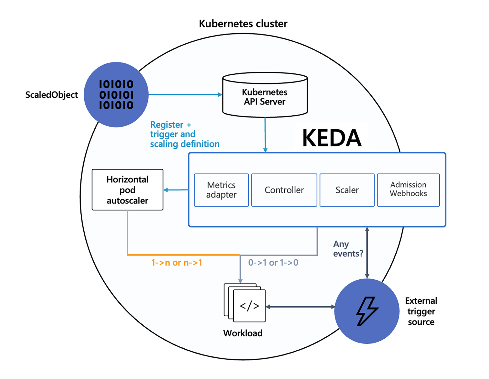
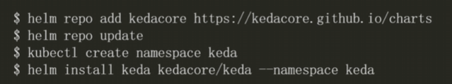
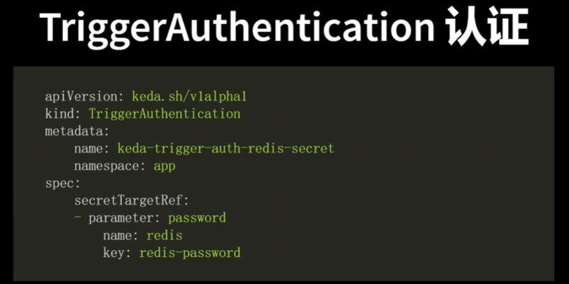
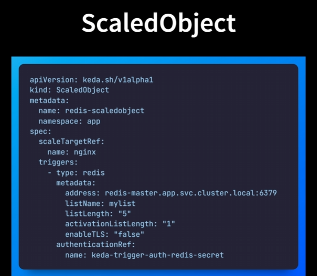
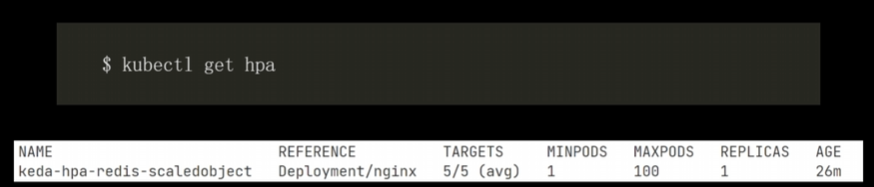
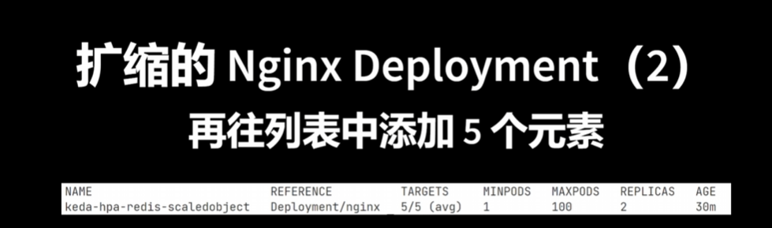
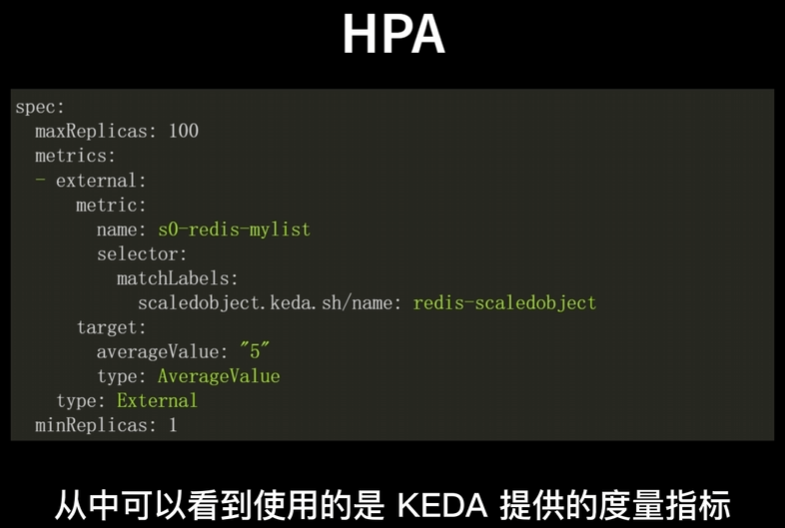

对于HPA和VPA，它的扩缩容都需要从其它地方进行一些指标信息的读取，而这些指标的信息又是定期采集的，因此每次进行扩缩容时总是出现慢半拍的延时问题。

如果要解决这个问题，我们可能需要一款基于事件驱动的扩容方案。

# 基于事件驱动的KEDA方案

1. CPU和内存的利用率
2. Metrics Server

keda根据事件扩缩，他有两个作用
1. 作为代理，激活或者停止Kubernetes上的Deployment （副本数0->1, 或者副本数1->0）
2. keda作为Metrics Server提供度量指标，这些指标可以被hpa来使用


keda架构图如下：


- External trigger source 事件源。支持多种事件源，例如 HTTP 请求、消息队列消息、数据库连接等。当事件源产生新的事件时，KEDA 会自动触发自动伸缩。

- ScaledObject（CRD）：用于定义自动伸缩的规则和目标。它可以用来定义触发器类型（例如 RabbitMQ、Kafka 等）、触发器元数据、最小和最大副本数等参数。即事件源与可扩所得资源之间的映射关系

- Scaler，接收事件并将其转换为 Kubernetes 可以理解的格式，然后根据 ScaledObject 定义的规则决定是否需要进行伸缩。作用（1）检测Deployment是否应该被激活（2）为特定的事件源提供度量指标。

KEDA有一系列的缩放器，既可以检测是否应该激活或停用部署，也可以为特定的事件源提供自定义度量。支持的常见缩放器有 ActiveMQ、Kafka、RabbitMQ、ETCD、MongoDB、MySQL、MSSQL、Redis、Prometheus、elasticsearch等，更多缩放器见 https://keda.sh/docs/2.14/concepts/#event-sources-and-scalers

- Metrics Adapter 是 KEDA 与 Kubernetes HPA（Horizontal Pod Autoscaler）之间的桥梁，用于将 Scaler 查询到的事件数量转化为 Kubernetes HPA 可以理解的度量值。

- 此外还包含Custom Resources (CRD)
(1) scaledobjects.keda.sh
表示 event sources（例如 Rabbit MQ）与 Kubernetes Deployment、StatefulSet 或 任何定义了 /scale 子资源的 Custom Resource 之间所需的映射。
```yaml
apiVersion: keda.sh/v1alpha1
kind: ScaledObject
metadata:
  name: {scaled-object-name}
  annotations:
    scaledobject.keda.sh/transfer-hpa-ownership: "true"     # Optional. Use to transfer an existing HPA ownership to this ScaledObject
    validations.keda.sh/hpa-ownership: "true"               # Optional. Use to disable HPA ownership validation on this ScaledObject
    autoscaling.keda.sh/paused: "true"                      # Optional. Use to pause autoscaling of objects explicitly
spec:
  scaleTargetRef:
    apiVersion:    {api-version-of-target-resource}         # Optional. Default: apps/v1
    kind:          {kind-of-target-resource}                # Optional. Default: Deployment
    name:          {name-of-target-resource}                # Mandatory. Must be in the same namespace as the ScaledObject
    envSourceContainerName: {container-name}                # Optional. Default: .spec.template.spec.containers[0]
  pollingInterval:  30                                      # Optional. Default: 30 seconds
  cooldownPeriod:   300                                     # Optional. Default: 300 seconds
  idleReplicaCount: 0                                       # Optional. Default: ignored, must be less than minReplicaCount
  minReplicaCount:  1                                       # Optional. Default: 0
  maxReplicaCount:  100                                     # Optional. Default: 100
  fallback:                                                 # Optional. Section to specify fallback options
    failureThreshold: 3                                     # Mandatory if fallback section is included
    replicas: 6                                             # Mandatory if fallback section is included
  advanced:                                                 # Optional. Section to specify advanced options
    restoreToOriginalReplicaCount: true/false               # Optional. Default: false
    horizontalPodAutoscalerConfig:                          # Optional. Section to specify HPA related options
      name: {name-of-hpa-resource}                          # Optional. Default: keda-hpa-{scaled-object-name}
      behavior:                                             # Optional. Use to modify HPA's scaling behavior
        scaleDown:
          stabilizationWindowSeconds: 300
          policies:
          - type: Percent
            value: 100
            periodSeconds: 15
  triggers:
  # {list of triggers to activate scaling of the target resource}
  # ref: https://keda.sh/docs/2.14/scalers/
```
(2) scaledjobs.keda.sh 
表示 event sources 和 Kubernetes Job 之间的映射。
```yaml
apiVersion: keda.sh/v1alpha1
kind: ScaledJob
metadata:
  name: {scaled-job-name}
  labels:
    my-label: {my-label-value}                # Optional. ScaledJob labels are applied to child Jobs
  annotations:
    autoscaling.keda.sh/paused: true          # Optional. Use to pause autoscaling of Jobs
    my-annotation: {my-annotation-value}      # Optional. ScaledJob annotations are applied to child Jobs
spec:
  jobTargetRef:
    parallelism: 1                            # [max number of desired pods](https://kubernetes.io/docs/concepts/workloads/controllers/job/#controlling-parallelism)
    completions: 1                            # [desired number of successfully finished pods](https://kubernetes.io/docs/concepts/workloads/controllers/job/#controlling-parallelism)
    activeDeadlineSeconds: 600                #  Specifies the duration in seconds relative to the startTime that the job may be active before the system tries to terminate it; value must be positive integer
    backoffLimit: 6                           # Specifies the number of retries before marking this job failed. Defaults to 6
    template:
      # describes the [job template](https://kubernetes.io/docs/concepts/workloads/controllers/job)
  pollingInterval: 30                         # Optional. Default: 30 seconds
  successfulJobsHistoryLimit: 5               # Optional. Default: 100. How many completed jobs should be kept.
  failedJobsHistoryLimit: 5                   # Optional. Default: 100. How many failed jobs should be kept.
  envSourceContainerName: {container-name}    # Optional. Default: .spec.JobTargetRef.template.spec.containers[0]
  minReplicaCount: 10                         # Optional. Default: 0
  maxReplicaCount: 100                        # Optional. Default: 100
  rolloutStrategy: gradual                    # Deprecated: Use rollout.strategy instead (see below).
  rollout:
    strategy: gradual                         # Optional. Default: default. Which Rollout Strategy KEDA will use.
    propagationPolicy: foreground             # Optional. Default: background. Kubernetes propagation policy for cleaning up existing jobs during rollout.
  scalingStrategy:
    strategy: "custom"                        # Optional. Default: default. Which Scaling Strategy to use. 
    customScalingQueueLengthDeduction: 1      # Optional. A parameter to optimize custom ScalingStrategy.
    customScalingRunningJobPercentage: "0.5"  # Optional. A parameter to optimize custom ScalingStrategy.
    pendingPodConditions:                     # Optional. A parameter to calculate pending job count per the specified pod conditions
      - "Ready"
      - "PodScheduled"
      - "AnyOtherCustomPodCondition"
    multipleScalersCalculation : "max" # Optional. Default: max. Specifies how to calculate the target metrics when multiple scalers are defined.
  triggers:
  # {list of triggers to create jobs} 
  # ref: https://keda.sh/docs/2.14/scalers/
```
(3)(4) triggerauthentications.keda.sh\clustertriggerauthentications.keda.sh 事件源的认证信息
ScaledObject/ScaledJob 通过引用 TriggerAuthentication 或 ClusterTriggerAuthentication，其中包含用于监视事件源的身份验证配置或 secret。
```yaml
apiVersion: v1
kind: Secret
metadata:
  name: {secret-name}
data:
  {secret-key-name}: YW1xcDovL3VzZXI6UEFTU1dPUkRAcmFiYml0bXEuZGVmYXVsdC5zdmMuY2x1c3Rlci5sb2NhbDo1Njcy #base64 encoded per secret spec
---
apiVersion: apps/v1
kind: Deployment
metadata:
  name: {deployment-name}
  namespace: default
  labels:
    app: {deployment-name}
spec:
  selector:
    matchLabels:
      app: {deployment-name}
  template:
    metadata:
      labels:
        app: {deployment-name}
    spec:
      containers:
      - name: {deployment-name}
        image: {container-image}
        envFrom:
        - secretRef:
            name: {secret-name}
---
apiVersion: keda.sh/v1alpha1
kind: ScaledObject
metadata:
  name: {scaled-object-name}
  namespace: default
spec:
  scaleTargetRef:
    name: {deployment-name}
  triggers:
  - type: rabbitmq
    metadata:
      queueName: hello
      host: {secret-key-name}
      queueLength  : '5'
```
上面 ScaledObject 使用的 event sources 为 rabbitmq，并指定了queueName、host 和 queueLength。

但这种用法存在一些缺点，见 https://keda.sh/docs/2.14/concepts/authentication/#the-downsides

出于这些原因和其他原因，我们还提供了一个 TriggerAuthentication 资源，用于将身份验证定义为 ScaledObject 。这允许您直接引用密钥、配置为使用 Pod 身份或使用由其他团队管理的身份验证对象。

TriggerAuthentication 允许您描述独立 ScaledObject 于部署容器的身份验证参数。它还支持更高级的身份验证方法，例如“pod 身份”、身份验证重用或允许 IT 配置身份验证。

```yaml
apiVersion: keda.sh/v1alpha1
kind: TriggerAuthentication
metadata:
  name: {trigger-authentication-name}
  namespace: default # must be same namespace as the ScaledObject
spec:
  podIdentity:
      provider: none | azure | azure-workload | aws | aws-eks | aws-kiam | gcp  # Optional. Default: none
      identityId: <identity-id>                                           # Optional. Only used by azure & azure-workload providers.
      roleArn: <role-arn>                                                 # Optional. Only used by aws provider.
      identityOwner: keda|workload                                        # Optional. Only used by aws provider.
  secretTargetRef:                                                        # Optional.
  - parameter: {scaledObject-parameter-name}                              # Required.
    name: {secret-name}                                                   # Required.
    key: {secret-key-name}                                                # Required.
  env:                                                                    # Optional.
  - parameter: {scaledObject-parameter-name}                              # Required.
    name: {env-name}                                                      # Required.
    containerName: {container-name}                                       # Optional. Default: scaleTargetRef.envSourceContainerName of ScaledObject
  hashiCorpVault:                                                         # Optional.
    address: {hashicorp-vault-address}                                    # Required.
    namespace: {hashicorp-vault-namespace}                                # Optional. Default is root namespace. Useful for Vault Enterprise
    authentication: token | kubernetes                                    # Required.
    role: {hashicorp-vault-role}                                          # Optional.
    mount: {hashicorp-vault-mount}                                        # Optional.
    credential:                                                           # Optional.
      token: {hashicorp-vault-token}                                      # Optional.
      serviceAccount: {path-to-service-account-file}                      # Optional.
    secrets:                                                              # Required.
    - parameter: {scaledObject-parameter-name}                            # Required.
      key: {hashicorp-vault-secret-key-name}                               # Required.
      path: {hashicorp-vault-secret-path}                                  # Required.
  azureKeyVault:                                                          # Optional.
    vaultUri: {key-vault-address}                                         # Required.
    podIdentity:                                                          # Optional. Required when using pod identity.
      provider: azure | azure-workload                                    # Required.
      identityId: <identity-id>                                           # Optional
    credentials:                                                          # Optional. Required when not using pod identity.
      clientId: {azure-ad-client-id}                                      # Required.
      clientSecret:                                                       # Required.
        valueFrom:                                                        # Required.
          secretKeyRef:                                                   # Required.
            name: {k8s-secret-with-azure-ad-secret}                       # Required.
            key: {key-within-the-secret}                                  # Required.
      tenantId: {azure-ad-tenant-id}                                      # Required.
    cloud:                                                                # Optional.
      type: AzurePublicCloud | AzureUSGovernmentCloud | AzureChinaCloud | AzureGermanCloud | Private # Required.
      keyVaultResourceURL: {key-vault-resource-url-for-cloud}             # Required when type = Private.
      activeDirectoryEndpoint: {active-directory-endpoint-for-cloud}      # Required when type = Private.
    secrets:                                                              # Required.
    - parameter: {param-name-used-for-auth}                               # Required.
      name: {key-vault-secret-name}                                       # Required.
      version: {key-vault-secret-version}                                 # Optional.
  awsSecretManager:
    podIdentity:                                                          # Optional.
      provider: aws                                                       # Required.
    credentials:                                                          # Optional.
      accessKey:                                                          # Required.
        valueFrom:                                                        # Required.
          secretKeyRef:                                                   # Required.
            name: {k8s-secret-with-aws-credentials}                       # Required.
            key: AWS_ACCESS_KEY_ID                                        # Required.
      accessSecretKey:                                                    # Required.
        valueFrom:                                                        # Required.
          secretKeyRef:                                                   # Required.
            name: {k8s-secret-with-aws-credentials}                       # Required.
            key: AWS_SECRET_ACCESS_KEY                                    # Required.
    region: {aws-region}                                                  # Optional.
    secrets:                                                              # Required.
    - parameter: {param-name-used-for-auth}                               # Required.
      name: {aws-secret-name}                                             # Required.
      version: {aws-secret-version}                                       # Optional.
  gcpSecretManager:                                                       # Optional.
    secrets:                                                              # Required.
      - parameter: {param-name-used-for-auth}                             # Required.
        id: {secret-manager-secret-name}                                  # Required.
        version: {secret-manager-secret-name}                             # Optional.
    podIdentity:                                                          # Optional.
      provider: gcp                                                       # Required.
    credentials:                                                          # Optional.
      clientSecret:                                                       # Required.
        valueFrom:                                                        # Required.
          secretKeyRef:                                                   # Required.
            name: {k8s-secret-with-gcp-iam-sa-secret}                     # Required.
            key: {key-within-the-secret} 
```

扩缩的过程：
- KEDA：负责0->1, 1->0
- HorizontalPodAutoscaler: 1->N, N->1

举例：一个应用接收Kafka主题中的消息并进行处理，当没有消息可以处理时，KEDA可以停止应用的Deployment。或者消息由0变有时，可以激活Deployment


# 使用举例
1. 安装



2. 场景说明
自动扩缩的场景是，根据redis中列表的长度，来对nginx的Deployment进行扩缩

3. 认证
因为redis服务需要认证，首先创建一个TriggerAuthentication.声明从Kubernetes的secret中获取redis密码


4. 创建一个ScaledObject资源
 

scaleTargetRef表示扩缩的目标，是deployment的名称（nginx）
triggers 表示扩缩的触发条件：
类型是redis，
metadata中制定了元数据
  address：redis的地址
  listName：列表的名称
  listLength：触发扩缩的列表长度
  activationListLength：激活Deployment的列表的长度
  authenticationRef：引用上一步创建的TriggerAuthentication资源

观察：这时候发现redis的Deployment的副本数变成了0， 这是因为activationListLength为1

5. 使用redis cli往redis的mylist中添加5个元素，通过kubectl get hpa


发现副本数变为1

再添加五个元素之后

发现副本数变为2


6. 查看由keta创建hpa的内容，发现hpa使用的是keda提供的度量指标



