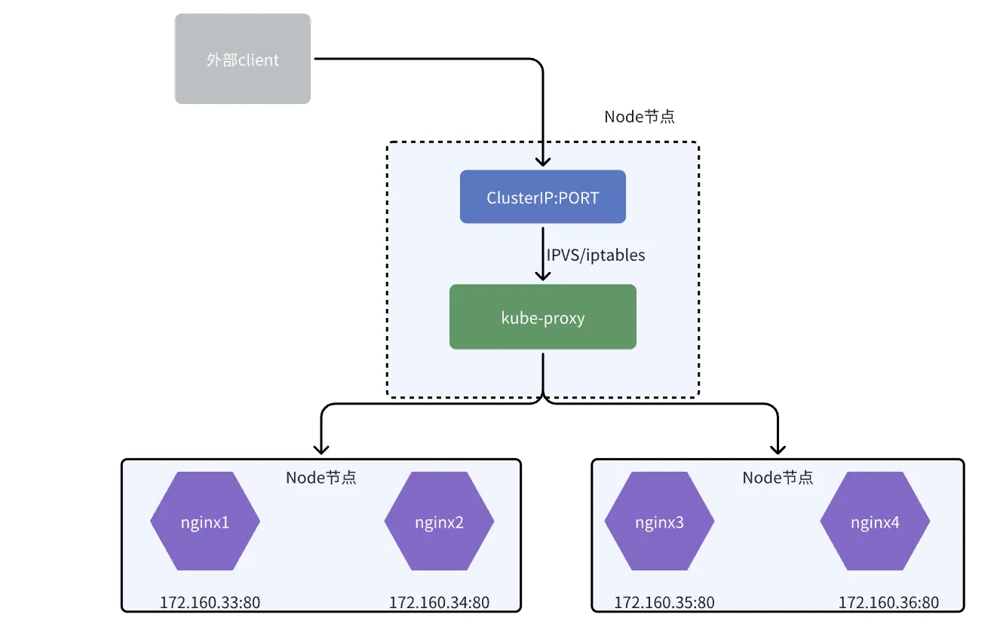

# 通过DNS

kube-proxy 是集群中每个节点上运行的网络代理，它负责将集群内部的Service暴露给其他Pod或外部网络。它通过在Node节点上设置网络规则和转发规则，将Service的请求转发到正确的目标Pod

同时kube-proxy实现负载均衡算法，将进入Service的请求均匀地分发到后端的Pod实例。这确保了在多个副本的情况下，Service能够平衡地处理请求，提高可用性和性能。

kube-proxy 通过监听知道了Service、endpoints对象的创建，然后把Service的CLUSTER-IP 和端口信息拿出来，创建iptables NAT规则做转发或通过ipvs模块创建VS服务器，这样经过CLUSTER-IP的流量都被转发到后端pod。



# 通过环境变量

在 Node 上新创建一个 Pod 时，kubelet 会为每个 Pod（容器）添加一组环境变量，其中就包括当前系统中已经存在的 Service 的 IP 地址和端口号。

环境变量格式，例如：

```sh
{SVCNAME}_SERVICE_HOST=host
{SVCNAME}_SERVICE_PORT=port
```

1. 集群规模大的时候环境变量很多，甚至可能超过容器限制

2. 如果先创建 Pods 后创建 Service，那么后创建的 Service 环境变量不会存在于先创建的 Pods 中。

# Headless Service

Headless Service 翻译过来就是“无头服务”，它表示的是创建的 Service 没有设置 Cluster IP。

它的创建非常简单，只需要设置 service.spec.clusterIP=None 即可。

它属于一种特殊类型的集群服务，通常应用于以下两种情况中：

1. 自定义负载均衡策略，即：不使用 Service 默认的负载均衡策略（默认的策略是通过服务转发连接到符合要求的任一一个 Pod 上）。
获取属于相同标签选择器下的所有 Pod 列表。

2. 所以通过 Headless Service 可以获取到所有符合相关要求的 Pod 列表，然后可以通过自定义负载均衡器让客户端的连接转发到一个、多个、或是所有的 Pod 上，典型的应用就是：StatefulSet。

Headless Service 的特点如下：

- 在集群内部没有一个特定的 Cluster IP 地址
- kube-proxy 不会处理 Headless Service
- 没有负载均衡和路由功能
- 根据服务是否有标签选择器进行 DNS 配置

# 无 Selector 的服务

它也属于一种特殊类型的集群服务。在上一节我们提到过如果没有标签选择器，就不会有 Endpoints 记录。但是可以创建 Endpoints 对象，在 Endpoints 对象中手动指定需要映射到的 IP 地址和端口号。

虽然 Service 服务通常都会被用来代理对于 Pod 的访问，但是也可以代理其它的后端类型，只要我们自定义 Endpoints 记录就可以了。这些情况通常包括：

1. 一个集群在不同场景下使用不同的数据库。比如在生产环境中使用外部数据库，而在测试环境中使用集群内的数据库；
2. 服务被其它命名空间或是其它集群上的服务调用；
3. 当迁移应用时，一些后端在集群内部运行，一些后端在集群外部运行。

需要注意的是：如果只定义一个没有标签选择器的服务，那么创建的服务在集群内有 VIP，只是没有 Endpoints 而已。

## 举例

1. 新建无Selector的服务如下
```yaml
apiVersion: v1
kind: Service
metadata:
  name: no-selector-svc
spec:
  ports:
    - protocol: TCP
      port: 80 # 指定 ClusterIP 对应的端口为 80
      targetPort: 9376 # 指定对应 Pod 的端口为 9376
```
2. 执行创建

```sh
$ kubectl create -f no-selector-svc.yaml
service/no-selector-svc created
# 定义的 no-selector-svc 依然是有 ClusterIP 的，为：10.100.179.62
$ kubectl get svc
NAME              TYPE        CLUSTER-IP      EXTERNAL-IP   PORT(S)   AGE
kubernetes        ClusterIP   10.96.0.1       <none>        443/TCP   87d
no-selector-svc   ClusterIP   10.100.179.62   <none>        80/TCP    22s
```

3. 下新建 test-endpoints.yaml 文件

```yaml
apiVersion: v1
kind: Endpoints
metadata:
  name: no-selector-svc # 这里的名称一定要与需要绑定的 Service 相同
subsets:
  - addresses:
      - ip: 192.0.2.42 # Endpoints 需要映射到的 IP 地址
    ports:
      - port: 9376 # Endpoints 映射的 IP 地址对应的端口号
```

4. 执行创建
```sh
$ kubectl create -f test-endpoints.yaml
endpoints/no-selector-svc created
```

5. 创建Endpoints
```sh
# 可以发现自定义的与 no-selector-svc 服务相关联的 Endpoints 映射已经建立好了
$ kubectl get endpoints
NAME              ENDPOINTS         AGE
kubernetes        10.192.0.2:6443   87d
no-selector-svc   192.0.2.42:9376   24s
```


