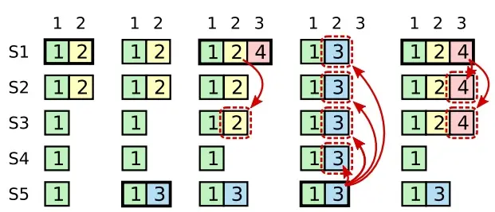
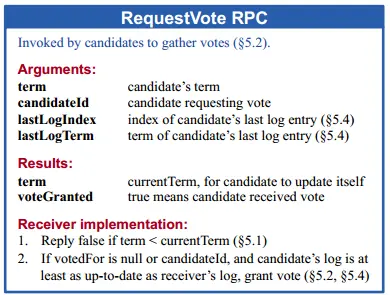

# 安全性的定义
如果有任何的服务器节点已经应用了一个确定的日志条目到它的状态机中，那么其他服务器节点不能在同一个日志索引位置应用一个不同的指令

# 矛盾抛出



# 过程描述

以下几（1、2、3、4、5）条对应图1中的5块

1. 在term1过后，进入term2，S1经过投票选举为了leader，复制client传来的任期2的entries。

2. 此时{index:2,term:2}只复制到了S2，S1就崩掉了，此时S5上位（S3、S4、S5三票），此时term为3，收到了来自client的请求。

3. 过了一会处于term3的leader（S5）崩掉了，S1在恢复后，重新成为leader(term4)，收到client的新请求（index：3，term：4），复制过去{term：2，index：2}的entry到S3，此时按照过去的committed标准（只要存在大多数副本的日志里），index为2的这条entry被认为可提交，当要提交时，S1崩溃了。（备注，可能是leader已提交，反馈客户端成功，follower未提交）

3. S5当选leader（备注，可能是term5，这里注意区分节点任期和日志entry的任期记录），进行{term:3,index:2}的复制，此时进行日志校验，发现只有index：1一致，于是从此之后的{term:2,index:2}被覆盖为{term:3,index:2}


# 完善之前的Raft协议
上述问题的原因是：新的领导人不知道过去老的日志条目是否是已提交的状态，而被覆盖后，导致状态机不一致的情况。

那么我们希望新的领导人也都知道之前已提交过的条目！

## 选举限制
之前的选举方案：candidate通过在一个随机的election_timeout中，获取大多数的票数成为leader。加上限制：成为领导人的候选者存在的log是最"新"的，那么它最有可能包含所有提交的日志条目。



- lastLogIndex 候选人的最后日志条目的索引值
- lastLogTerm 候选人最后日志条目的任期号

具体的做法是：投票选举阶段，candidate A向节点B发送了投票请求，如果B觉得A不够"新"，则拒绝！(这里讨论的情景是 term>= currentTerm)。拒绝条件是

```if(A.lastLogTerm<B.lastLogTerm || A.lastLogTerm == B.lastLogTerm && A.lastLogIndex< B.lastLogIndex)```

## 推迟提交

上面只是假设S1是在复制了当前任期的log entries到大部分server之后崩溃的情况，选举限制使得S5无法当选leader（图5，S1在term4复制到了S2、S3后崩溃，阻止了S5成为term5的leader）

回归最初的场景，如图1的第三块，S1在term4是leader，它复制了{term:2,index:2}给S3后，此时{term:2,index:2}可以被认为comitted，根据我们修改后的选举限制，在S1崩溃后，进入term5，将是S5当选leader（最后一项是任期3，最大），那么依旧会如图的第四块所发生的一样，覆盖了曾经认为可提交的entry，导致了状态机持久化不一致，这是不安全的。

问题依旧存在，让我们看看之前是如何定义提交：领导人知道一条当前任期内的日志记录是可以被提交的，只要它被存储到了大多数的服务器上

> As described in Section 5.3, a leader knows that an entry from its current term is committed once that entry isstored on a majority of the servers. If a leader crashes before committing an entry, future leaders will attempt tofinish replicating the entry. However, a leader cannot immediately conclude that an entry from a previous term is committed once it is stored on a majority of servers. Figure 8 illustrates a situation where an old log entry is stored on a majority of servers, yet can still be overwritten by a future lead
如同 5.3 节介绍的那样，领导人知道一条当前任期内的日志记录是可以被提交的，只要它被存储到了大多数的服务器上。如果一个领导人在提交日志条目之前崩溃了，未来后续的领导人会继续尝试复制这条日志记录。然而，一个领导人不能断定一个之前任期里的日志条目被保存到大多数服务器上的时候就一定已经提交了。图 8 展示了一种情况，一条已经被存储到大多数节点上的老日志条目，也依然有可能会被未来的领导人覆盖掉。

推迟提交：Raft 永远不会通过计算副本数目的方式去提交一个之前任期内的日志条目。只有领导人当前任期里的日志条目通过计算副本数目可以被提交

- 存储在大部分server里
- 至少存在一个最新term的log entry也同时被存储在大部分server里

还是回到图1，第三块：S1在任期4里复制任期2的老日志给S3，这时候作为leader的它知道{term:2,index:2}此条日志条目存在大多数服务器，按照我们最新修改后的延迟提交策略，只有领导人当前任期里的日志条目通过计算副本数目可以被提交，此时在任期4里，这项任期2的老日志为不可提交，那么崩溃后term5，由S5成为leader覆盖掉非committed状态的日志，属于安全操作。

结合选举限制和延迟提交来重新看一下这个情景
如图1第5块：假如S1在term4复制了大量的{term:4,index:3}（S2、S3），此时term4的leader可以认为{term:4,index:3}可提交，{term:2,index:2}也是可提交的（延迟提交），S1崩溃后，S5也无法成为选举人，这样也就无法覆盖掉可提交的日志了，leader只会在S2、S3中选出。

