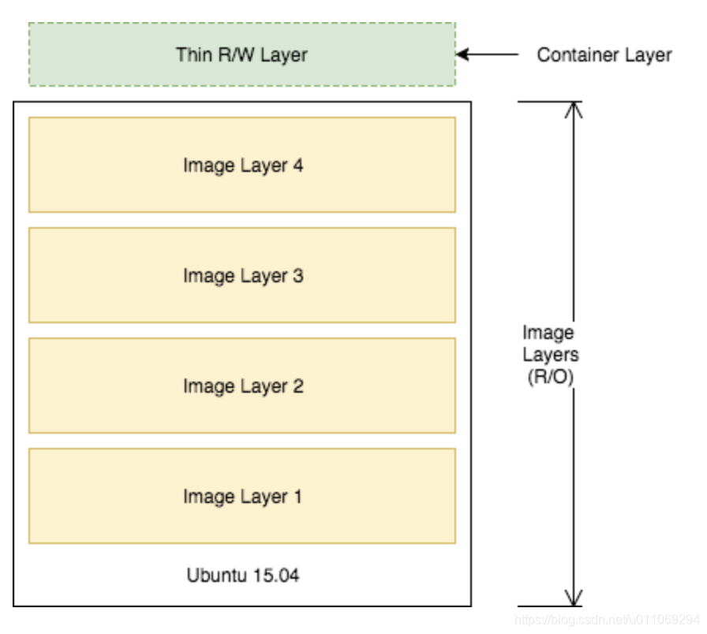
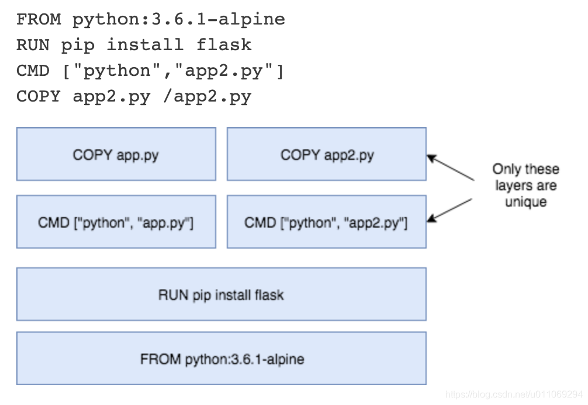

# 示例

```sh
对于镜像layer的理解
FROM python:3.6.1-alpine
RUN pip install flask
CMD [“python”,“app.py”]
COPY app.py /app.py
```

上面是一个Dockerfile的例子，每一行都会生成一个新的layer。 每一个层是上一层的增量或者是一些改变。

除了最上面的layer，镜像的每一层都是只读的。最上面的layer是为container创建的，是可读可写的，用来实现“copy-on-write"，意思就是仅当对一些位于只读层的文件需要被编辑时，存储在较低layer层中的文件就会被拉到读/写容器层（最上面的一层），然后将那些更改存储在容器层中。



可以使用docker diff查看哪些文件被拉到了容器层。参考文档：https://docs.docker.com/engine/reference/commandline/diff/

由于有些layer层是只读的，因此这些只读的layer可以被image和运行容器共享。 例如，使用自己的Dockerfile创建具有相似基础层的新Python应用程序，将共享与第一个Python应用程序相同的所有层。


