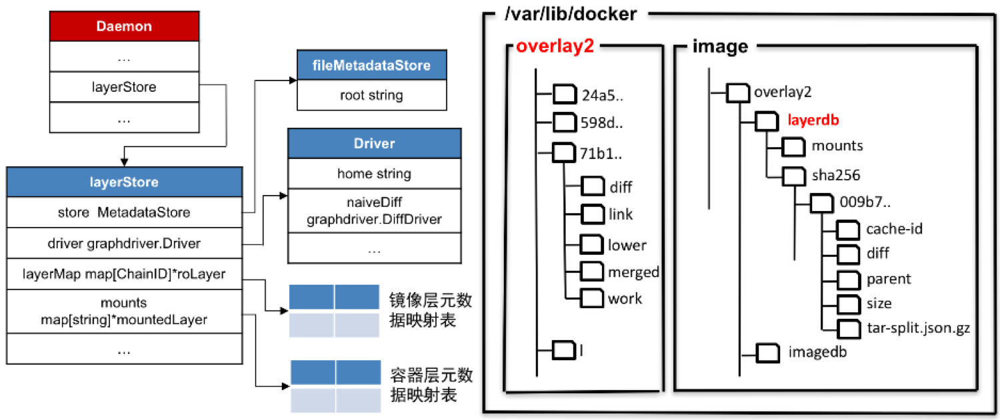

Docker镜像由多层只读镜像层组成，Docker容器实际上就是创建了一层读写层，然后将这层读写层与使用的镜像关联起来。所以实际上镜像和容器在Docker中都是通过“层”来进行存储，每一层对应一个目录，Docker层存储就是用来管理这些“层”以及这些层的元数据

Docker层存储主要包括存储驱动、层的元数据存储以及层的元数据映射表3个部分。在Docker源码中，关系如下如：



层的内容存储于/var/lib/docker/driver_name目录中，由存储驱动管理

层的元素据存储于/var/lib/docker/image/driver_name/layerdb目录中，由层的元数据存储管理

# 主要结构

Docker层存储在源码中使用一个layerStore结构来表示。store字段表示层的元数据存储，driver字段表示具体的存储驱动

存储驱动用一个Driver结构来表示，它实现了graphdriver.Driver接口。Docker支持overlay2，overlay，aufs等多种驱动，我们这里使用overlay2作为存储驱动，因此这个Driver就是overlay2定义的Driver结构。存储驱动管理层的具体内容

层的元数据存储则使用了名为fileMetadataStore的结构来表示，它实现了MetadataStore接口。层的元数据存储管理层的元数据

容器层的元数据通过一个mountedLayer结构来记录，镜像层的元数据则是通过一个roLayer结构来记录。

> 目录说明
> - Docker目录：/var/lib/docker
> - 存储驱动目录：/var/lib/docker/overlay2
> - 层的元数据存储目录：/var/lib/docker/image/overlay2/layerdb

```go
func NewDaemon(ctx context.Context, config *config.Config, pluginStore *plugin.Store) (daemon *Daemon, err error) {
	setDefaultMtu(config) {

    // 对于linux， operatingSystem=linux
    for operatingSystem, gd := range d.graphDrivers {
		layerStores[operatingSystem], err = layer.NewStoreFromOptions(layer.StoreOptions{
			Root:                      config.Root, // Linux下一般是 /var/lib/docker
			MetadataStorePathTemplate: filepath.Join(config.Root, "image", "%s", "layerdb"),
			GraphDriver:               gd,
			GraphDriverOptions:        config.GraphOptions,
			IDMapping:                 idMapping,
			PluginGetter:              d.PluginStore,
			ExperimentalEnabled:       config.Experimental,
			OS:                        operatingSystem,
		})
		if err != nil {
			return nil, err
		}
    }
```


## 创建Docker层存储

```go
type StoreOptions struct {
	Root                      string //存储路径：/var/lib/docker
	MetadataStorePathTemplate string //元数据存储路径模板：/var/lib/docker/image/%s/layerdb
	GraphDriver               string //存储驱动：overlay2、overlay、aufs、devicemmapper...
	GraphDriverOptions        []string
	IDMapping                 *idtools.IdentityMapping
	PluginGetter              plugingetter.PluginGetter
	ExperimentalEnabled       bool
	OS                        string
}
```


```go

// NewStoreFromOptions creates a new Store instance
func NewStoreFromOptions(options StoreOptions) (Store, error) {
	//1. 创建存储驱动
	driver, err := graphdriver.New(options.GraphDriver, options.PluginGetter, graphdriver.Options{
		Root:                options.Root, // /var/lib/docker
		DriverOptions:       options.GraphDriverOptions,
		UIDMaps:             options.IDMapping.UIDs(),
		GIDMaps:             options.IDMapping.GIDs(),
		ExperimentalEnabled: options.ExperimentalEnabled,
	})
	if err != nil {
		return nil, fmt.Errorf("error initializing graphdriver: %v", err)
	}
	logrus.Debugf("Initialized graph driver %s", driver)

    //2.根据元数据存储路径模板字符串和步骤1创建的存储驱动来创建层的元数据存储（路径）
	// options.MetadataStorePathTemplate:/var/lib/docker/image/%s/layerdb
	// 如果driver是overlay2，那么层的元数据路径
	root := fmt.Sprintf(options.MetadataStorePathTemplate, driver)

	// 创建层存储
	return newStoreFromGraphDriver(root, driver, options.OS)
}
```


```go
// newStoreFromGraphDriver creates a new Store instance using the provided
// metadata store and graph driver. The metadata store will be used to restore
// the Store.
func newStoreFromGraphDriver(root string, driver graphdriver.Driver, os string) (Store, error) {
	if !system.IsOSSupported(os) {
		return nil, fmt.Errorf("failed to initialize layer store as operating system '%s' is not supported", os)
	}

	//go语言中的断言，如果存储驱动能转还成一个
	//graphdriver.CapabilityDriver,则更新caps
	//caps主要用于设置层存储结构的useTarSplit字段
	caps := graphdriver.Capabilities{}
	if capDriver, ok := driver.(graphdriver.CapabilityDriver); ok {
		caps = capDriver.Capabilities()
	}

	ms, err := newFSMetadataStore(root)
	if err != nil {
		return nil, err
	}

	// 构造层的存储结构
	ls := &layerStore{
		store:       ms,     // 层的元数据存储
		driver:      driver, // 存储驱动
		layerMap:    map[ChainID]*roLayer{},     // 只读层映射表
		mounts:      map[string]*mountedLayer{}, // 读写层映射表
		locker:      locker.New(),
		useTarSplit: !caps.ReproducesExactDiffs,
		os:          os,
	}

    // 2.到元数据根目录/var/lib/docker/image/overlay2/layerdb下读取：
	// 1）目录sha256：这个目录下存储了镜像层的元数据
	// 2）目录mounts：这个目录下存储了容器层的元数据
	// 对于镜像层，返回一个字符串数组ids，字符串形式为"sha256:目录名"
	// 对于容器层，返回一个字符串数组mounts，字符串形式为”目录名“
	ids, mounts, err := ms.List()
	if err != nil {
		return nil, err
	}

	for _, id := range ids {
		l, err := ls.loadLayer(id)
		if err != nil {
			logrus.Debugf("Failed to load layer %s: %s", id, err)
			continue
		}
		if l.parent != nil {
			l.parent.referenceCount++
		}
	}

	for _, mount := range mounts {
		if err := ls.loadMount(mount); err != nil {
			logrus.Debugf("Failed to load mount %s: %s", mount, err)
		}
	}

	return ls, nil
}
```


# 加载镜像层元数据
每层镜像层的元数据通过一个roLayer结构来记录，加载元数据就是到每个镜像层的元数据目录下读取镜像层的元数据文件，然后构造一个roLayer结构，并将镜像层的元数据添加到层存储的镜像层元数据映射表中，由函数loadLayer()完成：

```go
func (ls *layerStore) loadLayer(layer ChainID) (*roLayer, error) {
	//1.如果镜像层元数据映射表中已经存在，则直接获取并返回
	cl, ok := ls.layerMap[layer]
	if ok {
		return cl, nil
	}

	/*
	   2.对layer:shaXX:ID
	   到目录/var/lib/docker/image/overlay2/layerdb/shaXX/ID/下读取
	   diff,size,parent,cache-id等文件
	   读取操作需要用到层的元数据存储结构实现的一系列操作来完成
	*/
	diff, err := ls.store.GetDiffID(layer)
	if err != nil {
		return nil, fmt.Errorf("failed to get diff id for %s: %s", layer, err)
	}

	size, err := ls.store.GetSize(layer)
	if err != nil {
		return nil, fmt.Errorf("failed to get size for %s: %s", layer, err)
	}

	cacheID, err := ls.store.GetCacheID(layer)
	if err != nil {
		return nil, fmt.Errorf("failed to get cache id for %s: %s", layer, err)
	}

	parent, err := ls.store.GetParent(layer)
	if err != nil {
		return nil, fmt.Errorf("failed to get parent for %s: %s", layer, err)
	}

	descriptor, err := ls.store.GetDescriptor(layer)
	if err != nil {
		return nil, fmt.Errorf("failed to get descriptor for %s: %s", layer, err)
	}

	//3.构造镜像层元数据对象
	cl = &roLayer{
		chainID:    layer,   //shaXX:该层在元数据目录下对应的目录名
		diffID:     diff,    //digest ID
		size:       size,    //层的大小
		cacheID:    cacheID, //存储驱动目录下该层镜像层的目录名(缓存ID)
		layerStore: ls,      //指向层存储
		references: map[Layer]struct{}{},
		descriptor: descriptor,
	}

	//如果存在父层，则继续加载父层
	if parent != "" {
		p, err := ls.loadLayer(parent)
		if err != nil {
			return nil, err
		}
		//设置元数据的parent字段
		cl.parent = p
	}

	//4.将该层镜像层元数据添加到 层存储的镜像层元数据映射表中
	ls.layerMap[cl.chainID] = cl

	return cl, nil
```

# 加载容器层元数据

每层容器层的元数据通过一个mountedLayer结构来记录，加载容器层元数据就是到每个容器层的元数据目录下读取容器层的元数据文件，然后构造一个mountedLayer结构，并将容器层的元数据添加到层存储的容器层元数据映射表中，由函数loadMount()完成：

```go
func (ls *layerStore) loadMount(mount string) error {
	//1.如果容器层元数据映射表中已经存在，则直接获取并返回
	if _, ok := ls.mounts[mount]; ok {
		return nil
	}

	/*
	   2.对mount:ID
	   到目录/var/lib/docker/image/overlay2/layerdb/mounts/ID/下读取
	   init-id,mount-id,parent等文件
	   读取操作需要用到层的元数据存储结构实现的一系列操作来完成
	*/

	mountID, err := ls.store.GetMountID(mount)
	if err != nil {
		return err
	}

	initID, err := ls.store.GetInitID(mount)
	if err != nil {
		return err
	}

	parent, err := ls.store.GetMountParent(mount)
	if err != nil {
		return err
	}

	//3.构造容器层元数据对象
	ml := &mountedLayer{
		name:       mount,
		mountID:    mountID,
		initID:     initID,
		layerStore: ls,
		references: map[RWLayer]*referencedRWLayer{},
	}

	//如果存在父层，则继续加载父层
	if parent != "" {
		p, err := ls.loadLayer(parent)
		if err != nil {
			return err
		}
		ml.parent = p

		p.referenceCount++
	}

	//4.将该层容器层元数据添加到 层存储的容器层元数据映射表中
	ls.mounts[ml.name] = ml

	return nil
}
```