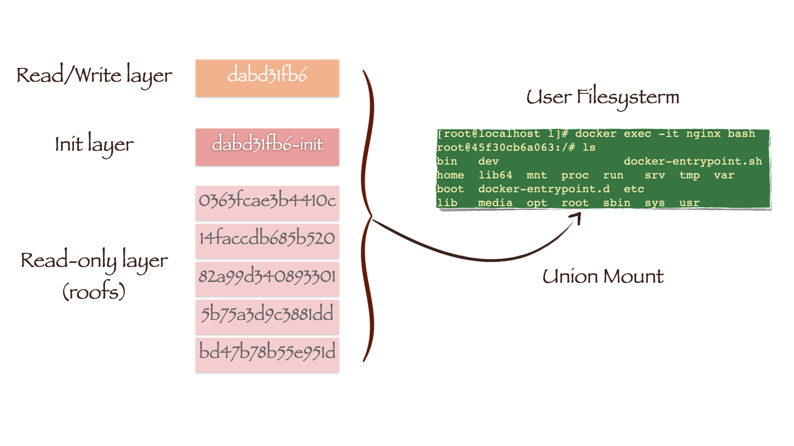

# /var/lib/docker/image/overlay2 目录
## distribution 目录
- diffid-by-digest 保存了digest(layerID)->diffID的映射关系
- v2metadata-by-diffid 保存了diffid -> (digest,repository)的映射关系
- digest(layerID) 就是 pull 镜像时的 hash ID，拉取是 镜像层文件是压缩文件，压缩态
- diffid 是 docker inspect 查看到的 镜像层 hash ID，此时 镜像层文件是解压缩的，解压缩态
- 因此虽说这两种 ID 都表示 镜像层 hash ID，但一个是压缩的，一个是解压缩的，所以 hash 运算后不一致
## imagedb 目录
- 保存镜像的元数据信息
- 两个子文件夹 content/ 和 metadata/
1) tree /var/lib/docker/image/overlay2/imagedb 可以查看此目录的结构
- 打开content/sha256目录下以镜像ID命名的文件，我们可以看到镜像的元数据信息，包括了镜像架构、操作系统 、默认配置、创建时间、历史信息和rootfs等
1) cat /var/lib/docker/image/overlay2/imagedb/content/sha256/（目录下任一镜像ID） | python -mjson.tool
2) image元数据中layer的diffID是以低层到高层的顺序记录的
## layerdb 目录 （ chainID、cacah-id）
- 保存镜像层的关联关系
- layerdb/sha256下的目录名称是以layer的chainID来命名的，它的计算方式为：
1) 如果layer是最底层，没有任何父layer，那么diffID = chainID;
2) 否则，chainID(n)=sha256sum(chainID(n-1)) diffID(n))
- 查看： tree /var/lib/docker/image/overlay2/layerdb -L 2
- 举例，查看某一镜像层 chainID 目录下的内容： cat /var/lib/docker/image/overlay2/layerdb/sha256/（任一chainID）
1) parent：父layer的chainID
2) size：layer文件的大小
3) cache-id：存储驱动通过cache-id索引到layer的实际文件内容
4) diff（猜测） ： 此层解压缩的 id
## repositories.json 文件
- 这个需要先搞清楚 registry 是镜像仓库，而 repository 代表镜像组（比如不同版本的 nginx 镜像）
- 该文件中描述了宿主机上所有镜像的repository元数据，主要包括镜像名、tag和镜像ID
1) 镜像ID是Docker采用SHA256算法
- 查看：cat /var/lib/docker/image/overlay2/repositories.json | python -mjson.tool

# 镜像

Docker镜像是一个只读的容器模板，含有启动Docker容器所需的文件系统。Docker镜像的文件内容和一些运行容器的配置文件组成了Docker容器的文件系统运行环境——rootfs。

当我们使用docker pull下载一个nginx镜像后，可以在Docker的工作目录**/var/lib/docker/image/overlay2**下找到它的相关信息

> overlay2是一种常用的存储驱动

# Repository

在Docker的镜像管理系统中，registry代表镜像仓库，如官方的Docker Hub。而repository则代表镜像组，即包含了不同版本的镜像集合。repositories.json文件中描述了宿主机上所有镜像的repository元数据，主要包括镜像名、tag和镜像ID。而镜像ID是Docker采用SHA256算法，根据镜像元数据配置文件计算得出的。

repositories.json
```json
{
    "Repositories": {
        "nginx": {
            "nginx:latest": "sha256:f6d0b4767a6c466c178bf718f99bea0d3742b26679081e52dbf8e0c7c4c42d74",
            "nginx@sha256:10b8cc432d56da8b61b070f4c7d2543a9ed17c2b23010b43af434fd40e2ca4aa": "sha256:f6d0b4767a6c466c178bf718f99bea0d3742b26679081e52dbf8e0c7c4c42d74"
        }
    }
}

```

# Image

镜像的元数据信息保存在imagedb目录中，其文件结构如下(有裁剪)：

```sh
[root@localhost ~]# tree  /var/lib/docker/image/overlay2/imagedb
/var/lib/docker/image/overlay2/imagedb
├── content
│   └── sha256
│       └── f6d0b4767a6c466c178bf718f99bea0d3742b26679081e52dbf8e0c7c4c42d74
└── metadata
    └── sha256

4 directories, 1 file

```

打开content/sha256目录下以**镜像ID**命名的文件，我们可以看到镜像的元数据信息，包括了镜像架构、操作系统 、默认配置、创建时间、历史信息和rootfs等：

```sh
cat /var/lib/docker/image/overlay2/imagedb/content/sha256/f6d0b4767a6c466c178bf718f99bea0d3742b26679081e52dbf8e0c7c4c42d74 | jq .
```

```json
{
    "architecture": "amd64",
    ...
    "created": "2021-01-12T10:17:41.649267496Z",
    "docker_version": "19.03.12",
    ...
    "os": "linux",
    "rootfs": {
        "diff_ids": [
            "sha256:cb42413394c4059335228c137fe884ff3ab8946a014014309676c25e3ac86864",
            "sha256:1c91bf69a08b515a1f9c36893d01bd3123d896b38b082e7c21b4b7cc7023525a",
            "sha256:56bc37de0858bc2a5c94db9d69b85b4ded4e0d03684bb44da77e0fe93a829292",
            "sha256:3e5288f7a70f526d6bceb54b3568d13c72952936cebfe28ddcb3386fe3a236ba",
            "sha256:85fcec7ef3efbf3b4e76a0f5fb8ea14eca6a6c7cbc0c52a1d401ad5548a29ba5"
        ],
        "type": "layers"
    }
}
```
在这些信息中，我们最关心的是rootfs。上文提到，rootfs是容器运行的文件系统环境。而从上面的元数据信息中我们发现，rootfs是由多个layer文件组成的。元数据记录了这些layer的diffID，它们是Docker使用SHA256算法根据layer文件内容计算得到的。这样做的好处是可以根据diffID检查layer文件的完整性，并且可以让相同diffID的layer文件被不同镜像共享。

# Layer

/var/lib/docker/image/overlay2/layerdb/sha256下的目录名称是以layer的chainID来命名的，它的计算方式为：

如果layer是最底层，没有任何父layer，那么diffID = chainID;
否则，chainID(n)=sha256sum(chainID(n-1) diffID(n))

我们可以发现**只有layercb42413394c*的diffID和chainID相等，因为它就是镜像的最底层**。实际上image元数据中layer的diffID是以低层到高层的顺序记录的，我们可以根据公式计算出倒数第二层的chainID：

```sh
[root@localhost ~]# echo -n "sha256:cb42413394c4059335228c137fe884ff3ab8946a014014309676c25e3ac86864 sha256:1c91bf69a08b515a1f9c36893d01bd3123d896b38b082e7c21b4b7cc7023525a" | sha256sum -
a3ee2510dcf02c980d7aff635909612006fd1662084d6225e52e769b984abeb5  -
[root@localhost ~]# ls /var/lib/docker/image/overlay2/layerdb/sha256 | grep a3ee2510dcf0*
a3ee2510dcf02c980d7aff635909612006fd1662084d6225e52e769b984abeb5
```

每一个以layer的chainID命名的目录下都保存了镜像层layer的元数据信息：

```sh
[root@localhost ~]# ls  /var/lib/docker/image/overlay2/layerdb/sha256/a3ee2510dcf02c980d7*
cache-id  diff  parent  size  tar-split.json.gz

```

- parent：父layer的chainID
- size：layer文件的大小
- cache-id：存储驱动通过cache-id索引到layer的实际文件内容

```sh
[root@localhost ~]# cat /var/lib/docker/image/overlay2/layerdb/sha256/a3ee2510dcf02c980d7*/parent
sha256:cb42413394c4059335228c137fe884ff3ab8946a014014309676c25e3ac86864
[root@localhost ~]# cat /var/lib/docker/image/overlay2/layerdb/sha256/a3ee2510dcf02c980d7*/size
63704232
[root@localhost ~]# cat /var/lib/docker/image/overlay2/layerdb/sha256/a3ee2510dcf02c980d7*/cache-id
0363fcae3b4410c394b8a99e0a24d1ec01eb5198c82d3422f9c411ceaad98286
```

如果我们启动一个容器，便可以发现Docker会在layerdb目录下新生成一个mounts目录

```sh
[root@localhost ~]# docker run -d --name=nginx -v /home:/home nginx
45f30cb6a063a7251db4388f17f85c1226d96277cb74693c1f38bef1d17b6193
[root@localhost ~]#  tree  /var/lib/docker/image/overlay2/layerdb -L 2
/var/lib/docker/image/overlay2/layerdb
├── mounts
│   └── 45f30cb6a063a7251db4388f17f85c1226d96277cb74693c1f38bef1d17b6193
├── sha256
│   ├── 3c90a0917c79b758d74b7040f62d17a7680cd14077f734330b1994a2985283b8
│   ├── 4dfe71c4470c5920135f00af483556b09911b72547113512d36dc29bfc5f7445
│   ├── a1c538085c6f891424160d8db120ea093d4dda393e94cd4713e3fff3c82299b5
│   ├── a3ee2510dcf02c980d7aff635909612006fd1662084d6225e52e769b984abeb5
│   └── cb42413394c4059335228c137fe884ff3ab8946a014014309676c25e3ac86864
└── tmp

9 directories, 0 files
```

mounts目录下有着以***容器ID命名***的文件，其内部记录了**容器层layer**的元数据信息：

```sh
[root@localhost ~]# ls /var/lib/docker/image/overlay2/layerdb/mounts/45f30cb6a063*
init-id  mount-id  parent
```
# 容器

镜像是由多个layer组成的文件，并在容器启动时成为容器文件系统的运行环境——只读的rootfs。而容器其实就是**Dokcer利用存储驱动在只读rootfs上挂载一个可读写层后的结果**。

## 联合挂载

联合挂载技术可以在一个挂载点同时挂载多个文件系统，将挂载点的原目录与被挂载内容进行整合，使得最终可见的文件系统将会包含整合之后的各层的文件和目录。

- lower：底层文件系统。对于Docker来说，就是只读的镜像层；
- upper：上层文件系统。对于Docker来说，就是可读写的容器层；
- merged：作为统一视图的联合挂载点。对于Docker来说，就是用户视角下的文件系统；
- work：提供辅助功能。

## 启动一个容器，观察系统中overlay2类型的挂载情况

```sh
[root@localhost ~]# docker run -d --name=nginx -v /home:/home nginx
45f30cb6a063a7251db4388f17f85c1226d96277cb74693c1f38bef1d17b6193
[root@localhost ~]# mount -t overlay
# dabd31fb6ad636b16b6f01f2332d068888de1e3e41a53751a35206e266b5dad4 是读写层ID
overlay on /var/lib/docker/overlay2/dabd31fb6ad636b16b6f01f2332d068888de1e3e41a53751a35206e266b5dad4/merged type overlay (rw,relatime,seclabel,lowerdir=/var/lib/docker/overlay2/l/U7ZXQ4ZL7TLD6XEBUVLR77LKS4:/var/lib/docker/overlay2/l/BXVB3Q7277EPHJEMMHKEOR6YS5:/var/lib/docker/overlay2/l/5K76AX5UNX35LFXZKLATNWHOIK:/var/lib/docker/overlay2/l/QTGJLTLBMEML5OGHHZUYM3GHTR:/var/lib/docker/overlay2/l/55T5LSGE3C2NFFQ54FHM7YDNKY:/var/lib/docker/overlay2/l/R2AW2LUWRDIV7DLJFYMS67LB3L,upperdir=/var/lib/docker/overlay2/dabd31fb6ad636b16b6f01f2332d068888de1e3e41a53751a35206e266b5dad4/diff,workdir=/var/lib/docker/overlay2/dabd31fb6ad636b16b6f01f2332d068888de1e3e41a53751a35206e266b5dad4/work)
```

根据输出结果我们可以找到overlay2的挂载点位置：
```sh
[root@localhost ~]# ll /var/lib/docker/overlay2/l
总用量 0
lrwxrwxrwx. 1 root root 72 2月   2 07:37 55T5LSGE3C2NFFQ54FHM7YDNKY -> ../0363fcae3b4410c394b8a99e0a24d1ec01eb5198c82d3422f9c411ceaad98286/diff
lrwxrwxrwx. 1 root root 72 2月   2 07:37 5K76AX5UNX35LFXZKLATNWHOIK -> ../14faccdb685b520f09148aaafec45dd31d2e6aa96516b60deaf59228ae9dbe66/diff
lrwxrwxrwx. 1 root root 72 2月   2 07:37 BXVB3Q7277EPHJEMMHKEOR6YS5 -> ../82a99d340893301cf33c79588042cd7d5db55cbcf34ca4b7a6ade609b6d28c96/diff
lrwxrwxrwx. 1 root root 72 2月   2 10:02 M5NBJHQ4ICWANIEYBYMJ5FLCZO -> ../dabd31fb6ad636b16b6f01f2332d068888de1e3e41a53751a35206e266b5dad4/diff # 读写层cache-id
lrwxrwxrwx. 1 root root 72 2月   2 07:37 QTGJLTLBMEML5OGHHZUYM3GHTR -> ../5b75a3d9c3881dd8041cdc3fa73679a9f1e4f1052d4548e22b5f4e4ccce7c2d0/diff
lrwxrwxrwx. 1 root root 72 2月   2 07:37 R2AW2LUWRDIV7DLJFYMS67LB3L -> ../bd47b78b55e951d504c6e70c0e7af451b020a5741f71ed0e91cb8f8dc77a8664/diff
lrwxrwxrwx. 1 root root 77 2月   2 10:02 U7ZXQ4ZL7TLD6XEBUVLR77LKS4 -> ../dabd31fb6ad636b16b6f01f2332d068888de1e3e41a53751a35206e266b5dad4-init/diff #读写层cache-id-init
```

/var/lib/docker/overlay2/l目录下保存的均是软链接文件，其文件名是避免使用mount命令时输出结果达到页面大小限制而生成的短名称；

在lowerdir中的软链接，除`U7ZXQ4ZL7TLD6XEBUVLR77LKS4`外，均指向了只读镜像层文件的挂载点，分别对应了我们下载的ngingx镜像的五层layer；

上文提到，layer元数据中的cache-id会索引到layer的实际文件，其路径为：/var/lib/docker/overlay2/bd47b78b55e951d504c6e70c0e7af451b020a5741f71ed0e91cb8f8dc77a8664/diff；

U7ZXQ4ZL7TLD6XEBUVLR77LKS4 指向的是容器启动时自动生成一层的以`读写层cache-id-init`命名的init-layer，其中的文件配置了容器的主机名，DNS服务等。

```sh
[root@localhost ~]# cd /var/lib/docker/overlay2/l
[root@localhost l]# ls ../bd47b78b55e951d504c6e70c0e7af451b020a5741f71ed0e91cb8f8dc77a8664/diff
bin  boot  dev  etc  home  lib  lib64  media  mnt  opt  proc  root  run  sbin  srv  sys  tmp  usr  var
[root@localhost l]# ls ../0363fcae3b4410c394b8a99e0a24d1ec01eb5198c82d3422f9c411ceaad98286/diff
docker-entrypoint.d  etc  lib  tmp  usr  var
[root@localhost l]# ls ../dabd31fb6ad636b16b6f01f2332d068888de1e3e41a53751a35206e266b5dad4-init/diff
dev  etc
[root@localhost l]# ls ../dabd31fb6ad636b16b6f01f2332d068888de1e3e41a53751a35206e266b5dad4-init/diff/etc
hostname  hosts  mtab  resolv.conf
...
```

我们更加深刻地意识到，镜像层就是多个layer文件经过联合挂载后得到的文件系统。而 M5NBJHQ4ICWANIEYBYMJ5FLCZO 指向的目录（mount -t overlay命令输出的upperdir）便是读写层，也就是容器层的文件系统：

```sh
[root@localhost l]# ls ../dabd31fb6ad636b16b6f01f2332d068888de1e3e41a53751a35206e266b5dad4/diff
etc  run  var
```

overlay2将upper和lower的文件系统联合挂载，就得到了用户视角下的文件系统：

```sh
[root@localhost l]# ls ../dabd31fb6ad636b16b6f01f2332d068888de1e3e41a53751a35206e266b5dad4/merged
bin   dev                  docker-entrypoint.sh  home  lib64  mnt  proc  run   srv  tmp  var
boot  docker-entrypoint.d  etc
```


用户在容器中修改文件，其实只对读写层进行了变动，不会覆盖下层只读层的文件系统。读写层会把只读层的原始版本文件隐藏，所以用户发现文件系统已改变。而如果我们使用docker commit 命令生成新镜像，保存内容仅为读写层更新的文件。

## 容器信息

可以在**/var/lib/docker/containers/容器ID**目录下看到容器的相关信息

```sh
[root@localhost ~]# tree /var/lib/docker/containers
/var/lib/docker/containers
└── 45f30cb6a063a7251db4388f17f85c1226d96277cb74693c1f38bef1d17b6193
    ├── 45f30cb6a063a7251db4388f17f85c1226d96277cb74693c1f38bef1d17b6193-json.log
    ├── checkpoints
    ├── config.v2.json
    ├── hostconfig.json
    ├── hostname
    ├── hosts
    ├── mounts
    ├── resolv.conf
    └── resolv.conf.hash

3 directories, 7 files
```

目录下的config.v2.json文件描述了容器的详细配置信息，和使用**docker inspect **命令对容器的查看结果是基本一致的

还可以在hostname、hosts和resolv.conf文件中看到容器的主机名，DNS配置等，它们和init-layer文件系统中的内容一致


```sh
[root@localhost ~]# cat /var/lib/docker/containers/45f30cb6a063a7*/hostname
45f30cb6a063
[root@localhost ~]# cat /var/lib/docker/containers/45f30cb6a063a7*/hosts
127.0.0.1	localhost
::1	localhost ip6-localhost ip6-loopback
fe00::0	ip6-localnet
ff00::0	ip6-mcastprefix
ff02::1	ip6-allnodes
ff02::2	ip6-allrouters
172.17.0.2	45f30cb6a063
[root@localhost ~]# cat /var/lib/docker/containers/45f30cb6a063a7*/resolv.conf
# Generated by NetworkManager
nameserver 192.168.1.1
nameserver 192.168.0.1
```


