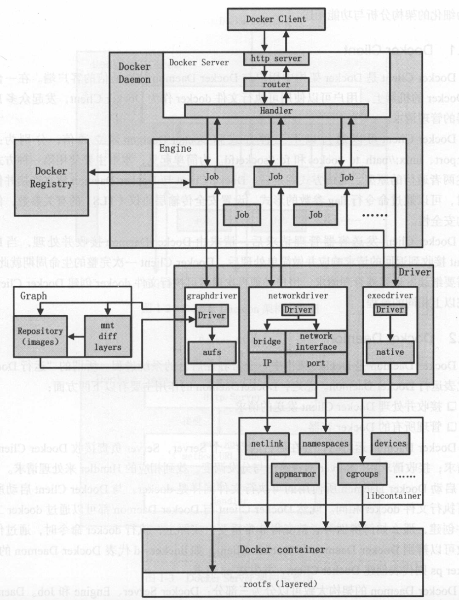
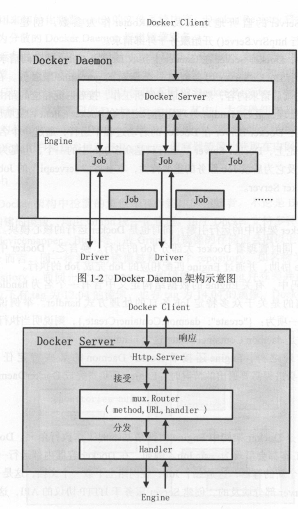
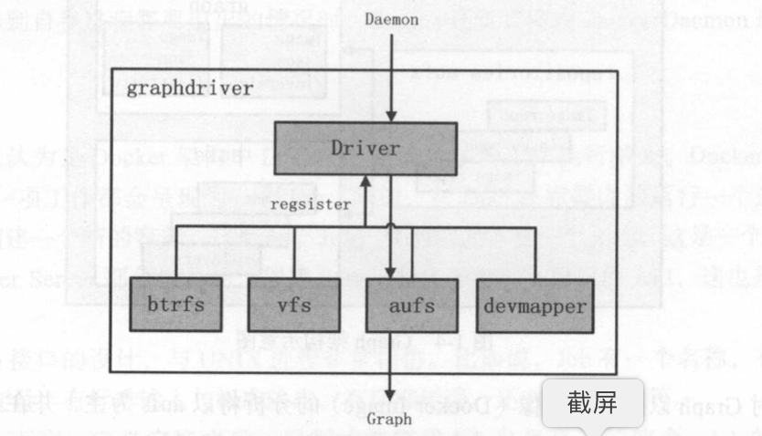
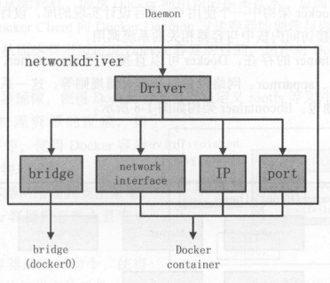
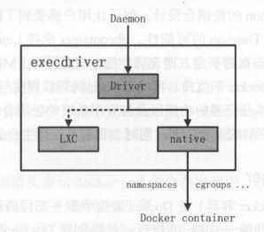
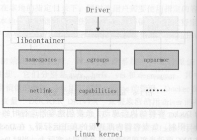
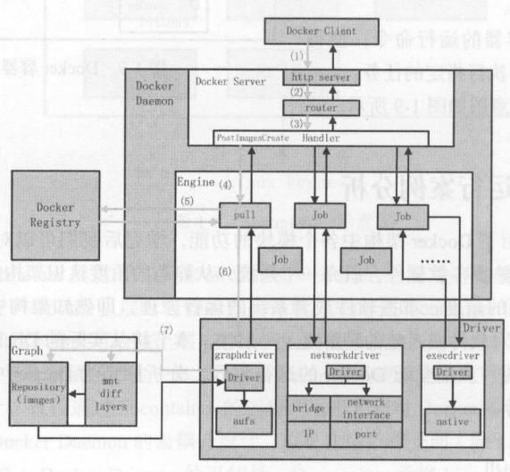

# 整体架构

架构中主要的模块有DockerClient、DockerDaemon、DockerRegistry、Graph、Driver、Libcontainer和Docker Container

## DockerClient

一般以unix://path_to_socket和DockerDaemon（包含Docker Server， Engine，Job）中的Docker Server通信

## DockerDaemon

### Docker Server

Docker Server是DockerDaemon的众多Job中的一个比较特殊的一个，名为"serveapi"

### Engine

存储容器信息，管理Job执行

关键数据结构`handlers`

### Job

Job有一个名称，有运行时参数、环境变量、标准输入、标准输出、标准错误、返回状态等等

## Docker Registry

容器竞相是用来在容器创建时初始化容器的rootfs文件系统内容

## Graph

是容器镜像的保管者。不管是下载的镜像，还是构建的镜像，都由Graph统一管理。Docker支持不同的镜像存储方案，如aufs、devicemapper、btrfs

## Driver

驱动模块。实现对Docker运行环境的定制。

为了将仅与Docker容器有关的管理从DockerDaemon的所有逻辑中区分开来，Docker的设计者设计了Driver层来抽象不同类别各自的功能范畴。

主要包含了以下三类驱动

### graphdriver

主要负责容器镜像的管理

- 从远程的Docker Registry下载镜像并进行存储
- 本地构建完成镜像之后的存储
- 为容器准备rootfs

在graphdriver的初始化过程之前，有四种文件系统或者文件系统的驱动Driver在DockerDaemon内部注册，它们分别是aufs、btrfs、vfs和devmapper。

aufs、btrfs和devmapper用于容器镜像的管理；vfs用于volume的管理。

overlay、overlay2是aufs的升级方案

### networkdriver

networkdriver的作用是完成Docker容器网络环境的配置，包括

- Docker Daemon启动时为Docker环境创建的网桥
- Docker容器创建前为其分配相应的网络接口资源
- Docker容器的IP、端口与宿主机做NAT端口映射、防火墙策略

### execdriver

容器运行时创建命名空间，负责容器资源使用的统计与限制，负责容器内部进程的运行

0.9.0以前的实现方式，使用Linux下的工具LXC
0.9.0以后，使用native驱动（独立于LXC，管理容器的创建和管理）

## libcontainer

libcontainer是Docker架构中一个使用GO语言设计实现的库，设计初衷是希望该库可以不依靠任何的依赖，直接访问内核中与容器先关的系统调用。由于libcontainer的存在，Docker可以直接调用libcontainer，最终操作容器的namespaces、cgroups、apparmor、网络设备以及防火墙规则等。

execdriver会直接调用libcontainer

# 流程示意

## docker pull

## docker run
