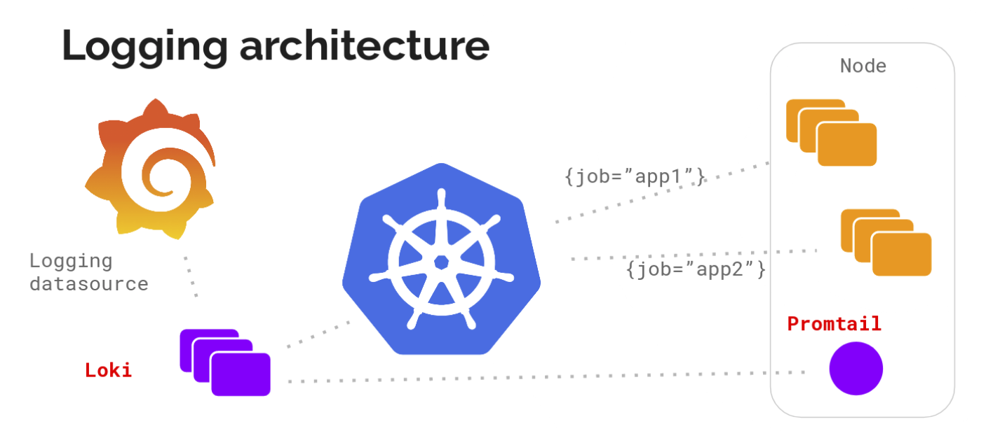
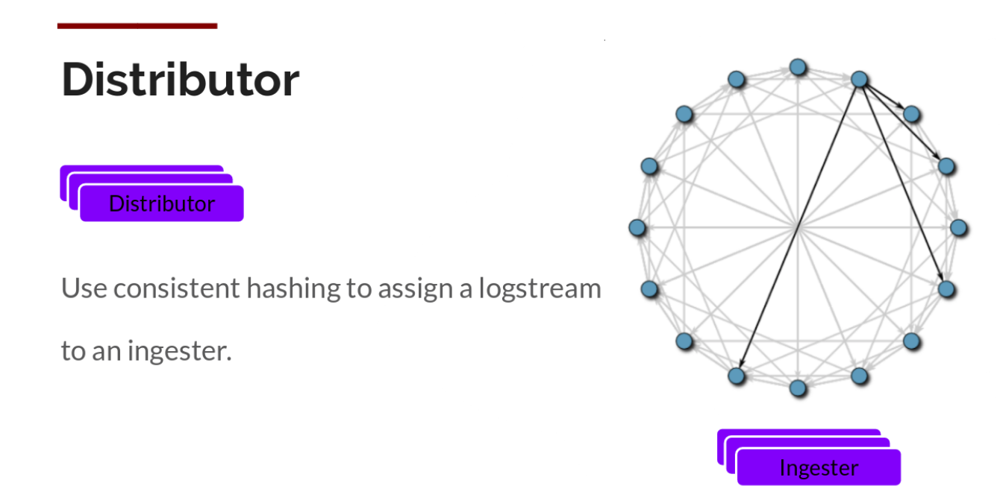

Grafana Loki 是一套可以组合成一个功能齐全的日志堆栈组件，与其他日志记录系统不同，Loki 是基于**仅索引有关日志元数据**的想法而构建的：标签（就像 Prometheus 标签一样）。**日志数据本身被压缩然后并存储在对象存储（例如 S3 或 GCS）的块中，甚至存储在本地文件系统上，轻量级的索引和高度压缩的块简化了操作，并显著降低了 Loki 的成本**，Loki 更适合中小团队。由于 Loki 使用和 Prometheus 类似的标签概念，也可以直接和 Grafana 集成，只需要添加 Loki 数据源就可以开始查询日志数据了。

Loki 还提供了一个专门用于日志查询的 LogQL 查询语句，类似于 PromQL，通过 LogQL 我们可以很容易查询到需要的日志，也可以很轻松获取监控指标。Loki 还能够将 LogQL 查询直接转换为 Prometheus 指标。此外 Loki 允许我们定义有关 LogQL 指标的报警，并可以将它们和 Alertmanager 进行对接。

Grafana Loki 主要由 3 部分组成:

- loki: 日志记录引擎，负责存储日志和处理查询
- promtail: 代理，负责收集日志并将其发送给 loki
- grafana: UI 界面

# 概述
Loki 通过使用类似 Prometheus 的标签索引机制来存储和查询日志数据，这使得它能够快速地进行分布式查询和聚合，而不需要将所有数据都从存储中加载到内存中。Loki还使用了压缩和切割日志数据的方法来减少存储空间的占用，从而更好地适应云原生环境下的高速增长的日志数据量。

> 运营成本更低：存储容易配置，存储量小；不用配置日志解析，运营和用户都方便介入；不会出现出现事故后发现日志没收集上来的情况

# 架构

## Distributor
1. 
- promtail收集日志并将其发送给loki
- Distributor就是第一个接收日志的组件
- Loki通过构建压缩数据块来实现批处理和压缩数据

2. 
- 组件ingester是一个有状态的组件
- 负责构建和刷新chunck,当chunk达到一定的数量或者时间后刷新到存储中去

3、

- 每个流的日志对应一个ingester
- 当日志到达Distributor后, 根据元数据和hash算法计算出应该到哪个ingester上面

## Ingester

ingester接收到日志并开始构建chunk.

- 将日志进行压缩并附加到chunk上面, 一旦chunk“填满”（数据达到一定数量或者过了一定期限）,ingester将其刷新到数据库
- 对块和索引使用单独的数据库,因为它们存储的数据类型不同

## Querier

- 由Querier负责给定一个时间范围和标签选择器, Querier查看索引以确定哪些块匹配, 并通过greps将结果显示出来
- 它还从Ingester获取尚未刷新的最新数据

# 拓展性

- Loki的索引存储可以是cassandra/bigtable/dynamodb
- chuncks可以是各种对象存储
- Querier和Distributor都是无状态的组件
- 对于ingester他虽然是有状态的 但当新的节点加入或者减少整节点间的chunk会重新分配，以适应新的散列环
