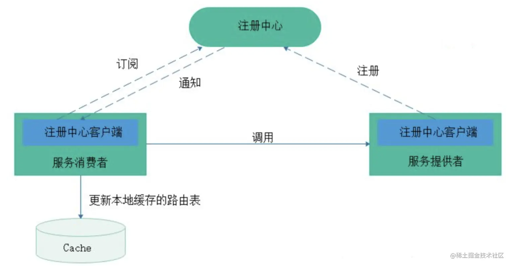
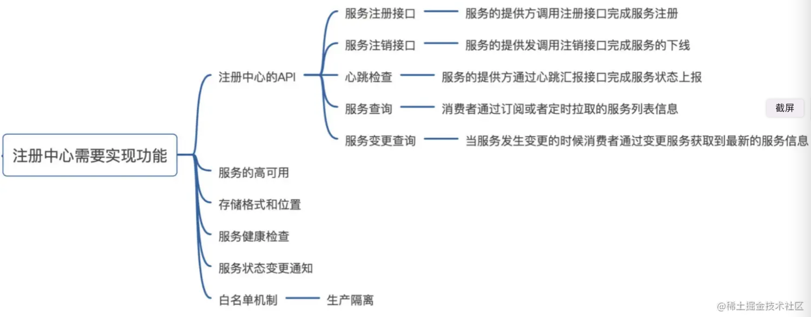
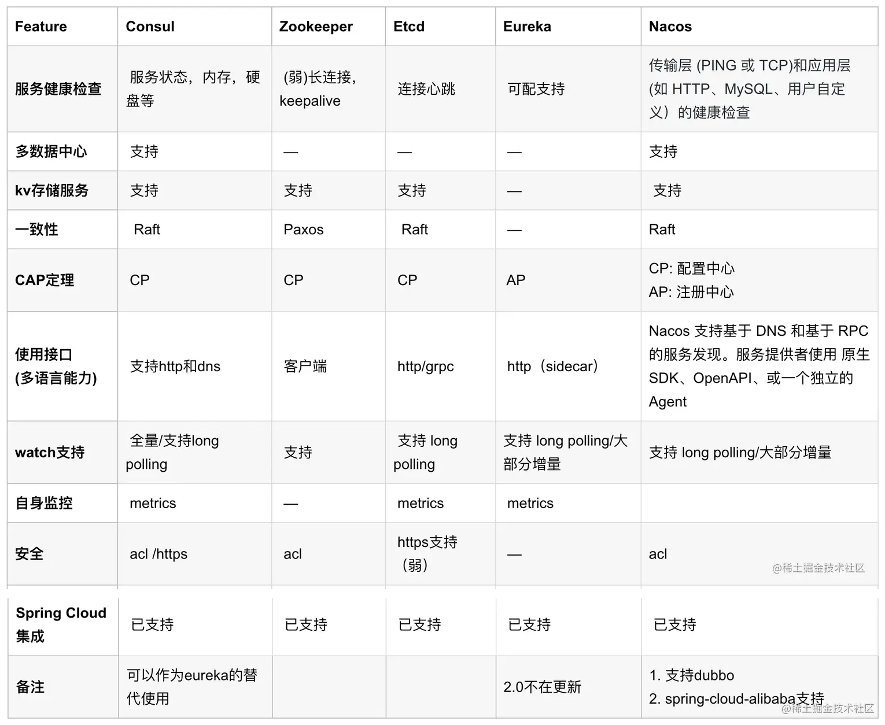
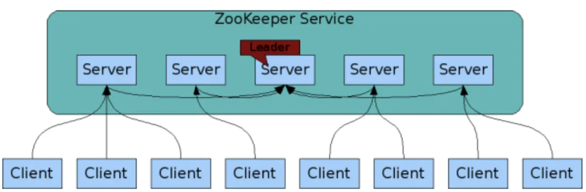
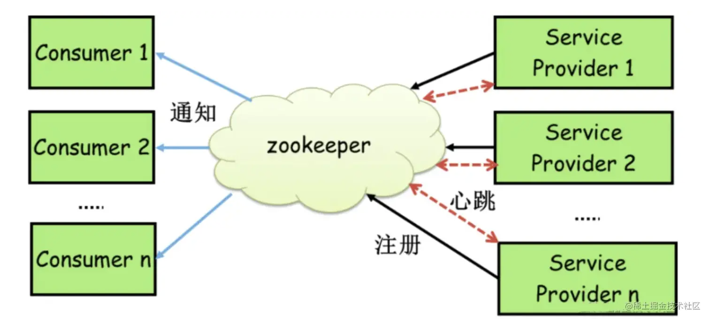
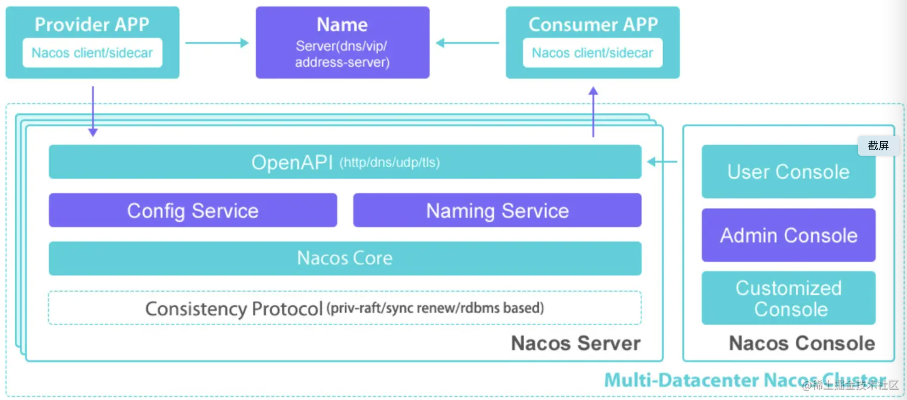

# 什么是注册中心？

注册中心主要有三种角色：

- 服务提供者（RPC Server）：在启动时，向 Registry 注册自身服务，并向 Registry 定期发送心跳汇报存活状态。
- 服务消费者（RPC Client）：在启动时，向 Registry 订阅服务，把 Registry 返回的服务节点列表缓存在本地内存中，并与 RPC Sever 建立连接。
- 服务注册中心（Registry）：用于保存 RPC Server 的注册信息，当 RPC Server 节点发生变更时，Registry 会同步变更，RPC Client 感知后会刷新本地 内存中缓存的服务节点列表。

最后，RPC Client 从本地缓存的服务节点列表中，基于负载均衡算法选择一台 RPC Sever 发起调用


# 配置中心的功能



# CAP理论

CAP理论是分布式架构中重要理论：

- 一致性(Consistency)：所有节点在同一时间具有相同的数据；
- 可用性(Availability) ：保证每个请求不管成功或者失败都有响应（某个系统的某个节点挂了，但是并不影响系统的接受或者发出请求）；
- 分隔容忍(Partition tolerance) ：系统中任意信息的丢失或失败不会影响系统的继续运作（整个系统中某个部分，挂掉了，或者宕机了，并不影响整个系统的运作或者说使用）。

CAP 不可能都取，只能取其中2个。

# 分布式系统协议

一致性协议算法主要有Paxos、Raft、ZAB。

- Paxos算法是一种基于消息传递的一致性算法，难以理解。基于Paxos协议的数据同步与传统主备方式最大的区别在于：Paxos只需超过半数的副本在线且相互通信正常，就可以保证服务的持续可用，且数据不丢失。

- Raft是Paxos的简化版，与Paxos相比，Raft强调的是易理解、易实现，Raft和Paxos一样只要保证超过半数的节点正常就能够提供服务较为出名的有etcd。

- ZooKeeper Atomic Broadcast (ZAB, ZooKeeper原子消息广播协议)是ZooKeeper实现分布式数据一致性的核心算法，ZAB借鉴Paxos算法，但又不像Paxos算法那样，是一种通用的分布式一致性算法，它是一种特别为ZooKeeper专门设计的支持崩溃恢复的原子广播协议。

# 注册中心对比



# Zookeeper

ZooKeeper是非常经典的服务注册中心中间件，在国内环境下，由于受到Dubbo框架的影响，大部分情况下认为Zookeeper是RPC服务框架下注册中心最好选择，随着Dubbo框架的不断开发优化，和各种注册中心组件的诞生，即使是RPC框架，现在的注册中心也逐步放弃了ZooKeeper。

## zookeeper的组件模型



## zookeeper如何实现注册中心

Zookeeper可以充当一个服务注册表（Service Registry）



每当一个服务提供者部署后都要将自己的服务注册到zookeeper的某一路径上: /{service}/{version}/{ip:port} 。
比如我们的HelloWorldService部署到两台机器，那么Zookeeper上就会创建两条目录：
```js
/HelloWorldService/1.0.0/100.19.20.01:16888
/HelloWorldService/1.0.0/100.19.20.02:16888
```

在zookeeper中，进行服务注册，实际上就是在zookeeper中创建了一个znode节点，该节点存储了该服务的IP、端口、调用方式(协议、序列化方式)等。该节点承担着最重要的职责，它由服务提供者(发布服务时)创建，以供服务消费者获取节点中的信息，从而定位到服务提供者真正网络拓扑位置以及得知如何调用。
RPC服务注册/发现过程简述如下：

1. 服务提供者启动时，会将其服务名称，ip地址注册到配置中心。
2. 服务消费者在第一次调用服务时，会通过注册中心找到相应的服务的IP地址列表，并缓存到本地，以供后续使用。当消费者调用服务时，不会再去请求注册中心，而是**直接通过负载均衡算法从IP列表中取一个服务提供者的服务器调用服务**。
3. 当服务提供者的某台服务器宕机或下线时，相应的ip会从服务提供者IP列表中移除。同时，**注册中心会将新的服务IP地址列表发送给服务消费者机器**，缓存在消费者本机。
4. 当某个服务的所有服务器都下线了，那么这个服务也就下线了。
5. 同样，当服务提供者的某台服务器上线时，**注册中心会将新的服务IP地址列表发送给服务消费者机器**，缓存在消费者本机。

## 心跳检测和watch机制

zookeeper提供了“心跳检测”功能：它会定时向各个服务提供者发送一个请求（实际上建立的是一个 socket 长连接），如果长期没有响应，服务中心就认为该服务提供者已经“挂了”，并将其剔除。
比如100.100.0.237这台机器如果宕机了，那么zookeeper上的路径就会只剩/HelloWorldService/1.0.0/100.100.0.238:16888。

Zookeeper的Watch机制其实就是一种**推拉结合**的模式：服务消费者会去监听相应路径（/HelloWorldService/1.0.0），一旦路径上的数据有任务变化（增加或减少），**Zookeeper只会发送一个事件类型和节点信息给关注的客户端**，而不会包括具体的变更内容，所以事件本身是轻量级的，这就是推的部分。收到变更通知的客户端需要自己去拉变更的数据，这就是拉的部分。

## zookeeper不适合作为配置中心

在 CAP 模型中，Zookeeper整体遵循一致性（CP）原则，即在任何时候对 Zookeeper 的访问请求能得到一致的数据结果，但是当机器下线或者宕机时，不能保证服务可用性。（那为什么Zookeeper不使用最终一致性（AP）模型呢？因为这个依赖Zookeeper的核心算法是ZAB，所有设计都是为了强一致性。这个对于分布式协调系统，完全没没有毛病。）

作为注册中心，可用性的要求要高于一致性。

作为一个**分布式协同服务**，ZooKeeper非常好，但是对于Service发现服务来说就不合适了，因为对于Service发现服务来说就算是返回了包含不实的信息的结果也比什么都不返回要好。所以当向注册中心查询服务列表时，我们可以容忍注册中心返回的是几分钟以前的注册信息，但不能接受服务直接down掉不可用。

但是zk会出现这样一种情况，当master节点因为网络故障与其他节点失去联系时，剩余节点会重新进行leader选举。问题在于，选举leader的时间太长，30 ~ 120s, 且选举期间整个zk集群都是不可用的，这就导致在选举期间注册服务瘫痪。在云部署的环境下，因网络问题使得zk集群失去master节点是较大概率会发生的事，虽然服务能够最终恢复，但是漫长的选举时间导致的注册长期不可用是不能容忍的。

# Nacos




