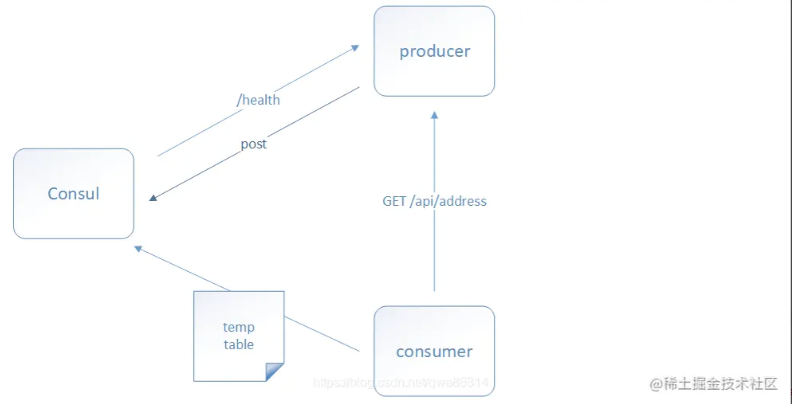
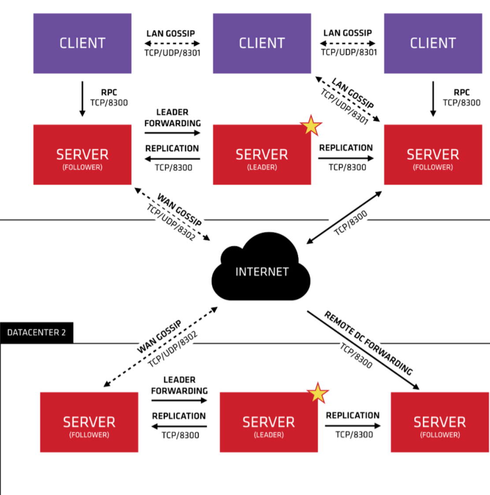
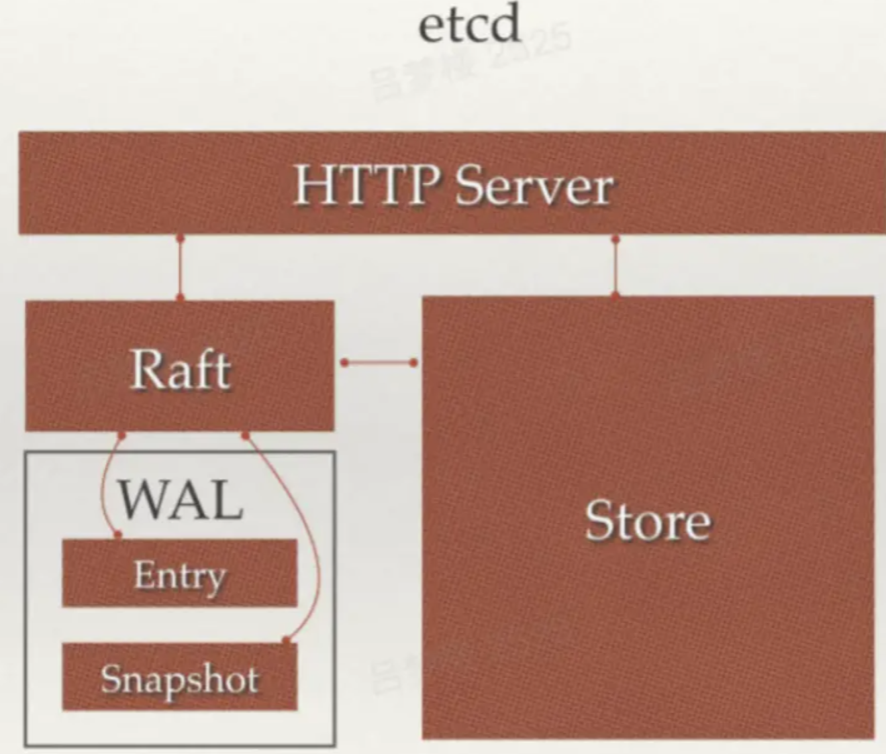

# 什么是注册中心？

注册中心主要有三种角色：

- 服务提供者（RPC Server）：在启动时，向 Registry 注册自身服务，并向 Registry 定期发送心跳汇报存活状态。
- 服务消费者（RPC Client）：在启动时，向 Registry 订阅服务，把 Registry 返回的服务节点列表缓存在本地内存中，并与 RPC Sever 建立连接。
- 服务注册中心（Registry）：用于保存 RPC Server 的注册信息，当 RPC Server 节点发生变更时，Registry 会同步变更，RPC Client 感知后会刷新本地 内存中缓存的服务节点列表。

最后，RPC Client 从本地缓存的服务节点列表中，基于负载均衡算法选择一台 RPC Sever 发起调用


# 配置中心的功能


# CAP理论

CAP理论是分布式架构中重要理论：

- 一致性(Consistency)：所有节点在同一时间具有相同的数据；
- 可用性(Availability) ：保证每个请求不管成功或者失败都有响应（某个系统的某个节点挂了，但是并不影响系统的接受或者发出请求）；
- 分隔容忍(Partition tolerance) ：系统中任意信息的丢失或失败不会影响系统的继续运作（整个系统中某个部分，挂掉了，或者宕机了，并不影响整个系统的运作或者说使用）。

CAP 不可能都取，只能取其中2个。

# 分布式系统协议

一致性协议算法主要有Paxos、Raft、ZAB。

- Paxos算法是一种基于消息传递的一致性算法，难以理解。基于Paxos协议的数据同步与传统主备方式最大的区别在于：Paxos只需超过半数的副本在线且相互通信正常，就可以保证服务的持续可用，且数据不丢失。

- Raft是Paxos的简化版，与Paxos相比，Raft强调的是易理解、易实现，Raft和Paxos一样只要保证超过半数的节点正常就能够提供服务较为出名的有etcd。

- ZooKeeper Atomic Broadcast (ZAB, ZooKeeper原子消息广播协议)是ZooKeeper实现分布式数据一致性的核心算法，ZAB借鉴Paxos算法，但又不像Paxos算法那样，是一种通用的分布式一致性算法，它是一种特别为ZooKeeper专门设计的支持崩溃恢复的原子广播协议。

# 注册中心对比


# Zookeeper

ZooKeeper是非常经典的服务注册中心中间件，在国内环境下，由于受到Dubbo框架的影响，大部分情况下认为Zookeeper是RPC服务框架下注册中心最好选择，随着Dubbo框架的不断开发优化，和各种注册中心组件的诞生，即使是RPC框架，现在的注册中心也逐步放弃了ZooKeeper。

## zookeeper的组件模型


## zookeeper如何实现注册中心

Zookeeper可以充当一个服务注册表（Service Registry）


每当一个服务提供者部署后都要将自己的服务注册到zookeeper的某一路径上: /{service}/{version}/{ip:port} 。
比如我们的HelloWorldService部署到两台机器，那么Zookeeper上就会创建两条目录：
```js
/HelloWorldService/1.0.0/100.19.20.01:16888
/HelloWorldService/1.0.0/100.19.20.02:16888
```

在zookeeper中，进行服务注册，实际上就是在zookeeper中创建了一个znode节点，该节点存储了该服务的IP、端口、调用方式(协议、序列化方式)等。该节点承担着最重要的职责，它由服务提供者(发布服务时)创建，以供服务消费者获取节点中的信息，从而定位到服务提供者真正网络拓扑位置以及得知如何调用。
RPC服务注册/发现过程简述如下：

1. 服务提供者启动时，会将其服务名称，ip地址注册到配置中心。
2. 服务消费者在第一次调用服务时，会通过注册中心找到相应的服务的IP地址列表，并缓存到本地，以供后续使用。当消费者调用服务时，不会再去请求注册中心，而是**直接通过负载均衡算法从IP列表中取一个服务提供者的服务器调用服务**。
3. 当服务提供者的某台服务器宕机或下线时，相应的ip会从服务提供者IP列表中移除。同时，**注册中心会将新的服务IP地址列表发送给服务消费者机器**，缓存在消费者本机。
4. 当某个服务的所有服务器都下线了，那么这个服务也就下线了。
5. 同样，当服务提供者的某台服务器上线时，**注册中心会将新的服务IP地址列表发送给服务消费者机器**，缓存在消费者本机。

## 心跳检测和watch机制

zookeeper提供了“心跳检测”功能：它会定时向各个服务提供者发送一个请求（实际上建立的是一个 socket 长连接），如果长期没有响应，服务中心就认为该服务提供者已经“挂了”，并将其剔除。
比如100.100.0.237这台机器如果宕机了，那么zookeeper上的路径就会只剩/HelloWorldService/1.0.0/100.100.0.238:16888。

Zookeeper的Watch机制其实就是一种**推拉结合**的模式：服务消费者会去监听相应路径（/HelloWorldService/1.0.0），一旦路径上的数据有任务变化（增加或减少），**Zookeeper只会发送一个事件类型和节点信息给关注的客户端**，而不会包括具体的变更内容，所以事件本身是轻量级的，这就是推的部分。收到变更通知的客户端需要自己去拉变更的数据，这就是拉的部分。

## zookeeper不适合作为配置中心

在 CAP 模型中，Zookeeper整体遵循一致性（CP）原则，即在任何时候对 Zookeeper 的访问请求能得到一致的数据结果，但是当机器下线或者宕机时，不能保证服务可用性。（那为什么Zookeeper不使用最终一致性（AP）模型呢？因为这个依赖Zookeeper的核心算法是ZAB，所有设计都是为了强一致性。这个对于分布式协调系统，完全没没有毛病。）

作为注册中心，可用性的要求要高于一致性。

作为一个**分布式协同服务**，ZooKeeper非常好，但是对于Service发现服务来说就不合适了，因为对于Service发现服务来说就算是返回了包含不实的信息的结果也比什么都不返回要好。所以当向注册中心查询服务列表时，我们可以容忍注册中心返回的是几分钟以前的注册信息，但不能接受服务直接down掉不可用。

但是zk会出现这样一种情况，当master节点因为网络故障与其他节点失去联系时，剩余节点会重新进行leader选举。问题在于，选举leader的时间太长，30 ~ 120s, 且选举期间整个zk集群都是不可用的，这就导致在选举期间注册服务瘫痪。在云部署的环境下，因网络问题使得zk集群失去master节点是较大概率会发生的事，虽然服务能够最终恢复，但是漫长的选举时间导致的注册长期不可用是不能容忍的。

# Consul

Consul 是 HashiCorp 公司推出的开源工具，**用于实现分布式系统的服务发现与配置**。与其它分布式服务注册与发现的方案，Consul 的方案更“一站式”，内置了服务注册与发现框架、分布一致性协议实现、健康检查、Key/Value存储、**多数据中心方案**。
Consul 使用起来也较为简单，使用 Go 语言编写，因此具有天然可移植性(支持Linux、windows和Mac OS X)；安装包仅包含一个可执行文件，方便部署，与 Docker 等轻量级容器可无缝配合。



## Consul 主要特征

- **CP模型，使用 Raft 算法来保证强一致性，不保证可用性；**
- 支持服务注册与发现、健康检查、KV Store功能。
- 支持**多数据中心**，可以避免单数据中心的单点故障，而其部署则需要考虑网络延迟, 分片等情况等。
- 支持安全服务通信，Consul可以为服务生成和分发TLS证书，以建立相互的TLS连接。
- 支持 http 和 dns 协议接口；
- 官方提供 web 管理界面。

## 多数据中心



- 在上图中有两个DataCenter，他们通过Internet互联，同时请注意为了提高通信效率，只有Server节点才加入跨数据中心的通信。

- **在单个数据中心中**，Consul分为Client和Server两种节点（所有的节点也被称为Agent），Server节点保存数据，Client负责健康检查及转发数据请求到Server；Server节点有一个Leader和多个Follower，Leader节点会将数据同步到Follower，Server的数量推荐是3个或者5个，在Leader挂掉的时候会启动选举机制产生一个新的Leader。

- 集群内的Consul节点通过gossip协议（流言协议）维护成员关系，也就是说某个节点了解集群内现在还有哪些节点，这些节点是Client还是Server。单个数据中心的流言协议同时使用TCP和UDP通信，并且都使用8301端口。跨数据中心的流言协议也同时使用TCP和UDP通信，端口使用8302。

- 集群内数据的读写请求既可以直接发到Server，也可以通过Client使用RPC转发到Server，请求最终会到达Leader节点，在允许数据延时的情况下，读请求也可以在普通的Server节点完成，集群内数据的读写和复制都是通过TCP的8300端口完成。


# ETCD

etcd是一个Go言编写的分布式、高可用的一致性键值存储系统，用于提供可靠的分布式键值存储、配置共享和服务发现等功能。


## ETCD框架



etcd主要分为四个部分：

- HTTP Server：用于处理用户发送的API请求以及其它etcd节点的同步与心跳信息请求。
- Store：用于处理etcd支持的各类功能的事务，包括数据索引、节点状态变更、监控与反馈、事件处理与执行等等，是etcd对用户提供的大多数API功能的具体实现。
- Raft：Raft强一致性算法的具体实现，是etcd的核心。
- WAL：Write Ahead Log（预写式日志），是etcd的数据存储方式。除了在内存中存有所有数据的状态以及节点的索引以外，etcd就通过WAL进行持久化存储。WAL中，所有的数据提交前都会事先记录日志。Snapshot是为了防止数据过多而进行的状态快照；Entry表示存储的具体日志内容。


- 易使用：基于HTTP+JSON的API让你用curl就可以轻松使用；
- 易部署：使用Go语言编写，跨平台，部署和维护简单；
- 强一致：使用Raft算法充分保证了分布式系统数据的强一致性；
- 高可用：具有容错能力，假设集群有n个节点，当有(n-1)/2节点发送故障，依然能提供服务；
- 持久化：数据更新后，会通过WAL格式数据持久化到磁盘，支持Snapshot快照；
- 快速：每个实例每秒支持一千次写操作，极限写性能可达10K QPS；
- 安全：可选SSL客户认证机制；
- ETCD 3.0：除了上述功能，还支持gRPC通信、watch机制。


# Nacos

> Nacos是阿里开源的，支持基于 DNS 和基于 RPC 的服务发现, 还可以作为动态配置中心。Nacos的注册中心支持CP也支持AP，对他来说只是一个命令的切换。


Nacos 致力于发现、配置和管理微服务。Nacos 提供了一组简单易用的特性集，帮助您快速实现动态服务发现、服务配置、服务元数据及流量管理。
Nacos 帮助您更敏捷和容易地构建、交付和管理微服务平台。 Nacos 是构建以“服务”为中心的现代应用架构 (例如微服务范式、云原生范式) 的服务基础设施。

## Nacos的功能
1. 服务发现和服务健康监测：

- Nacos 支持基于 DNS 和基于 RPC 的服务发现。服务提供者使用原生SDK、OpenAPI、或一个独立的Agent注册 Service 后，服务消费者可以使用DNS 或HTTP&API查找和发现服务。
- Nacos 提供对服务的实时的健康检查，阻止向不健康的主机或服务实例发送请求。Nacos 支持传输层 (PING 或 TCP)和应用层 (如 HTTP、MySQL、用户自定义）的健康检查。 对于复杂的云环境和网络拓扑环境中（如 VPC、边缘网络等）服务的健康检查，Nacos 提供了 agent 上报模式和服务端主动检测2种健康检查模式。Nacos 还提供了统一的健康检查仪表盘，帮助您根据健康状态管理服务的可用性及流量。

2. 动态配置服务：

- 动态配置服务可以让您以中心化、外部化和动态化的方式管理所有环境的应用配置和服务配置。
- 动态配置消除了配置变更时重新部署应用和服务的需要，让配置管理变得更加高效和敏捷。
- 配置中心化管理让实现无状态服务变得更简单，让服务按需弹性扩展变得更容易。
- Nacos 提供了一个简洁易用的UI 帮助您管理所有的服务和应用的配置。Nacos 还提供包括配置版本跟踪、金丝雀发布、一键回滚配置以及客户端配置更新状态跟踪在内的一系列开箱即用的配置管理特性，帮助您更安全地在生产环境中管理配置变更和降低配置变更带来的风险。

3. 动态 DNS 服务：

- 动态 DNS 服务支持权重路由，让您更容易地实现中间层负载均衡、更灵活的路由策略、流量控制以及数据中心内网的简单DNS解析服务。动态DNS服务还能让您更容易地实现以 DNS 协议为基础的服务发现，以帮助您消除耦合到厂商私有服务发现 API 上的风险。
- Nacos 提供了一些简单的 DNS APIs 帮助您管理服务的关联域名和可用的 IP:PORT 列表。

# 注册中心选型

## 服务健康检查：Euraka 使用时需要显式配置健康检查支持；Zookeeper、Etcd 则在失去了和服务进程的连接情况下任务不健康，而 Consul 相对更为详细点，比如内存是否已使用了90%，文件系统的空间是不是快不足了。

## 多数据中心
Consul 和 Nacos 都支持，其他的产品则需要额外的开发工作来实现。

## KV 存储服务
除了 Eureka，其他几款都能够对外支持 k-v 的存储服务，所以后面会讲到这几款产品追求高一致性的重要原因。而提供存储服务，也能够较好的转化为动态配置服务哦。

## CAP 理论的取舍：
Eureka 是典型的 AP，Nacos可以配置为 AP，作为分布式场景下的服务发现的产品较为合适，服务发现场景的可用性优先级较高，一致性并不是特别致命。
而Zookeeper、Etcd、Consul则是 CP 类型牺牲可用性，在服务发现场景并没太大优势；


## Watch的支持：
Zookeeper 支持服务器端推送变化，其它都通过长轮询的方式来实现变化的感知。


