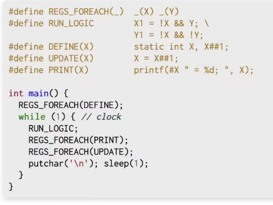

数字逻辑电路代码
```c
#include <stdio.h>
#include <unistd.h>  // sleep函数的头文件

#define REGS_FOREACH(_) _(X) _(Y)  // 两个寄存器 X和Y
#define RUN_LOGIC X1 = !X && Y; \
                  Y1 = !X && !Y;
#define DEFINE(X) static int X, X##1;      // 对寄存器做操作的宏之1/3：定义寄存器
#define UPDATE(X) X = X##1;                // 对寄存器做操作的宏之2/3：更新一个寄存器
#define PRINT(X) printf(#X " = %d; ", X);  // 对寄存器做操作的宏之3/3：打印一个寄存器

int main(void) {
    REGS_FOREACH(DEFINE);
    while(1) {// clock
        RUN_LOGIC;
        REGS_FOREACH(PRINT);
        REGS_FOREACH(UPDATE);
        putchar('\n');
        sleep(1);
    }
}
```

如果C语言基础不好，看不懂这几个宏，可以用`gcc -E a.c`, 将上面的所有的宏都展开