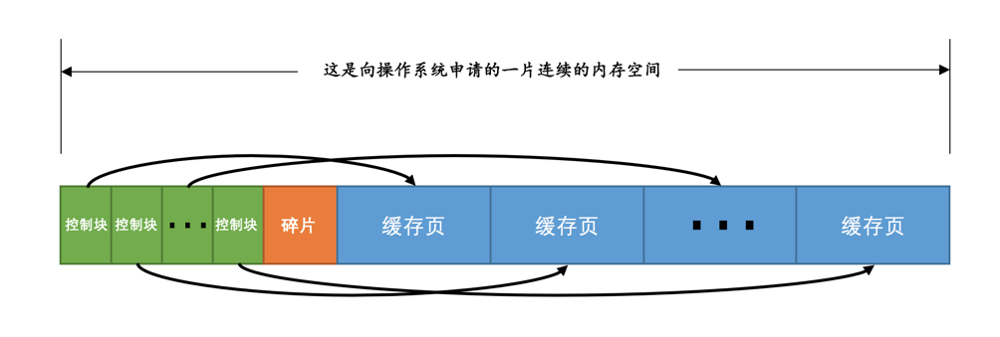
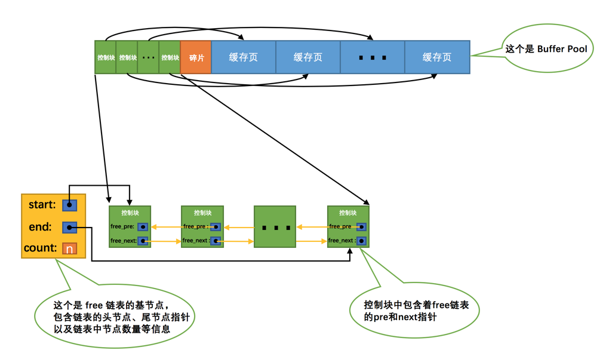

对于使用InnoDB作为存储引擎的表来说，不管是用于存储用户数据的索引（包括聚簇索引和二级索引），还是各种系统数据，都是以页的形式存放在表空间中的，而所谓的表空间只不过是InnoDB对文件系统上一个或几个实际文件的抽象，也就是说我们的数据说到底还是存储在磁盘上的。但是各位也都知道，磁盘的速度慢的跟乌龟一样，怎么能配得上“快如风，疾如电”的CPU呢？所以InnoDB存储引擎在处理客户端的请求时，当需要访问某个页的数据时，就会把完整的页的数据全部加载到内存中，也就是说即使我们只需要访问一个页的一条记录，那也需要先把整个页的数据加载到内存中。将整个页加载到内存中后就可以进行读写访问了，在进行完读写访问之后并不着急把该页对应的内存空间释放掉，而是将其缓存起来，这样将来有请求再次访问该页面时，就可以省去磁盘IO的开销了。

# Buffer Pool

InnoDB为了缓存磁盘中的页，在MySQL服务器启动的时候就向操作系统申请了一片连续的内存叫做Buffer Pool（中文名是缓冲池）。默认情况下Buffer Pool只有128M大小。可以在启动服务器的时候配置innodb_buffer_pool_size参数的值：

```ini
[server]
innodb_buffer_pool_size = 268435456 # 单位是字节，最小设置为5M
```

## Buffer Pool内部组成

Buffer Pool中默认的缓存页大小和在磁盘上默认的页大小是一样的，都是16KB。为了更好的管理这些在Buffer Pool中的缓存页，设计InnoDB的大佬为每一个缓存页都创建了一些所谓的控制信息，这些控制信息包括该页所属的表空间编号、页号、缓存页在Buffer Pool中的地址、链表节点信息、一些锁信息以及LSN信息



> 每个控制块大约占用缓存页大小的5%，在MySQL5.7.21这个版本中，每个控制块占用的大小是808字节。而我们设置的innodb_buffer_pool_size并不包含这部分控制块占用的内存空间大小，也就是说InnoDB在为Buffer Pool向操作系统申请连续的内存空间时，这片连续的内存空间一般会比innodb_buffer_pool_size的值大5%左右。

## free链表的管理

把所有空闲的缓存页对应的控制块作为一个节点放到一个链表中，这个链表也可以被称作free链表（或者说空闲链表）



> 链表的基节点占用的内存空间并不包含在为Buffer Pool申请的一大片连续内存空间之内，而是单独申请的一块内存空间

> 链表基节点占用的内存空间并不大，在MySQL5.7.21这个版本里，每个基节点只占用40字节大小。后边我们即将介绍许多不同的链表，它们的基节点和free链表的基节点的内存分配方式是一样一样的，都是单独申请的一块40字节大小的内存空间，并不包含在为Buffer Pool申请的一大片连续内存空间之内。

## 缓存页的哈希处理

表空间号 + 页号作为key，缓存页作为value创建一个哈希表，在需要访问某个页的数据时，先从哈希表中根据表空间号 + 页号看看有没有对应的缓存页，如果有，直接使用该缓存页就好，如果没有，那就从free链表中选一个空闲的缓存页，然后把磁盘中对应的页加载到该缓存页的位置

## flush链表的管理

每次修改缓存页后(缓存页变成了脏页)，我们并不着急立即把修改同步到磁盘上，而是在未来的某个时间点进行同步

脏页对应的控制块都会作为一个节点加入到一个链表中，因为这个链表节点对应的缓存页都是需要被刷新到磁盘上的，所以也叫flush链表。链表的构造和free链表差不多。


## LRU链表的管理

### 简单的LRU链表

LRU链表（LRU的英文全称：Least Recently Used）。当我们需要访问某个页时，可以这样处理LRU链表：

1. 如果该页不在Buffer Pool中，在把该页从磁盘加载到Buffer Pool中的缓存页时，就把该缓存页对应的控制块作为节点塞到链表的头部。
2. 如果该页已经缓存在Buffer Pool中，则直接把该页对应的控制块移动到LRU链表的头部。


### 划分区域的LRU链表

简单LRU的问题：
- 加载到Buffer Pool中的页不一定被用到(线性预读、随机预读)。
- 如果非常多的使用频率偏低的页被同时加载到Buffer Pool时，可能会把那些使用频率非常高的页从Buffer Pool中淘汰掉。

解决思路：对LRU表换分区域

- 一部分存储使用频率非常高的缓存页，所以这一部分链表也叫做热数据，或者称young区域。
- 另一部分存储使用频率不是很高的缓存页，所以这一部分链表也叫做冷数据，或者称old区域。


1. 针对预读的页面可能不进行后续访情况的优化

当磁盘上的某个页面在初次加载到Buffer Pool中的某个缓存页时，该缓存页对应的控制块会被放到冷区域的头部。这样针对预读到Buffer Pool却不进行后续访问的页面就会被逐渐从冷区域逐出，而不会影响热区域中被使用比较频繁的缓存页。

2. 针对全表扫描时，短时间内访问大量使用频率非常低的页面情况的优化

在进行全表扫描时，虽然首次被加载到Buffer Pool的页被放到了冷区域的头部，但是后续会被马上访问到，每次进行访问的时候又会把该页放到热区域的头部，这样仍然会把那些使用频率比较高的页面给顶下去。有同学会想：可不可以在第一次访问该页面时不将其从冷区域移动到热区域的头部，后续访问时再将其移动到热区域的头部。回答是：行不通！因为设计InnoDB的大佬规定每次去页面中读取一条记录时，都算是访问一次页面，而一个页面中可能会包含很多条记录，也就是说读取完某个页面的记录就相当于访问了这个页面好多次。

  咋办？全表扫描有一个特点，那就是它的执行频率非常低，谁也不会没事儿老在那写全表扫描的语句玩，而且在执行全表扫描的过程中，即使某个页面中有很多条记录，也就是去多次访问这个页面所花费的时间也是非常少的。所以我们只需要规定，在对某个处在冷区域的缓存页进行第一次访问时就在它对应的控制块中记录下来这个访问时间，如果后续的访问时间与第一次访问的时间在某个时间间隔内，那么该页面就不会被从冷区域移动到热区域的头部，否则将它移动到热区域的头部。

### 刷新脏页到磁盘

后台有专门的线程每隔一段时间负责把脏页刷新到磁盘，这样可以不影响用户线程处理正常的请求。主要有两种刷新路径：

1. 从LRU链表的冷数据中刷新一部分页面到磁盘。

后台线程会定时从LRU链表尾部开始扫描一些页面，扫描的页面数量可以通过系统变量innodb_lru_scan_depth来指定，如果从里边儿发现脏页，会把它们刷新到磁盘。这种刷新页面的方式被称之为BUF_FLUSH_LRU。

2. 从flush链表中刷新一部分页面到磁盘。

后台线程也会定时从flush链表中刷新一部分页面到磁盘，刷新的速率取决于当时系统是不是很繁忙。这种刷新页面的方式被称之为BUF_FLUSH_LIST。

有时候后台线程刷新脏页的进度比较慢，导致用户线程在准备加载一个磁盘页到Buffer Pool时没有可用的缓存页，这时就会尝试看看LRU链表尾部有没有可以直接释放掉的未修改页面，如果没有的话会不得不将LRU链表尾部的一个脏页同步刷新到磁盘（和磁盘交互是很慢的，这会降低处理用户请求的速度）。这种刷新单个页面到磁盘中的刷新方式被称之为BUF_FLUSH_SINGLE_PAGE。

  当然，有时候系统特别繁忙时，也可能出现用户线程批量的从flush链表中刷新脏页的情况，很显然在处理用户请求过程中去刷新脏页是一种严重降低处理速度的行为（毕竟磁盘的速度满的要死），这属于一种迫不得已的情况，不过这得放在后边介绍redo日志的checkpoint时说了。

### 多个Buffer Pool实例


#### 配置Buffer Pool时的注意事项

innodb_buffer_pool_size(所有Buffer Pool大小)必须是innodb_buffer_pool_chunk_size× innodb_buffer_pool_instances(Pool个数)的倍数（这主要是想保证每一个Buffer Pool实例中包含的chunk数量相同）。

innodb_buffer_pool_size = 是innodb_buffer_pool_chunk_size×innodb_buffer_pool_instances×innodb_buffer_pool_chunk_INSTANCES(算出来的值，实际没这个变量)

#### Buffer Pool中存储的其它信息

Buffer Pool的缓存页除了用来缓存磁盘上的页面以外，还可以存储锁信息、自适应哈希索引等信息

#### 查看Buffer Pool的状态信息


```
mysql> SHOW ENGINE INNODB STATUS\G

(...省略前面的许多状态)
----------------------
BUFFER POOL AND MEMORY
----------------------
Total memory allocated 13218349056;
Dictionary memory allocated 4014231
Buffer pool size   786432
Free buffers       8174
Database pages     710576
Old database pages 262143
Modified db pages  124941
Pending reads 0
Pending writes: LRU 0, flush list 0, single page 0
Pages made young 6195930012, not young 78247510485
108.18 youngs/s, 226.15 non-youngs/s
Pages read 2748866728, created 29217873, written 4845680877
160.77 reads/s, 3.80 creates/s, 190.16 writes/s
Buffer pool hit rate 956 / 1000, young-making rate 30 / 1000 not 605 / 1000
Pages read ahead 0.00/s, evicted without access 0.00/s, Random read ahead 0.00/s
LRU len: 710576, unzip_LRU len: 118
I/O sum[134264]:cur[144], unzip sum[16]:cur[0]
--------------
(...省略后边的许多状态)

mysql>
```

- Total memory allocated：代表Buffer Pool向操作系统申请的内存空间大小，包括全部控制块、缓存页、以及碎片的大小。

- Dictionary memory allocated：为数据字典信息分配的内存空间大小，注意这个内存空间和Buffer Pool没什么关系，不包括在Total memory allocated中。

- Buffer pool size：代表该Buffer Pool可以容纳多少缓存页，注意，单位是页！

- Free buffers：代表当前Buffer Pool还有多少空闲缓存页，也就是free链表中还有多少个节点。

- Database pages：代表LRU链表中的页的数量，包含young和old两个区域的节点数量。

- Old database pages：代表LRU链表old区域的节点数量。

- Modified db pages：代表脏页数量，也就是flush链表中节点的数量。

- Pending reads：正在等待从磁盘上加载到Buffer Pool中的页面数量。当准备从磁盘中加载某个页面时，会先为这个页面在Buffer Pool中分配一个缓存页以及它对应的控制块，然后把这个控制块添加到LRU的old区域的头部，但是这个时候真正的磁盘页并没有被加载进来，Pending reads的值会跟着加1。

- Pending writes LRU：即将从LRU链表中刷新到磁盘中的页面数量。

- Pending writes flush list：即将从flush链表中刷新到磁盘中的页面数量。

- Pending writes single page：即将以单个页面的形式刷新到磁盘中的页面数量。

- Pages made young：代表LRU链表中曾经从old区域移动到young区域头部的节点数量。这里需要注意，一个节点每次只有从old区域移动到young区域头部时才会将Pages made young的值加1，也就是说如果该节点本来就在young区域，由于它符合在young区域1/4后边的要求，下一次访问这个页面时也会将它移动到young区域头部，但这个过程并不会导致Pages made young的值加1。

- Page made not young：在将innodb_old_blocks_time设置的值大于0时，首次访问或者后续访问某个处在old区域的节点时由于不符合时间间隔的限制而不能将其移动到young区域头部时，Page made not young的值会加1。

这里需要注意，对于处在young区域的节点，如果由于它在young区域的1/4处而导致它没有被移动到young区域头部，这样的访问并不会将Page made not young的值加1。

- youngs/s：代表每秒从old区域被移动到young区域头部的节点数量。

- non-youngs/s：代表每秒由于不满足时间限制而不能从old区域移动到young区域头部的节点数量。

- Pages read、created、written：代表读取，创建，写入了多少页。后边跟着读取、创建、写入的速率。

- Buffer pool hit rate：表示在过去某段时间，平均访问1000次页面，有多少次该页面已经被缓存到Buffer Pool了。

- young-making rate：表示在过去某段时间，平均访问1000次页面，有多少次访问使页面移动到young区域的头部了。需要大家注意的一点是，这里统计的将页面移动到young区域的头部次数不仅仅包含从old区域移动到young区域头部的次数，还包括从young区域移动到young区域头部的次数（访问某个young区域的节点，只要该节点在young区域的1/4处往后，就会把它移动到young区域的头部）。

- not (young-making rate)：表示在过去某段时间，平均访问1000次页面，有多少次访问没有使页面移动到young区域的头部。需要大家注意的一点是，这里统计的没有将页面移动到young区域的头部次数不仅仅包含因为设置了innodb_old_blocks_time系统变量而导致访问了old区域中的节点但没把它们移动到young区域的次数，还包含因为该节点在young区域的前1/4处而没有被移动到young区域头部的次数。

- LRU len：代表LRU链表中节点的数量。

- unzip_LRU：代表unzip_LRU链表中节点的数量（由于我们没有具体介绍过这个链表，现在可以忽略它的值）。

- I/O sum：最近50s读取磁盘页的总数。

- I/O cur：现在正在读取的磁盘页数量。

- I/O unzip sum：最近50s解压的页面数量。

- I/O unzip cur：正在解压的页面数量