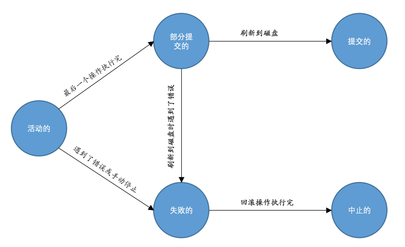

 即使对于单独的一条UPDATE语句，读写磁盘也是以页面为单位的。在对某个页面进行读写访问时，都会先把这个页面加载到Buffer Pool中，之后如果修改了某个页面，也不会立即把修改同步到磁盘，而只是把这个修改了的页面加到Buffer Pool的flush链表中，在之后的某个时间点才会刷新到磁盘

 # 事务的概念

 保证原子性、隔离性、一致性和持久性的一个或多个数据库操作称之为一个事务（英文名是：transaction）

 ##  事务的状态

- 活动的（active），事务对应的数据库操作正在执行过程中时，我们就说该事务处在活动的状态。

- 部分提交的（partially committed），当事务中的最后一个操作执行完成，但由于操作都在内存中执行，所造成的影响并没有刷新到磁盘时，我们就说该事务处在部分提交的状态。

- 失败的（failed），当事务处在活动的或者部分提交的状态时，可能遇到了某些错误（数据库自身的错误、操作系统错误或者直接断电等）而无法继续执行，或者人为的停止当前事务的执行，我们就说该事务处在失败的状态。

- 中止的（aborted），如果事务执行了半截而变为失败的状态，比如我们前面介绍的狗哥向猫爷转账的事务，当狗哥账户的钱被扣除，但是猫爷账户的钱没有增加时遇到了错误，从而当前事务处在了失败的状态，那么就需要把已经修改的狗哥账户余额调整为未转账之前的金额，换句话说，就是要撤销失败事务对当前数据库造成的影响。书面一点的话，我们把这个撤销的过程称之为回滚。当回滚操作执行完毕时，也就是数据库恢复到了执行事务之前的状态，我们就说该事务处在了中止的状态。

- 提交的（committed），当一个处在部分提交的状态的事务将修改过的数据都同步到磁盘上之后，我们就可以说该事务处在了提交的状态。



# MySQL中事务的语法

## 自动提交

```
mysql> SHOW VARIABLES LIKE 'autocommit';
+---------------+-------+
| Variable_name | Value |
+---------------+-------+
| autocommit    | ON    |
+---------------+-------+
1 row in set (0.01 sec)
```
默认情况下，如果我们不显式的使用START TRANSACTION或者BEGIN语句开启一个事务，那么每一条语句都算是一个独立的事务，这种特性称之为事务的自动提交。

## 隐式提交

当我们使用START TRANSACTION或者BEGIN语句开启了一个事务，或者把系统变量autocommit的值设置为OFF时，事务就不会进行自动提交，但是如果我们输入了某些语句之后就会悄悄地提交掉，就像我们输入了COMMIT语句了一样，这种因为某些特殊的语句而导致事务提交的情况称为隐式提交，这些会导致事务隐式提交的语句包括：

1. 定义或修改数据库对象的数据定义语言（Data definition language，缩写为：DDL）

```
BEGIN;

SELECT ... # 事务中的一条语句
UPDATE ... # 事务中的一条语句
... # 事务中的其它语句

CREATE TABLE ... # 此语句会隐式的提交前面语句所属于的事务
```

2. 隐式使用或修改mysql数据库中的表

```
当我们使用ALTER USER、CREATE USER、DROP USER、GRANT、RENAME USER、REVOKE、SET PASSWORD等语句时也会隐式的提交前面语句所属于的事务。
```

3. 事务控制或关于锁定的语句

当我们在一个事务还没提交或者回滚时就又使用START TRANSACTION或者BEGIN语句开启了另一个事务时，会隐式的提交上一个事务

```
BEGIN;

SELECT ... # 事务中的一条语句
UPDATE ... # 事务中的一条语句
... # 事务中的其它语句

BEGIN; # 此语句会隐式的提交前面语句所属于的事务

```

或者当前的autocommit系统变量的值为OFF，我们手动把它调为ON时，也会隐式的提交前面语句所属的事务。

或者使用LOCK TABLES、UNLOCK TABLES等关于锁定的语句也会隐式的提交前面语句所属的事务。

4. 加载数据的语句,比如我们使用LOAD DATA语句来批量往数据库中导入数据时，也会隐式的提交前面语句所属的事务。

5. 关于MySQL复制的一些语句, 使用START SLAVE、STOP SLAVE、RESET SLAVE、CHANGE MASTER TO等语句时也会隐式的提交前面语句所属的事务。

6. 其它的一些语句, 使用ANALYZE TABLE、CACHE INDEX、CHECK TABLE、FLUSH、 LOAD INDEX INTO CACHE、OPTIMIZE TABLE、REPAIR TABLE、RESET等语句也会隐式的提交前面语句所属的事