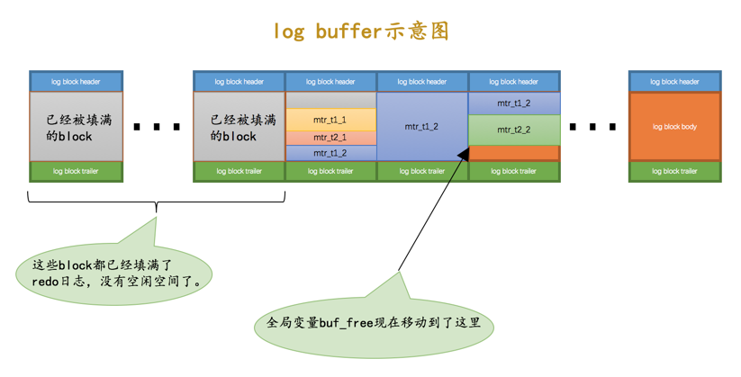

# redo log
问题：如果我们只在内存的Buffer Pool中修改了页面，假设在事务提交后突然发生了某个故障，导致内存中的数据都失效了，那么这个`已经提交了的事务`对数据库中所做的更改也就跟着丢失了。

一个很简单的做法就是在事务提交完成之前把该事务所修改的所有页面都刷新到磁盘，但是这个简单粗暴的做法有些问题：

1. 刷新一个完整的数据页太浪费了，有时候我们仅仅修改了某个页面中的一个字节，但是我们知道在InnoDB中是以页为单位来进行磁盘IO的，也就是说我们在该事务提交时不得不将一个完整的页面从内存中刷新到磁盘，我们又知道一个页面默认是16KB大小，只修改一个字节就要刷新16KB的数据到磁盘上显然是太浪费了。

2. 随机IO刷起来比较慢，一个事务可能包含很多语句，即使是一条语句也可能修改许多页面，倒霉催的是该事务修改的这些页面可能并不相邻，这就意味着在将某个事务修改的Buffer Pool中的页面刷新到磁盘时，需要进行很多的随机IO，随机IO比顺序IO要慢，尤其对于传统的机械硬盘来说。

方案：我们只是想让已经提交了的事务对数据库中数据所做的修改永久生效，即使后来系统崩溃，在重启后也能把这种修改恢复出来。所以我们其实没有必要在每次事务提交时就把该事务在内存中修改过的全部页面刷新到磁盘，`只需要把修改了哪些东西记录一下就好`，比方说某个事务将系统表空间中的第100号页面中偏移量为1000处的那个字节的值1改成2我们只需要记录一下：

将第0号表空间的100号页面的偏移量为1000处的值更新为2.

这样我们在事务提交时，把上述内容刷新到磁盘中，即使之后系统崩溃了，重启之后只要按照上述内容所记录的步骤重新更新一下数据页，那么该事务对数据库中所做的修改又可以被恢复出来.上述内容也被称之为重做日志，英文名为redo log

1. redo日志占用的空间非常小,存储表空间ID、页号、偏移量以及需要更新的值所需的存储空间是很小的，关于redo日志的格式我们稍后会详细介绍，现在只要知道一条redo日志占用的空间不是很大就好了。

2. redo日志是顺序写入磁盘的,在执行事务的过程中，每执行一条语句，就可能产生若干条redo日志，这些日志是按照产生的顺序写入磁盘的，也就是使用顺序IO。

redo日志会把事务在执行过程中对数据库所做的所有修改都记录下来，在之后系统奔溃重启后可以把事务所做的任何修改都恢复出来

# mini-transaction

## 以组的形式写入redo日志

在执行语句的过程中产生的redo日志被设计InnoDB划分成了若干个不可分割的组，比如

- 更新Max Row ID属性时产生的redo日志是不可分割的。
- 向聚簇索引对应B+树的页面中插入一条记录时产生的redo日志是不可分割的。
- 向某个二级索引对应B+树的页面中插入一条记录时产生的redo日志是不可分割的。
- 还有其他的一些对页面的访问操作时产生的redo日志是不可分割的。。。

**有的需要保证原子性的操作会生成多条redo日志，比如向某个索引对应的B+树中进行一次悲观插入就需要生成许多条redo日志。**

如何把这些redo日志划分到一个组里边儿呢？设计InnoDB的大佬做了一个很简单的小把戏，就是在该组中的最后一条redo日志后边加上一条特殊类型的redo日志，该类型名称为MLOG_MULTI_REC_END

有的需要保证原子性的操作只生成一条redo日志，比如更新Max Row ID属性的操作就只会生成一条redo日志。其实在一条日志后边跟一个类型为MLOG_MULTI_REC_END的redo日志也是可以的.

虽然redo日志的类型比较多，但撑死了也就是几十种，是小于127这个数字的，也就是说用7个比特位就足以包括所有的redo日志类型，而type字段其实是占用1个字节的，也就是说我们可以省出来一个比特位用来表示该需要保证原子性的操作只产生单一的一条redo日志

## Mini-Transaction的概念

设计MySQL的大佬把对底层页面中的一次原子访问的过程称之为一个Mini-Transaction，简称mtr，比如上面所说的修改一次Max Row ID的值算是一个Mini-Transaction，向某个索引对应的B+树中插入一条记录的过程也算是一个Mini-Transaction。一个mtr可以包含一组redo日志，在进行奔溃恢复时这一组redo日志作为一个不可分割的整体。

**一个事务可以包含若干条语句，每一条语句其实是由若干个mtr组成，每一个mtr又可以包含若干条redo日志**

## redo日志的写入过程

### redo log block

用来存储redo日志的页称为block(大小为512字节的页)

其中log block header的几个属性的意思分别如下：

1. LOG_BLOCK_HDR_NO：每一个block都有一个大于0的唯一标号，本属性就表示该标号值。

2. LOG_BLOCK_HDR_DATA_LEN：表示block中已经使用了多少字节。

3. LOG_BLOCK_FIRST_REC_GROUP：一条redo日志也可以称之为一条redo日志记录（redo log record），一个mtr会生产多条redo日志记录，这些redo日志记录被称之为一个redo日志记录组（redo log record group）。LOG_BLOCK_FIRST_REC_GROUP就代表该block中第一个mtr生成的redo日志记录组的偏移量（**也就是这个block里第一个mtr生成的第一条redo日志的偏移量**）。

4. LOG_BLOCK_CHECKPOINT_NO：表示所谓的checkpoint的序号。

log block trailer中属性的意思如下：

1. LOG_BLOCK_CHECKSUM：表示block的校验值，用于正确性校验，我们暂时不关心它。

### redo-log 缓冲区

写入redo日志时也不能直接直接写到磁盘上，实际上在服务器启动时就向操作系统申请了一大片称之为redo log buffer的连续内存空间，翻译成中文就是redo日志缓冲区，简称为log buffer。这片内存空间被划分成若干个连续的redo log block

