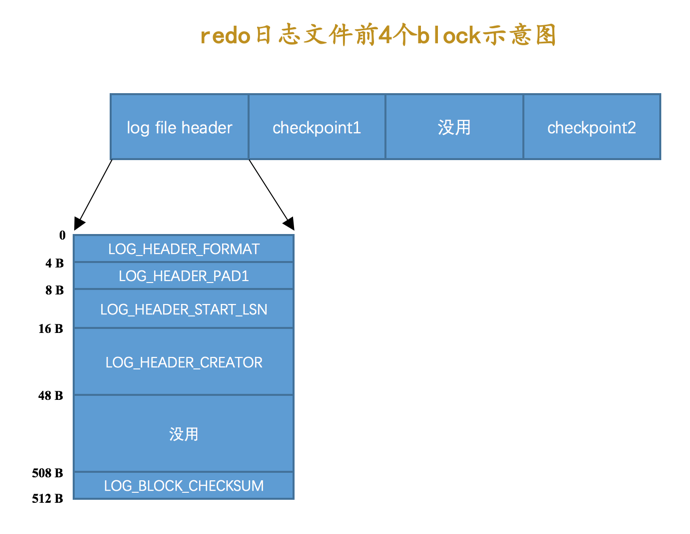

# redo日志文件组

MySQL的数据目录（使用SHOW VARIABLES LIKE 'datadir'查看）下默认有两个名为ib_logfile0和ib_logfile1的文件，log buffer中的日志默认情况下就是刷新到这两个磁盘文件中。如果我们对默认的redo日志文件不满意，可以通过下面几个启动参数来调节：

1. innodb_log_group_home_dir  该参数指定了redo日志文件所在的目录，默认值就是当前的数据目录。

2. innodb_log_file_size  该参数指定了每个redo日志文件的大小，在MySQL 5.7.21这个版本中的默认值为48MB，

3. innodb_log_files_in_group  该参数指定redo日志文件的个数，默认值为2，最大值为100。

磁盘上的redo日志文件不只一个，而是以一个日志文件组的形式出现的。这些文件以ib_logfile[数字]（数字可以是0、1、2...）的形式进行命名。在将redo日志写入日志文件组时，是从ib_logfile0开始写，如果ib_logfile0写满了，就接着ib_logfile1写，同理，ib_logfile1写满了就去写ib_logfile2，依此类推。如果写到最后一个文件该咋办？那就重新转到ib_logfile0继续写，所以整个过程如下图所示：

# redo log 文件的元数据

## 第一个block

|属性名|长度（单位：字节）|描述|
|--|--|--|
|LOG_HEADER_FORMAT|4|redo日志的版本，在MySQL 5.7.21中该值永远为1|
|LOG_HEADER_START_LSN|8|标记本redo日志文件开始的LSN值，也就是文件偏移量为2048字节处对应的LSN值|

## 第二个block

|属性名|长度（单位：字节）|描述|
|--|--|--|
|LOG_CHECKPOINT_NO|8|服务器做checkpoint的编号，每做一次checkpoint，该值就加1。|
|LOG_CHECKPOINT_LSN|8|服务器做checkpoint结束时对应的LSN值，系统崩溃恢复时将从该值开始。|
|LOG_CHECKPOINT_OFFSET|8|上个属性中的LSN值在redo日志文件组中的偏移量|
|LOG_CHECKPOINT_LOG_BUF_SIZE|8|服务器在做checkpoint操作时对应的log buffer的大小|

# Log Sequeue Number

InnoDB的为记录已经写入的redo日志量，设计了一个称之为Log Sequeue Number的全局变量，翻译过来就是：日志序列号，简称lsn，从8704开始，非连续的。

向log buffer中写入redo日志时不是一条一条写入的，而是以一个mtr生成的一组redo日志为单位进行写入的

## flushed_to_disk_lsn

lsn 当前系统中写入的redo日志量(字节量)，这包括了写到log buffer而没有刷新到磁盘的日志

flushed_to_disk_lsn用来标记log buffer中已经有哪些日志被刷新到磁盘中了

当有新的redo日志写入到log buffer时，首先lsn的值会增长，但flushed_to_disk_lsn不变，随后随着不断有log buffer中的日志被刷新到磁盘上，flushed_to_disk_lsn的值也跟着增长。如果两者的值相同时，说明log buffer中的所有redo日志都已经刷新到磁盘中了。

> buf_next_to_write的全局变量，标记当前log buffer中已经有哪些日志被刷新到磁盘中了