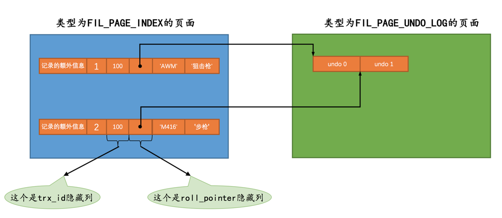

# 事务id

这个事务id本质上就是一个数字，它的分配策略和隐藏列row_id（当用户没有为表创建主键和UNIQUE键时InnoDB自动创建的列）的分配策略大抵相同，具体策略如下：

1. 服务器会在内存中维护一个全局变量，每当需要为某个事务分配一个事务id时，就会把该变量的值当作事务id分配给该事务，并且把该变量自增1。

2. 每当这个变量的值为256的倍数时，就会将该变量的值刷新到系统表空间的页号为5的页面中一个称之为Max Trx ID的属性处，这个属性占用8个字节的存储空间。

3. 当系统下一次重新启动时，会将上面提到的Max Trx ID属性加载到内存中，将该值加上256之后赋值给我们前面提到的全局变量（因为在上次关机时该全局变量的值可能大于Max Trx ID属性值）。

这样就可以保证整个系统中分配的事务id值是一个递增的数字。先被分配id的事务得到的是较小的事务id，后被分配id的事务得到的是较大的事务id。

# trx_id隐藏列

聚簇索引的记录除了会保存完整的用户数据以外，而且还会自动添加名为trx_id、roll_pointer的隐藏列，如果表中没有定义主键、UNIQUE键，还会自动添加一个名为row_id的隐藏列。

trx_id就是某个对这个聚簇索引记录做改动的语句所在的事务对应的事务id而已（此处的改动可以是INSERT、DELETE、UPDATE操作）

# undo日志的格式

InnoDB存储引擎在实际进行增、删、改一条记录时，都需要先把对应的undo日志记下来。一般每对一条记录做一次改动，就对应着一条undo日志，但在某些更新记录的操作中，也可能会对应着2条undo日志。一个事务在执行过程中可能新增、删除、更新若干条记录，也就是说需要记录很多条对应的undo日志，这些undo日志会被从0开始编号，也就是说根据生成的顺序分别被称为第0号undo日志、第1号undo日志、...、第n号undo日志等，这个编号也被称之为undo no

# roll_pointer隐藏列

这个占用7个字节的字段本质上就是一个指向记录对应的undo日志的一个指针。比方说向undo_demo表里插入了2条记录，每条记录都有与其对应的一条undo日志。记录被存储到了类型为FIL_PAGE_INDEX的页面中（就是数据页），undo日志被存放到了类型为FIL_PAGE_UNDO_LOG的页面中

