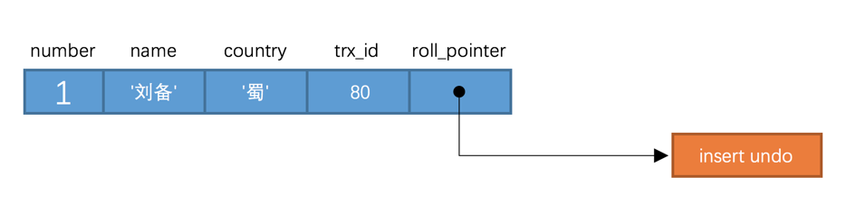
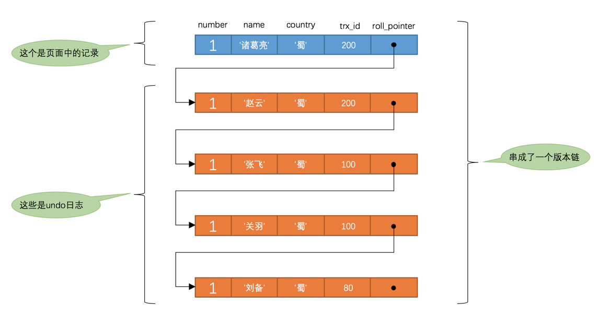

SQL标准中规定，针对不同的隔离级别，并发事务可以发生不同严重程度的问题，具体情况如下：

|隔离级别|脏读|不可重复读|幻读|
|--|--|--|--|
|READ UNCOMMITTED|Possible|Possible|Possible|
|READ COMMITTED|Not Possible|Possible|Possible|
|REPEATABLE READ|Not Possible|Not Possible|Possible|
|SERIALIZABLE|Not Possible|Not Possible|Not Possible|

脏写这个问题太严重了，不论是哪种隔离级别，都不允许脏写的情况发生

# MVCC原理

## 版本链

对于使用InnoDB存储引擎的表来说，它的聚簇索引记录中都包含两个必要的隐藏列（row_id并不是必要的，表中有主键或者非NULL的UNIQUE键时都不会包含row_id列）：

1. trx_id：每次一个事务对某条聚簇索引记录进行改动时，都会把该事务的事务id赋值给trx_id隐藏列。

2. roll_pointer：每次对某条聚簇索引记录进行改动时，都会把旧的版本写入到undo日志中，然后这个隐藏列就相当于一个指针，可以通过它来找到该记录修改前的信息。

> 实际上insert undo只在事务回滚时起作用，当事务提交后，该类型的undo日志就没用了，它占用的Undo Log Segment也会被系统回收（也就是该undo日志占用的Undo页面链表要么被重用，要么被释放）。虽然真正的insert undo日志占用的存储空间被释放了，但是roll_pointer的值并不会被清除，roll_pointer属性占用7个字节，第一个比特位就标记着它指向的undo日志的类型，如果该比特位的值为1时，就代表着它指向的undo日志类型为insert undo。

## ReadView（可见性视图）

1. 对于使用READ UNCOMMITTED隔离级别的事务来说，由于可以读到未提交事务修改过的记录，所以读取记录的最新版本就好了

2. 对于使用SERIALIZABLE隔离级别的事务来说，InnoDB使用加锁的方式来访问记录；

3. 对于使用READ COMMITTED和REPEATABLE READ隔离级别的事务来说，都必须保证读到已经提交了的事务修改过的记录，也就是说假如另一个事务已经修改了记录但是尚未提交，是不能直接读取最新版本的记录的，核心问题就是：需要判断一下版本链中的哪个版本是当前事务可见的。为此，InnoDB提出了一个ReadView(可见性视图)，ReadView中主要包含4个比较重要的内容：

1) m_ids：表示在生成ReadView时当前系统中活跃的读写事务的事务id列表。

2) min_trx_id：表示在生成ReadView时当前系统中活跃的读写事务中最小的事务id，也就是m_ids中的最小值。(比它小的，都已经提交了)

3) max_trx_id：表示生成ReadView时系统中应该分配给下一个事务的id值。（比它大的，都没有提交、甚至没有创建）

> 注意max_trx_id并不是m_ids中的最大值，事务id是递增分配的。比方说现在有id为1，2，3这三个事务，之后id为3的事务提交了。那么一个新的读事务在生成ReadView时，m_ids就包括1和2，min_trx_id的值就是1，max_trx_id的值就是4。

4) creator_trx_id：表示生成该ReadView的事务的事务id。

> 只有在对表中的记录做改动时（执行INSERT、DELETE、UPDATE这些语句时）才会为事务分配事务id，否则在一个只读事务中的事务id值都默认为0。

有了这个ReadView，这样在访问某条记录时，只需要按照下面的步骤判断记录的某个版本是否可见：

1) 如果被访问版本的trx_id属性值与ReadView中的creator_trx_id值相同，意味着当前事务在访问它自己修改过的记录，所以该版本可以被当前事务访问。
2) 如果被访问版本的trx_id属性值小于ReadView中的min_trx_id值，表明生成该版本的事务在当前事务生成ReadView前已经提交，所以该版本可以被当前事务访问。
3) 如果被访问版本的trx_id属性值大于ReadView中的max_trx_id值，表明生成该版本的事务在当前事务生成ReadView后才开启，所以该版本不可以被当前事务访问。
4) 如果被访问版本的trx_id属性值在ReadView的min_trx_id和max_trx_id之间，那就需要判断一下trx_id属性值是不是在m_ids列表中，如果在，说明创建ReadView时生成该版本的事务还是活跃的，该版本不可以被访问；如果不在，说明创建ReadView时生成该版本的事务已经被提交，该版本可以被访问。
  
如果某个版本的数据对当前事务不可见的话，那就顺着版本链找到下一个版本的数据，继续按照上面的步骤判断可见性，依此类推，直到版本链中的最后一个版本。如果最后一个版本也不可见的话，那么就意味着该条记录对该事务完全不可见，查询结果就不包含该记录。

READ COMMITTED和REPEATABLE READ所谓的生成ReadView的时机不同到底不同在哪里

1. READ COMMITTED —— 每次读取数据前都生成一个ReadView

2. REPEATABLE READ —— 在第一次读取数据时生成一个ReadView