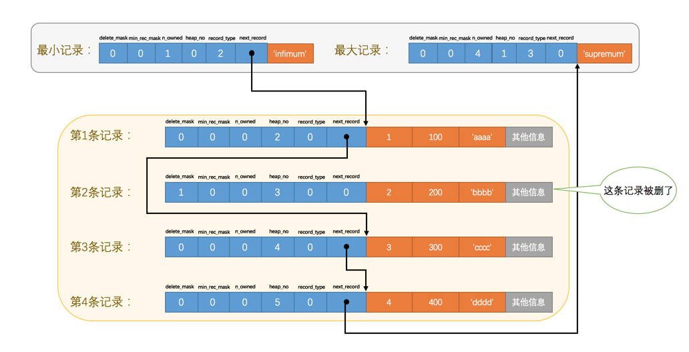

# 页简介

页是InnoDB管理存储空间的基本单位，一个页的大小一般是16KB。InnoDB为了不同的目的而设计了许多种不同类型的页，比如存放表空间头部信息的页，存放Insert Buffer信息的页，存放INODE信息的页，存放undo日志信息的页，存放表中记录的页（官方称这种页为索引页、INDEX页、数据页）。

# 数据页结构的快速浏览

|名称|中文名|占用空间大小|简单描述|
|--|--|--|--|
|File Header|文件头部|38字节|页的一些通用信息|
|Page Header|页面头部|56字节|数据页专有的一些信息|
|Infimum + Supremum|最小记录和最大记录|26字节|两个虚拟的行记录|
|User Records|用户记录|不确定|实际存储的行记录内容|
|Free Space|空闲空间|不确定|页中尚未使用的空间|
|Page Directory|页面目录|不确定|页中的某些记录的相对位置|
|File Trailer|文件尾部|8字节|校验页是否完整|

## 在页中插入记录

无论我们怎么对页中的记录做增删改查，In弄DB始终会维护一条记录的单链表，链表中的各个节点是按照主键值有小到大的顺序连接起来的

## delete_mask

行记录之间是没有间隔的。

被删除的记录之所以不立即从磁盘上删除，是因为移除它们之后其他的记录在磁盘上重新排列有性能损耗，所以只是打了一个删除标记而已，所有被删除的记录都会重新组成一个垃圾链表，它们占用的空间称之为可重用空间。

## min_rec_mask

## n_owned

## heap_no

当前记录在本页中的位置。从2开始，因为heap_no为0、1的是伪记录，分别表示最大和最小记录，分别放在Infimum和Supermum部分

## next_record

从当前记录的真实数据到下一条记录的真实数据的地址偏移量。指的是按照主键值有小到大的顺序的下一条记录。特别的，Infimum记录的下一条记录就是本页中主键值最小的用户记录，本页中主键值最大的用户记录的下一条就是Supermum记录。

