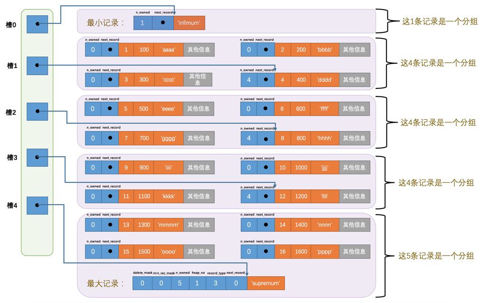

# 页简介

页是InnoDB管理存储空间的基本单位，一个页的大小一般是16KB。InnoDB为了不同的目的而设计了许多种不同类型的页，比如存放表空间头部信息的页，存放Insert Buffer信息的页，存放INODE信息的页，存放undo日志信息的页，存放表中记录的页（官方称这种页为索引页、INDEX页、数据页）。

# 数据页结构的快速浏览

|名称|中文名|占用空间大小|简单描述|
|--|--|--|--|
|File Header|文件头部|38字节|页的一些通用信息|
|Page Header|页面头部|56字节|数据页专有的一些信息|
|Infimum + Supremum|最小记录和最大记录|26字节|两个虚拟的行记录|
|User Records|用户记录|不确定|实际存储的行记录内容|
|Free Space|空闲空间|不确定|页中尚未使用的空间|
|Page Directory|页面目录|不确定|页中的某些记录的相对位置|
|File Trailer|文件尾部|8字节|校验页是否完整|

## 在页中插入记录

无论我们怎么对页中的记录做增删改查，In弄DB始终会维护一条记录的单链表，链表中的各个节点是按照主键值有小到大的顺序连接起来的

- delete_mask

行记录之间是没有间隔的。

被删除的记录之所以不立即从磁盘上删除，是因为移除它们之后其他的记录在磁盘上重新排列有性能损耗，所以只是打了一个删除标记而已，所有被删除的记录都会重新组成一个垃圾链表，它们占用的空间称之为可重用空间。

- min_rec_mask

- n_owned

- heap_no

当前记录在本页中的位置。从2开始，因为heap_no为0、1的是伪记录，分别表示最大和最小记录，分别放在Infimum和Supermum部分

- next_record

从当前记录的真实数据到下一条记录的真实数据的地址偏移量。指的是按照主键值有小到大的顺序的下一条记录。特别的，Infimum记录的下一条记录就是本页中主键值最小的用户记录，本页中主键值最大的用户记录的下一条就是Supermum记录。

当数据页中存在多条被删除的记录时，这些记录的next_record属性将会把这些被删除掉的记录组成一个垃圾链表，以备复用。

# Page Directory （页目录）

为当前页中的记录建立目录

目录页分组示意图如下：

对于最小记录所在的分组只能有 1 条记录，最大记录所在的分组拥有的记录条数只能在 1~8 条之间，剩下的分组中记录的条数范围只能在是 4~8 条之间。

所以在一个数据页中查找指定主键值的记录的过程分为两步：

通过二分法确定该记录所在的槽，并找到该槽中主键值最小的那条记录。

通过记录的next_record属性遍历该槽所在的组中的各个记录。

# File Header (文件头部)

不同类型的页都有File Header，他描述了针对各种页通用的一些信息，比如页标号、上一个页下一个页的编号，占38字节

|名称|占用空间大小|描述|
|-|-|-|
|FIL_PAGE_SPACE_OR_CHKSUM|4字节|页的校验和（checksum值）|
|FIL_PAGE_OFFSET|4字节|页号|
|FIL_PAGE_PREV|4字节|上一个页的页号|
|FIL_PAGE_NEXT|4字节|下一个页的页号|
|FIL_PAGE_LSN|8字节|页面被最后修改时对应的日志序列位置(英文名是：Log Sequence Number)|
|FIL_PAGE_TYPE|2字节|该页的类型|
|FIL_PAGE_FILE_FLUSH_LSN|8字节|仅在系统表空间的一个页中定义，代表文件至少被刷新到了对应的LSN值|
|FIL_PAGE_ARCH_LOG_NO_OR_SPACE_ID|4字节|页属于哪个表空间|

注意 FIL_PAGE_TYPE

|类型名称|十六进制|描述|
|-|-|-|
|FIL_PAGE_TYPE_ALLOCATED|0x0000|最新分配，还没使用|
|FIL_PAGE_UNDO_LOG|0x0002|Undo日志页|
|FIL_PAGE_INODE|0x0003|段信息节点|
|FIL_PAGE_IBUF_FREE_LIST|0x0004|Insert Buffer空闲列表|
|FIL_PAGE_IBUF_BITMAP|0x0005|Insert Buffer位图|
|FIL_PAGE_TYPE_SYS|0x0006|系统页|
|FIL_PAGE_TYPE_TRX_SYS|0x0007|事务系统数据|
|FIL_PAGE_TYPE_FSP_HDR|0x0008|表空间头部信息|
|FIL_PAGE_TYPE_XDES|0x0009|扩展描述页|
|FIL_PAGE_TYPE_BLOB|0x000A|BLOB页|
|FIL_PAGE_INDEX|0x45BF|索引页，也就是我们所说的数据页|

# Page Header （页头部）

针对数据页记录的各种状态信息（比如页里头有多少个记录、多少个槽）

|名称|占用空间大小|描述|
|-|-|-|
|PAGE_N_DIR_SLOTS|2字节|在页目录中的槽数量|
|PAGE_HEAP_TOP|2字节|还未使用的空间最小地址，也就是说从该地址之后就是Free Space|
|PAGE_N_HEAP|2字节|本页中的记录的数量（包括最小和最大记录以及标记为删除的记录）|
|PAGE_FREE|2字节|第一个已经标记为删除的记录地址（各个已删除的记录通过next_record也会组成一个单链表，这个单链表中的记录可以被重新利用）|
|PAGE_GARBAGE|2字节|已删除记录占用的字节数|
|PAGE_LAST_INSERT|2字节|最后插入记录的位置|
|PAGE_DIRECTION|2字节|记录插入的方向:最新一条插入记录的主键比上一条的大那么插入方向是向右，反之向左|
|PAGE_N_DIRECTION|2字节|一个方向连续插入的记录数量|
|PAGE_N_RECS|2字节|该页中记录的数量（不包括最小和最大记录以及被标记为删除的记录）|
|PAGE_MAX_TRX_ID|8字节|修改当前页的最大事务ID，该值仅在二级索引中定义|
|PAGE_LEVEL|2字节|当前页在B+树中所处的层级|
|PAGE_INDEX_ID|8字节|索引ID，表示当前页属于哪个索引|
|PAGE_BTR_SEG_LEAF|10字节|B+树叶子段的头部信息，仅在B+树的Root页定义|
|PAGE_BTR_SEG_TOP|10字节|B+树非叶子段的头部信息，仅在B+树的Root页定义|

# Page Trailer （页头部）

包含8字节，可以分成2个小部分：

前4个字节代表页的校验和。这个部分是和File Header中的校验和相对应的。每当一个页面在内存中修改了，在同步之前就要把它的校验和算出来，因为File Header在页面的前面，所以校验和会被首先同步到磁盘，当完全写完时，校验和也会被写到页的尾部，如果完全同步成功，则页的首部和尾部的校验和应该是一致的。如果写了一半儿断电了，那么在File Header中的校验和就代表着已经修改过的页，而在File Trialer中的校验和代表着原先的页，二者不同则意味着同步中间出了错

后4个字节代表页面被最后修改时对应的日志序列位置（LSN）。这个部分也是为了校验页的完整性的，只不过我们目前还没说LSN是个什么意思，所以大家可以先不用管这个属性。
