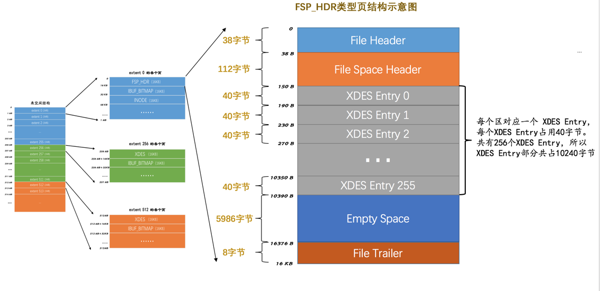

# 区（extent）和组

表空间中的页实在是太多了，为了更好的管理这些页，设计InnoDB的大佬们提出了区（英文名：extent）的概念。对于16KB的页来说，连续的64个页就是一个区，也就是说一个区默认占用1MB空间大小。不论是系统表空间还是独立表空间，都可以看成是由若干个区组成的，每256个区被划分成一组。

InnoDB表空间的结构


InnoDB表空间的结构-分组

其中extent 0 ~ extent 255这256个区算是第一个组，extent 256 ~ extent 511这256个区算是第二个组，extent 512 ~ extent 767这256个区算是第三个组（图中并未画全第三个组全部的区，请自行脑补），依此类推可以划分更多的组。这些组的头几个页的类型都是类似的，就像这样：


1. 第1个组最开始的3个页的类型是固定的，也就是说extent 0这个区最开始的3个页的类型是固定的，分别是：

- FSP_HDR类型: 这个类型的页是用来登记整个表空间的一些整体属性以及本组所有的区，也就是extent 0 ~ extent 255这256个区的属性.整个表空间只有一个FSP_HDR类型的页。

- IBUF_BITMAP类型：这个类型的页是存储本组所有的区的所有页关于INSERT BUFFER的信息。

- INODE类型：这个类型的页存储了许多称为INODE的数据结构。

2. 其余各组最开始的2个页的类型是固定的，也就是说extent 256、extent 512这些区最开始的2个页的类型是固定的，分别是：

- XDES类型: 全称是extent descriptor，用来登记本组256个区的属性。上面介绍的FSP_HDR类型的页其实和XDES类型的页的作用类似，只不过FSP_HDR类型的页还会额外存储一些表空间的属性。

- IBUF_BITMAP类型.


# 段Segment

对B+树的叶子节点和非叶子节点进行了区别对待，也就是说叶子节点有自己独有的区，非叶子节点也有自己独有的区。存放叶子节点的区的集合就算是一个段（segment），存放非叶子节点的区的集合也算是一个段。也就是说一个索引会生成2个段，一个叶子节点段，一个非叶子节点段。

# 碎片区
现在为了考虑以完整的区为单位分配给某个段对于数据量较小的表太浪费存储空间的这种情况，InnoDB提出了一个碎片（fragment）区的概念，也就是在一个碎片区中，并不是所有的页都是为了存储同一个段的数据而存在的，而是碎片区中的页可以用于不同的目的，比如有些页用于段A，有些页用于段B，有些页甚至哪个段都不属于。碎片区直属于表空间，并不属于任何一个段。所以此后为某个段分配存储空间的策略是这样的：

- 在刚开始向表中插入数据的时候，段是从某个碎片区以单个页为单位来分配存储空间的。
- 当某个段已经占用了32个碎片区页之后，就会以完整的区为单位来分配存储空间

段不能仅定义为是某些区的集合，更精确的应该是某些零散的页以及一些完整的区的集合。除了索引的叶子节点段和非叶子节点段之外，InnoDB中还有为存储一些特殊的数据而定义的段，比如回滚段

# 区的分类

- FREE 空闲的区：现在还没有用到这个区中的任何页。

- FREE_FRAG 有剩余空间的碎片区：表示碎片区中还有可用的页。

- FULL_FRAG 没有剩余空间的碎片区：表示碎片区中的所有页都被使用，没有空闲页。

- FSEG 附属于某个段的区。每一个索引都可以分为叶子节点段和非叶子节点段，除此之外InnoDB还会另外定义一些特殊作用的段，在这些段中的数据量很大时将使用区来作为基本的分配单位。

需要再次强调一遍的是，处于FREE、FREE_FRAG以及FULL_FRAG这三种状态的区都是独立的，算是直属于表空间；而处于FSEG状态的区是附属于某个段的。

XDES Entry（Extent Descriptor Entry）是用来管理区的结构，每一个区都对应着一个XDES Entry结构。


- Segment ID（8字节）。每一个段都有一个唯一的编号，用ID表示，此处的Segment ID字段表示就是该区所在的段。当然前提是该区已经被分配给某个段了，不然的话该字段的值没什么意义。

- List Node（12字节）。这个部分可以将若干个XDES Entry结构串联成一个链表，大家看一下这个List Node的结构：

- State（4字节）。这个字段表明区的状态。可选的值就是我们前面说过的那4个，分别是：FREE、FREE_FRAG、FULL_FRAG和FSEG。

- Page State Bitmap（16字节）。这个部分共占用16个字节，也就是128个比特位。我们说一个区默认有64个页，这128个比特位被划分为64个部分，每个部分2个比特位，对应区中的一个页。比如Page State Bitmap部分的第1和第2个比特位对应着区中的第1个页，第3和第4个比特位对应着区中的第2个页，依此类推，Page State Bitmap部分的第127和128个比特位对应着区中的第64个页。这两个比特位的第一个位表示对应的页是否是空闲的，第二个比特位还没有用。

# XDES Entry 链表

...

# 链表小结

综上所述，表空间是由若干个区组成的，每个区都对应一个XDES Entry的结构，直属于表空间的区对应的XDES Entry结构可以分成FREE、FREE_FRAG和FULL_FRAG这3个链表；每个段可以附属若干个区，每个段中的区对应的XDES Entry结构可以分成FREE、NOT_FULL和FULL这3个链表。每个链表都对应一个List Base Node的结构，这个结构里记录了链表的头、尾节点的位置以及该链表中包含的节点数。正是因为这些链表的存在，管理这些区才变成了一件so easy的事情。

# 段的结构

段其实不对应表空间中某一个连续的物理区域，而是一个逻辑上的概念，由若干个零散的页以及一些完整的区组成。像每个区都有对应的XDES Entry来记录这个区中的属性一样，设计InnoDB的大佬为每个段都定义了一个INODE Entry结构来记录一下段中的属性。


- Fragment Array Entry 段是一些零散页和一些完整的区的集合，每个Fragment Array Entry结构都对应着一个零散的页，这个结构一共4个字节，表示一个零散页的页号。

# 各类页详情情况

## FSP_HDR 类型

第一个组的第一个页，当然也是表空间的第一个页，页号为0。这个页的类型是FSP_HDR，它存储了表空间的一些整体属性以及第一个组内256个区的对应的XDES Entry结构，直接看这个类型的页的示意图。




## XDES 类型

每一个XDES Entry（40字节）对应表空间的一个区。在区的数量非常多时，一个单独的页可能就不够存放足够多的XDES Entry结构，所以表空间的区分为了若干个组，每组开头的一个页记录着本组内所有的区对应的XDES Entry结构。由于第一个组的第一个页有些特殊，因为它也是整个表空间的第一个页，所以除了记录本组中的所有区对应的XDES Entry结构以外，还记录着表空间的一些整体属性，这个页的类型就是上面的的FSP_HDR类型，整个表空间里只有一个这个类型的页。除去第一个分组以外，之后的每个分组的第一个页只需要记录本组内所有的区对应的XDES Entry结构即可，不需要再记录表空间的属性了，为了和FSP_HDR类型做区别，每个分组的第一个页的类型定义为XDES，它的结构和FSP_HDR类型是非常相似的：


## IBUF_BITMAP 类型

记录了一些有关Change Buffer

## INODE 类型

InnoDB为每个索引定义了两个段，而且为某些特殊功能定义了些特殊的段。为了方便管理，又为每个段设计了一个INODE Entry结构，这个结构中记录了关于这个段的相关属性。INODE类型的页就是为了存储INODE Entry结构而存在的。

# 系统表空间

整个MySQL进程只有一个系统表空间，在系统表空间中会额外记录一些有关整个系统信息的页，所以会比独立表空间多出一些记录这些信息的页，它的表空间 ID（Space ID）是0。


## InnoDB数据字典

我们平时使用INSERT语句向表中插入的那些记录称之为用户数据，MySQL只是作为一个软件来为我们来保管这些数据，提供方便的增删改查接口而已。但是每当我们向一个表中插入一条记录的时候，MySQL先要校验一下插入语句对应的表存不存在，插入的列和表中的列是否符合，如果语法没有问题的话，还需要知道该表的聚簇索引和所有二级索引对应的根页是哪个表空间的哪个页，然后把记录插入对应索引的B+树中。所以说，MySQL除了保存着我们插入的用户数据之外，还需要保存许多额外的信息，比方说：

- 某个表属于哪个表空间，表里边有多少列
- 表对应的每一个列的类型是什么
- 该表有多少索引，每个索引对应哪几个字段，该索引对应的根页在哪个表空间的哪个页
- 该表有哪些外键，外键对应哪个表的哪些列
- 某个表空间对应文件系统上文件路径是什么

为了更好的管理我们这些用户数据而不得已引入的一些额外数据，这些数据也称为元数据。InnoDB存储引擎特意定义了一些列的内部系统表（internal system table）来记录这些这些元数据：

|表名|描述|
|--|--|
|SYS_TABLES|整个InnoDB存储引擎中所有的表的信息|
|SYS_COLUMNS|整个InnoDB存储引擎中所有的列的信息|
|SYS_INDEXES|整个InnoDB存储引擎中所有的索引的信息|
|SYS_FIELDS|整个InnoDB存储引擎中所有的索引对应的列的信息|
|SYS_FOREIGN|整个InnoDB存储引擎中所有的外键的信息|
|SYS_FOREIGN_COLS|整个InnoDB存储引擎中所有的外键对应列的信息|
|SYS_TABLESPACES|整个InnoDB存储引擎中所有的表空间信息|
|SYS_DATAFILES|整个InnoDB存储引擎中所有的表空间对应文件系统的文件路径信息|
|SYS_VIRTUAL|整个InnoDB存储引擎中所有的虚拟生成列的信息|

这些系统表也被称为数据字典，它们都是以B+树的形式保存在系统表空间的某些页中，其中SYS_TABLES、SYS_COLUMNS、SYS_INDEXES、SYS_FIELDS这四个表尤其重要，称之为基本系统表（basic system tables）

## Data Dictionary Header页

只要有了上述4个基本系统表，也就意味着可以获取其他系统表以及用户定义的表的所有元数据。比方说我们想看看SYS_TABLESPACES这个系统表里存储了哪些表空间以及表空间对应的属性，那就可以：

1. 到SYS_TABLES表中根据表名定位到具体的记录，就可以获取到SYS_TABLESPACES表的TABLE_ID

2. 使用这个TABLE_ID到SYS_COLUMNS表中就可以获取到属于该表的所有列的信息。

3. 使用这个TABLE_ID还可以到SYS_INDEXES表中获取所有的索引的信息，索引的信息中包括对应的INDEX_ID，还记录着该索引对应的B+数根页是哪个表空间的哪个页。

4. 使用INDEX_ID就可以到SYS_FIELDS表中获取所有索引列的信息。

InnoDB使用一个固定的页来记录这4个表的聚簇索引和二级索引对应的B+树位置，这个页就是页号为7的页，类型为SYS，记录了Data Dictionary Header，也就是数据字典的头部信息。除了这4个表的5个索引的根页信息外，这个页号为7的页还记录了整个InnoDB存储引擎的一些全局属性，说话太啰嗦，直接看这个页的示意图：


|名称|中文名|占用空间大小|简单描述|
|-|-|-|-|
|File Header|文件头部|38字节|页的一些通用信息|
|Data Dictionary Header|数据字典头部信息|56字节|记录一些基本系统表的根页位置以及InnoDB存储引擎的一些全局信息|
|Segment Header|段头部信息|10字节|记录本页所在段对应的INODE Entry位置信息|
|Empty Space|尚未使用空间|16272字节|用于页结构的填充，没什么实际意义|
|File Trailer|文件尾部|8字节|校验页是否完整|

可以看到这个页里竟然有Segment Header部分，意味着设计InnoDB的大佬把这些有关数据字典的信息当成一个段来分配存储空间，我们就姑且称之为数据字典段吧。由于目前我们需要记录的数据字典信息非常少（可以看到Data Dictionary Header部分仅占用了56字节），所以该段只有一个碎片页，也就是页号为7的这个页。

- Max Row ID：如果不显式的为表定义主键，且表中也没有UNIQUE索引，那么InnoDB存储引擎会默认生成一个名为row_id的列作为主键。因为它是主键，所以每条记录的row_id列的值不能重复。原则上只要一个表中的row_id列不重复就可以了，也就是说表a和表b拥有一样的row_id列也没什么关系，不过设计InnoDB只提供了这个Max Row ID字段，不论哪个拥有row_id列的表插入一条记录时，该记录的row_id列的值就是Max Row ID对应的值，然后再把Max Row ID对应的值加1，也就是说这个Max Row ID是全局共享的。
- Max Table ID：InnoDB存储引擎中的所有的表都对应一个唯一的ID，每次新建一个表时，就会把本字段的值作为该表的ID，然后自增本字段的值。
- Max Index ID：InnoDB存储引擎中的所有的索引都对应一个唯一的ID，每次新建一个索引时，就会把本字段的值作为该索引的ID，然后自增本字段的值。
- Max Space ID：InnoDB存储引擎中的所有的表空间都对应一个唯一的ID，每次新建一个表空间时，就会把本字段的值作为该表空间的ID，然后自增本字段的值。
- Mix ID Low(Unused)：这个字段没什么用，跳过。
- Root of SYS_TABLES clust index：本字段代表SYS_TABLES表聚簇索引的根页的页号。
- Root of SYS_TABLE_IDS sec index：本字段代表SYS_TABLES表为ID列建立的二级索引的根页的页号。
- Root of SYS_COLUMNS clust index：本字段代表SYS_COLUMNS表聚簇索引的根页的页号。
- Root of SYS_INDEXES clust index本字段代表SYS_INDEXES表聚簇索引的根页的页号。
- Root of SYS_FIELDS clust index：本字段代表SYS_FIELDS表聚簇索引的根页的页号。
- Unused：这4个字节没用，跳过。

 以上就是页号为7的页的全部内容，初次看可能会懵逼（因为有点儿绕），大家多瞅几次。

## information_schema系统数据库

用户是不能直接访问InnoDB的这些内部系统表的，除非直接去解析系统表空间对应文件系统上的文件。不过考虑到查看这些表的内容可能有助于大家分析问题，所以在系统数据库information_schema中提供了一些以innodb_sys开头的表：

```sh
mysql> USE information_schema;
Database changed

mysql> SHOW TABLES LIKE 'innodb_sys%';
+--------------------------------------------+
| Tables_in_information_schema (innodb_sys%) |
+--------------------------------------------+
| INNODB_SYS_DATAFILES                       |
| INNODB_SYS_VIRTUAL                         |
| INNODB_SYS_INDEXES                         |
| INNODB_SYS_TABLES                          |
| INNODB_SYS_FIELDS                          |
| INNODB_SYS_TABLESPACES                     |
| INNODB_SYS_FOREIGN_COLS                    |
| INNODB_SYS_COLUMNS                         |
| INNODB_SYS_FOREIGN                         |
| INNODB_SYS_TABLESTATS                      |
+--------------------------------------------+
10 rows in set (0.00 sec)

```

在information_schema数据库中的这些以INNODB_SYS开头的表并不是真正的内部系统表（内部系统表就是我们上面介绍的以SYS开头的那些表），而是在存储引擎启动时读取这些以SYS开头的系统表，然后填充到这些以INNODB_SYS开头的表中。以INNODB_SYS开头的表和以SYS开头的表中的字段并不完全一样，但供大家参考已经足矣。


