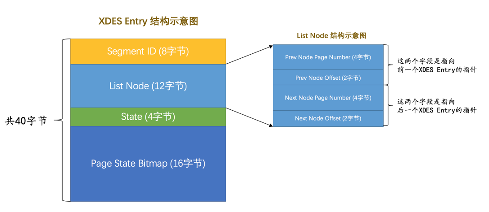

# 区（extent）和组

表空间中的页实在是太多了，为了更好的管理这些页，设计InnoDB的大佬们提出了区（英文名：extent）的概念。对于16KB的页来说，连续的64个页就是一个区，也就是说一个区默认占用1MB空间大小。不论是系统表空间还是独立表空间，都可以看成是由若干个区组成的，每256个区被划分成一组。

InnoDB表空间的结构

InnoDB表空间的结构-分组

其中extent 0 ~ extent 255这256个区算是第一个组，extent 256 ~ extent 511这256个区算是第二个组，extent 512 ~ extent 767这256个区算是第三个组（图中并未画全第三个组全部的区，请自行脑补），依此类推可以划分更多的组。这些组的头几个页的类型都是类似的，就像这样：

1. 第1个组最开始的3个页的类型是固定的，也就是说extent 0这个区最开始的3个页的类型是固定的，分别是：

- FSP_HDR类型: 这个类型的页是用来登记整个表空间的一些整体属性以及本组所有的区，也就是extent 0 ~ extent 255这256个区的属性.整个表空间只有一个FSP_HDR类型的页。

- IBUF_BITMAP类型：这个类型的页是存储本组所有的区的所有页关于INSERT BUFFER的信息。

- INODE类型：这个类型的页存储了许多称为INODE的数据结构。

2. 其余各组最开始的2个页的类型是固定的，也就是说extent 256、extent 512这些区最开始的2个页的类型是固定的，分别是：

- XDES类型: 全称是extent descriptor，用来登记本组256个区的属性。上面介绍的FSP_HDR类型的页其实和XDES类型的页的作用类似，只不过FSP_HDR类型的页还会额外存储一些表空间的属性。

- IBUF_BITMAP类型.

# 段Segment

对B+树的叶子节点和非叶子节点进行了区别对待，也就是说叶子节点有自己独有的区，非叶子节点也有自己独有的区。存放叶子节点的区的集合就算是一个段（segment），存放非叶子节点的区的集合也算是一个段。也就是说一个索引会生成2个段，一个叶子节点段，一个非叶子节点段。

# 碎片区
现在为了考虑以完整的区为单位分配给某个段对于数据量较小的表太浪费存储空间的这种情况，InnoDB提出了一个碎片（fragment）区的概念，也就是在一个碎片区中，并不是所有的页都是为了存储同一个段的数据而存在的，而是碎片区中的页可以用于不同的目的，比如有些页用于段A，有些页用于段B，有些页甚至哪个段都不属于。碎片区直属于表空间，并不属于任何一个段。所以此后为某个段分配存储空间的策略是这样的：

- 在刚开始向表中插入数据的时候，段是从某个碎片区以单个页为单位来分配存储空间的。
- 当某个段已经占用了32个碎片区页之后，就会以完整的区为单位来分配存储空间

段不能仅定义为是某些区的集合，更精确的应该是某些零散的页以及一些完整的区的集合。除了索引的叶子节点段和非叶子节点段之外，InnoDB中还有为存储一些特殊的数据而定义的段，比如回滚段

# 区的分类

- FREE 空闲的区：现在还没有用到这个区中的任何页。

- FREE_FRAG 有剩余空间的碎片区：表示碎片区中还有可用的页。

- FULL_FRAG 没有剩余空间的碎片区：表示碎片区中的所有页都被使用，没有空闲页。

- FSEG 附属于某个段的区。每一个索引都可以分为叶子节点段和非叶子节点段，除此之外InnoDB还会另外定义一些特殊作用的段，在这些段中的数据量很大时将使用区来作为基本的分配单位。

需要再次强调一遍的是，处于FREE、FREE_FRAG以及FULL_FRAG这三种状态的区都是独立的，算是直属于表空间；而处于FSEG状态的区是附属于某个段的。

XDES Entry（Extent Descriptor Entry）是用来管理区的结构，每一个区都对应着一个XDES Entry结构。

- Segment ID（8字节）。每一个段都有一个唯一的编号，用ID表示，此处的Segment ID字段表示就是该区所在的段。当然前提是该区已经被分配给某个段了，不然的话该字段的值没什么意义。

- List Node（12字节）。这个部分可以将若干个XDES Entry结构串联成一个链表，大家看一下这个List Node的结构：

- State（4字节）。这个字段表明区的状态。可选的值就是我们前面说过的那4个，分别是：FREE、FREE_FRAG、FULL_FRAG和FSEG。

- Page State Bitmap（16字节）。这个部分共占用16个字节，也就是128个比特位。我们说一个区默认有64个页，这128个比特位被划分为64个部分，每个部分2个比特位，对应区中的一个页。比如Page State Bitmap部分的第1和第2个比特位对应着区中的第1个页，第3和第4个比特位对应着区中的第2个页，依此类推，Page State Bitmap部分的第127和128个比特位对应着区中的第64个页。这两个比特位的第一个位表示对应的页是否是空闲的，第二个比特位还没有用。

# XDES Entry 链表

...

# 链表小结

综上所述，表空间是由若干个区组成的，每个区都对应一个XDES Entry的结构，直属于表空间的区对应的XDES Entry结构可以分成FREE、FREE_FRAG和FULL_FRAG这3个链表；每个段可以附属若干个区，每个段中的区对应的XDES Entry结构可以分成FREE、NOT_FULL和FULL这3个链表。每个链表都对应一个List Base Node的结构，这个结构里记录了链表的头、尾节点的位置以及该链表中包含的节点数。正是因为这些链表的存在，管理这些区才变成了一件so easy的事情。

# 段的结构

段其实不对应表空间中某一个连续的物理区域，而是一个逻辑上的概念，由若干个零散的页以及一些完整的区组成。像每个区都有对应的XDES Entry来记录这个区中的属性一样，设计InnoDB的大佬为每个段都定义了一个INODE Entry结构来记录一下段中的属性。

