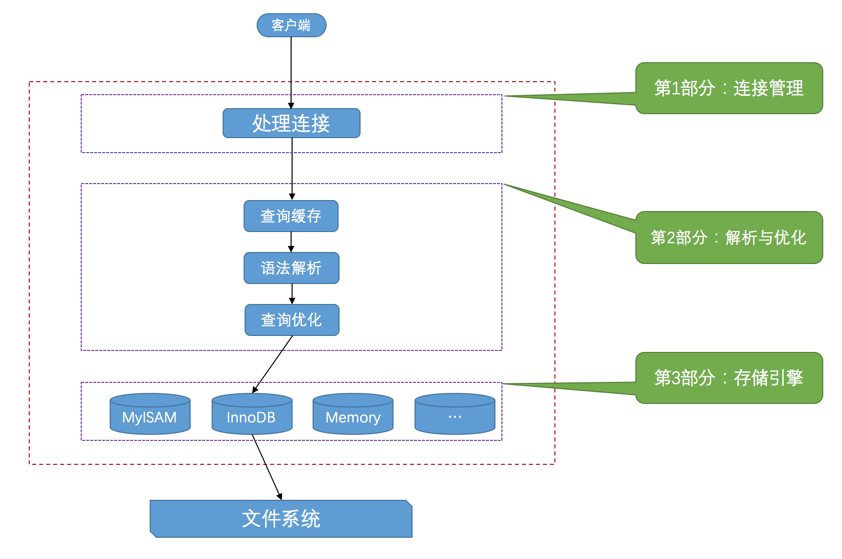

# mysql的程序或工具有哪些

- mysqld 代表着MySQL服务器程序，运行这个可执行文件就可以直接启动一个服务器进程

- mysqld_safe 是一个启动脚本，它会间接的调用mysqld，而且还顺便启动了另外一个监控进程，这个监控进程在服务器进程挂了的时候，可以帮助重启它。另外，使用mysqld_safe启动服务器程序时，它会将服务器程序的出错信息和其他诊断信息重定向到某个文件中，产生出错日志，这样可以方便我们找出发生错误的原因。

- mysql.server也是一个启动脚本，它会间接的调用mysqld_safe，在调用mysql.server时在后边指定start参数就可以启动服务器程序了，就像这样`mysql.server start`, 也可以`mysql.server stop`

# 使用Unix域套接字文件通信

可以使用Unix域套接字文件来进行进程间通信。如果我们在启动客户端程序的时候指定的主机名为localhost，或者指定了--protocol=socket的启动参数，那服务器程序和客户端程序之间就可以通过Unix域套接字文件来进行通信了。

MySQL服务器程序默认监听的Unix域套接字文件路径为/tmp/mysql.sock，客户端程序也默认连接到这个Unix域套接字文件。如果我们想改变这个默认路径，可以在启动服务器程序时指定socket参数，就像这样：

`mysqld --socket=/tmp/a.txt`

# 服务器处理客户端请求

# 连接管理

客户端进程可以采用TCP/IP、命名管道或共享内存、Unix域套接字这几种方式之一来与服务器进程建立连接。MySQL服务器会为每一个连接进来的客户端分配一个线程（从线程池），但是线程分配的太多了会严重影响系统性能

# 解析与优化

## 查询缓存

- MySQL服务器程序处理查询请求的过程也是这样，会把刚刚处理过的查询请求和结果缓存起来，如果下一次有一模一样的请求过来，直接从缓存中查找结果

- 如果两个查询请求在任何字符上的不同（例如：空格、注释、大小写），都会导致缓存不会命中。另外，如果查询请求中包含某些系统函数、用户自定义变量和函数、一些系统表，如 mysql 、information_schema、 performance_schema 数据库中的表，那这个请求就不会被缓存。

- MySQL的缓存系统会监测涉及到的每张表，只要该表的结构或者数据被修改，如对该表使用了INSERT、 UPDATE、DELETE、TRUNCATE TABLE、ALTER TABLE、DROP TABLE或 DROP DATABASE语句，那使用该表的所有高速缓存查询都将变为无效并从高速缓存中删除！

> 从MySQL 5.7.20开始，不推荐使用查询缓存，并在MySQL 8.0中删除。

## 语法解析

这个从指定的文本中提取出我们需要的信息本质上算是一个编译过程，涉及词法解析、语法分析、语义分析等阶段，这些问题不属于我们讨论的范畴，大家只要了解在处理请求的过程中需要这个步骤就好了。

## 查询优化

语法解析之后，服务器程序获得到了需要的信息，比如要查询的列是哪些，表是哪个，搜索条件是什么等等，但光有这些是不够的，因为我们写的MySQL语句执行起来效率可能并不是很高，MySQL的优化程序会对我们的语句做一些优化，如外连接转换为内连接、表达式简化、子查询转为连接等等的一堆东西。优化的结果就是生成一个执行计划，这个执行计划表明了应该使用哪些索引进行查询，表之间的连接顺序是什么样的。我们可以使用EXPLAIN语句来查看某个语句的执行计划

## 存储引擎

表是由一行一行的记录组成的，但这只是一个逻辑上的概念，物理上如何表示记录，怎么从表中读取数据，怎么把数据写入具体的物理存储器上，这都是存储引擎负责的事情。

为了管理方便，人们把连接管理、查询缓存、语法解析、查询优化这些并不涉及真实数据存储的功能划分为MySQL server的功能，把真实存取数据的功能划分为存储引擎的功能。**各种不同的存储引擎向上面的MySQL server层提供统一的调用接口**（也就是存储引擎API），包含了几十个底层函数，像"读取索引第一条内容"、"读取索引下一条内容"、"插入记录"等等。

在MySQL server完成了查询优化后，只需按照生成的执行计划调用底层存储引擎提供的API，获取到数据后返回给客户端就好了。

常用存储引擎
- ARCHIVE    用于数据存档（行被插入后不能再修改）
- BLACKHOLE    丢弃写操作，读操作会返回空内容
- CSV    在存储数据时，以逗号分隔各个数据项
- InnoDB    具备外键支持功能的事务存储引擎，是默认的
- MEMORY    置于内存的表
- MERGE   用来管理多个MyISAM表构成的表集合
- MyISAM    主要的非事务处理存储引擎
- NDB    MySQL集群专用存储引擎