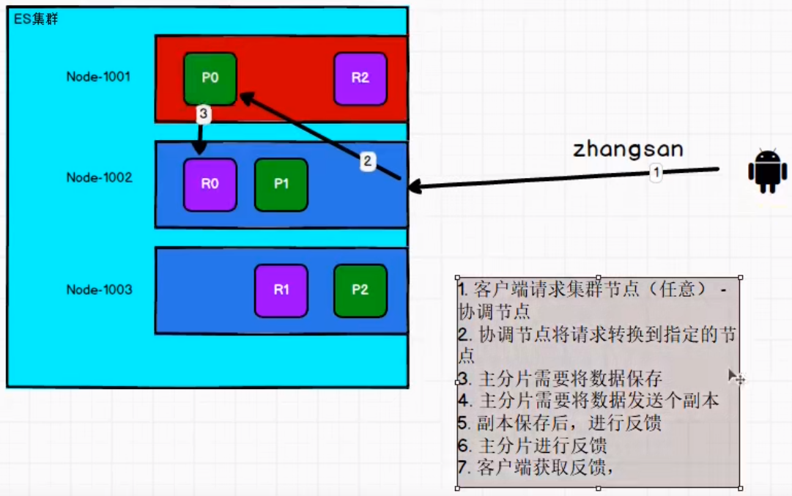
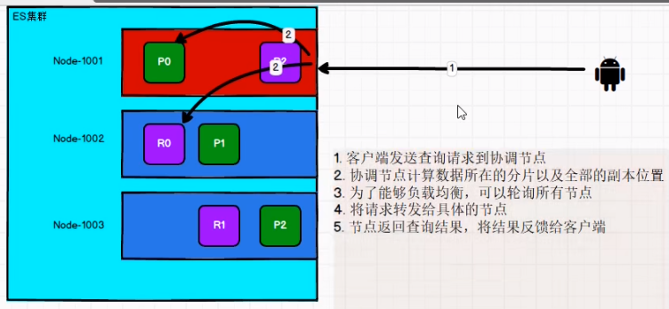
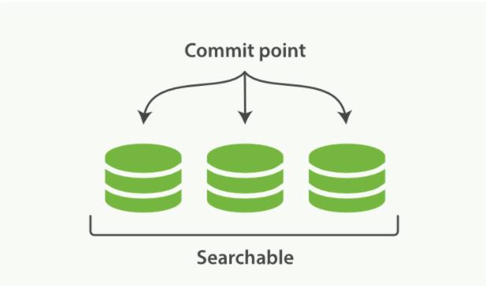
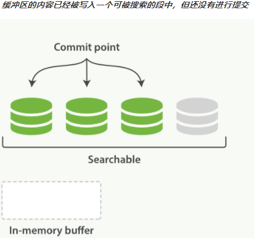
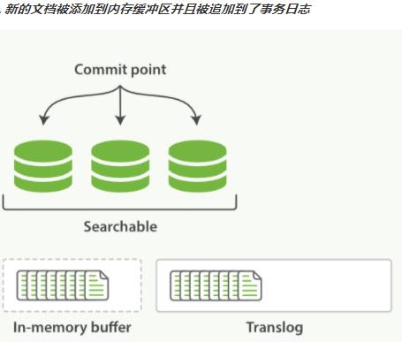

# 概念
## 映射Mapping

索引的结构信息

mapping 是处理数据的方式和规则方面做一些限制，如：某个字段的数据类型、默认值、分析器、是否被索引等等。这些都是映射里面可以设置的，其它就是处理 ES 里面数据的一些使用规则设置也叫做映射，按着最优规则处理数据对性能提高很大，因此才需要建立映射，并且需要思考如何建立映射才能对性能更好。

## 分片Shards

一个索引可以存储超出单个节点硬件限制的大量数据。比如，一个具有 10 亿文档数据的索引占据 1TB 的磁盘空间，而任一节点都可能没有这样大的磁盘空间。 或者单个节点处理搜索请求，响应太慢。为了解决这个问题，**Elasticsearch 提供了将索引划分成多份的能力，每一份就称之为分片。**当你创建一个索引的时候，你可以指定你想要的分片的数量。每个分片本身也是一个功能完善并且独立的“索引”，这个“索引”可以被放置到集群中的任何节点上。

分片很重要，主要有两方面的原因：

- 允许你水平分割 / 扩展你的内容容量。
- 允许你在分片之上进行分布式的、并行的操作，进而提高性能/吞吐量。

至于一个分片怎样分布，它的文档怎样聚合和搜索请求，是完全由 Elasticsearch 管理的，对于作为用户的你来说，这些都是透明的，无需过分关心。

**一个 Lucene 索引 我们在 Elasticsearch 称作 分片 。 一个Elasticsearch 索引 是分片的集合。 当 Elasticsearch 在索引中搜索的时候， 他发送查询到每一个属于索引的分片（Lucene 索引），然后合并每个分片的结果到一个全局的结果集。**

Lucene 是 Apache 软件基金会 Jakarta 项目组的一个子项目，提供了一个简单却强大的应用程式接口，能够做全文索引和搜寻。在 Java 开发环境里 Lucene 是一个成熟的免费开源工具。就其本身而言， Lucene 是当前以及最近几年最受欢迎的免费 Java 信息检索程序库。但 Lucene 只是一个提供全文搜索功能类库的核心工具包，而真正使用它还需要一个完善的服务框架搭建起来进行应用。

目前市面上流行的搜索引擎软件，主流的就两款： Elasticsearch 和 Solr,这两款都是基于 Lucene 搭建的，可以独立部署启动的搜索引擎服务软件。由于内核相同，所以两者除了服务器安装、部署、管理、集群以外，对于数据的操作 修改、添加、保存、查询等等都十分类似。

## 副本Replicas
在一个网络 / 云的环境里，失败随时都可能发生，在某个分片/节点不知怎么的就处于离线状态，或者由于任何原因消失了，这种情况下，有一个故障转移机制是非常有用并且是强烈推荐的。为此目的， Elasticsearch 允许你创建分片的一份或多份拷贝，这些拷贝叫做复制分片(副本)。

复制分片之所以重要，有两个主要原因：

- 在分片/节点失败的情况下，提供了高可用性。因为这个原因，注意到复制分片从不与原/主要（original/primary）分片置于同一节点上是非常重要的。
- 扩展你的搜索量/吞吐量，因为搜索可以在所有的副本上并行运行。
总之，每个索引可以被分成多个分片。一个索引也可以被复制 0 次（意思是没有复制）或多次。一旦复制了，每个索引就有了主分片（作为复制源的原来的分片）和复制分片（主分片的拷贝）之别。

> tips
> **分片和副本的数量可以在索引创建的时候指定。在索引创建之后，你可以在任何时候动态地改变复制的数量，但是你事后不能改变分片的数量。**

默认情况下，Elasticsearch 中的每个索引被分片 1 个主分片和 1 个复制，这意味着，如果你的集群中至少有两个节点，你的索引将会有 1 个主分片和另外 1 个复制分片（1 个完全拷贝），这样的话每个索引总共就有 2 个分片， 我们需要根据索引需要确定分片个数。

## 分配Allocation
将分片分配给某个节点的过程，包括分配主分片或者副本。如果是副本，还包含从主分片复制数据的过程。这个过程是由 master 节点完成的。

## 主结点

一个运行中的 Elasticsearch 实例称为一个节点，而集群是由一个或者多个拥有相同cluster.name 配置的节点组成， 它们共同承担数据和负载的压力。当有节点加入集群中或者从集群中移除节点时，集群将会重新平均分布所有的数据。

当一个节点被选举成为主节点时， **它将负责管理集群范围内的所有变更，例如增加、删除索引，或者增加、删除节点等。 而主节点并不需要涉及到文档级别的变更和搜索等操作**，所以当集群只拥有一个主节点的情况下，即使流量的增加它也不会成为瓶颈。 任何节点都可以成为主节点。我们的示例集群就只有一个节点，所以它同时也成为了主节点。

作为用户，我们可以将请求发送到集群中的任何节点 ，包括主节点。 每个节点都知道任意文档所处的位置，**并且能够将我们的请求直接转发到存储我们所需文档的节点**。 无论我们将请求发送到哪个节点，它都能负责从各个包含我们所需文档的节点收集回数据，并将最终结果返回給客户端。 Elasticsearch 对这一切的管理都是透明的

## elasticsearch-head  一个chrome浏览器插件

用来查看集群状态

## 水平扩容

副本尽量分配到不同的结点上

## 再平衡问题

结点迁移再平衡

## 主分片的数量是没法修改的

## 路由计算和分片控制
当索引一个文档的时候，文档会被存储到一个主分片中。 Elasticsearch 如何知道一个
文档应该存放到哪个分片中呢？当我们创建文档时，它如何决定这个文档应当被存储在分片 1 还是分片 2 中呢？首先这肯定不会是随机的，否则将来要获取文档的时候我们就不知道从何处寻找了。实际上，这个过程是根据下面这个公式决定的：

```sh
shard = hash(routing) % number_of_primary_shards
```

routing 是一个可变值，默认是文档的 _id ，也可以设置成一个自定义的值

这就解释了为什么我们要在创建索引的时候就确定好主分片的数量并且永远不会改变这个数量:因为如果数量变化了，那么所有之前路由的值都会无效，文档也再也找不到了。

所有的文档API ( get . index . delete 、 bulk , update以及 mget ）都接受一个叫做routing 的路由参数，通过这个参数我们可以自定义文档到分片的映射。一个自定义的路由参数可以用来确保所有相关的文档—一例如所有属于同一个用户的文档——都被存储到同一个分片中。


分片控制：我们可以发送请求到集群中的任一节点。每个节点都有能力处理任意请求。每个节点都知道集群中任一文档位置，所以可以直接将请求转发到需要的节点上。在下面的例子中，如果将所有的请求发送到Node 1001，我们将其称为协调节点coordinating node。

## 写数据流程



新建、索引和删除请求都是写操作， 必须在主分片上面完成之后才能被复制到相关的副本分片。

在客户端收到成功响应时，文档变更已经在主分片和所有副本分片执行完成，变更是安全的。有一些可选的请求参数允许您影响这个过程，可能以数据安全为代价提升性能。

consistency
即一致性。在默认设置下，即使仅仅是在试图执行一个写操作之前，主分片都会要求必须要有规定数量quorum（或者换种说法，也即必须要有大多数）的分片副本处于活跃可用状态，才会去执行写操作（其中分片副本 可以是主分片或者副本分片）。这是为了避免在发生网络分区故障（network partition）的时候进行写操作，进而导致数据不一致。 规定数量即： int((primary + number_of_replicas) / 2 ) + 1
consistency 参数的值可以设为：
one ：只要主分片状态 ok 就允许执行写操作。
all：必须要主分片和所有副本分片的状态没问题才允许执行写操作。
quorum：默认值为quorum , 即大多数的分片副本状态没问题就允许执行写操

## 读数据流程



## 更新流程

部分更新一个文档结合了先前说明的读取和写入流程：


1. 客户端向Node 1发送更新请求。
2. 它将请求转发到主分片所在的Node 3 。
3. Node 3从主分片检索文档，修改_source字段中的JSON，并且尝试重新索引主分片的文档。如果文档已经被另一个进程修改,它会重试步骤3 ,超过retry_on_conflict次后放弃。
4. 如果 Node 3成功地更新文档，它将新版本的文档并行转发到Node 1和 Node 2上的副本分片，重新建立索引。一旦所有副本分片都返回成功，Node 3向协调节点也返回成功，协调节点向客户端返回成功。

当主分片把更改转发到副本分片时， 它不会转发更新请求。 相反，它转发完整文档的新版本。请记住，这些更改将会异步转发到副本分片，并且不能保证它们以发送它们相同的顺序到达。 如果 Elasticsearch 仅转发更改请求，则可能以错误的顺序应用更改，导致得到损坏的文档。

## 倒排索引

1. 不可改变的倒排索引
早期的全文检索会为整个文档集合建立一个很大的倒排索引并将其写入到磁盘。 一旦新的索引就绪，旧的就会被其替换，这样最近的变化便可以被检索到。

倒排索引被写入磁盘后是不可改变的：它永远不会修改。

不需要锁。如果你从来不更新索引，你就不需要担心多进程同时修改数据的问题。

一旦索引被读入内核的文件系统缓存，便会留在哪里，由于其不变性。只要文件系统缓存中还有足够的空间，那么大部分读请求会直接请求内存，而不会命中磁盘。这提供了很大的性能提升。

其它缓存(像filter缓存)，在索引的生命周期内始终有效。它们不需要在每次数据改变时被重建，因为数据不会变化。

写入单个大的倒排索引允许数据被压缩，减少磁盘IO和需要被缓存到内存的索引的使用量。

当然，一个不变的索引也有不好的地方。主要事实是它是不可变的! 你不能修改它。如果你需要让一个新的文档可被搜索，你需要重建整个索引。这要么对一个索引所能包含的数据量造成了很大的限制，要么对索引可被更新的频率造成了很大的限制。

2. 动态更新索引

通过增加新的补充索引来反映新近的修改，而不是直接重写整个倒排索引。每一个倒排索引都会被轮流查询到,从最早的开始查询完后再对结果进行合并。

Elasticsearch基于Lucene，这个java库引入了按段搜索的概念。每一段本身都是一个倒排索引，但索引在 Lucene 中除表示所有段的集合外，还增加了提交点的概念—一个列出了所有已知段的文件。



按段搜索会以如下流程执行：

一、新文档被收集到内存索引缓存。

二、不时地, 缓存被提交。
1. 一个新的段，一个追加的倒排索引，被写入磁盘。
2. 一个新的包含新段名字的提交点被写入磁盘。
3. 磁盘进行同步，所有在文件系统缓存中等待的写入都刷新到磁盘，以确保它们被写入物理文件
三、新的段被开启，让它包含的文档可见以被搜索。
四、内存缓存被清空，等待接收新的文档。


当一个查询被触发，所有已知的段按顺序被查询。词项统计会对所有段的结果进行聚合，以保证每个词和每个文档的关联都被准确计算。这种方式可以用相对较低的成本将新文档添加到索引。

段是不可改变的，所以既不能从把文档从旧的段中移除，也不能修改旧的段来进行反映文档的更新。取而代之的是，每个提交点会包含一个.del 文件，文件中会列出这些被删除文档的段信息。

当一个**文档被“删除”**时，它实际上只是在 .del 文件中被标记删除。一个被标记删除的文档仍然可以被查询匹配到，但它会在最终结果被返回前从结果集中移除。

文档更新也是类似的操作方式:当一个文档被更新时，旧版本文档被标记删除，文档的新版本被索引到一个新的段中。可能两个版本的文档都会被一个查询匹配到，但被删除的那个旧版本文档在结果集返回前就已经被移除

## 近实时搜索
随着按段（per-segment）搜索的发展，一个新的文档从索引到可被搜索的延迟显著降低了。新文档在几分钟之内即可被检索，但这样还是不够快。磁盘在这里成为了瓶颈。提交（Commiting）一个新的段到磁盘需要一个fsync来确保段被物理性地写入磁盘，这样在断电的时候就不会丢失数据。

但是fsync操作代价很大；如果每次索引一个文档都去执行一次的话会造成很大的性能问题。

我们需要的是一个更轻量的方式来使一个文档可被搜索，这意味着fsync要从整个过程中被移除。在Elasticsearch和磁盘之间是文件系统缓存。像之前描述的一样，在内存索引缓冲区中的文档会被写入到一个新的段中。但是这里新段会被先写入到文件系统缓存—这一步代价会比较低，稍后再被刷新到磁盘—这一步代价比较高。不过只要文件已经在缓存中，就可以像其它文件一样被打开和读取了。


Lucene允许新段被写入和打开，使其包含的文档在未进行一次完整提交时便对搜索可见。这种方式比进行一次提交代价要小得多，并且在不影响性能的前提下可以被频繁地执行。



**在 Elasticsearch 中，写入和打开一个新段的轻量的过程叫做refresh。默认情况下每个分片会每秒自动刷新一次。这就是为什么我们说 Elasticsearch是近实时搜索：文档的变化并不是立即对搜索可见，但会在一秒之内变为可见。**

**这些行为可能会对新用户造成困惑：他们索引了一个文档然后尝试搜索它，但却没有搜到。这个问题的解决办法是用refresh API执行一次手动刷新：/usersl_refresh**

**尽管刷新是比提交轻量很多的操作，它还是会有性能开销。当写测试的时候，手动刷新很有用，但是不要在生产环境下每次索引一个文档都去手动刷新。相反，你的应用需要意识到Elasticsearch 的近实时的性质，并接受它的不足。**

**并不是所有的情况都需要每秒刷新。可能你正在使用Elasticsearch索引大量的日志文件，你可能想优化索引速度而不是近实时搜索，可以通过设置refresh_interval ，降低每个索引的刷新频率**

```json
{
    "settings": {
    	"refresh_interval": "30s"
    }
}
```

refresh_interval可以在既存索引上进行动态更新。在生产环境中，当你正在建立一个大的新索引时，可以先关闭自动刷新，待开始使用该索引时，再把它们调回来。

```sh
# 关闭自动刷新
PUT /users/_settings
{ "refresh_interval": -1 }

# 每一秒刷新
PUT /users/_settings
{ "refresh_interval": "1s" }
```
## 持久化变更

**如果没有用fsync把数据从文件系统缓存刷（flush）到硬盘，我们不能保证数据在断电甚至是程序正常退出之后依然存在**。为了保证Elasticsearch 的可靠性，需要确保数据变化被持久化到磁盘。在动态更新索引，一次完整的提交会将段刷到磁盘，并写入一个包含所有段列表的提交点。Elasticsearch 在启动或重新打开一个索引的过程中使用这个提交点来判断哪些段隶属于当前分片。

即使通过每秒刷新(refresh）实现了近实时搜索，我们仍然需要经常进行完整提交来确保能从失败中恢复。但在两次提交之间发生变化的文档怎么办?我们也不希望丢失掉这些数据。Elasticsearch 增加了一个**translog** ，或者叫事务日志，在每一次对Elasticsearch进行操作时均进行了日志记录。

整个流程如下:

一、一个文档被索引之后，就会被添加到内存缓冲区，并且追加到了 translog



二、刷新（refresh）使分片每秒被刷新（refresh）一次：

- 这些在内存缓冲区的文档被写入到一个新的段中，且没有进行fsync操作。
- 这个段被打开，使其可被搜索。
- 内存缓冲区被清空。


三、这个进程继续工作，更多的文档被添加到内存缓冲区和追加到事务日志。


四、每隔一段时间—例如translog变得越来越大，索引被刷新（flush）；一个新的translog被创建，并且一个全量提交被执行。

- 所有在内存缓冲区的文档都被写入一个新的段。

- 缓冲区被清空。

- 一个提交点被写入硬盘。

- 文件系统缓存通过fsync被刷新（flush） 。

- 老的translog被删除

translog 提供所有还没有被刷到磁盘的操作的一个持久化纪录。当Elasticsearch启动的时候，它会从磁盘中使用最后一个提交点去恢复己知的段，并且会重放translog 中所有在最后一次提交后发生的变更操作。

translog 也被用来提供实时CRUD。当你试着通过ID查询、更新、删除一个文档，它会在尝试从相应的段中检索之前，首先检查 translog任何最近的变更。这意味着它总是能够实时地获取到文档的最新版本。


执行一个提交并且截断translog 的行为在 Elasticsearch被称作一次flush。分片每30分钟被自动刷新（flush)，或者在 translog 太大的时候也会刷新。

你很少需要自己手动执行flush操作，通常情况下，自动刷新就足够了。这就是说，在重启节点或关闭索引之前执行 flush有益于你的索引。当Elasticsearch尝试恢复或重新打开一个索引，它需要重放translog中所有的操作，所以如果日志越短，恢复越快。

translog 的目的是保证操作不会丢失，在文件被fsync到磁盘前，被写入的文件在重启之后就会丢失。默认translog是每5秒被fsync刷新到硬盘，或者在每次写请求完成之后执行（e.g. index, delete, update, bulk）。这个过程在主分片和复制分片都会发生。最终，基本上，这意味着在整个请求被fsync到主分片和复制分片的translog之前，你的客户端不会得到一个200 OK响应。

## 段合并

由于自动刷新流程每秒会创建一个新的段，这样会导致短时间内的段数量暴增。而段数目太多会带来较大的麻烦。每一个段都会消耗文件句柄、内存和 cpu运行周期。更重要的是，每个搜索请求都必须轮流检查每个段；所以段越多，搜索也就越慢。

Elasticsearch通过在后台进行段合并来解决这个问题。小的段被合并到大的段，然后这些大的段再被合并到更大的段。

段合并的时候会将那些旧的已删除文档从文件系统中清除。被删除的文档（或被更新文档的旧版本）不会被拷贝到新的大段中。

启动段合并不需要你做任何事。进行索引和搜索时会自动进行。

## 文档分析

分析包含下面的过程：

将一块文本分成适合于倒排索引的独立的词条。
- 将这些词条统一化为标准格式以提高它们的“可搜索性”，或者recall。
- 分析器执行上面的工作。分析器实际上是将三个功能封装到了一个包里：

1. 字符过滤器：首先，字符串按顺序通过每个 字符过滤器 。他们的任务是在分词前整理字符串。一个字符过滤器可以用来去掉 HTML，或者将 & 转化成 and。
2. 分词器：其次，字符串被分词器分为单个的词条。一个简单的分词器遇到空格和标点的时候，可能会将文本拆分成词条。
3. Token 过滤器：最后，词条按顺序通过每个 token 过滤器 。这个过程可能会改变词条（例如，小写化Quick ），删除词条（例如， 像 a， and， the 等无用词），或者增加词条（例如，像jump和leap这种同义词）

## kibana

config/kibana.yaml

```yaml
# 默认端口
server.port: 5601
# ES 服务器的地址
elasticsearch.hosts: ["http://localhost:9200"]
# 索引名
kibana.index: ".kibana"
# 支持中文
i18n.locale: "zh-CN"
```

## 优化

1. 合理设置分片数

分片和副本的设计为 ES 提供了支持分布式和故障转移的特性，但并不意味着分片和副本是可以无限分配的。而且索引的分片完成分配后由于索引的路由机制，我们是不能重新修改分片数的。

可能有人会说，我不知道这个索引将来会变得多大，并且过后我也不能更改索引的大小，所以为了保险起见，还是给它设为 1000 个分片吧。但是需要知道的是，一个分片并不是没有代价的。需要了解：

- 一个分片的底层即为一个 Lucene 索引，会消耗一定文件句柄、内存、以及 CPU运转。

- 每一个搜索请求都需要命中索引中的每一个分片，如果每一个分片都处于不同的节点还好， 但如果多个分片都需要在同一个节点上竞争使用相同的资源就有些糟糕了。

- 用于计算相关度的词项统计信息是基于分片的。如果有许多分片，每一个都只有很少的数据会导致很低的相关度。

一个业务索引具体需要分配多少分片可能需要架构师和技术人员对业务的增长有个预先的判断，横向扩展应当分阶段进行。为下一阶段准备好足够的资源。 只有当你进入到下一个阶段，你才有时间思考需要作出哪些改变来达到这个阶段。一般来说，我们遵循一些原则：

- 控制每个分片占用的硬盘容量不超过 ES 的最大 JVM 的堆空间设置（一般设置不超过 32G，参考下文的 JVM 设置原则），因此，如果索引的总容量在 500G 左右，那分片大小在 16 个左右即可；当然，最好同时考虑原则 2。
- 考虑一下 node 数量，一般一个节点有时候就是一台物理机，如果分片数过多，大大超过了节点数，很可能会导致一个节点上存在多个分片，一旦该节点故障，即使保持了 1 个以上的副本，同样有可能会导致数据丢失，集群无法恢复。所以， 一般都设置分片数不超过节点数的 3 倍。
- 主分片，副本和节点最大数之间数量，我们分配的时候可以参考以下关系：
节点数<=主分片数 *（副本数+1）

2. 优化写入

- 批量数据提交

- 优化存储设备。ES 是一种密集使用磁盘的应用，在段合并的时候会频繁操作磁盘，所以对磁盘要求较高，当磁盘速度提升之后，集群的整体性能会大幅度提高。

- 合理使用合并
Lucene 以段的形式存储数据。当有新的数据写入索引时， Lucene 就会自动创建一个新的段。

随着数据量的变化，段的数量会越来越多，消耗的多文件句柄数及 CPU 就越多，查询效率就会下降。

由于 Lucene 段合并的计算量庞大，会消耗大量的 I/O，所以 ES 默认采用较保守的策略，让后台定期进行段合并。

- 减少 Refresh 的次数

Lucene 在新增数据时，采用了延迟写入的策略，默认情况下索引的refresh_interval 为1 秒。

Lucene 将待写入的数据先写到内存中，超过 1 秒（默认）时就会触发一次 Refresh，然后 Refresh 会把内存中的的数据刷新到操作系统的文件缓存系统中。

如果我们对搜索的实效性要求不高，可以将 Refresh 周期延长，例如 30 秒。

这样还可以有效地减少段刷新次数，但这同时意味着需要消耗更多的 Heap 内存。

- 加大 Flush 设置

Flush 的主要目的是把文件缓存系统中的段持久化到硬盘，当 Translog 的数据量达到 512MB 或者 30 分钟时，会触发一次 Flush。

index.translog.flush_threshold_size 参数的默认值是 512MB，我们进行修改。

增加参数值意味着文件缓存系统中可能需要存储更多的数据，所以我们需要为操作系统的文件缓存系统留下足够的空间。

- 减少副本的数量
ES 为了保证集群的可用性，提供了 Replicas（副本）支持，然而每个副本也会执行分析、索引及可能的合并过程，所以 Replicas 的数量会严重影响写索引的效率。

当写索引时，需要把写入的数据都同步到副本节点，副本节点越多，写索引的效率就越慢。

如果我们需要大批量进行写入操作，可以先禁止Replica复制，设置
index.number_of_replicas: 0 关闭副本。在写入完成后， Replica 修改回正常的状态。

- 优化内存设置

ES 默认安装后设置的内存是 1GB，对于任何一个现实业务来说，这个设置都太小了。如果是通过解压安装的 ES，则在 ES 安装文件中包含一个 jvm.option 文件，添加如下命令来设置 ES 的堆大小， Xms 表示堆的初始大小， Xmx 表示可分配的最大内存，都是 1GB。

确保 Xmx 和 Xms 的大小是相同的，其目的是为了能够在 Java 垃圾回收机制清理完堆区后不需要重新分隔计算堆区的大小而浪费资源，可以减轻伸缩堆大小带来的压力。

假设你有一个 64G 内存的机器，按照正常思维思考，你可能会认为把 64G 内存都给ES 比较好，但现实是这样吗， 越大越好？虽然内存对 ES 来说是非常重要的，但是答案是否定的！

因为 ES 堆内存的分配需要满足以下两个原则：

- 不要超过物理内存的 50%： Lucene 的设计目的是把底层 OS 里的数据缓存到内存中。Lucene 的段是分别存储到单个文件中的，这些文件都是不会变化的，所以很利于缓存，同时操作系统也会把这些段文件缓存起来，以便更快的访问。如果我们设置的堆内存过大， Lucene 可用的内存将会减少，就会严重影响降低 Lucene 的全文本查询性能。

- 堆内存的大小最好不要超过 32GB：在 Java 中，所有对象都分配在堆上，然后有一个 Klass Pointer 指针指向它的类元数据。这个指针在 64 位的操作系统上为 64 位， 64 位的操作系统可以使用更多的内存（2^64）。在 32 位
的系统上为 32 位， 32 位的操作系统的最大寻址空间为 4GB（2^32）。
但是 64 位的指针意味着更大的浪费，因为你的指针本身大了。浪费内存不算，更糟糕的是，更大的指针在主内存和缓存器（例如 LLC, L1 等）之间移动数据的时候，会占用更多的带宽。

最终我们都会采用 31 G 设置

-Xms 31g
-Xmx 31g

## 文档刷写


协调节点默认使用文档 ID 参与计算（也支持通过 routing），以便为路由提供合适的分片：shard = hash(document_id) % (num_of_primary_shards)

当分片所在的节点接收到来自协调节点的请求后，会将请求写入到 Memory Buffer，然后定时（默认是每隔 1 秒）写入到 Filesystem Cache，这个从 Memory Buffer 到 Filesystem Cache 的过程就叫做 refresh；

当然在某些情况下，存在 Momery Buffer 和 Filesystem Cache 的数据可能会丢失， ES 是通过 translog的机制来保证数据的可靠性的。其实现机制是接收到请求后，同时也会写入到 translog 中，当 Filesystemcache 中的数据写入到磁盘中时，才会清除掉，这个过程叫做 flush；

在 flush 过程中，内存中的缓冲将被清除，内容被写入一个新段，段的 fsync 将创建一个新的提交点，并将内容刷新到磁盘，旧的 translog 将被删除并开始一个新的 translog。

flush 触发的时机是定时触发（默认 30 分钟）或者 translog 变得太大（默认为 512M）时；


## 更新和删除的流程

- 删除和更新也都是写操作，但是 Elasticsearch 中的文档是不可变的，因此不能被删除或者改动以展示其变更；
- 磁盘上的每个段都有一个相应的.del 文件。当删除请求发送后，文档并没有真的被删除，而是在.del文件中被标记为删除。该文档依然能匹配查询，但是会在结果中被过滤掉。当段合并时，在.del 文件中被标记为删除的文档将不会被写入新段。
- 在新的文档被创建时， Elasticsearch 会为该文档指定一个版本号，当执行更新时，旧版本的文档在.del文件中被标记为删除，新版本的文档被索引到一个新段。旧版本的文档依然能匹配查询，但是会在结果中被过滤掉。

## Elasticsearch 搜索的流程？


- 搜索被执行成一个两阶段过程，我们称之为 Query Then Fetch；
- 在初始查询阶段时，查询会广播到索引中每一个分片拷贝（主分片或者副本分片）。 每个分片在本地执行搜索并构建一个匹配文档的大小为 from + size 的优先队列。 PS：在搜索的时候是会查询Filesystem Cache 的，但是有部分数据还在 Memory Buffer，所以搜索是近实时的。
- 每个分片返回各自优先队列中 所有文档的 ID 和排序值 给协调节点，它合并这些值到自己的优先队列中来产生一个全局排序后的结果列表。
- 接下来就是取回阶段， 协调节点辨别出哪些文档需要被取回并向相关的分片提交多个 GET 请求。每个分片加载并丰富文档，如果有需要的话，接着返回文档给协调节点。一旦所有的文档都被取回了，协调节点返回结果给客户端。
- Query Then Fetch 的搜索类型在文档相关性打分的时候参考的是本分片的数据，这样在文档数量较少的时候可能不够准确， DFS Query Then Fetch 增加了一个预查询的处理，询问 Term 和 Document frequency，这个评分更准确，但是性能会变差。

## 在并发情况下， Elasticsearch 如果保证读写一致？

- 可以通过版本号使用乐观并发控制，以确保新版本不会被旧版本覆盖，由应用层来处理具体的冲突；

- 另外对于写操作，一致性级别支持 quorum/one/all，默认为 quorum，即只有当大多数分片可用时才允许写操作。但即使大多数可用，也可能存在因为网络等原因导致写入副本失败，这样该副本被认为故障，分片将会在一个不同的节点上重建。

- 对于读操作，可以设置 replication 为 sync(默认)，这使得操作在主分片和副本分片都完成后才会返回；如果设置 replication 为 async 时，也可以通过设置搜索请求参数_preference 为 primary 来查询主分片，确保文档是最新版本。

## 如何监控 Elasticsearch 集群状态？
elasticsearch-head 插件。

通过 Kibana 监控 Elasticsearch。你可以实时查看你的集群健康状态和性能，也可以分析过去的集群、索引和节点指标


