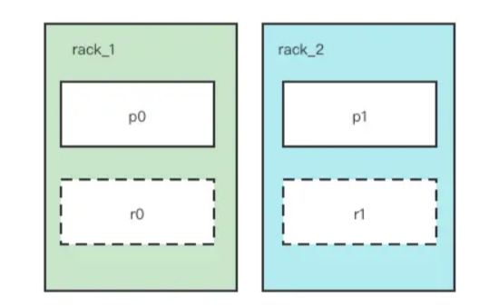
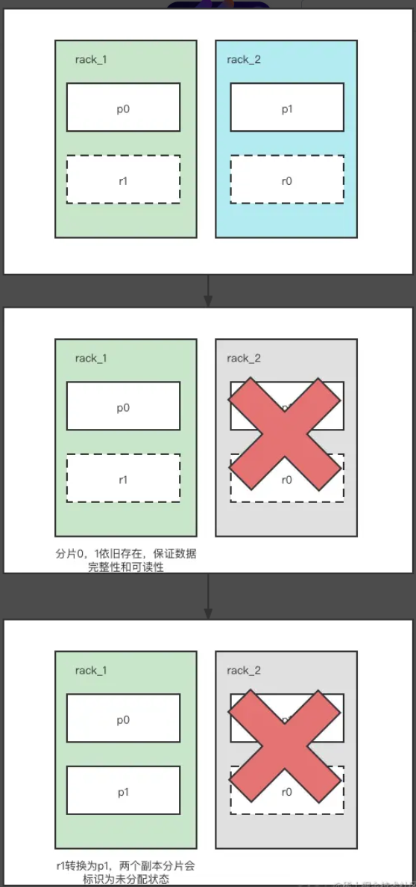

# 什么是分片Shard
分片是ES的数据载体，一个索引可以被分成多个分片，在ES中又有主分片和副本分片之分，每个主分片承担单个索引的一部分数据，每个副本分片又是对应主分片的副本（备份）。每个分片都是Lucene的实例，具有完整的功能

## 为什么需要分片？
ES的使用场景是针对海量数据，如果没有分片的产生，那么所有的数据都会堆积在一个节点中，当索引数据达到GB,TB级别的时候，单个节点的压力会非常大，也导致访问速度急剧下降。同时单个节点也无法保证高可用，发生单点故障的几率很大。综上，针对分布式场景，为了保证高可用，出现了分片的概念。

## 索引的数据完整性是什么？
比如索引被分成了3个主分片，每个主分片有1个副本分片，也就是说这个索引数据被分成了3份，那么只要这三份数据存在，无论是主还是副都成为这个索引数据是完整的。比如有主分片p0,p1,p2,副分片r0,r1,r2，当p0,p1丢失，但r0,r1存在，这样r0,r1,p2就可以组成一份完整的索引数据。

# 分片分配策略

ES会自动在节点上做分片均衡（shard reblance），会尽可能的让分片分配到不同的节点上。

每个主分片和其副本分片不能同时存在于一个节点上，以此保证一个节点宕机，还有另一个分片可用

如果有出现分片未分配的情况，可以通过以下指令查看原因

```sh
GET _cluster/allocation/explain
```

## 普通分片分配

假设硬件分布在两个不同的物理机架中，普通的分片分配虽然会将主副分片分配到不同的节点上，但是不能保证这些节点不是在同一个机架下的，因此有可能会将主副分片分布在同一个机架上。my_index的分片分布在两个不同的物理机架rack1,rack2上，总共有主分片p0,p1，副分片r0,r1，假设现在rack1或者rack2宕机了，就会导致分片0或者分片1的主副分片都不存在，从而导致索引不可用，为了避免这种情况引入了分片分配感知



## 分片分配感知

通过自定义节点属性来实现，比如定义一个属性rack_id，通过该属性来判断是否属于同一个机架，比如当有2个机架时，就会分别在另一个机架中分配自己的副分片，这样就能保证另一台机架宕机后，仍工作的机架上也有之前的机架的副分片，从而保证了数据的完整性。

设置启用分片分配感知后，分片仅分配给已为指定感知属性设置值的节点。如果使用了多个感知属性，那么es在分配分片时会分别考虑每个属性

总的来说，分片分配感知会将任意一个机架上的索引的副分片复制到每个机架中，这样就能确保即使某一个机架宕机了，其他机架上也有自己的备份，从而保证数据的完整性
分片分配感知开启后分片的分配如下，当机架2宕机后，机架1中还有分片1的副本，这时副分片1会转换为主分片1，以此保证集群的可用性。这一点在上述的实验中也以证明。



## 分片感知应用

1. 机架1中添加配置
```sh
node.attr.rack_id: rack_1
```

2. 机架2中添加配置
```sh
node.attr.rack_id: rack_2
```

3. 开启分片分配感知
PUT _cluster/settings
```json
{
  "persistent": {
    "cluster.routing.allocation.awareness.attributes": "rack_id"
  }
}
```

除了使用自定义的属性来实现外，还可以使用节点自带的属性
```
_name：匹配节点名称
_host_ip: 匹配节点主机IP地址
_publish_ip：匹配节点发布IP地址
_ip：匹配host_ip或者publish_ip
_host：匹配主机名hostname
_id：匹配节点ID
_tier：匹配节点的数据层角色
```


