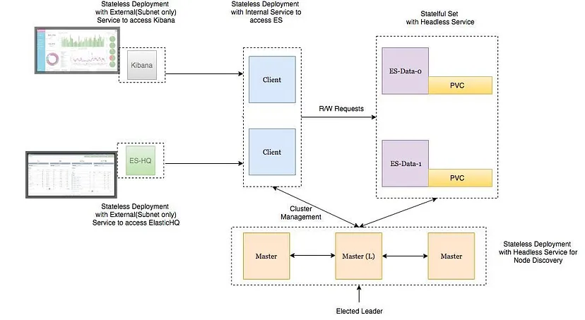

原文地址：https://faun.pub/https-medium-com-thakur-vaibhav23-ha-es-k8s-7e655c1b7b61

# 部署架构



- Elasticsearch Data Node Pods are deployed as a Stateful Set with a headless service to provide Stable Network Identities.
- Elasticsearch Master Node Pods are deployed as a Replica Set with a headless service which will help in Auto-discovery.
- Elasticsearch Client Node Pods are deployed as a Replica Set with a internal service which will allow access to the Data Nodes for R/W requests.
- Kibana and ElasticHQ Pods are deployed as Replica Sets with Services accessible outside the Kubernetes cluster but still internal to your Subnetwork (not publicly exposed unless otherwise required ).
- HPA(Horizonal Pod Auto-scaler) deployed for Client Nodes to enable auto-scaling under high load.


## Important:

- Setting ES_JAVA_OPTS env variable.
- Setting CLUSTER_NAME env variable.
- Setting NUMBER_OF_MASTERS (to avoid split-brain problem) env variable for master deployment. In case of 3 masters we have set it 2.
- Setting correct Pod-AntiAffinity policies among similar pods in order to ensure HA if a worker node fails.

# 在GKE中的部署

## Namespace
```yaml
apiVersion: v1 
kind: Namespace
metadata:
  name: elasticsearch
```

## Master Nodes
```yaml
apiVersion: apps/v1beta1
kind: Deployment
metadata:
  name: es-master
  namespace: elasticsearch
  labels:
    component: elasticsearch
    role: master
spec:
  replicas: 3
  template:
    metadata:
      labels:
        component: elasticsearch
        role: master
    spec:
      affinity:
        podAntiAffinity:
          preferredDuringSchedulingIgnoredDuringExecution:
          - weight: 100
            podAffinityTerm:
              labelSelector:
                matchExpressions:
                - key: role
                  operator: In
                  values:
                  - master
              topologyKey: kubernetes.io/hostname
      initContainers:
      - name: init-sysctl
        image: busybox:1.27.2
        command:
        - sysctl
        - -w
        - vm.max_map_count=262144 # vm.max_map_count 是一个与内核虚拟内存子系统相关的参数，用于控制进程可以拥有的内存映射区域的最大数量。 它通常用于限制一个进程可以打开的文件数量，特别是在使用大量内存映射文件的情况下。 在Linux系统上， vm.max_map_count 参数的默认值通常是较小的数值，例如65530
        securityContext:
          privileged: true
      containers:
      - name: es-master
        image: quay.io/pires/docker-elasticsearch-kubernetes:6.2.4
        env:
        - name: NAMESPACE
          valueFrom:
            fieldRef:
              fieldPath: metadata.namespace
        - name: NODE_NAME
          valueFrom:
            fieldRef:
              fieldPath: metadata.name
        - name: CLUSTER_NAME
          value: my-es
        - name: NUMBER_OF_MASTERS
          value: "2"
        - name: NODE_MASTER
          value: "true"
        - name: NODE_INGEST
          value: "false"
        - name: NODE_DATA
          value: "false"
        - name: HTTP_ENABLE
          value: "false"
        - name: ES_JAVA_OPTS
          value: -Xms256m -Xmx256m
        - name: PROCESSORS
          valueFrom:
            resourceFieldRef:
              resource: limits.cpu
        resources:
          limits:
            cpu: 2
        ports:
        - containerPort: 9300
          name: transport
        volumeMounts:
        - name: storage
          mountPath: /data
      volumes:
          - emptyDir:
              medium: ""
            name: "storage"
---
apiVersion: v1
kind: Service
metadata:
  name: elasticsearch-discovery
  namespace: elasticsearch
  labels:
    component: elasticsearch
    role: master
spec:
  selector:
    component: elasticsearch
    role: master
  ports:
  - name: transport
    port: 9300
    protocol: TCP
  clusterIP: None
```

部署：
```sh
kubectl apply -f es-master.yml
kubectl -n elasticsearch get all
```
```js
NAME               DESIRED   CURRENT   UP-TO-DATE   AVAILABLE   AGE
deploy/es-master   3         3         3            3           32s

NAME                      DESIRED   CURRENT   READY     AGE
rs/es-master-594b58b86c   3         3         3         31s

NAME                            READY     STATUS    RESTARTS   AGE
po/es-master-594b58b86c-9jkj2   1/1       Running   0          31s
po/es-master-594b58b86c-bj7g7   1/1       Running   0          31s
po/es-master-594b58b86c-lfpps   1/1       Running   0          31s

NAME                          TYPE        CLUSTER-IP   EXTERNAL-IP   PORT(S)    AGE
svc/elasticsearch-discovery   ClusterIP   None         <none>        9300/TCP   31s
```

It is interesting to follow the logs of any of the master-node pods to witness the master election among them 

```sh
kubectl -n elasticsearch logs -f po/es-master-594b58b86c-9jkj2 | grep ClusterApplierService
```
```log
[2018-10-21T07:41:54,958][INFO ][o.e.c.s.ClusterApplierService] [es-master-594b58b86c-9jkj2] detected_master {es-master-594b58b86c-bj7g7}{1aFT97hQQ7yiaBc2CYShBA}{Q3QzlaG3QGazOwtUl7N75Q}{10.9.126.87}{10.9.126.87:9300}, added {{es-master-594b58b86c-lfpps}{wZQmXr5fSfWisCpOHBhaMg}{50jGPeKLSpO9RU_HhnVJCA}{10.9.124.81}{10.9.124.81:9300},{es-master-594b58b86c-bj7g7}{1aFT97hQQ7yiaBc2CYShBA}{Q3QzlaG3QGazOwtUl7N75Q}{10.9.126.87}{10.9.126.87:9300},}, reason: apply cluster state (from master [master {es-master-594b58b86c-bj7g7}{1aFT97hQQ7yiaBc2CYShBA}{Q3QzlaG3QGazOwtUl7N75Q}{10.9.126.87}{10.9.126.87:9300} committed version [3]])
```

It can be seen that es-master pod named **es-master-594b58b86c-bj7g7** was elected as the master and other 2 pods added to it and each other.

The headless service named **elasticsearch-discovery** is *set by default as an env variable in the docker image*  and is used for discovery among the nodes. This can ofcourse be overridden.

## Data Nodes
```yaml
apiVersion: storage.k8s.io/v1beta1
kind: StorageClass
metadata:
  name: fast
provisioner: kubernetes.io/gce-pd
parameters:
  type: pd-ssd
  fsType: xfs
allowVolumeExpansion: true
---
apiVersion: apps/v1beta1
kind: StatefulSet
metadata:
  name: es-data
  namespace: elasticsearch
  labels:
    component: elasticsearch
    role: data
spec:
  serviceName: elasticsearch-data
  replicas: 3
  template:
    metadata:
      labels:
        component: elasticsearch
        role: data
    spec:
      affinity:
        podAntiAffinity:
          preferredDuringSchedulingIgnoredDuringExecution:
          - weight: 100
            podAffinityTerm:
              labelSelector:
                matchExpressions:
                - key: role
                  operator: In
                  values:
                  - data
              topologyKey: kubernetes.io/hostname
      initContainers:
      - name: init-sysctl
        image: busybox:1.27.2
        command:
        - sysctl
        - -w
        - vm.max_map_count=262144
        securityContext:
          privileged: true
      containers:
      - name: es-data
        image: quay.io/pires/docker-elasticsearch-kubernetes:6.2.4
        env:
        - name: NAMESPACE
          valueFrom:
            fieldRef:
              fieldPath: metadata.namespace
        - name: NODE_NAME
          valueFrom:
            fieldRef:
              fieldPath: metadata.name
        - name: CLUSTER_NAME
          value: my-es
        - name: NODE_MASTER
          value: "false"
        - name: NODE_INGEST
          value: "false"
        - name: HTTP_ENABLE
          value: "false"
        - name: ES_JAVA_OPTS
          value: -Xms256m -Xmx256m
        - name: PROCESSORS
          valueFrom:
            resourceFieldRef:
              resource: limits.cpu
        resources:
          limits:
            cpu: 2
        ports:
        - containerPort: 9300
          name: transport
        volumeMounts:
        - name: storage
          mountPath: /data
  volumeClaimTemplates:
  - metadata:
      name: storage
      annotations:
        volume.beta.kubernetes.io/storage-class: "fast"
    spec:
      accessModes: [ "ReadWriteOnce" ]
      storageClassName: fast
      resources:
        requests:
          storage: 10Gi
---
apiVersion: v1
kind: Service
metadata:
  name: elasticsearch-data
  namespace: elasticsearch
  labels:
    component: elasticsearch
    role: data
spec:
  ports:
  - port: 9300
    name: transport
  clusterIP: None
  selector:
    component: elasticsearch
    role: data
```

The headless service in case of data nodes provides stable network identities to the nodes and also help in data transfer among them.

It is important to format the persistent volume before attaching it to the pod. This can be done by specifiying the volume type when creating storage class. We can also set the flag to allow volume expansion on the fly. More can be read about that [here](https://kubernetes.io/blog/2018/07/12/resizing-persistent-volumes-using-kubernetes/) .

```yaml
parameters:  
  type: pd-ssd  
  fsType: xfs
allowVolumeExpansion: true
```

## Client Nodes
```yaml
---
apiVersion: apps/v1beta1
kind: Deployment
metadata:
  name: es-client
  namespace: elasticsearch
  labels:
    component: elasticsearch
    role: client
spec:
  replicas: 2
  template:
    metadata:
      labels:
        component: elasticsearch
        role: client
    spec:
      affinity:
        podAntiAffinity:
          preferredDuringSchedulingIgnoredDuringExecution:
          - weight: 100
            podAffinityTerm:
              labelSelector:
                matchExpressions:
                - key: role
                  operator: In
                  values:
                  - client
              topologyKey: kubernetes.io/hostname
      initContainers:
      - name: init-sysctl
        image: busybox:1.27.2
        command:
        - sysctl
        - -w
        - vm.max_map_count=262144
        securityContext:
          privileged: true
      containers:
      - name: es-client
        image: quay.io/pires/docker-elasticsearch-kubernetes:6.2.4
        env:
        - name: NAMESPACE
          valueFrom:
            fieldRef:
              fieldPath: metadata.namespace
        - name: NODE_NAME
          valueFrom:
            fieldRef:
              fieldPath: metadata.name
        - name: CLUSTER_NAME
          value: my-es
        - name: NODE_MASTER
          value: "false"
        - name: NODE_DATA
          value: "false"
        - name: HTTP_ENABLE
          value: "true"
        - name: ES_JAVA_OPTS
          value: -Xms256m -Xmx256m
        - name: NETWORK_HOST
          value: _site_,_lo_
        - name: PROCESSORS
          valueFrom:
            resourceFieldRef:
              resource: limits.cpu
        resources:
          limits:
            cpu: 1
        ports:
        - containerPort: 9200
          name: http
        - containerPort: 9300
          name: transport
        volumeMounts:
        - name: storage
          mountPath: /data
      volumes:
          - emptyDir:
              medium: ""
            name: storage
---
apiVersion: v1
kind: Service
metadata:
  name: elasticsearch
  namespace: elasticsearch
  annotations: 
    cloud.google.com/load-balancer-type: Internal
  labels:
    component: elasticsearch
    role: client
spec:
  selector:
    component: elasticsearch
    role: client
  ports:
  - name: http
    port: 9200
  type: LoadBalancer
```

The service deployed here is to access the ES Cluster from outside the Kubernetes cluster but still internal to our subnet. The annotation “cloud.google.com/load-balancer-type: Internal” ensures this.

However, if the application reading/writing to our ES cluster is deployed within the cluster then the ElasticSearch service can be accessed by http://elasticsearch.elasticsearch:9200 .

Observe logs for the master pod:

```sh
kubectl apply -f es-data.yml
kubectl -n elasticsearch get pods -l role=data
```
```js
NAME        READY     STATUS    RESTARTS   AGE
es-data-0   1/1       Running   0          48s
es-data-1   1/1       Running   0          28s
```

```sh
kubectl apply -f es-client.yml 
kubectl -n elasticsearch get pods -l role=client
```
```js
NAME                         READY     STATUS    RESTARTS   AGE
es-client-69b84b46d8-kr7j4   1/1       Running   0          47s
es-client-69b84b46d8-v5pj2   1/1       Running   0          47s
```

```sh
kubectl -n elasticsearch get all
```
```js
NAME               DESIRED   CURRENT   UP-TO-DATE   AVAILABLE   AGE
deploy/es-client   2         2         2            2           1m
deploy/es-master   3         3         3            3           9m
NAME                      DESIRED   CURRENT   READY     AGE
rs/es-client-69b84b46d8   2         2         2         1m
rs/es-master-594b58b86c   3         3         3         9m
NAME                   DESIRED   CURRENT   AGE
statefulsets/es-data   2         2         3m
NAME                            READY     STATUS    RESTARTS   AGE
po/es-client-69b84b46d8-kr7j4   1/1       Running   0          1m
po/es-client-69b84b46d8-v5pj2   1/1       Running   0          1m
po/es-data-0                    1/1       Running   0          3m
po/es-data-1                    1/1       Running   0          3m
po/es-master-594b58b86c-9jkj2   1/1       Running   0          9m
po/es-master-594b58b86c-bj7g7   1/1       Running   0          9m
po/es-master-594b58b86c-lfpps   1/1       Running   0          9m
NAME                          TYPE        CLUSTER-IP     EXTERNAL-IP   PORT(S)          AGE
svc/elasticsearch             LoadBalancer   10.9.121.160 10.9.120.8     9200:32310/TCP   1m
svc/elasticsearch-data        ClusterIP   None           <none>        9300/TCP         3m
svc/elasticsearch-discovery   ClusterIP   None           <none>        9300/TCP         9m
```

Check logs of es-master leader pod

```sh
kubectl -n elasticsearch logs po/es-master-594b58b86c-bj7g7 | grep ClusterApplierService
```

```log
[2018-10-21T07:41:53,731][INFO ][o.e.c.s.ClusterApplierService] [es-master-594b58b86c-bj7g7] new_master {es-master-594b58b86c-bj7g7}{1aFT97hQQ7yiaBc2CYShBA}{Q3QzlaG3QGazOwtUl7N75Q}{10.9.126.87}{10.9.126.87:9300}, added {{es-master-594b58b86c-lfpps}{wZQmXr5fSfWisCpOHBhaMg}{50jGPeKLSpO9RU_HhnVJCA}{10.9.124.81}{10.9.124.81:9300},}, reason: apply cluster state (from master [master {es-master-594b58b86c-bj7g7}{1aFT97hQQ7yiaBc2CYShBA}{Q3QzlaG3QGazOwtUl7N75Q}{10.9.126.87}{10.9.126.87:9300} committed version [1] source [zen-disco-elected-as-master ([1] nodes joined)[{es-master-594b58b86c-lfpps}{wZQmXr5fSfWisCpOHBhaMg}{50jGPeKLSpO9RU_HhnVJCA}{10.9.124.81}{10.9.124.81:9300}]]])
[2018-10-21T07:41:55,162][INFO ][o.e.c.s.ClusterApplierService] [es-master-594b58b86c-bj7g7] added {{es-master-594b58b86c-9jkj2}{x9Prp1VbTq6_kALQVNwIWg}{7NHUSVpuS0mFDTXzAeKRcg}{10.9.125.81}{10.9.125.81:9300},}, reason: apply cluster state (from master [master {es-master-594b58b86c-bj7g7}{1aFT97hQQ7yiaBc2CYShBA}{Q3QzlaG3QGazOwtUl7N75Q}{10.9.126.87}{10.9.126.87:9300} committed version [3] source [zen-disco-node-join[{es-master-594b58b86c-9jkj2}{x9Prp1VbTq6_kALQVNwIWg}{7NHUSVpuS0mFDTXzAeKRcg}{10.9.125.81}{10.9.125.81:9300}]]])
[2018-10-21T07:48:02,485][INFO ][o.e.c.s.ClusterApplierService] [es-master-594b58b86c-bj7g7] added {{es-data-0}{SAOhUiLiRkazskZ_TC6EBQ}{qirmfVJBTjSBQtHZnz-QZw}{10.9.126.88}{10.9.126.88:9300},}, reason: apply cluster state (from master [master {es-master-594b58b86c-bj7g7}{1aFT97hQQ7yiaBc2CYShBA}{Q3QzlaG3QGazOwtUl7N75Q}{10.9.126.87}{10.9.126.87:9300} committed version [4] source [zen-disco-node-join[{es-data-0}{SAOhUiLiRkazskZ_TC6EBQ}{qirmfVJBTjSBQtHZnz-QZw}{10.9.126.88}{10.9.126.88:9300}]]])
[2018-10-21T07:48:21,984][INFO ][o.e.c.s.ClusterApplierService] [es-master-594b58b86c-bj7g7] added {{es-data-1}{fiv5Wh29TRWGPumm5ypJfA}{EXqKGSzIQquRyWRzxIOWhQ}{10.9.125.82}{10.9.125.82:9300},}, reason: apply cluster state (from master [master {es-master-594b58b86c-bj7g7}{1aFT97hQQ7yiaBc2CYShBA}{Q3QzlaG3QGazOwtUl7N75Q}{10.9.126.87}{10.9.126.87:9300} committed version [5] source [zen-disco-node-join[{es-data-1}{fiv5Wh29TRWGPumm5ypJfA}{EXqKGSzIQquRyWRzxIOWhQ}{10.9.125.82}{10.9.125.82:9300}]]])
[2018-10-21T07:50:51,245][INFO ][o.e.c.s.ClusterApplierService] [es-master-594b58b86c-bj7g7] added {{es-client-69b84b46d8-v5pj2}{MMjA_tlTS7ux-UW44i0osg}{rOE4nB_jSmaIQVDZCjP8Rg}{10.9.125.83}{10.9.125.83:9300},}, reason: apply cluster state (from master [master {es-master-594b58b86c-bj7g7}{1aFT97hQQ7yiaBc2CYShBA}{Q3QzlaG3QGazOwtUl7N75Q}{10.9.126.87}{10.9.126.87:9300} committed version [6] source [zen-disco-node-join[{es-client-69b84b46d8-v5pj2}{MMjA_tlTS7ux-UW44i0osg}{rOE4nB_jSmaIQVDZCjP8Rg}{10.9.125.83}{10.9.125.83:9300}]]])
[2018-10-21T07:50:58,964][INFO ][o.e.c.s.ClusterApplierService] [es-master-594b58b86c-bj7g7] added {{es-client-69b84b46d8-kr7j4}{gGC7F4diRWy2oM1TLTvNsg}{IgI6g3iZT5Sa0HsFVMpvvw}{10.9.124.82}{10.9.124.82:9300},}, reason: apply cluster state (from master [master {es-master-594b58b86c-bj7g7}{1aFT97hQQ7yiaBc2CYShBA}{Q3QzlaG3QGazOwtUl7N75Q}{10.9.126.87}{10.9.126.87:9300} committed version [7] source [zen-disco-node-join[{es-client-69b84b46d8-kr7j4}{gGC7F4diRWy2oM1TLTvNsg}{IgI6g3iZT5Sa0HsFVMpvvw}{10.9.124.82}{10.9.124.82:9300}]]])
```

## check Anti-Affinity Rules for our ES-Pods

```sh
kubectl -n elasticsearch get pods -o wide
```

```js
NAME                         READY     STATUS    RESTARTS   AGE       IP            NODE
es-client-69b84b46d8-kr7j4   1/1       Running   0          10m       10.8.14.52   gke-cluster1-pool1-d2ef2b34-t6h9
es-client-69b84b46d8-v5pj2   1/1       Running   0          10m       10.8.15.53   gke-cluster1-pool1-42b4fbc4-cncn
es-data-0                    1/1       Running   0          12m       10.8.16.58   gke-cluster1-pool1-4cfd808c-kpx1
es-data-1                    1/1       Running   0          12m       10.8.15.52   gke-cluster1-pool1-42b4fbc4-cncn
es-master-594b58b86c-9jkj2   1/1       Running   0          18m       10.8.15.51   gke-cluster1-pool1-42b4fbc4-cncn
es-master-594b58b86c-bj7g7   1/1       Running   0          18m       10.8.16.57   gke-cluster1-pool1-4cfd808c-kpx1
es-master-594b58b86c-lfpps   1/1       Running   0          18m       10.8.14.51   gke-cluster1-pool1-d2ef2b34-t6h9
```

Note that no 2 similar pods are on same node. This ensures HA in case of node failures.

## Scaling Considerations

### Client Nodes

We can deploy autoscalers for our client nodes depending upon our CPU thresholds. A sample HPA for client node might look something like this:

```yaml
apiVersion: autoscaling/v1
kind: HorizontalPodAutoscaler
metadata:
  name: es-client
  namespace: elasticsearch
spec:
  maxReplicas: 5
  minReplicas: 2
  scaleTargetRef:
    apiVersion: extensions/v1beta1
    kind: Deployment
    name: es-client
targetCPUUtilizationPercentage: 80
```

Whenever the autoscaler will kick in, we can watch the new client-node pods being added to the cluster, by observing the logs of any of the master-node pods.

### Data Nodes

In case of Data-Node Pods all we have to do it increase the number of replicas using the K8 Dashboard or GKE console. The newly created data node will be automatically added to the cluster and start replicating data from other nodes.

### Master Nodes

Master-Node Pods do not require autoscaling as they only store cluster-state information but in case you want to add more data nodes make sure there are no even number of master nodes in the cluster also the environment variable NUMBER_OF_MASTERS is updated accordingly.

# Deploying Kibana and ES-HQ
[Kibana](https://www.elastic.co/products/kibana) and [ES-HQ](http://www.elastichq.org/)

Kibana is a simple tool to visualize ES-data and ES-HQ helps in Administration and monitoring of Elasticsearch cluster. For our Kibana and ES-HQ deployment we keep the following things in mind

- We provide the name of the ES-Cluster as an environment variable to the docker image
- The service to access the Kibana/ES-HQ deployment is internal to our organisation only i.e. No public IP is created. We use a GCP Internal load balancer.

## Kibana
```yaml
apiVersion: apps/v1beta1
kind: Deployment
metadata:
  name: es-kibana
  namespace: elasticsearch
  labels:
    component: elasticsearch
    role: kibana
spec:
  replicas: 1
  template:
    metadata:
      labels:
        component: elasticsearch
        role: kibana
    spec:
      containers:
      - name: es-kibana
        image: docker.elastic.co/kibana/kibana-oss:6.2.2
        env:
        - name: CLUSTER_NAME
          value: my-es
        - name: ELASTICSEARCH_URL
          value: http://elasticsearch:9200
        resources:
          limits:
            cpu: 0.5
        ports:
        - containerPort: 5601
          name: http
---
apiVersion: v1
kind: Service
metadata:
  name: kibana
  annotations:
    cloud.google.com/load-balancer-type: "Internal"
  namespace: elasticsearch
  labels:
    component: elasticsearch
    role: kibana
spec:
  selector:
    component: elasticsearch
    role: kibana
  ports:
  - name: http
    port: 80
    targetPort: 5601
    protocol: TCP
  type: LoadBalancer
```

## ES-HQ
```yaml
apiVersion: v1
kind: Namespace
metadata:
  name: elasticsearch
---
apiVersion: apps/v1beta1
kind: Deployment
metadata:
  name: es-hq
  namespace: elasticsearch
  labels:
    component: elasticsearch
    role: hq
spec:
  replicas: 1
  template:
    metadata:
      labels:
        component: elasticsearch
        role: hq
    spec:
      containers:
      - name: es-hq
        image: elastichq/elasticsearch-hq:release-v3.4.0
        env:
        - name: HQ_DEFAULT_URL
          value: http://elasticsearch:9200
        resources:
          limits:
            cpu: 0.5
        ports:
        - containerPort: 5000
          name: http
---
apiVersion: v1
kind: Service
metadata:
  name: hq
  annotations:
    cloud.google.com/load-balancer-type: "Internal"
  namespace: elasticsearch
  labels:
    component: elasticsearch
    role: hq
spec:
  selector:
    component: elasticsearch
    role: hq
  ports:
  - name: http
    port: 80
    targetPort: 5000
    protocol: TCP
  type: LoadBalancer
```


#