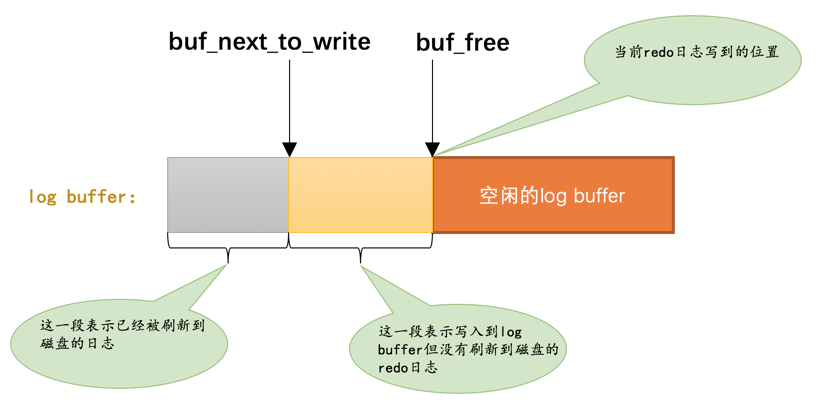

# redo日志文件组

MySQL的数据目录（使用SHOW VARIABLES LIKE 'datadir'查看）下默认有两个名为ib_logfile0和ib_logfile1的文件，log buffer中的日志默认情况下就是刷新到这两个磁盘文件中。如果我们对默认的redo日志文件不满意，可以通过下面几个启动参数来调节：

1. innodb_log_group_home_dir  该参数指定了redo日志文件所在的目录，默认值就是当前的数据目录。

2. innodb_log_file_size  该参数指定了每个redo日志文件的大小，在MySQL 5.7.21这个版本中的默认值为48MB，

3. innodb_log_files_in_group  该参数指定redo日志文件的个数，默认值为2，最大值为100。

磁盘上的redo日志文件不只一个，而是以一个日志文件组的形式出现的。这些文件以ib_logfile[数字]（数字可以是0、1、2...）的形式进行命名。在将redo日志写入日志文件组时，是从ib_logfile0开始写，如果ib_logfile0写满了，就接着ib_logfile1写，同理，ib_logfile1写满了就去写ib_logfile2，依此类推。如果写到最后一个文件该咋办？那就重新转到ib_logfile0继续写，所以整个过程如下图所示：


# redo log 文件的元数据

## 第一个block


|属性名|长度（单位：字节）|描述|
|--|--|--|
|LOG_HEADER_FORMAT|4|redo日志的版本，在MySQL 5.7.21中该值永远为1|
|LOG_HEADER_START_LSN|8|标记本redo日志文件开始的LSN值，也就是文件偏移量为2048字节处对应的LSN值|

## 第二个block


|属性名|长度（单位：字节）|描述|
|--|--|--|
|LOG_CHECKPOINT_NO|8|服务器做checkpoint的编号，每做一次checkpoint，该值就加1。|
|LOG_CHECKPOINT_LSN|8|服务器做checkpoint结束时对应的LSN值，系统崩溃恢复时将从该值开始。|
|LOG_CHECKPOINT_OFFSET|8|上个属性中的LSN值在redo日志文件组中的偏移量|
|LOG_CHECKPOINT_LOG_BUF_SIZE|8|服务器在做checkpoint操作时对应的log buffer的大小|

# Log Sequeue Number

InnoDB的为记录已经写入的redo日志量，设计了一个称之为Log Sequeue Number的全局变量，翻译过来就是：日志序列号，简称lsn，从8704开始，非连续的。

向log buffer中写入redo日志时不是一条一条写入的，而是以一个mtr生成的一组redo日志为单位进行写入的

## flushed_to_disk_lsn

lsn 当前系统中写入的redo日志量(字节量)，这包括了写到log buffer而没有刷新到磁盘的日志

flushed_to_disk_lsn用来标记log buffer中已经有哪些日志被刷新到磁盘中了



当有新的redo日志写入到log buffer时，首先lsn的值会增长，但flushed_to_disk_lsn不变，随后随着不断有log buffer中的日志被刷新到磁盘上，flushed_to_disk_lsn的值也跟着增长。如果两者的值相同时，说明log buffer中的所有redo日志都已经刷新到磁盘中了。

> buf_next_to_write的全局变量，标记当前log buffer中已经有哪些日志被刷新到磁盘中了

## checkpoint

redo日志文件组容量是有限的，因此需要循环使用redo日志文件组中的文件，但是这会造成最后写的redo日志与最开始写的redo日志追尾，这时应该想到：redo日志只是为了系统崩溃后恢复脏页用的，如果对应的脏页已经刷新到了磁盘，也就是说即使现在系统奔溃，那么在重启后也用不着使用redo日志恢复该页面了，所以该redo日志也就没有存在的必要了，那么它占用的磁盘空间就可以被后续的redo日志所重用。也就是说：判断某些redo日志占用的磁盘空间是否可以覆盖的依据就是它对应的脏页是否已经刷新到磁盘里。

全局变量checkpoint_lsn来代表当前系统中可以被覆盖的redo日志总量是多少

## 查看系统中的各种LSN值


```
mysql> SHOW ENGINE INNODB STATUS\G

(...省略前面的许多状态)
LOG
---
Log sequence number 124476971  # 代表系统中的lsn值，也就是当前系统已经写入的redo日志量，包括写入log buffer中的日志。
Log flushed up to   124099769  # 代表flushed_to_disk_lsn的值，也就是当前系统已经写入磁盘的redo日志量。
Pages flushed up to 124052503  # 代表flush链表中被最早修改的那个页面对应的oldest_modification属性值。
Last checkpoint at  124052494  # 当前系统的checkpoint_lsn值。
0 pending log flushes, 0 pending chkp writes
24 log i/o's done, 2.00 log i/o's/second
----------------------
(...省略后边的许多状态)
```

## innodb_flush_log_at_trx_commit的用法

为了保证事务的持久性，用户线程在事务提交时需要将该事务执行过程中产生的所有redo日志都刷新到磁盘上。这一条要求太狠了，会很明显的降低数据库性能。如果对事务的持久性要求不是那么强烈的话，可以选择修改一个称为innodb_flush_log_at_trx_commit的系统变量的值，该变量有3个可选的值：

0：当该系统变量值为0时，表示在事务提交时不立即向磁盘中同步redo日志，这个任务是交给后台线程做的。

这样很明显会加快请求处理速度，但是如果事务提交后服务器挂了，后台线程没有及时将redo日志刷新到磁盘，那么该事务对页面的修改会丢失。

1：当该系统变量值为1时，表示在事务提交时需要将redo日志同步到磁盘，可以保证事务的持久性。1也是innodb_flush_log_at_trx_commit的默认值。

2：当该系统变量值为2时，表示在事务提交时需要将redo日志写到**操作系统的缓冲区**中，但并不需要保证将日志真正的刷新到磁盘。

这种情况下如果数据库挂了，操作系统没挂的话，事务的持久性还是可以保证的，但是操作系统也挂了的话，那就不能保证持久性了。

# 崩溃恢复

1. 确定恢复的起点 checkpoint_lsn之前的redo日志都可以被覆盖，也就是说这些redo日志对应的脏页都已经被刷新到磁盘中了，既然它们已经被刷盘，我们就没必要恢复它们了。对于checkpoint_lsn之后的redo日志，它们对应的脏页可能没被刷盘，也可能被刷盘了，我们不能确定，所以需要从checkpoint_lsn开始读取redo日志来恢复页面。

2. redo日志文件组的第一个文件的管理信息中有两个block都存储了checkpoint_lsn的信息，我们当然是要选取最近发生的那次checkpoint的信息。衡量checkpoint发生时间早晚的信息就是所谓的checkpoint_no，我们只要把checkpoint1和checkpoint2这两个block中的checkpoint_no值读出来比一下大小，哪个的checkpoint_no值更大，说明哪个block存储的就是最近的一次checkpoint信息。这样我们就能拿到最近发生的checkpoint对应的checkpoint_lsn值以及它在redo日志文件组中的偏移量checkpoint_offset。

