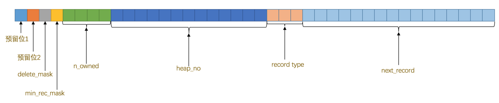

# InnoDB页

将数据划分为若干个页，以页作为磁盘和内存之间交互的基本单位，InnoDB中页的大小一般为 16 KB。也就是在一般情况下，一次最少从磁盘中读取16KB的内容到内存中，一次最少把内存中的16KB内容刷新到磁盘中。

# InnoDB行格式(一条记录的格式)

现在为止设计了4种不同类型的行格式，分别是Compact、Redundant、Dynamic和Compressed行格式

## COMPACT行格式

- 变长字段长度列表不一定存在，只存储值为非NULL的列的内容占用的长度。

> 在Compact行格式下只会把变长类型的列的长度逆序存到变长字段长度列表中。对于 CHAR(M) 类型的列来说，当列采用的是定长字符集时，该列占用的字节数不会被加到变长字段长度列表，而如果采用变长字符集时，该列占用的字节数也会被加到变长字段长度列表

- NULL值列表不一定存在；NULL值列表中每个bit对应一个允许为NULL的列。如果bit位数不是8的倍数，高位补0

- 记录头信息

由固定的5个字节组成。5个字节也就是40个二进制位，不同的位代表不同的意思，如图：

|名称|大小（单位bit）|描述|
|--|--|--|
|预留位1|1|没有使用|
|预留位2|1|没有使用|
|delete_mask|1|标记该记录是否被删除|
|min_rec_mask|1|B+树的每层非叶子节点中的最小记录都会添加该标记|
|n_owned|4|表示当前记录拥有的记录数|
|heap_no|13|表示当前记录在记录堆的位置信息|
|record_type|3|表示当前记录的类型，0表示普通记录，1表示B+树非叶子节点记录，2表示最小记录，3表示最大记录|
|next_record|16|表示下一条记录的相对位置|

### 记录的真实数据

MySQL会为每个记录默认添加一些列（隐藏列）, 这些列出现在“记录的真实数据”的最前面

|列名|是否必须|占用空间（单位字节）|描述|
|--|--|--|--|
|row_id (DB_ROW_ID)|否|6|行ID，唯一标志一条记录|
|transaction_id(DB_TRX_ID)|是|6|事务ID|
|roll_pointer(DB_ROLL_PTR)|是|7|回滚指针|

InnoDB表对主键的生成策略：优先使用用户自定义主键作为主键，如果用户没有定义主键，则选取一个Unique键作为主键，如果表中连Unique键都没有定义的话，则InnoDB会为表默认添加一个名为row_id的隐藏列作为主键。

## Redundant行格式

MySQL5.0之前用的一种行格式

## Dynamic和Compressed行格式

MySQL5.7默认的行格式是Dynamic。这两种行格式和Compact行格式很像，只不过在处理`行溢出`数据时不一样：它不会在记录的真实数据处存储字段真实数据的钱768个字节，而是把所有的字节都存储到其他页面中、只在记录的真实数据处存储其他页面的地址

Compressed行格式和Dynamic不同的一点是，Compressed行格式会采用压缩算法对页面进行压缩，以节省空间。