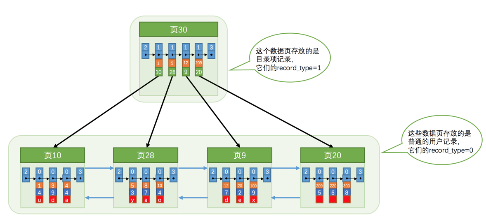
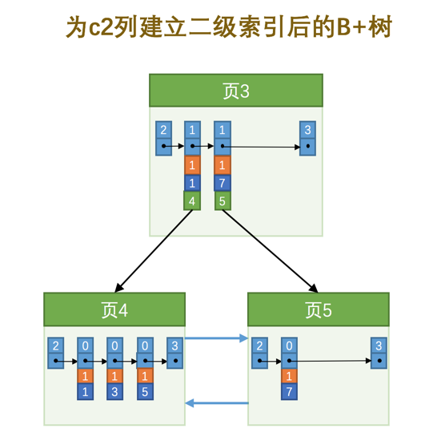

各个数据页可以组成一个双向链表，而每个数据页中的记录会按照主键值从小到大的顺序组成一个单向链表，每个数据页都会为存储在它里边儿的记录生成一个页目录，在通过主键查找某条记录的时候可以在页目录中使用二分法快速定位到对应的槽，然后再遍历该槽对应分组中的记录即可快速找到指定的记录.

## 在一个页中的查找

假设目前表中的记录比较少，所有的记录都可以被存放到一个页中，在查找记录的时候可以根据搜索条件的不同分为两种情况：

### 以主键为搜索条件

在页目录中使用二分法快速定位到对应的槽，然后再遍历该槽对应分组中的记录即可快速找到指定的记录。

### 以其他列作为搜索条件

因为在数据页中并没有对非主键列建立所谓的页目录，所以无法通过二分法快速定位相应的槽。这种情况下只能从最小记录开始依次遍历单链表中的每条记录，然后对比每条记录是不是符合搜索条件。很显然，这种查找的效率是非常低的。

## 在很多页中查找
大部分情况下我们表中存放的记录都是非常多的，需要好多的数据页来存储这些记录。在很多页中查找记录的话可以分为两个步骤：

1. 定位到记录所在的页
2. 从所在的页内中查找相应的记录。

在没有索引的情况下，不论是根据主键列或者其他列的值进行查找，由于我们并不能快速的定位到记录所在的页，所以只能从第一个页沿着双向链表一直往下找，在每一个页中根据我们刚刚介绍过的查找方式去查找指定的记录。

## 页分裂

页中的记录进行增删改操作的过程中，必须通过一些诸如记录移动的操作来始终保证这个状态一直成立：下一个数据页中用户记录的主键值必须大于上一个页中用户记录的主键值。这个过程我们也可以称为页分裂。

## 数据页的目录（就是索引）

因为页（默认16KB）在物理存储上可能并不挨着，所以如果想从这么多页中根据主键值快速定位某些记录所在的页，我们需要给它们做个目录，每个页对应一个目录项，每个目录项包括下面两个部分：

- 页的用户记录中最小的主键值，我们用key来表示。

- 页号，我们用page_no表示。

# InnoDB中的索引方案

复用了存储用户记录的数据页来存储目录项，我们把这些用来表示目录项的记录称为目录项记录。那InnoDB通过记录头信息里的record_type属性，它的各个取值代表的意思如下：

0：普通的用户记录
1：目录项记录
2：最小记录
3：最大记录

## 多级目录结构

## 聚簇索引

我们上面介绍的B+树本身就是一个目录，或者说本身就是一个索引。它有两个特点：

1. 使用记录主键值的大小进行记录和页的排序，这包括三个方面的含义：

- 页内的记录是按照主键的大小顺序排成一个单向链表。

- 各个存放用户记录的页也是根据页中用户记录的主键大小顺序排成一个双向链表。

- 存放目录项记录的页分为不同的层次，在同一层次中的页也是根据页中目录项记录的主键大小顺序排成一个双向链表。

2. B+树的叶子节点存储的是完整的用户记录。

所谓完整的用户记录，就是指这个记录中存储了所有列的值（包括隐藏列）。

具有这两种特性的B+树称为聚簇索引，所有完整的用户记录都存放在这个聚簇索引的叶子节点处。这种聚簇索引并不需要我们在MySQL语句中显式的使用INDEX语句去创建（后边会介绍索引相关的语句），InnoDB存储引擎会自动的为我们创建聚簇索引。另外有趣的一点是，在InnoDB存储引擎中，聚簇索引就是数据的存储方式（所有的用户记录都存储在了叶子节点），也就是所谓的索引即数据，数据即索引。

二级索引的内节点目录项包含了索引列主键列和页号, 且保证在B+树的同一层内节点的目录项记录除页号这个字段以外是唯一的

