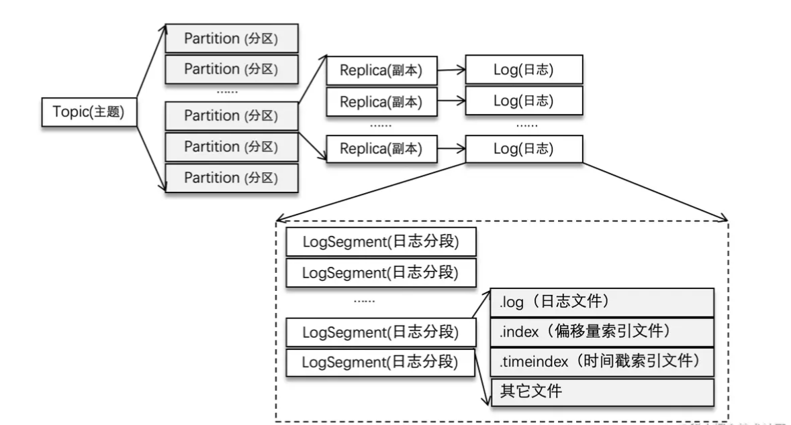
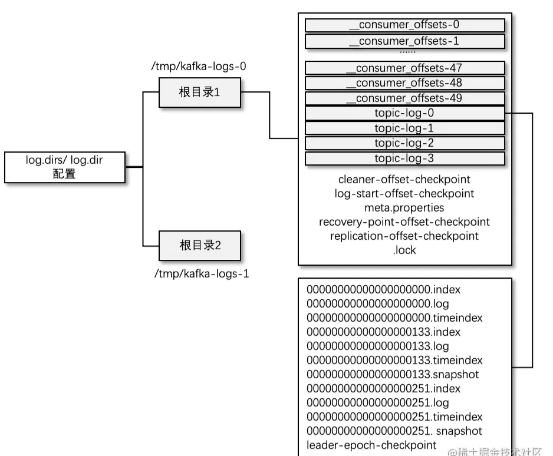
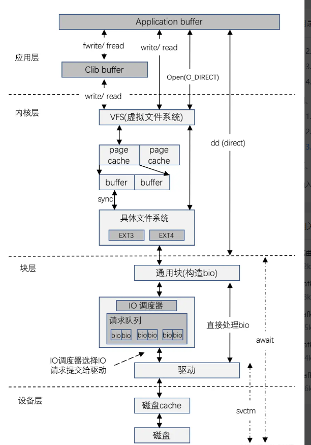

# kafka存储视图

# kafka日志目录结构

1. 消费组之间互不影响
2. 每个消费者只能消费所分配到的分区中的消息, 换言之,每一个分区只能被一个消费组中的一个消费者所消费。
3. 每个 LogSegment 中的日志文件（以“.log”为文件后缀）都有对应的两个索引文件：偏移量索引文件（以“.index”为文件后缀）和时间戳索引文件（以“.timeindex” 为文件后缀）。每个 LogSegment 都有一个基准偏移量 baseOffset，用来表示当前 LogSegment 中第一条消息的 offset。偏移量是一个 64 位的长整型数，日志文件和两个索引文件都是根据基 准偏移量（baseOffset）命名的，名称固定为 20 位数字，没有达到的位数则用 0 填充。比如第一个 LogSegment 的基准偏移量为 0，对应的日志文件为 00000000000000000000.log。

# kafka的特点
- 高可靠 Permanent Storage
- 高吞吐 High Throughput
- 高可用 High Avaliablity
- 可伸缩 Scalable